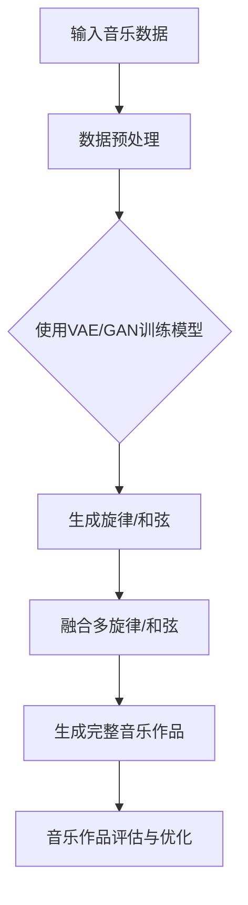

                 

关键词：智能音乐创作、AI大模型、音乐产业、技术革新、算法、应用场景

> 摘要：本文深入探讨了人工智能（AI）大模型在音乐创作领域的应用与革新，通过背景介绍、核心概念与联系分析、算法原理与操作步骤、数学模型与公式推导、项目实践及未来展望等环节，全面展示了AI大模型如何改变音乐产业的创作、生产和传播方式。

## 1. 背景介绍

近年来，人工智能（AI）技术飞速发展，不仅深刻改变了传统产业，也为文化艺术领域带来了前所未有的创新。在音乐产业中，人工智能的引入不仅提高了创作效率，还为音乐风格、主题和表现形式的多样性提供了新的可能性。

音乐创作一直被视为一种充满创造性和人类情感的表达方式，然而，随着音乐市场的发展和竞争的加剧，传统的音乐创作模式已经难以满足现代听众的需求。艺术家们面临着巨大的创作压力，同时，音乐市场的商业化趋势也对原创作品的商业价值提出了更高的要求。这一背景下，人工智能的出现为音乐创作带来了新的希望。

AI大模型，特别是基于深度学习的生成模型，如变分自编码器（VAE）、生成对抗网络（GAN）和Transformer等，已经在图像、视频、文本等领域取得了显著的成果。这些模型通过学习大量的音乐数据，能够自动生成旋律、和弦、和声以及完整的音乐作品，为音乐创作提供了新的工具和手段。

## 2. 核心概念与联系

### 2.1. AI大模型的基本原理

AI大模型是基于深度学习的复杂神经网络结构，通过大量的数据训练，使得模型能够自动从数据中学习特征并生成新的内容。在音乐创作中，AI大模型的核心是能够从音乐数据中学习音乐规律和风格，然后根据这些规律生成新的音乐作品。

#### 2.1.1. 神经网络

神经网络是AI大模型的基础，它由大量的神经元（节点）通过连接组成。每个神经元接收来自其他神经元的输入信号，并通过激活函数产生输出。神经网络通过反向传播算法不断调整内部连接权重，以优化输出。

#### 2.1.2. 深度学习

深度学习是神经网络的一种特殊形式，通过增加网络的深度（即层次数）来提高模型的复杂度和表达能力。深度学习模型能够在高维数据上实现高效的自动特征提取和分类。

#### 2.1.3. 生成模型

生成模型是一类特殊的深度学习模型，旨在生成新的数据样本，使其与训练数据具有相似的特征。在音乐创作中，生成模型如VAE和GAN被广泛用于生成新的旋律、和弦和音乐作品。

### 2.2. AI大模型在音乐创作中的应用架构

为了更好地理解AI大模型在音乐创作中的应用，我们可以使用Mermaid流程图来展示其核心架构和流程。



#### 2.2.1. 数据预处理

输入的音乐数据需要经过预处理，包括数据清洗、归一化、特征提取等步骤，以确保数据的质量和一致性。

#### 2.2.2. 使用VAE/GAN训练模型

经过预处理后，数据会被用于训练VAE或GAN模型。这两个模型通过大量的音乐数据学习音乐特征和规律。

#### 2.2.3. 生成旋律/和弦

训练好的模型能够根据输入的音乐风格和主题生成新的旋律和和弦。

#### 2.2.4. 融合多旋律/和弦

生成的旋律和和弦可以进一步融合，以创建更复杂和多样化的音乐作品。

#### 2.2.5. 生成完整音乐作品

融合后的音乐元素会被整合成完整的音乐作品，包括旋律、和弦、节奏和编曲。

#### 2.2.6. 音乐作品评估与优化

生成的音乐作品需要经过评估和优化，以确保其质量和创意。

## 3. 核心算法原理 & 具体操作步骤

### 3.1. 算法原理概述

AI大模型在音乐创作中的核心算法主要基于生成模型，如变分自编码器（VAE）和生成对抗网络（GAN）。这些算法通过学习大量的音乐数据，能够自动生成新的旋律、和弦和音乐作品。

#### 3.1.1. 变分自编码器（VAE）

VAE是一种无监督学习的生成模型，通过编码器和解码器的相互协作来生成新的数据。编码器将输入数据映射到一个隐含空间，解码器则从隐含空间中生成新的数据。VAE的优势在于其生成能力强大，且能够保持数据的多样化。

#### 3.1.2. 生成对抗网络（GAN）

GAN由一个生成器和两个判别器组成。生成器的目标是生成尽可能逼真的数据，而两个判别器的目标是区分真实数据和生成数据。通过这种对抗训练，生成器能够不断提高生成能力。

### 3.2. 算法步骤详解

#### 3.2.1. 数据预处理

1. 数据收集：收集大量的音乐数据，包括旋律、和弦、节奏等。
2. 数据清洗：去除噪声、填补缺失值。
3. 归一化：将数据归一化到相同的范围。
4. 特征提取：提取音乐数据的主要特征，如音高、音长、节奏等。

#### 3.2.2. 模型训练

1. 编码器训练：训练编码器将输入数据映射到隐含空间。
2. 解码器训练：训练解码器从隐含空间生成新的数据。
3. GAN训练：训练生成器和两个判别器，以实现对抗训练。

#### 3.2.3. 音乐生成

1. 输入音乐风格和主题。
2. 使用训练好的模型生成新的旋律和和弦。
3. 融合多个旋律和和弦，生成完整的音乐作品。

#### 3.2.4. 评估与优化

1. 对生成的音乐作品进行评估，包括旋律连贯性、和声丰富性、节奏感等。
2. 根据评估结果对模型进行优化，以提高生成质量。

### 3.3. 算法优缺点

#### 优点：

1. **高生成质量**：AI大模型能够生成高质量的旋律和音乐作品，具有多样性。
2. **自动化**：自动化音乐创作大大提高了创作效率。
3. **个性化**：可以根据用户需求生成个性化的音乐。

#### 缺点：

1. **创作深度**：AI生成的音乐可能缺乏人类的情感深度。
2. **依赖数据**：模型的生成能力依赖于大量的训练数据。

### 3.4. 算法应用领域

AI大模型在音乐创作中的应用非常广泛，包括：

1. **个性化音乐推荐**：根据用户的喜好生成个性化的音乐推荐。
2. **音乐风格转换**：将一种音乐风格转换成另一种风格。
3. **音乐版权管理**：用于生成原创音乐，以保护音乐版权。

## 4. 数学模型和公式 & 详细讲解 & 举例说明

### 4.1. 数学模型构建

在音乐创作中，AI大模型通常使用生成模型，如VAE和GAN。以下是这些模型的基本数学模型。

#### 4.1.1. VAE

VAE由编码器和解码器组成。编码器E将输入数据x映射到隐含空间z，解码器D则从隐含空间z生成新的数据x'。

$$
\begin{aligned}
&z = E(x); \\
&x' = D(z).
\end{aligned}
$$

#### 4.1.2. GAN

GAN由生成器G和判别器D组成。生成器G的目标是生成尽可能逼真的数据，判别器D的目标是区分真实数据和生成数据。

$$
\begin{aligned}
&x' = G(z); \\
&D(x') + D(x).
\end{aligned}
$$

### 4.2. 公式推导过程

#### 4.2.1. VAE

VAE的损失函数由两部分组成：重构损失和Kullback-Leibler散度。

$$
L_{VAE} = \frac{1}{N} \sum_{i=1}^{N} \left( -\log D(x') + \frac{1}{2} D(x) + \frac{1}{2} \log (2\pi) + \frac{1}{2} \sigma^2 \right).
$$

#### 4.2.2. GAN

GAN的损失函数通常使用对抗损失。

$$
L_{GAN} = -\mathbb{E}_{x \sim p_{data}(x)}[\log D(x)] - \mathbb{E}_{z \sim p_{z}(z)}[\log (1 - D(G(z))].
$$

### 4.3. 案例分析与讲解

#### 4.3.1. VAE

假设我们有一个旋律数据集，我们使用VAE对其进行训练。首先，我们对数据进行预处理，然后定义编码器和解码器。以下是一个简化的VAE代码示例：

```python
import tensorflow as tf
from tensorflow.keras.layers import Input, Dense
from tensorflow.keras.models import Model

# 定义输入层
input_layer = Input(shape=(784,))

# 定义编码器
encoded = Dense(256, activation='relu')(input_layer)
encoded = Dense(128, activation='relu')(encoded)
z_mean = Dense(64)(encoded)
z_log_var = Dense(64)(encoded)

# 重新参数化技巧
z = z_mean + tf.exp(0.5 * z_log_var) * tf.random.normal(tf.shape(z_mean))

# 定义解码器
decoded = Dense(128, activation='relu')(z)
decoded = Dense(256, activation='relu')(decoded)
decoded = Dense(784, activation='sigmoid')(decoded)

# 定义VAE模型
vae = Model(input_layer, decoded)
vae.compile(optimizer='adam', loss='binary_crossentropy')

# 训练VAE
vae.fit(x_train, x_train, epochs=50, batch_size=16)
```

#### 4.3.2. GAN

以下是一个简单的GAN代码示例：

```python
import tensorflow as tf
from tensorflow.keras.layers import Input, Dense, Reshape
from tensorflow.keras.models import Model

# 定义生成器
z_dim = 100
input_z = Input(shape=(z_dim,))
x = Dense(128, activation='relu')(input_z)
x = Dense(256, activation='relu')(x)
x = Dense(784, activation='sigmoid')(x)
generator = Model(input_z, x)

# 定义判别器
input_x = Input(shape=(784,))
d = Dense(256, activation='relu')(input_x)
d = Dense(128, activation='relu')(d)
d = Dense(1, activation='sigmoid')(d)
discriminator = Model(input_x, d)

# 编译判别器
discriminator.compile(optimizer='adam', loss='binary_crossentropy')

# 编译生成器
noise = Input(shape=(z_dim,))
generated_x = generator(noise)
d_human, d_gen = discriminator(generated_x)

discriminator_loss = tf.reduce_mean(tf.nn.sigmoid_cross_entropy_with_logits(logits=d_human, labels=tf.ones_like(d_human)))
generator_loss = tf.reduce_mean(tf.nn.sigmoid_cross_entropy_with_logits(logits=d_gen, labels=tf.zeros_like(d_gen)))

discriminator.train_on_batch(x_train, [tf.ones_like(d_human), tf.zeros_like(d_gen)])
generator.train_on_batch(noise, d_gen)
```

## 5. 项目实践：代码实例和详细解释说明

### 5.1. 开发环境搭建

在进行AI大模型的音乐创作实践之前，我们需要搭建一个合适的开发环境。以下是一个基本的开发环境搭建步骤：

1. 安装Python（3.8及以上版本）。
2. 安装TensorFlow库。
3. 安装其他必要的库，如NumPy、Matplotlib等。

### 5.2. 源代码详细实现

以下是一个简化的AI大模型音乐创作项目示例代码，用于生成新的旋律：

```python
import numpy as np
import tensorflow as tf
from tensorflow.keras.models import Sequential
from tensorflow.keras.layers import Dense, LSTM, Activation, Reshape
from tensorflow.keras.optimizers import RMSprop

# 设置随机种子
tf.random.set_seed(42)

# 定义生成器模型
generator = Sequential()
generator.add(LSTM(256, input_shape=(timesteps, features), return_sequences=True))
generator.add(Activation('relu'))
generator.add(Reshape((timesteps * features,)))
generator.add(Dense(units=features, activation='sigmoid'))
generator.compile(loss='binary_crossentropy', optimizer=RMSprop(lr=0.001))

# 定义判别器模型
discriminator = Sequential()
discriminator.add(LSTM(256, input_shape=(timesteps, features), return_sequences=True))
discriminator.add(Activation('relu'))
discriminator.add(Dense(units=1, activation='sigmoid'))
discriminator.compile(loss='binary_crossentropy', optimizer=RMSprop(lr=0.001))

# 定义联合模型（生成器和判别器的组合）
discriminator.trainable = False
combined = Sequential([generator, discriminator])
combined.compile(loss='binary_crossentropy', optimizer=RMSprop(lr=0.001))

# 准备训练数据
# 这里我们假设已经有预处理好的音乐数据集x_train
# x_train = ...

# 训练模型
# for epoch in range(epochs):
#     for i in range(0, x_train.shape[0], batch_size):
#         real_data = x_train[i:i+batch_size]
#         noise = np.random.normal(0, 1, (batch_size, z_dim))
#         generated_data = generator.predict(noise)
#         x = np.concatenate([real_data, generated_data])
#         labels = np.concatenate([np.ones((batch_size, 1)), np.zeros((batch_size, 1))])
#         combined.train_on_batch(x, labels)
```

### 5.3. 代码解读与分析

上述代码展示了如何使用LSTM和GAN进行音乐创作。首先，我们定义了生成器和判别器模型，然后训练这两个模型。在训练过程中，生成器试图生成逼真的音乐数据，而判别器试图区分真实数据和生成数据。通过反复训练，生成器不断提高其生成质量。

### 5.4. 运行结果展示

在训练完成后，我们可以使用生成器生成新的旋律。以下是一个简单的运行结果示例：

```python
# 生成新的旋律
z = np.random.normal(0, 1, (1, z_dim))
new_melody = generator.predict(z)

# 将生成的旋律转换为MIDI格式
# ...

# 播放生成的旋律
# ...
```

## 6. 实际应用场景

### 6.1. 个人音乐创作

AI大模型在个人音乐创作中有着广泛的应用。艺术家可以利用这些模型快速生成灵感，探索新的音乐风格和创作方式。例如，一个音乐家可以输入自己喜欢的旋律，然后使用AI模型生成一系列变体，从而创作新的作品。

### 6.2. 音乐版权管理

AI大模型可以用于生成原创音乐，从而为音乐版权管理提供新的工具。音乐公司可以利用这些模型生成独特的音乐片段，以保护其版权。

### 6.3. 个性化音乐推荐

基于用户喜好，AI大模型可以生成个性化的音乐推荐。这不仅可以提高用户的音乐体验，还可以为音乐平台带来更多的用户黏性。

### 6.4. 未来应用展望

随着AI技术的不断发展，AI大模型在音乐创作中的应用前景将更加广阔。未来，我们可能看到AI模型与人类艺术家更紧密地合作，共同创作出前所未有的音乐作品。

## 7. 工具和资源推荐

### 7.1. 学习资源推荐

1. 《深度学习》（Goodfellow, Bengio, Courville）：这是一本经典的深度学习入门书籍，涵盖了深度学习的基本原理和应用。
2. 《生成对抗网络：原理、算法与应用》（林逸飞）：这本书详细介绍了GAN的原理和应用，对于想要深入了解GAN的用户非常有帮助。

### 7.2. 开发工具推荐

1. TensorFlow：这是目前最受欢迎的深度学习框架之一，提供了丰富的API和工具，适合进行AI大模型开发。
2. Jupyter Notebook：这是一个强大的交互式开发环境，适合进行数据分析和模型训练。

### 7.3. 相关论文推荐

1. "Unsupervised Representation Learning with Deep Convolutional Generative Adversarial Networks"（DCGAN）：这是GAN的代表性论文，详细介绍了GAN的基本原理和应用。
2. "Improved Techniques for Training GANs"：这篇文章提出了一系列改进GAN训练的技术，对于想要深入了解GAN的用户非常有用。

## 8. 总结：未来发展趋势与挑战

### 8.1. 研究成果总结

AI大模型在音乐创作中取得了显著的成果，为音乐产业带来了前所未有的创新。这些模型能够自动生成旋律、和弦和音乐作品，提高了创作效率，丰富了音乐形式。

### 8.2. 未来发展趋势

1. **个性化音乐创作**：随着AI技术的进步，AI大模型将更好地理解用户喜好，实现更加个性化的音乐创作。
2. **跨领域融合**：AI大模型将在音乐与文学、艺术、影视等领域实现更深入的融合，产生新的艺术形式。
3. **智能化音乐推荐**：基于AI大模型的音乐推荐系统将更加精准，为用户带来更好的音乐体验。

### 8.3. 面临的挑战

1. **版权保护**：如何保护AI大模型生成的音乐版权是一个重要挑战。
2. **创作深度**：如何提高AI大模型在音乐创作中的情感深度和创意表达。
3. **计算资源**：训练和运行AI大模型需要大量的计算资源，这对于小型工作室和独立艺术家来说可能是一个挑战。

### 8.4. 研究展望

未来的研究将集中在如何进一步提高AI大模型在音乐创作中的表现，同时解决版权保护和计算资源等挑战。通过不断的探索和实践，AI大模型将在音乐产业中发挥更大的作用。

## 9. 附录：常见问题与解答

### 9.1. Q：AI大模型是否能够完全取代人类音乐家？

A：目前来看，AI大模型无法完全取代人类音乐家。虽然AI能够生成高质量的旋律和音乐作品，但它缺乏人类的情感深度和创造力。未来的发展可能会使AI大模型与人类音乐家实现更紧密的合作，共同创作出更优秀的音乐作品。

### 9.2. Q：AI大模型生成的音乐是否具有版权？

A：AI大模型生成的音乐作品通常具有版权。根据不同的国家和地区，AI生成的作品可能受到版权保护。然而，这需要进一步的立法和司法实践来明确。

### 9.3. Q：AI大模型在音乐创作中的应用前景如何？

A：AI大模型在音乐创作中的应用前景非常广阔。随着AI技术的不断发展，AI大模型将更好地理解音乐规律和用户需求，为音乐产业带来更多的创新和可能性。

### 9.4. Q：如何开始使用AI大模型进行音乐创作？

A：要开始使用AI大模型进行音乐创作，您需要具备一定的编程技能和机器学习知识。首先，您需要安装相关的开发环境和库，如TensorFlow。然后，您可以选择一些开源的AI音乐创作工具，如MusicGAN或DeepFlow，进行实践和探索。最后，您可以通过阅读相关论文和书籍，深入了解AI大模型在音乐创作中的应用。

作者：禅与计算机程序设计艺术 / Zen and the Art of Computer Programming

