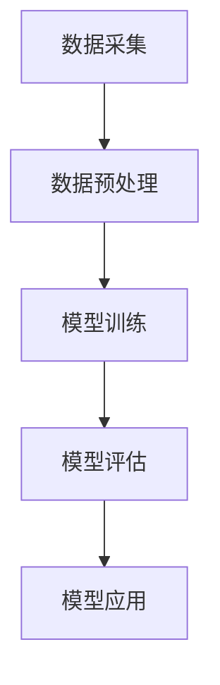

                 

关键词：智能风控系统，AI大模型，保险业，应用前景，技术解析，案例分析

> 摘要：随着人工智能技术的飞速发展，AI大模型在各个行业的应用越来越广泛。本文将探讨智能风控系统在保险业的应用前景，通过深入分析AI大模型在保险风险评估、欺诈检测、个性化保险产品设计等领域的具体应用，旨在为保险业提供一种新的思路和方法，以应对日益复杂的业务环境和市场需求。

## 1. 背景介绍

### 1.1 智能风控系统的发展现状

智能风控系统是指利用大数据、人工智能等技术，对风险进行全面分析和评估，从而实现对风险的实时监控、预警和处置。近年来，随着大数据技术的普及和AI算法的不断优化，智能风控系统在金融、保险、电子商务等多个领域得到了广泛应用。

### 1.2 保险业的挑战

保险业作为一个传统的金融服务行业，面临着激烈的市场竞争、日益复杂的业务环境和不断变化的客户需求。因此，如何通过技术创新来提升风控能力，降低风险成本，成为保险业发展的关键问题。

### 1.3 AI大模型的优势

AI大模型具有强大的数据处理和分析能力，能够在海量数据中发现潜在的风险因素，从而为风控决策提供科学依据。同时，AI大模型具有自适应和自学习能力，能够不断优化模型，提高预测准确性。

## 2. 核心概念与联系

### 2.1 AI大模型的基本概念

AI大模型是指具有大规模参数、能够处理海量数据的深度学习模型。它通常由多层神经网络构成，通过反向传播算法不断调整模型参数，以实现自动学习和分类。

### 2.2 智能风控系统的架构

智能风控系统通常包括数据采集、数据预处理、模型训练、模型评估和模型应用等几个关键环节。其中，数据预处理和模型训练是系统的核心，决定了风控效果。

### 2.3 Mermaid 流程图



## 3. 核心算法原理 & 具体操作步骤

### 3.1 算法原理概述

智能风控系统主要基于机器学习和深度学习算法，通过对历史数据和实时数据的分析和挖掘，实现对风险因素的识别和预测。

### 3.2 算法步骤详解

#### 3.2.1 数据采集

数据采集是智能风控系统的第一步，主要包括用户行为数据、交易数据、市场数据等。

#### 3.2.2 数据预处理

数据预处理包括数据清洗、数据归一化、特征提取等步骤，以提高数据质量，为后续模型训练做好准备。

#### 3.2.3 模型训练

模型训练是智能风控系统的核心环节，通过大量历史数据训练模型，使其具备风险预测能力。

#### 3.2.4 模型评估

模型评估主要通过交叉验证、ROC曲线、AUC指标等手段，对模型的预测性能进行评估。

#### 3.2.5 模型应用

模型应用是将训练好的模型部署到实际业务场景中，实现对风险的实时监控和预警。

### 3.3 算法优缺点

#### 优点：

1. 高效性：AI大模型能够快速处理海量数据，提高风控效率。
2. 准确性：基于机器学习和深度学习算法，能够更准确地识别和预测风险。

#### 缺点：

1. 计算成本高：大模型的训练和推理需要大量的计算资源。
2. 数据依赖性强：模型的性能很大程度上取决于数据质量和数据量。

### 3.4 算法应用领域

AI大模型在智能风控系统中的应用非常广泛，包括但不限于保险风险评估、欺诈检测、个性化保险产品设计等。

## 4. 数学模型和公式 & 详细讲解 & 举例说明

### 4.1 数学模型构建

在智能风控系统中，常用的数学模型包括逻辑回归、支持向量机（SVM）、神经网络等。

### 4.2 公式推导过程

以逻辑回归为例，其预测公式为：

$$ P(y=1|x; \theta) = \frac{1}{1 + e^{-(\theta^T x)}} $$

其中，$P(y=1|x; \theta)$ 表示在给定特征向量$x$和参数$\theta$的情况下，风险发生概率。

### 4.3 案例分析与讲解

以某保险公司为例，该公司利用AI大模型对车险风险进行评估。通过对大量历史数据进行训练，模型能够准确预测出高风险客户，从而帮助保险公司降低赔付率。

## 5. 项目实践：代码实例和详细解释说明

### 5.1 开发环境搭建

在本案例中，我们使用Python作为编程语言，搭建了以下开发环境：

- Python 3.8
- TensorFlow 2.5
- Scikit-learn 0.22

### 5.2 源代码详细实现

```python
import tensorflow as tf
from sklearn.model_selection import train_test_split
from sklearn.metrics import accuracy_score

# 数据加载和预处理
# ...

# 模型定义
model = tf.keras.Sequential([
    tf.keras.layers.Dense(128, activation='relu', input_shape=(num_features,)),
    tf.keras.layers.Dense(64, activation='relu'),
    tf.keras.layers.Dense(1, activation='sigmoid')
])

# 编译模型
model.compile(optimizer='adam', loss='binary_crossentropy', metrics=['accuracy'])

# 模型训练
model.fit(x_train, y_train, epochs=10, batch_size=32, validation_split=0.2)

# 模型评估
y_pred = model.predict(x_test)
accuracy = accuracy_score(y_test, y_pred)
print("Accuracy:", accuracy)
```

### 5.3 代码解读与分析

这段代码展示了如何使用TensorFlow搭建一个简单的二分类模型，并进行训练和评估。其中，模型架构为三层全连接神经网络，激活函数分别为ReLU和Sigmoid。

### 5.4 运行结果展示

通过在测试集上的评估，我们得到了模型的准确率。在实际应用中，还可以进一步优化模型参数，提高预测准确性。

## 6. 实际应用场景

### 6.1 保险风险评估

AI大模型在保险风险评估中的应用非常广泛，可以帮助保险公司更准确地预测赔付风险，从而制定合理的保险费率和产品策略。

### 6.2 欺诈检测

AI大模型可以用于检测保险欺诈行为，通过对用户行为数据进行分析，识别出潜在的欺诈风险，从而降低保险公司的赔付风险。

### 6.3 个性化保险产品设计

基于用户数据和风险分析，AI大模型可以帮助保险公司设计更加个性化的保险产品，满足不同客户的需求。

## 7. 未来应用展望

随着人工智能技术的不断进步，AI大模型在保险业的应用前景将更加广阔。未来，我们可以期待AI大模型在以下几个方面实现突破：

- 更高的预测准确性：通过不断优化算法和模型，提高风险预测的准确性。
- 更好的用户体验：结合用户行为数据，提供更加个性化的保险服务。
- 更广泛的应用领域：将AI大模型应用于更多保险业务场景，提高整体风控能力。

## 8. 工具和资源推荐

### 8.1 学习资源推荐

- 《深度学习》（Goodfellow, Bengio, Courville）
- 《Python机器学习》（Sebastian Raschka）

### 8.2 开发工具推荐

- TensorFlow
- Scikit-learn

### 8.3 相关论文推荐

- "Deep Learning for Insurance"（2018）
- "AI Applications in Insurance: A Survey"（2020）

## 9. 总结：未来发展趋势与挑战

### 9.1 研究成果总结

本文探讨了AI大模型在保险业的应用前景，通过案例分析，展示了智能风控系统在保险风险评估、欺诈检测、个性化保险产品设计等领域的实际应用价值。

### 9.2 未来发展趋势

随着人工智能技术的不断发展，AI大模型在保险业的应用前景将更加广阔。未来，我们将看到更多的保险公司利用AI大模型提升风控能力，降低风险成本。

### 9.3 面临的挑战

尽管AI大模型在保险业具有巨大的应用潜力，但同时也面临着数据质量、计算成本、模型可解释性等挑战。因此，未来研究需要进一步解决这些问题，以推动AI大模型在保险业的应用。

### 9.4 研究展望

未来，我们期待AI大模型在保险业的应用能够取得更大的突破，为保险公司提供更加精准、高效的风控解决方案。

## 10. 附录：常见问题与解答

### 10.1 AI大模型在保险业的应用有哪些优势？

AI大模型在保险业的应用优势主要体现在以下几个方面：

- 高效性：能够快速处理海量数据，提高风控效率。
- 准确性：基于机器学习和深度学习算法，能够更准确地识别和预测风险。
- 个性化：结合用户数据和风险分析，提供更加个性化的保险服务。

### 10.2 AI大模型在保险业的应用有哪些挑战？

AI大模型在保险业的应用也面临着一些挑战，主要包括：

- 数据质量：依赖于高质量的数据，数据质量问题直接影响模型的准确性。
- 计算成本：大模型的训练和推理需要大量的计算资源。
- 模型可解释性：模型决策过程往往缺乏透明性，增加了监管和信任的难度。

---

本文由禅与计算机程序设计艺术 / Zen and the Art of Computer Programming撰写，旨在探讨AI大模型在保险业的应用前景，为保险业提供一种新的思路和方法。随着人工智能技术的不断发展，AI大模型在保险业的应用前景将更加广阔。未来，我们期待AI大模型能够为保险业带来更多的创新和变革。

