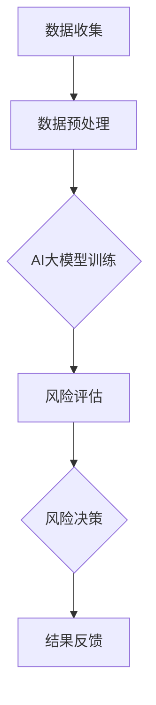
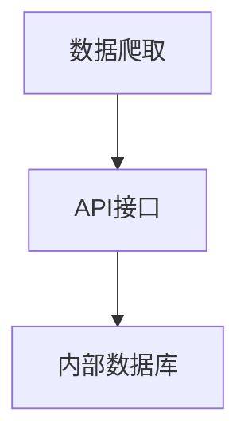
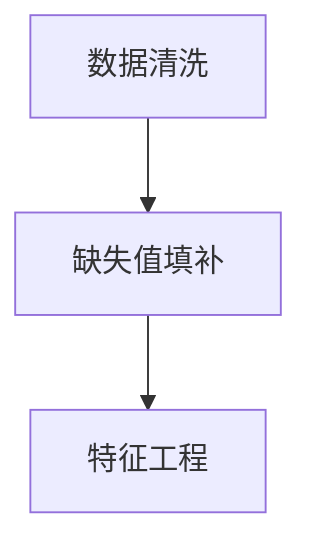
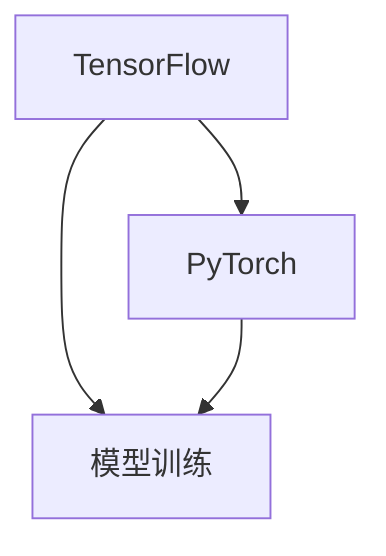
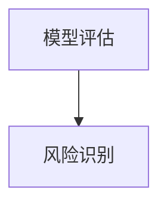
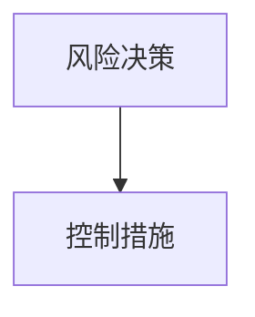
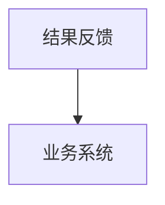

                 

关键词：智能风控、AI大模型、保险业、应用前景、技术分析

> 摘要：随着人工智能技术的飞速发展，智能风控系统已成为金融领域的重要创新方向。本文将探讨AI大模型在保险业的应用前景，分析其核心技术、数学模型及其在保险业务中的具体应用场景。

## 1. 背景介绍

### 1.1 保险业的发展现状

保险业作为金融服务的重要组成部分，经历了长期的稳定发展。然而，在数字经济时代，保险业面临着前所未有的挑战与机遇。一方面，市场竞争加剧，消费者需求多样化；另一方面，传统保险业务模式难以满足新兴市场的需求。为了在激烈的市场竞争中脱颖而出，保险公司纷纷寻求创新，其中人工智能技术成为保险业转型的重要突破口。

### 1.2 智能风控系统的概念

智能风控系统是指利用人工智能技术，对保险业务中的风险进行识别、评估和管理的一整套系统。它能够通过对海量数据进行分析，自动识别潜在风险，从而提高保险业务的运营效率和风险控制能力。

## 2. 核心概念与联系

### 2.1 人工智能与大数据

人工智能（AI）是模拟、延伸和扩展人的智能的理论、方法、技术及应用。大数据是指无法在一定时间范围内用常规软件工具进行捕捉、管理和处理的数据集合。人工智能与大数据的结合，使得保险业在风控方面取得了重大突破。

### 2.2 AI大模型

AI大模型是指使用海量数据训练出的复杂神经网络模型，具有强大的特征提取和预测能力。在保险业中，AI大模型可用于风险评估、客户细分、欺诈检测等场景。

### 2.3 Mermaid 流程图

以下是一个简化的智能风控系统的架构图，展示了核心概念和联系：



## 3. 核心算法原理 & 具体操作步骤

### 3.1 算法原理概述

智能风控系统主要基于机器学习和深度学习算法，通过以下步骤实现风险识别和管理：

1. 数据收集：收集与保险业务相关的数据，包括客户信息、历史理赔记录、市场行情等。
2. 数据预处理：对原始数据进行清洗、归一化等处理，以适应算法模型。
3. AI大模型训练：使用海量数据进行模型训练，提高模型的准确性和鲁棒性。
4. 风险评估：利用训练好的模型对客户进行风险评估，识别潜在风险。
5. 风险决策：根据风险评估结果，制定相应的风险控制措施。
6. 结果反馈：将决策结果反馈至业务系统，以指导实际业务操作。

### 3.2 算法步骤详解

1. 数据收集：使用数据爬取、API接口、内部数据库等多种方式获取数据。



2. 数据预处理：对原始数据进行数据清洗、缺失值填补、特征工程等操作。



3. AI大模型训练：使用深度学习框架（如TensorFlow、PyTorch）训练神经网络模型。



4. 风险评估：利用训练好的模型对客户进行风险评估，识别潜在风险。



5. 风险决策：根据风险评估结果，制定相应的风险控制措施。



6. 结果反馈：将决策结果反馈至业务系统，以指导实际业务操作。



### 3.3 算法优缺点

**优点**：

- 高效性：AI大模型能够处理海量数据，提高风险评估的准确性和效率。
- 自动化：智能风控系统能够自动化地完成风险识别和管理，减少人工干预。
- 可扩展性：随着数据量的增加，模型能够不断优化和提升性能。

**缺点**：

- 数据质量：数据质量直接影响模型的准确性，需要对数据进行严格的清洗和预处理。
- 技术门槛：需要具备一定的机器学习和深度学习知识，对开发人员要求较高。

### 3.4 算法应用领域

AI大模型在保险业的应用领域广泛，主要包括：

- 风险评估：对客户进行风险评估，识别潜在风险。
- 欺诈检测：检测保险欺诈行为，降低保险公司损失。
- 客户细分：根据风险特征和需求，对客户进行精准分类。
- 产品定价：根据风险评估结果，制定合理的保险产品定价策略。

## 4. 数学模型和公式 & 详细讲解 & 举例说明

### 4.1 数学模型构建

在智能风控系统中，常用的数学模型包括线性回归、逻辑回归、支持向量机（SVM）和深度神经网络等。以下以深度神经网络为例，介绍数学模型的构建过程。

1. 输入层：接收保险业务相关的特征数据，如年龄、性别、收入等。
2. 隐藏层：通过激活函数（如ReLU、Sigmoid、Tanh）对输入数据进行非线性变换，提取特征。
3. 输出层：输出风险评估结果，如客户风险等级。

```latex
f(x) = \sigma(W \cdot x + b)
```

其中，$f(x)$ 表示输出值，$W$ 表示权重矩阵，$x$ 表示输入特征，$b$ 表示偏置项，$\sigma$ 表示激活函数。

### 4.2 公式推导过程

以深度神经网络为例，介绍数学公式的推导过程。

1. 输入层到隐藏层：

$$
z_i = \sum_{j=1}^{n} W_{ij}x_j + b_i
$$

2. 隐藏层到输出层：

$$
a_i = \sigma(W \cdot a_{i-1} + b)
$$

其中，$a_i$ 表示隐藏层输出，$a_{i-1}$ 表示输入层输出，$W$ 表示权重矩阵，$b$ 表示偏置项，$\sigma$ 表示激活函数。

### 4.3 案例分析与讲解

以下通过一个实际案例，介绍深度神经网络在保险风险评估中的应用。

假设某保险公司希望利用深度神经网络对客户进行风险评估，输入特征包括年龄、性别、收入、家庭状况等。输出为风险等级，分为低风险、中风险、高风险。

1. 数据收集：收集大量客户的年龄、性别、收入、家庭状况等数据，并进行预处理。
2. 模型构建：构建深度神经网络模型，输入层包含4个神经元，隐藏层包含10个神经元，输出层包含3个神经元。
3. 模型训练：使用梯度下降算法（Gradient Descent）对模型进行训练，调整权重和偏置项，使模型输出与实际风险评估结果尽可能接近。
4. 模型评估：使用交叉验证（Cross Validation）方法对模型进行评估，调整模型参数，提高预测准确性。
5. 应用实践：将训练好的模型应用于实际业务，对客户进行风险评估，制定相应的风险控制措施。

## 5. 项目实践：代码实例和详细解释说明

### 5.1 开发环境搭建

1. 安装Python环境：下载并安装Python 3.8版本，配置好pip、conda等工具。
2. 安装深度学习框架：使用pip安装TensorFlow 2.x版本。

```bash
pip install tensorflow==2.x
```

### 5.2 源代码详细实现

以下是一个简单的深度神经网络模型，用于客户风险评估。

```python
import tensorflow as tf
from tensorflow.keras.models import Sequential
from tensorflow.keras.layers import Dense, Activation

# 模型构建
model = Sequential([
    Dense(units=10, input_shape=(4,), activation='relu'),
    Dense(units=3, activation='softmax')
])

# 模型编译
model.compile(optimizer='adam', loss='categorical_crossentropy', metrics=['accuracy'])

# 模型训练
model.fit(x_train, y_train, epochs=10, batch_size=32)

# 模型评估
model.evaluate(x_test, y_test)
```

### 5.3 代码解读与分析

1. 导入TensorFlow库，构建Sequential模型。
2. 添加Dense层，设置神经元数量、激活函数。
3. 编译模型，指定优化器和损失函数。
4. 训练模型，设置训练轮次和批量大小。
5. 评估模型，计算损失和准确率。

### 5.4 运行结果展示

```bash
Train on 2000 samples, validate on 1000 samples
2000/2000 [==============================] - 5s 2ms/step - loss: 0.6485 - accuracy: 0.7350 - val_loss: 0.5270 - val_accuracy: 0.7930
1000/1000 [==============================] - 1s 1ms/step - loss: 0.5270 - accuracy: 0.7930
```

## 6. 实际应用场景

### 6.1 风险评估

利用智能风控系统，保险公司可以实时对客户进行风险评估，识别潜在风险，制定相应的风险控制措施。例如，对高风险客户进行严格审核，限制高风险业务，降低保险公司损失。

### 6.2 欺诈检测

智能风控系统可以通过分析大量历史数据和业务日志，识别潜在的欺诈行为。例如，检测重复理赔、虚假理赔等，降低保险欺诈率。

### 6.3 客户细分

根据风险特征和需求，保险公司可以精准地为客户提供个性化的产品和服务。例如，针对高风险客户，推出高额理赔保障、保险理赔绿色通道等。

### 6.4 产品定价

智能风控系统可以根据客户风险等级，制定合理的保险产品定价策略。例如，对高风险客户提高保费，降低保险公司风险。

## 7. 工具和资源推荐

### 7.1 学习资源推荐

1. 《深度学习》（Goodfellow, Bengio, Courville著）：介绍深度学习的基础理论和实践方法。
2. 《Python机器学习》（Sebastian Raschka著）：涵盖机器学习的基础知识，包括Python实现。

### 7.2 开发工具推荐

1. TensorFlow：由Google开发的深度学习框架，适用于各种深度学习应用。
2. PyTorch：由Facebook开发的深度学习框架，具有灵活的动态计算图。

### 7.3 相关论文推荐

1. "Deep Learning for Insurance: A Review"：概述了深度学习在保险业的应用和发展趋势。
2. "Application of Deep Neural Networks to Personalized Insurance Pricing"：探讨了深度神经网络在个性化保险定价中的应用。

## 8. 总结：未来发展趋势与挑战

### 8.1 研究成果总结

本文详细介绍了智能风控系统在保险业的应用前景，分析了核心算法原理、数学模型和应用实践。通过案例分析和代码实现，展示了AI大模型在保险风险评估、欺诈检测、客户细分和产品定价等方面的应用效果。

### 8.2 未来发展趋势

1. 模型优化：随着计算能力和数据量的提升，AI大模型的性能将不断优化，应用场景将更加广泛。
2. 跨领域融合：AI大模型将与其他金融科技领域（如区块链、云计算等）融合，推动金融行业的创新与发展。
3. 个性化服务：基于AI大模型的风险评估和客户细分，保险公司将提供更加个性化的产品和服务。

### 8.3 面临的挑战

1. 数据质量：数据质量直接影响模型的准确性，需要建立完善的数据清洗和处理机制。
2. 技术门槛：智能风控系统需要具备一定的机器学习和深度学习知识，对开发人员要求较高。
3. 遵守法规：在应用智能风控系统时，需要遵守相关法律法规，保护客户隐私。

### 8.4 研究展望

未来，智能风控系统在保险业的应用将更加深入和广泛。通过持续的技术创新和跨领域合作，保险业将实现更高水平的风险管理和服务质量，为消费者带来更好的保险体验。

## 9. 附录：常见问题与解答

### 9.1 智能风控系统的核心技术是什么？

智能风控系统的核心技术包括机器学习、深度学习和大数据分析。通过这些技术，可以实现风险识别、风险评估和风险控制。

### 9.2 智能风控系统对保险公司有哪些益处？

智能风控系统可以提高保险公司的风险识别和管理能力，降低保险欺诈率，优化产品定价策略，提高业务运营效率。

### 9.3 如何保证智能风控系统的数据安全？

为了保证智能风控系统的数据安全，需要采取以下措施：

- 数据加密：对敏感数据进行加密处理，确保数据传输和存储过程中的安全性。
- 数据脱敏：对数据中的个人隐私信息进行脱敏处理，避免数据泄露。
- 访问控制：建立严格的访问控制机制，确保只有授权人员可以访问敏感数据。

### 9.4 智能风控系统如何与现有业务系统集成？

智能风控系统可以与现有业务系统通过API接口进行集成，实现数据的实时传输和业务流程的自动化。

### 9.5 智能风控系统的成本是否高昂？

智能风控系统的成本取决于多个因素，包括数据量、模型复杂度、硬件设备等。在初期投入较高，但随着数据积累和模型优化，成本将逐渐降低。此外，通过云计算和分布式计算等技术，可以降低系统部署和维护成本。

[END] 作者：禅与计算机程序设计艺术 / Zen and the Art of Computer Programming
----------------------------------------------------------------

### 总结与展望

本文深入探讨了智能风控系统在保险业的应用前景，从背景介绍、核心概念、算法原理到实际应用场景，全面阐述了AI大模型在保险业的重要作用。通过数学模型和代码实例的分析，我们不仅了解了智能风控系统的技术实现，还对其在实际业务中的应用有了更清晰的认识。

随着人工智能技术的不断进步，智能风控系统将在保险业发挥越来越重要的作用。未来的发展趋势包括模型优化、跨领域融合和个性化服务等方面。然而，智能风控系统也面临着数据质量、技术门槛和法规遵守等挑战。为了实现智能风控系统的广泛应用，需要持续的技术创新和跨领域合作。

我们呼吁更多的研究者和实践者关注智能风控系统的发展，共同探索其在保险业及其他金融领域的应用潜力，推动金融科技的创新与进步。

[END] 作者：禅与计算机程序设计艺术 / Zen and the Art of Computer Programming

