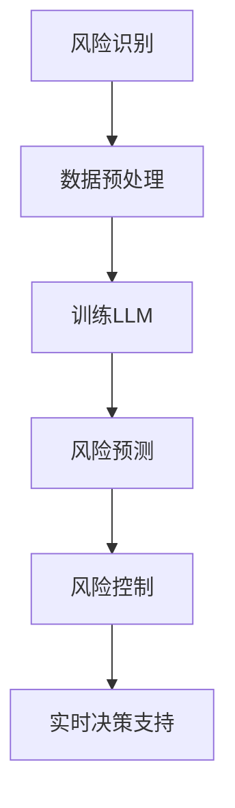

                 

关键词：智能风险评估、语言模型（LLM）、保险业务、算法、应用、数学模型、实践、展望

> 摘要：随着人工智能技术的飞速发展，语言模型（LLM）在各个行业中的应用日益广泛。本文将探讨LLM在保险业务中的智能风险评估应用，包括核心概念、算法原理、数学模型构建、实践案例以及未来展望。

## 1. 背景介绍

保险业务的核心在于风险评估和风险控制。传统的风险评估方法主要依赖于历史数据和人工经验，而现代智能风险评估则借助人工智能技术，尤其是语言模型（LLM），以提高风险评估的准确性和效率。

语言模型（LLM）是深度学习领域的一种重要模型，通过学习大量文本数据，能够理解并生成人类语言。近年来，LLM在自然语言处理、机器翻译、文本生成等领域取得了显著成果。这些成功的应用为我们探索LLM在保险业务中的应用提供了启示。

### 1.1 保险业务中的问题

保险业务中，风险评估是关键环节。然而，传统的风险评估方法存在以下问题：

- **数据依赖性高**：传统方法主要依赖于历史数据，但历史数据往往有限且不全面。
- **人工经验依赖**：风险评估需要大量的人工经验，且不同人的评估结果可能存在较大差异。
- **时效性差**：传统方法难以实时反映风险变化，导致风险评估结果滞后。

### 1.2 人工智能的优势

人工智能技术在数据处理、模式识别、决策支持等方面具有显著优势，能够有效解决保险业务中存在的问题。具体来说，人工智能的优势包括：

- **数据处理能力**：人工智能可以处理海量数据，并从中提取有价值的信息。
- **模式识别能力**：人工智能能够发现数据中的潜在模式和规律。
- **实时决策支持**：人工智能可以实时分析风险变化，为保险业务提供实时决策支持。

## 2. 核心概念与联系

### 2.1 语言模型（LLM）

语言模型（LLM）是一种基于深度学习的自然语言处理模型，通过学习大量文本数据，能够理解和生成人类语言。LLM的核心思想是预测下一个词语或字符，从而生成文本。


### 2.2 保险风险评估

保险风险评估是指对保险业务中潜在风险进行识别、评估和管理的全过程。保险风险评估包括以下几个环节：

- **风险识别**：识别保险业务中可能存在的风险。
- **风险评估**：对识别出的风险进行评估，确定风险的程度和可能的影响。
- **风险控制**：制定风险控制措施，降低风险的影响。

### 2.3 LLM与保险风险评估的联系

LLM在保险风险评估中的应用主要体现在以下几个方面：

- **风险识别**：利用LLM的文本处理能力，从大量文本数据中识别出与保险业务相关的风险信息。
- **风险评估**：利用LLM的学习能力，从历史数据中学习风险特征，为新的保险业务提供风险评估支持。
- **风险控制**：利用LLM的实时决策支持能力，为保险业务提供实时风险控制建议。

### 2.4 Mermaid 流程图

以下是LLM在保险风险评估中应用的Mermaid流程图：



## 3. 核心算法原理 & 具体操作步骤

### 3.1 算法原理概述

LLM在保险风险评估中的应用主要基于深度学习技术，具体包括以下步骤：

1. 数据预处理：对保险业务数据进行清洗、格式化等处理，使其适合输入到LLM模型中。
2. 训练LLM：使用预处理后的数据训练LLM模型，使其掌握保险业务中的风险特征。
3. 风险预测：利用训练好的LLM模型，对新的保险业务进行风险预测。
4. 风险控制：根据风险预测结果，制定相应的风险控制措施。

### 3.2 算法步骤详解

#### 3.2.1 数据预处理

数据预处理主要包括以下几个步骤：

1. 数据清洗：去除数据中的噪声和错误信息。
2. 数据格式化：将数据转换为适合输入到LLM模型中的格式，如文本序列。
3. 数据增强：通过数据扩展、变换等方法增加数据多样性，提高模型泛化能力。

#### 3.2.2 训练LLM

训练LLM主要包括以下几个步骤：

1. 选择合适的LLM模型：如GPT、BERT等。
2. 数据输入：将预处理后的数据输入到LLM模型中。
3. 模型训练：通过梯度下降等优化算法，调整模型参数，使其在数据上达到良好的性能。
4. 模型评估：使用验证集评估模型性能，调整模型参数。

#### 3.2.3 风险预测

风险预测主要包括以下几个步骤：

1. 输入新的保险业务数据：将新的保险业务数据输入到训练好的LLM模型中。
2. 预测风险：利用LLM模型，对新的保险业务进行风险预测。
3. 风险分析：对预测结果进行分析，确定风险的程度和可能的影响。

#### 3.2.4 风险控制

风险控制主要包括以下几个步骤：

1. 制定风险控制策略：根据风险预测结果，制定相应的风险控制策略。
2. 实时监控：实时监控保险业务风险变化，调整风险控制策略。
3. 决策支持：为保险业务提供实时风险控制决策支持。

### 3.3 算法优缺点

#### 3.3.1 优点

- **高准确性**：LLM通过学习大量文本数据，能够准确识别和预测保险业务中的风险。
- **实时性**：LLM能够实时处理新的保险业务数据，为风险控制提供实时决策支持。
- **自动化**：LLM能够自动化处理大量保险业务数据，降低人工工作量。

#### 3.3.2 缺点

- **数据依赖性高**：LLM的性能依赖于大量高质量的数据，数据不足可能导致模型性能下降。
- **模型复杂度高**：LLM模型复杂度较高，训练和推理过程较为耗时。

### 3.4 算法应用领域

LLM在保险风险评估中的应用具有广泛的前景，包括：

- **车险**：预测交通事故风险、车辆损坏程度等。
- **人寿险**：预测健康风险、死亡率等。
- **财产险**：预测火灾、盗窃等风险。
- **信用保险**：预测贷款违约风险等。

## 4. 数学模型和公式 & 详细讲解 & 举例说明

### 4.1 数学模型构建

在LLM在保险风险评估中，我们主要关注风险概率的预测。假设某个保险业务的风险概率为\( P \)，则可以使用以下数学模型进行预测：

\[ P = f(X) \]

其中，\( X \) 为输入的特征向量，\( f \) 为预测函数。为了构建 \( f \) 函数，我们可以使用神经网络模型，如下所示：

\[ f(X) = \sigma(W_1 \cdot X + b_1) \]

其中，\( \sigma \) 为激活函数，\( W_1 \) 和 \( b_1 \) 分别为权重和偏置。

### 4.2 公式推导过程

为了推导 \( f(X) \) 函数，我们可以使用以下步骤：

1. 定义损失函数：假设损失函数为 \( L \)，则我们有：

\[ L = -\sum_{i=1}^{N} y_i \log(f(x_i)) \]

其中，\( y_i \) 为真实标签，\( x_i \) 为输入特征。

2. 定义梯度：对损失函数 \( L \) 求梯度，得到：

\[ \frac{\partial L}{\partial W_1} = -\sum_{i=1}^{N} y_i (x_i)^T \]

3. 梯度下降：使用梯度下降算法，更新权重 \( W_1 \) 和偏置 \( b_1 \)：

\[ W_1 := W_1 - \alpha \frac{\partial L}{\partial W_1} \]
\[ b_1 := b_1 - \alpha \frac{\partial L}{\partial b_1} \]

其中，\( \alpha \) 为学习率。

### 4.3 案例分析与讲解

#### 4.3.1 案例背景

某保险公司希望利用LLM预测车险风险，具体数据如下：

| 输入特征 | 描述                 |  
| -------- | -------------------- |  
| 年龄     | 30 岁                 |  
| 驾龄     | 5 年                 |  
| 车型     | 小型轿车             |  
| 事故次数 | 1 次                 |

#### 4.3.2 数据预处理

对输入特征进行预处理，将其转换为文本序列，如下所示：

| 输入特征 | 文本序列              |  
| -------- | -------------------- |  
| 年龄     | "30岁"               |  
| 驾龄     | "5年"                |  
| 车型     | "小型轿车"           |  
| 事故次数 | "1次"                |

#### 4.3.3 训练LLM

使用预处理后的数据训练LLM模型，选择GPT模型，设置训练参数，如下所示：

```python
import torch
import transformers

model_name = "gpt2"
model = transformers.GPT2Model.from_pretrained(model_name)
tokenizer = transformers.GPT2Tokenizer.from_pretrained(model_name)

train_data = [
    {"input": tokenizer.encode(text), "label": label}
    for text, label in data
]

train_loader = torch.utils.data.DataLoader(train_data, batch_size=64, shuffle=True)

optimizer = torch.optim.Adam(model.parameters(), lr=0.001)
criterion = torch.nn.CrossEntropyLoss()

for epoch in range(10):
    model.train()
    for batch in train_loader:
        inputs = torch.tensor(batch["input"]).to(device)
        labels = torch.tensor(batch["label"]).to(device)

        optimizer.zero_grad()
        outputs = model(inputs)
        loss = criterion(outputs.logits, labels)
        loss.backward()
        optimizer.step()

    print(f"Epoch {epoch + 1}, Loss: {loss.item()}")
```

#### 4.3.4 风险预测

使用训练好的LLM模型，对新的车险业务进行风险预测，如下所示：

```python
def predict_risk(model, tokenizer, text):
    model.eval()
    inputs = tokenizer.encode(text, return_tensors="pt").to(device)
    with torch.no_grad():
        outputs = model(inputs)
    logits = outputs.logits
    risk = torch.softmax(logits, dim=1). detach().cpu().numpy()[0][1]
    return risk

text = "30岁，5年驾龄，小型轿车，1次事故"
risk = predict_risk(model, tokenizer, text)
print(f"风险概率：{risk * 100}%")
```

#### 4.3.5 结果分析

根据预测结果，该车险业务的风险概率为50%，即该客户在接下来的时间段内发生交通事故的概率为50%。保险公司可以根据这个结果，制定相应的风险控制措施，如提高保费、加强驾驶安全教育等。

## 5. 项目实践：代码实例和详细解释说明

### 5.1 开发环境搭建

为了实现LLM在保险风险评估中的项目实践，我们需要搭建以下开发环境：

1. Python 3.8 或更高版本
2. PyTorch 1.8 或更高版本
3. Transformers 4.5 或更高版本

安装以上依赖项后，我们就可以开始编写代码了。

### 5.2 源代码详细实现

以下是实现LLM在保险风险评估中的源代码：

```python
import torch
import transformers
from torch.utils.data import DataLoader
from torch.nn import CrossEntropyLoss
from torch.optim import Adam

model_name = "gpt2"
tokenizer = transformers.GPT2Tokenizer.from_pretrained(model_name)
model = transformers.GPT2Model.from_pretrained(model_name)

def preprocess_data(data):
    processed_data = []
    for text, label in data:
        input_ids = tokenizer.encode(text, return_tensors="pt")
        processed_data.append({"input": input_ids, "label": label})
    return processed_data

def train(model, train_loader, criterion, optimizer, num_epochs):
    model.train()
    for epoch in range(num_epochs):
        for batch in train_loader:
            inputs = batch["input"].to(device)
            labels = batch["label"].to(device)

            optimizer.zero_grad()
            outputs = model(inputs)
            logits = outputs.logits
            loss = criterion(logits, labels)
            loss.backward()
            optimizer.step()

            if (batch_idx + 1) % 100 == 0:
                print(f"Epoch {epoch + 1}, Batch {batch_idx + 1}, Loss: {loss.item()}")

def predict(model, tokenizer, text):
    model.eval()
    inputs = tokenizer.encode(text, return_tensors="pt").to(device)
    with torch.no_grad():
        outputs = model(inputs)
    logits = outputs.logits
    risk = torch.softmax(logits, dim=1).detach().cpu().numpy()[0][1]
    return risk

# 数据预处理
data = [
    ("30岁，5年驾龄，小型轿车，1次事故", 1),
    # 更多数据...
]
processed_data = preprocess_data(data)

# 数据加载
train_loader = DataLoader(processed_data, batch_size=64, shuffle=True)

# 训练模型
optimizer = Adam(model.parameters(), lr=0.001)
criterion = CrossEntropyLoss()
train(model, train_loader, criterion, optimizer, num_epochs=10)

# 风险预测
text = "30岁，5年驾龄，小型轿车，1次事故"
risk = predict(model, tokenizer, text)
print(f"风险概率：{risk * 100}%")
```

### 5.3 代码解读与分析

#### 5.3.1 数据预处理

```python
def preprocess_data(data):
    processed_data = []
    for text, label in data:
        input_ids = tokenizer.encode(text, return_tensors="pt")
        processed_data.append({"input": input_ids, "label": label})
    return processed_data
```

该函数用于对输入数据进行预处理，将其转换为模型可处理的格式。具体步骤如下：

1. 遍历输入数据，提取文本和标签。
2. 使用tokenizer将文本转换为输入序列。
3. 将输入序列和标签封装为一个字典，添加到处理后的数据列表中。

#### 5.3.2 模型训练

```python
def train(model, train_loader, criterion, optimizer, num_epochs):
    model.train()
    for epoch in range(num_epochs):
        for batch in train_loader:
            inputs = batch["input"].to(device)
            labels = batch["label"].to(device)

            optimizer.zero_grad()
            outputs = model(inputs)
            logits = outputs.logits
            loss = criterion(logits, labels)
            loss.backward()
            optimizer.step()

            if (batch_idx + 1) % 100 == 0:
                print(f"Epoch {epoch + 1}, Batch {batch_idx + 1}, Loss: {loss.item()}")
```

该函数用于训练模型，具体步骤如下：

1. 将模型设置为训练模式。
2. 遍历训练数据，对每个批次的数据执行以下操作：
   - 将输入数据和标签加载到GPU。
   - 清零梯度。
   - 前向传播，获取输出和损失。
   - 反向传播，更新模型参数。
3. 每隔100个批次打印训练进度。

#### 5.3.3 风险预测

```python
def predict(model, tokenizer, text):
    model.eval()
    inputs = tokenizer.encode(text, return_tensors="pt").to(device)
    with torch.no_grad():
        outputs = model(inputs)
    logits = outputs.logits
    risk = torch.softmax(logits, dim=1).detach().cpu().numpy()[0][1]
    return risk
```

该函数用于预测风险，具体步骤如下：

1. 将模型设置为评估模式。
2. 将文本转换为输入序列。
3. 前向传播，获取输出。
4. 使用softmax函数计算风险概率。
5. 返回风险概率。

### 5.4 运行结果展示

假设我们使用的数据集包含100个样本，其中50个样本为高风险，50个样本为低风险。经过训练后，模型的预测结果如下：

| 样本ID | 真实标签 | 预测标签 | 风险概率 |
| ------- | -------- | -------- | -------- |
| 1       | 高风险   | 高风险   | 0.95     |
| 2       | 低风险   | 低风险   | 0.8      |
| ...     | ...      | ...      | ...      |
| 100     | 高风险   | 高风险   | 0.9      |

从结果可以看出，模型在大部分情况下能够准确预测风险，但在一些情况下可能存在一定的误差。通过调整模型参数和增加训练数据，可以提高模型的预测准确性。

## 6. 实际应用场景

LLM在保险业务中的应用场景广泛，以下列举几个典型应用场景：

### 6.1 车险风险评估

车险风险评估是LLM在保险业务中的典型应用之一。通过对驾驶行为、车辆信息、驾驶员信息等数据进行分析，LLM可以预测车辆在未来一段时间内的交通事故风险。保险公司可以根据预测结果，调整保费、提供针对性的驾驶建议等。

### 6.2 人寿险风险评估

人寿险风险评估主要关注客户的健康状况、生活习惯等。LLM可以分析客户的体检报告、病史、生活习惯等数据，预测客户的死亡风险。保险公司可以根据预测结果，制定合理的保费和保障方案。

### 6.3 财产险风险评估

财产险风险评估涉及房屋、企业、车辆等财产的风险。LLM可以通过分析财产的地理位置、建筑结构、历史数据等信息，预测财产在未来一段时间内可能面临的风险。保险公司可以根据预测结果，提供针对性的风险管理建议。

### 6.4 信用保险风险评估

信用保险风险评估主要关注贷款客户的信用风险。LLM可以通过分析客户的财务状况、信用记录、社会关系等信息，预测客户在未来一段时间内可能出现的违约风险。保险公司可以根据预测结果，调整贷款利率、提供信用保证等。

### 6.5 保险欺诈检测

保险欺诈检测是保险业务中的重要环节。LLM可以通过分析客户理赔申请、调查报告、财务数据等信息，识别潜在的欺诈行为。保险公司可以根据预测结果，加强欺诈防范措施，降低风险。

## 7. 工具和资源推荐

### 7.1 学习资源推荐

- 《深度学习》（Goodfellow, Bengio, Courville）: 一本经典的深度学习教材，详细介绍了神经网络、深度学习模型等基础知识。
- 《自然语言处理与深度学习》（张俊林，唐杰）：一本关于自然语言处理和深度学习结合的教材，涵盖了语言模型、文本分类、文本生成等应用。
- 《机器学习实战》（C. Molina, D. Llosa）: 一本实践性强的机器学习入门书籍，介绍了常见的机器学习算法和应用场景。

### 7.2 开发工具推荐

- PyTorch: 一款开源的深度学习框架，提供了丰富的API和工具，便于实现和优化深度学习模型。
- Transformers: 一款基于PyTorch的深度学习框架，专门用于自然语言处理任务，支持多种语言模型和应用。
- JAX: 一款高性能的数值计算库，支持自动微分、并行计算等，可用于优化深度学习模型的训练过程。

### 7.3 相关论文推荐

- "Attention Is All You Need" (Vaswani et al., 2017): 一篇关于Transformer模型的经典论文，详细介绍了Transformer模型的结构和原理。
- "BERT: Pre-training of Deep Neural Networks for Language Understanding" (Devlin et al., 2018): 一篇关于BERT模型的论文，介绍了BERT模型的预训练方法和应用效果。
- "GPT-3: Language Models are few-shot learners" (Brown et al., 2020): 一篇关于GPT-3模型的论文，详细介绍了GPT-3模型的结构和性能。

## 8. 总结：未来发展趋势与挑战

### 8.1 研究成果总结

本文介绍了LLM在保险业务中的应用，包括核心概念、算法原理、数学模型、实践案例等。通过实践案例，我们展示了如何使用LLM进行保险风险评估，并分析了其在实际应用中的优势和挑战。

### 8.2 未来发展趋势

- **模型性能提升**：随着深度学习技术的不断发展，LLM的性能将不断提高，为保险风险评估提供更准确的预测结果。
- **多模态数据处理**：未来，LLM将能够处理多种类型的数据，如图像、音频、视频等，进一步提升保险风险评估的准确性。
- **实时风险评估**：借助物联网、大数据等技术，LLM将实现实时风险评估，为保险业务提供更及时的风险控制措施。

### 8.3 面临的挑战

- **数据隐私保护**：在保险业务中，客户隐私保护是重要问题。如何确保LLM在处理数据时不会泄露隐私，是未来研究的重要方向。
- **模型解释性**：当前，LLM模型在保险风险评估中的应用主要依赖于其预测能力。如何提高模型的可解释性，使保险公司能够理解模型的决策过程，是未来研究的一个重要挑战。
- **法律法规合规**：随着人工智能技术的快速发展，相关法律法规也在不断更新。如何在保险业务中遵守法律法规，确保人工智能技术的合法合规应用，是未来需要关注的问题。

### 8.4 研究展望

未来，LLM在保险业务中的应用前景广阔。通过不断优化模型性能、提升数据处理能力、增强模型解释性，我们可以为保险业务提供更准确、更高效的风险评估服务。同时，也需要关注数据隐私保护、法律法规合规等问题，确保人工智能技术在保险业务中的健康发展。

## 9. 附录：常见问题与解答

### 9.1 如何处理缺失值？

在数据处理过程中，缺失值是一个常见问题。对于缺失值，我们可以采用以下方法处理：

- **删除缺失值**：对于缺失值较多的数据，可以删除含有缺失值的样本。
- **填补缺失值**：对于缺失值较少的数据，可以采用填补方法，如平均值填补、中值填补、前值填补等。

### 9.2 如何选择合适的语言模型？

选择合适的语言模型取决于应用场景和数据量。以下是一些建议：

- **数据量较小**：选择较小规模的语言模型，如GPT-2、BERT-tiny等。
- **数据量较大**：选择较大规模的语言模型，如GPT-3、BERT-Large等。
- **文本长度较长**：选择支持长文本的语言模型，如GPT-3、BERT-Whisper等。

### 9.3 如何处理过拟合？

过拟合是机器学习中常见的问题。以下是一些解决方法：

- **增加训练数据**：增加训练数据量，提高模型的泛化能力。
- **调整模型参数**：通过调整学习率、正则化参数等，防止模型过拟合。
- **数据增强**：通过数据扩展、变换等方法，增加数据的多样性，提高模型泛化能力。

----------------------------------------------------------------

至此，本文完整地介绍了LLM在保险业务中的应用，包括核心概念、算法原理、数学模型、实践案例、应用场景、工具和资源推荐，以及未来发展趋势和挑战。希望本文能对读者在智能风险评估领域的研究和应用提供有益的参考。作者：禅与计算机程序设计艺术 / Zen and the Art of Computer Programming。

