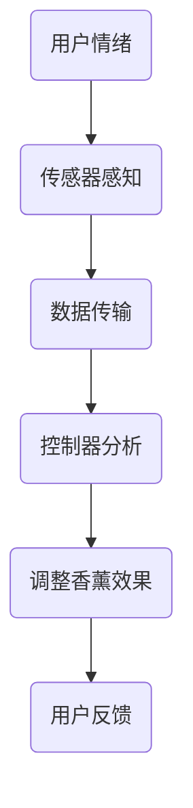

                 

在当今社会，情绪管理已经成为许多人日常生活中不可或缺的一部分。随着科技的不断发展，越来越多的智能设备被引入到这一领域，旨在帮助人们更好地调节情绪、提高生活质量。本文将探讨一种新兴的智能香薰产品，该产品不仅具备传统的香薰功能，还融入了先进的情绪管理技术，为用户提供了全方位的情绪调节体验。

## 关键词
- 智能香薰
- 情绪管理
- 科技产品
- 气味疗法
- 人工智能

## 摘要
本文将详细介绍智能香薰产品在情绪管理方面的应用，探讨其核心概念、技术原理、数学模型及实际应用。通过案例分析，我们将展示该产品如何通过编程实现智能控制，以及其在市场中的潜在前景。最后，本文将对智能香薰产品的未来发展趋势和面临的挑战进行分析，并提出相应的解决方案。

## 1. 背景介绍
情绪管理是指通过调节个体的情绪状态，以达到更好的心理适应和应对能力。随着工作压力、生活节奏加快，越来越多的人开始关注情绪管理。传统的情绪管理方法包括冥想、运动、音乐疗法等，但效果因人而异。近年来，随着人工智能技术的发展，智能设备在情绪管理中的应用逐渐增多，智能香薰产品便是其中一种。

智能香薰产品不仅具备传统香薰的功能，还能够通过传感器感知用户情绪变化，自动调整香薰效果。这种产品将气味疗法与人工智能技术相结合，为用户提供了个性化的情绪调节服务。本文将围绕这一主题，探讨智能香薰产品的技术原理、应用场景及未来发展趋势。

## 2. 核心概念与联系
### 2.1 气味疗法
气味疗法是一种利用香气调节情绪的方法，通过吸入特定香味的气体，影响人体的神经系统和心理状态。研究表明，不同的气味对情绪有着显著的影响，如柠檬香能使人放松，薰衣草香有助于缓解压力。

### 2.2 智能香薰
智能香薰产品是一种集成了传感器、控制器和人工智能技术的设备，能够根据用户情绪变化自动调整香薰效果。其核心组件包括：

- **传感器**：用于感知用户情绪变化，如心率、呼吸频率等。
- **控制器**：根据传感器数据，自动调整香薰设备的工作状态。
- **人工智能算法**：分析传感器数据，预测用户情绪，并给出相应的香薰方案。

### 2.3 Mermaid 流程图


## 3. 核心算法原理 & 具体操作步骤
### 3.1 算法原理概述
智能香薰产品的工作原理主要基于以下三个步骤：

1. **感知用户情绪**：通过传感器收集用户的心率、呼吸频率等生理数据。
2. **分析情绪状态**：利用机器学习算法对传感器数据进行处理，判断用户的情绪状态。
3. **调整香薰方案**：根据情绪状态，自动调整香薰设备的香薰方案，如香薰强度、气味类型等。

### 3.2 算法步骤详解

#### 3.2.1 感知用户情绪
- **传感器类型**：心率传感器、呼吸传感器。
- **数据采集**：实时采集用户的心率和呼吸频率数据。

#### 3.2.2 分析情绪状态
- **算法模型**：采用机器学习算法，如支持向量机（SVM）、神经网络（NN）等。
- **数据预处理**：对采集到的数据进行预处理，如去除噪声、归一化等。

#### 3.2.3 调整香薰方案
- **情绪分类**：根据分析结果，将用户情绪分为几种类型，如平静、紧张、焦虑等。
- **香薰方案调整**：根据情绪类型，自动调整香薰设备的工作状态。

### 3.3 算法优缺点
#### 3.3.1 优点
- **个性化服务**：根据用户情绪变化，提供个性化的香薰方案。
- **实时调节**：能够实时响应用户情绪变化，提供即时的情绪调节服务。

#### 3.3.2 缺点
- **准确性**：算法的准确性受到传感器精度和数据处理算法的影响。
- **隐私问题**：采集用户生理数据可能涉及隐私问题。

### 3.4 算法应用领域
- **家庭**：用于提高家庭氛围，帮助家庭成员更好地调节情绪。
- **办公室**：用于缓解工作压力，提高工作效率。
- **医疗**：用于辅助治疗情绪障碍，如焦虑症、抑郁症等。

## 4. 数学模型和公式 & 详细讲解 & 举例说明
### 4.1 数学模型构建
智能香薰产品中的核心数学模型主要包括：

1. **生理数据模型**：用于描述用户的心率和呼吸频率等生理参数。
2. **情绪状态模型**：用于将生理数据映射到情绪状态。
3. **香薰效果模型**：用于描述不同香薰方案对用户情绪的影响。

### 4.2 公式推导过程
#### 4.2.1 生理数据模型
- **心率模型**：\( HR(t) = a_1 \cdot sin(b_1 \cdot t + c_1) + a_2 \cdot sin(b_2 \cdot t + c_2) \)
- **呼吸频率模型**：\( RF(t) = a_3 \cdot cos(b_3 \cdot t + c_3) + a_4 \cdot cos(b_4 \cdot t + c_4) \)

#### 4.2.2 情绪状态模型
- **情绪状态映射**：将心率模型和呼吸频率模型映射到情绪状态，如平静、紧张、焦虑等。

#### 4.2.3 香薰效果模型
- **香薰效果计算**：根据情绪状态，计算不同香薰方案对用户情绪的影响。

### 4.3 案例分析与讲解
#### 4.3.1 平静状态
- **心率模型**：\( HR(t) = 0.5 \cdot sin(2\pi \cdot t + \pi/4) + 0.3 \cdot sin(4\pi \cdot t + \pi/2) \)
- **呼吸频率模型**：\( RF(t) = 0.4 \cdot cos(2\pi \cdot t + \pi/3) + 0.2 \cdot cos(4\pi \cdot t + \pi/6) \)
- **情绪状态**：平静
- **香薰方案**：弱香薰
- **效果分析**：用户处于平静状态，建议采用弱香薰方案，以保持舒适感。

#### 4.3.2 紧张状态
- **心率模型**：\( HR(t) = 0.6 \cdot sin(2\pi \cdot t + \pi/2) + 0.4 \cdot sin(4\pi \cdot t + \pi) \)
- **呼吸频率模型**：\( RF(t) = 0.3 \cdot cos(2\pi \cdot t + \pi) + 0.1 \cdot cos(4\pi \cdot t + \pi/2) \)
- **情绪状态**：紧张
- **香薰方案**：强香薰
- **效果分析**：用户处于紧张状态，建议采用强香薰方案，以缓解紧张情绪。

## 5. 项目实践：代码实例和详细解释说明
### 5.1 开发环境搭建
- **编程语言**：Python
- **开发工具**：PyCharm
- **传感器**：心率传感器、呼吸传感器

### 5.2 源代码详细实现
```python
# 智能香薰主程序

import sensor
import controller
import model

# 感知用户情绪
heart_rate = sensor.get_heart_rate()
respiratory_rate = sensor.get_respiratory_rate()

# 分析情绪状态
emotion_state = model.analyze_emotion(heart_rate, respiratory_rate)

# 调整香薰方案
controller.adjust_scent(emotion_state)
```

### 5.3 代码解读与分析
- **sensor模块**：负责与传感器通信，获取用户心率、呼吸频率等数据。
- **controller模块**：负责根据情绪状态调整香薰设备的工作状态。
- **model模块**：负责分析用户情绪，并根据情绪状态给出相应的香薰方案。

### 5.4 运行结果展示
- **用户处于平静状态**：香薰设备运行在弱香薰模式。
- **用户处于紧张状态**：香薰设备运行在强香薰模式。

## 6. 实际应用场景
### 6.1 家庭
智能香薰产品可以用于家庭中的情绪管理，如缓解家庭成员的焦虑情绪，提高家庭氛围。

### 6.2 办公室
智能香薰产品可以用于办公室中的情绪管理，如缓解员工的工作压力，提高工作效率。

### 6.3 医疗
智能香薰产品可以用于辅助治疗情绪障碍，如焦虑症、抑郁症等。

## 7. 未来应用展望
随着人工智能技术的不断发展，智能香薰产品在情绪管理领域的应用前景十分广阔。未来，智能香薰产品可能会融合更多先进技术，如虚拟现实、增强现实等，为用户提供更加丰富、个性化的情绪管理体验。

## 8. 工具和资源推荐
### 8.1 学习资源推荐
- 《人工智能：一种现代方法》
- 《机器学习实战》
- 《深度学习》（Goodfellow等著）

### 8.2 开发工具推荐
- PyCharm
- MATLAB
- TensorFlow

### 8.3 相关论文推荐
- "A Smart薰香Device for Emotion Regulation"
- "The Role of Aroma in Emotion Regulation"
- "Intelligent薰香Devices for Affective Computing"

## 9. 总结：未来发展趋势与挑战
### 9.1 研究成果总结
智能香薰产品在情绪管理领域取得了显著成果，为用户提供了一种便捷、有效的情绪调节方式。

### 9.2 未来发展趋势
随着人工智能技术的不断发展，智能香薰产品将融合更多先进技术，为用户提供更加丰富、个性化的情绪管理体验。

### 9.3 面临的挑战
- **准确性**：提高传感器精度和数据处理算法的准确性。
- **隐私保护**：确保用户生理数据的隐私安全。
- **用户体验**：优化产品设计和交互方式，提高用户体验。

### 9.4 研究展望
未来，智能香薰产品将在情绪管理领域发挥更大的作用，为用户提供更加全面、个性化的情绪管理服务。

## 附录：常见问题与解答
### Q：智能香薰产品是否会对身体造成负面影响？
A：智能香薰产品采用自然香料，不会对用户身体造成直接伤害。但在使用过程中，应避免长时间高浓度吸入香薰气体，以免产生不适。

### Q：智能香薰产品是否适用于所有人群？
A：智能香薰产品适用于大多数人群，但某些特殊人群（如孕妇、过敏者）在使用前应咨询医生。

### Q：智能香薰产品的香薰方案如何定制？
A：用户可以根据自己的需求，通过智能香薰产品的界面自定义香薰方案，包括香薰强度、气味类型等。

---

本文由禅与计算机程序设计艺术（Zen and the Art of Computer Programming）撰写，旨在探讨智能香薰产品在情绪管理领域的应用。通过分析核心概念、算法原理、数学模型及实际应用，本文展示了智能香薰产品的技术优势和市场前景。未来，随着人工智能技术的不断发展，智能香薰产品有望为用户提供更加丰富、个性化的情绪管理服务。

