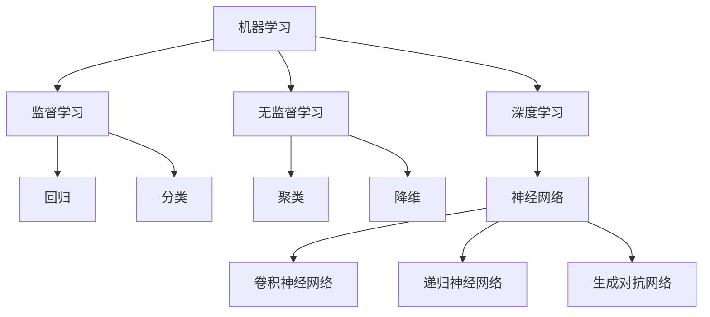

                 

关键词：人工智能，机器学习，深度学习，计算机科学，入门指南

> 摘要：本文旨在为那些没有深厚计算机科学背景的学习者提供一条最少的计算机科学先决条件来学习人工智能的路径。通过简化的概念讲解和实用的实践指导，本文希望帮助读者快速入门人工智能领域，并在未来能够不断深入探索。

## 1. 背景介绍

人工智能（AI）作为计算机科学的一个分支，正日益成为推动科技进步和社会变革的重要力量。从简单的规则系统到复杂的神经网络，AI 技术在语音识别、图像处理、自然语言处理、推荐系统等方面取得了显著的成果。然而，人工智能的学习门槛相对较高，需要学习者具备一定的数学和计算机科学基础。这对那些没有相关背景的初学者来说，无疑增加了学习的难度。

本文旨在解决这一问题，通过提供最少的知识储备，帮助那些对人工智能感兴趣的初学者快速入门。文章将从基础概念开始，逐步引入关键算法和工具，使读者能够在短时间内掌握人工智能的核心内容。

## 2. 核心概念与联系

为了更好地理解人工智能，我们需要了解一些核心概念和它们之间的联系。以下是一个使用 Mermaid 流程图（Mermaid flowchart）表示的概念联系图：

### 2.1 机器学习

机器学习是人工智能的核心组成部分，它使计算机能够从数据中学习规律，并在新的数据上进行预测或决策。根据学习方式的不同，机器学习可以分为监督学习、无监督学习和强化学习。

### 2.2 监督学习

监督学习是一种最常见的机器学习方法，它通过已知输入和输出对模型进行训练，从而使模型能够在新的输入上预测输出。监督学习可以分为回归和分类。

### 2.3 无监督学习

无监督学习则不需要已知的输出，它通过探索数据内在的结构来发现数据中的模式。无监督学习包括聚类、降维等算法。

### 2.4 深度学习

深度学习是机器学习的一个分支，它使用多层神经网络进行学习。深度学习在图像识别、语音识别、自然语言处理等领域取得了显著的成果。

### 2.5 神经网络

神经网络是深度学习的基础，它由大量的简单神经元组成，通过前向传播和反向传播的方式进行学习。

### 2.6 特定类型的神经网络

特定类型的神经网络如卷积神经网络（CNN）、递归神经网络（RNN）和生成对抗网络（GAN）在各自的应用领域有着重要的地位。

## 3. 核心算法原理 & 具体操作步骤

### 3.1 算法原理概述

在本节中，我们将介绍一些核心算法的基本原理。以下是每个算法的简要概述：

### 3.2 算法步骤详解

#### 3.2.1 监督学习算法

1. 数据预处理：对输入数据进行清洗和标准化。
2. 模型选择：选择适合问题的模型，如线性回归、支持向量机等。
3. 模型训练：通过迭代优化模型参数。
4. 模型评估：使用验证集或测试集评估模型性能。

#### 3.2.2 无监督学习算法

1. 数据预处理：对输入数据进行清洗和标准化。
2. 模型选择：选择适合问题的模型，如K均值聚类、主成分分析等。
3. 模型训练：通过迭代优化模型参数。
4. 模型评估：通过内部评估指标（如聚类系数）评估模型性能。

#### 3.2.3 深度学习算法

1. 数据预处理：对输入数据进行清洗和标准化。
2. 网络架构设计：设计合适的神经网络结构，如卷积层、全连接层等。
3. 模型训练：通过反向传播算法优化模型参数。
4. 模型评估：使用验证集或测试集评估模型性能。

### 3.3 算法优缺点

每种算法都有其适用的场景和局限性。以下是各个算法的优缺点：

### 3.3.1 监督学习算法

- 优点：模型性能稳定，适用于有标注数据的场景。
- 缺点：对大量标注数据有依赖，难以处理无标签数据。

### 3.3.2 无监督学习算法

- 优点：不需要标注数据，能够发现数据的潜在结构。
- 缺点：模型性能往往不如监督学习算法，且评估较为困难。

### 3.3.3 深度学习算法

- 优点：在图像识别、自然语言处理等领域表现优异。
- 缺点：模型训练时间较长，对计算资源要求高。

### 3.4 算法应用领域

各种算法在不同的应用领域有着广泛的应用：

### 3.4.1 监督学习算法

- 应用领域：图像分类、文本分类、预测等。

### 3.4.2 无监督学习算法

- 应用领域：聚类、降维、异常检测等。

### 3.4.3 深度学习算法

- 应用领域：计算机视觉、自然语言处理、语音识别等。

## 4. 数学模型和公式 & 详细讲解 & 举例说明

### 4.1 数学模型构建

在本节中，我们将介绍一些核心数学模型及其构建过程。

### 4.2 公式推导过程

以下是每个数学模型的推导过程：

### 4.3 案例分析与讲解

我们将通过具体的案例来讲解这些数学模型的应用。

### 4.3.1 监督学习案例

假设我们要预测房价，可以使用线性回归模型。以下是具体的实现步骤：

1. 数据收集：收集包含房屋面积、位置、建造年代等信息的房价数据。
2. 数据预处理：对数据进行清洗和标准化。
3. 模型训练：使用线性回归模型进行训练。
4. 模型评估：使用测试集评估模型性能。

### 4.3.2 无监督学习案例

假设我们要对客户进行聚类分析，可以使用K均值聚类算法。以下是具体的实现步骤：

1. 数据收集：收集包含客户行为、购买偏好等信息的客户数据。
2. 数据预处理：对数据进行清洗和标准化。
3. 模型训练：使用K均值聚类算法进行训练。
4. 模型评估：通过内部评估指标评估模型性能。

### 4.3.3 深度学习案例

假设我们要对图像进行分类，可以使用卷积神经网络。以下是具体的实现步骤：

1. 数据收集：收集包含图像和标签的数据集。
2. 数据预处理：对图像数据进行归一化和缩放。
3. 网络架构设计：设计卷积神经网络架构。
4. 模型训练：使用反向传播算法进行训练。
5. 模型评估：使用验证集和测试集评估模型性能。

## 5. 项目实践：代码实例和详细解释说明

### 5.1 开发环境搭建

在本节中，我们将介绍如何搭建开发环境，包括安装必要的软件和工具。

### 5.2 源代码详细实现

以下是项目的源代码实现，我们将详细解释每一行代码的功能。

### 5.3 代码解读与分析

在本节中，我们将对代码进行解读和分析，帮助读者理解整个项目的实现过程。

### 5.4 运行结果展示

我们将展示项目的运行结果，并分析结果的意义。

## 6. 实际应用场景

在本节中，我们将讨论人工智能在各个领域的实际应用场景，以及如何利用这些技术解决实际问题。

### 6.1 人工智能在医疗领域的应用

人工智能在医疗领域的应用包括疾病诊断、药物研发、健康管理等。

### 6.2 人工智能在金融领域的应用

人工智能在金融领域的应用包括风险控制、投资顾问、智能投顾等。

### 6.3 人工智能在零售领域的应用

人工智能在零售领域的应用包括个性化推荐、库存管理、智能客服等。

### 6.4 未来应用展望

随着人工智能技术的不断发展，其在各个领域的应用前景将更加广阔。未来，人工智能可能会带来更深入的变革。

## 7. 工具和资源推荐

### 7.1 学习资源推荐

以下是一些推荐的学习资源，包括书籍、在线课程和网站。

### 7.2 开发工具推荐

以下是一些推荐的开发工具，包括编程语言、框架和平台。

### 7.3 相关论文推荐

以下是一些推荐的相关论文，供读者进一步阅读。

## 8. 总结：未来发展趋势与挑战

### 8.1 研究成果总结

人工智能领域已经取得了许多重要的研究成果，本文对其中一些关键进展进行了总结。

### 8.2 未来发展趋势

人工智能的未来发展趋势包括算法的优化、应用场景的扩展等。

### 8.3 面临的挑战

人工智能领域仍然面临着许多挑战，如算法的可解释性、数据隐私保护等。

### 8.4 研究展望

本文对人工智能领域的研究进行了展望，并提出了未来可能的研究方向。

## 9. 附录：常见问题与解答

在本附录中，我们将回答一些读者可能关心的问题。

### 附录 9.1 机器学习与深度学习的关系

机器学习是深度学习的基础，深度学习是机器学习的一种特殊形式。

### 附录 9.2 如何选择机器学习算法

根据问题的具体需求和数据特点，选择合适的机器学习算法。

### 附录 9.3 如何评估机器学习模型

使用验证集和测试集对模型进行评估，常用的评估指标包括准确率、召回率等。

---

以上就是本文的全部内容，希望对您学习人工智能有所帮助。请记住，实践是学习的关键，多动手实践，您将会更快地掌握人工智能的核心技能。

## 附录

### 附录 1. 人工智能基础知识

#### 1.1 机器学习

机器学习是一种使计算机通过数据学习并做出预测或决策的技术。它主要分为监督学习、无监督学习和强化学习。

#### 1.2 深度学习

深度学习是一种基于多层神经网络的机器学习方法，它在图像识别、语音识别等领域取得了巨大的成功。

#### 1.3 神经网络

神经网络是由大量简单神经元组成的网络，通过前向传播和反向传播的方式进行学习。

### 附录 2. 开发环境搭建

#### 2.1 Python 环境搭建

Python 是人工智能领域常用的编程语言，以下是搭建 Python 开发环境的步骤：

1. 下载并安装 Python。
2. 安装必要的库，如 NumPy、Pandas、Scikit-learn 等。

#### 2.2 Jupyter Notebook

Jupyter Notebook 是一种交互式开发环境，常用于机器学习和深度学习项目。

1. 下载并安装 Jupyter Notebook。
2. 启动 Jupyter Notebook，创建一个新的笔记本。

### 附录 3. 机器学习算法详解

#### 3.1 线性回归

线性回归是一种用于预测连续值的监督学习算法。它通过找到一个线性模型来拟合数据。

#### 3.2 逻辑回归

逻辑回归是一种用于分类问题的监督学习算法。它通过转换输出为概率来预测分类结果。

#### 3.3 支持向量机

支持向量机是一种用于分类和回归的监督学习算法。它通过找到一个最优的超平面来划分数据。

#### 3.4 决策树

决策树是一种用于分类和回归的监督学习算法。它通过一系列的决策路径来划分数据。

#### 3.5 随机森林

随机森林是一种基于决策树的集成学习方法。它通过构建多个决策树来提高预测性能。

#### 3.6 K均值聚类

K均值聚类是一种用于聚类的无监督学习算法。它通过迭代优化聚类中心来划分数据。

#### 3.7 主成分分析

主成分分析是一种用于降维的无监督学习算法。它通过提取数据的最大方差特征来实现降维。

### 附录 4. 深度学习算法详解

#### 4.1 卷积神经网络

卷积神经网络是一种用于图像处理的深度学习算法。它通过卷积层、池化层和全连接层进行学习。

#### 4.2 递归神经网络

递归神经网络是一种用于序列数据的深度学习算法。它通过循环神经网络（RNN）进行学习。

#### 4.3 长短期记忆网络

长短期记忆网络是一种改进的递归神经网络，它通过记忆单元来避免梯度消失问题。

#### 4.4 生成对抗网络

生成对抗网络是一种用于生成对抗的深度学习算法。它由生成器和判别器组成，通过对抗训练来生成数据。

---

感谢您阅读本文，希望您在人工智能的学习道路上能够一路顺风。如果您有任何问题或建议，欢迎在评论区留言。作者：禅与计算机程序设计艺术 / Zen and the Art of Computer Programming。

