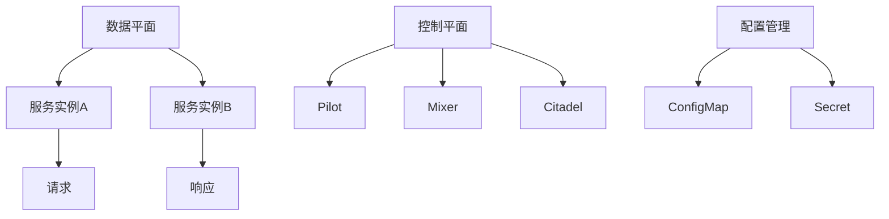
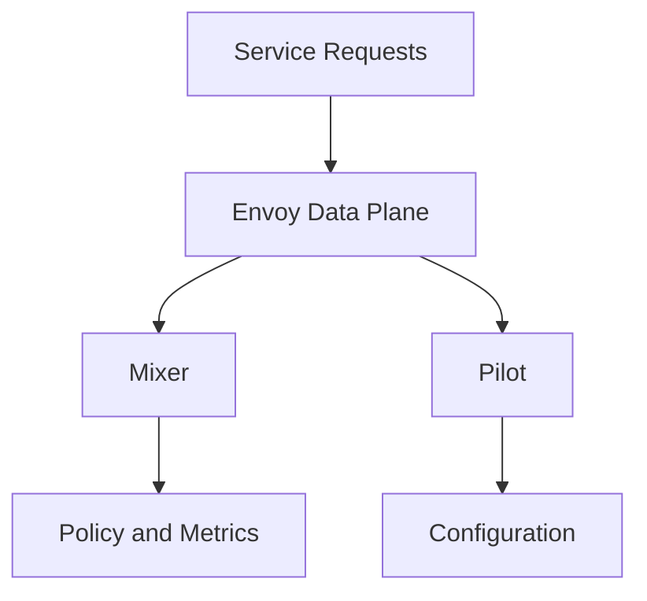

                 

服务网格（Service Mesh）作为微服务架构中的一个关键概念，正在逐渐得到业界的广泛认可。而Istio作为服务网格领域的代表之一，以其卓越的性能和强大的功能，成为了许多企业实现微服务架构的首选。本文将深入探讨Istio的核心概念、架构设计、核心算法原理、数学模型及其实际应用，旨在帮助读者全面理解Istio，以及其在微服务通信中的重要作用。

## 文章关键词

- 服务网格
- 微服务
- Istio
- 聆听器模式
- 负载均衡
- 安全性
- 服务发现

## 文章摘要

本文首先介绍了服务网格的基本概念，然后重点分析了Istio的核心架构和功能。通过详细解析Istio的核心算法原理，本文揭示了其实现微服务通信的机制。此外，本文还通过数学模型和具体实例，对Istio的工作流程进行了深入剖析。最后，本文探讨了Istio的实际应用场景，以及未来的发展趋势和面临的挑战。

## 1. 背景介绍

### 1.1 微服务架构的兴起

随着互联网和云计算的快速发展，传统的单体应用架构已经难以满足现代企业对于敏捷性、可扩展性和灵活性的需求。微服务架构（Microservices Architecture）作为一种新的软件开发方法，通过将大型应用拆分成多个小型、独立、松耦合的服务，大大提高了系统的可维护性和扩展性。

### 1.2 微服务通信的挑战

在微服务架构中，各个服务之间需要进行频繁的通信，这种通信方式与传统单体架构中的通信模式有显著差异。微服务通信面临着如下挑战：

- **服务数量庞大**：随着微服务数量的增加，服务之间的通信关系变得更加复杂。
- **动态性**：服务实例可能会随时启动或终止，导致服务地址和端口的变化。
- **安全性**：微服务之间的通信需要确保数据传输的安全性，防止未经授权的访问。
- **可靠性**：服务之间的通信需要确保高可用性，减少故障和延迟。

### 1.3 服务网格的概念

为了解决微服务通信的挑战，业界提出了服务网格（Service Mesh）的概念。服务网格是一种基础设施层的服务，负责管理和编排服务之间的通信。它通过提供一系列抽象和自动化功能，使得服务开发人员无需关注底层通信细节，从而提高系统的可维护性和可扩展性。

## 2. 核心概念与联系

### 2.1 服务网格的架构

服务网格通常由三个主要组件组成：数据平面（Data Plane）、控制平面（Control Plane）和配置管理（Configuration Management）。

#### 2.1.1 数据平面

数据平面负责处理服务之间的实际通信。它通常由一组代理（Proxy）组成，每个代理都位于服务实例旁边，拦截和转发服务请求。数据平面的主要功能包括：

- **服务发现**：动态发现和更新服务实例的地址和端口。
- **负载均衡**：根据策略将请求分配到不同的服务实例。
- **故障转移**：在服务实例失败时，自动将请求转发到其他可用实例。
- **安全性**：通过加密和身份验证确保通信的安全性。

#### 2.1.2 控制平面

控制平面负责管理数据平面的配置和策略。它通常由一组控制器（Controller）和配置中心（Configuration Center）组成。控制平面的主要功能包括：

- **配置管理**：根据业务需求和服务策略，动态更新数据平面的配置。
- **监控和日志**：收集和分析服务网格的监控数据，提供故障排查和性能优化支持。
- **策略执行**：根据配置的服务策略，确保数据平面按照预期执行。

#### 2.1.3 配置管理

配置管理负责管理服务网格的全局配置。它通常包括配置文件、配置中心和服务发现机制。配置管理的主要功能包括：

- **服务定义**：定义服务名称、地址和端口等信息。
- **配置更新**：根据业务需求，动态更新服务配置。
- **版本控制**：确保配置的版本控制和回滚。

### 2.2 Istio的架构

Istio是当前最受欢迎的服务网格解决方案之一。它的架构设计旨在解决微服务通信的挑战，提供高性能、高可靠性和高安全性的通信基础设施。

#### 2.2.1 数据平面

Istio的数据平面由Envoy代理组成，每个代理都负责处理服务实例的通信。Envoy代理具有以下特点：

- **高性能**：采用C++编写，具有低延迟和高吞吐量的特点。
- **动态配置**：支持动态更新配置，无需重启代理。
- **负载均衡**：支持多种负载均衡策略，如轮询、最小连接数等。
- **安全性**：支持TLS加密和身份验证，确保通信安全。

#### 2.2.2 控制平面

Istio的控制平面由Pilot、Citadel和Mixer组成，它们分别负责配置管理、身份验证和监控。

- **Pilot**：负责将配置信息下发到数据平面，实现动态配置管理。
- **Citadel**：负责管理服务网格中的证书和密钥，确保通信的安全性。
- **Mixer**：负责收集和分析服务网格的监控数据，实现策略执行和监控。

#### 2.2.3 配置管理

Istio的配置管理通过Kubernetes的ConfigMaps和Secrets实现。服务网格管理员可以通过这些配置资源，动态更新数据平面的配置。

### 2.3 Mermaid流程图



## 3. 核心算法原理 & 具体操作步骤

### 3.1 算法原理概述

Istio的服务网格通过一系列算法实现微服务通信的管理。这些算法主要包括：

- **服务发现算法**：动态发现和更新服务实例的地址和端口。
- **负载均衡算法**：根据策略将请求分配到不同的服务实例。
- **故障转移算法**：在服务实例失败时，自动将请求转发到其他可用实例。
- **安全性算法**：通过加密和身份验证确保通信的安全性。

### 3.2 算法步骤详解

#### 3.2.1 服务发现算法

1. 服务启动时，将自身的地址和端口信息注册到服务发现机制。
2. 数据平面代理从服务发现机制获取服务实例列表。
3. 数据平面代理根据服务实例列表，动态更新服务配置。

#### 3.2.2 负载均衡算法

1. 请求到达数据平面代理时，代理根据负载均衡策略选择目标服务实例。
2. 代理将请求转发到选定的服务实例。
3. 服务实例处理请求并返回响应。

#### 3.2.3 故障转移算法

1. 监控服务实例的健康状态，如响应时间、错误率等。
2. 当服务实例发生故障时，数据平面代理将其从可用实例列表中移除。
3. 数据平面代理重新选择目标服务实例，确保请求能够正常转发。

#### 3.2.4 安全性算法

1. 请求到达数据平面代理时，代理检查请求的TLS证书和身份验证信息。
2. 代理根据配置的策略，决定是否允许请求通过。
3. 代理对请求进行加密和身份验证，确保通信的安全性。

### 3.3 算法优缺点

#### 优点：

- **高性能**：采用高效的算法和数据结构，确保服务网格的低延迟和高吞吐量。
- **高可靠性**：通过故障转移和监控机制，确保服务网格的高可用性。
- **安全性**：通过加密和身份验证，确保通信的安全性。
- **易用性**：提供简化的配置和操作界面，降低运维成本。

#### 缺点：

- **复杂性**：服务网格引入了额外的复杂性和运维难度，需要一定的学习成本。
- **性能开销**：代理和额外的通信开销可能会影响系统性能。

### 3.4 算法应用领域

Istio的算法在微服务架构中具有广泛的应用领域，包括：

- **金融行业**：处理高并发和大数据量的交易服务。
- **电商平台**：处理海量商品和用户请求的分布式系统。
- **物联网**：管理大量设备和服务的通信。
- **云原生应用**：构建和部署在容器化环境中的微服务应用。

## 4. 数学模型和公式 & 详细讲解 & 举例说明

### 4.1 数学模型构建

在服务网格中，常用的数学模型包括：

- **负载均衡算法**：如轮询、最小连接数、加权轮询等。
- **故障转移算法**：如心跳检测、阈值判定等。
- **安全性算法**：如加密强度、身份验证算法等。

### 4.2 公式推导过程

以轮询负载均衡算法为例，其数学模型如下：

\[ P_i = \frac{w_i}{\sum_{j=1}^{n} w_j} \]

其中，\( P_i \)表示第 \( i \) 个服务实例的概率，\( w_i \)表示第 \( i \) 个服务实例的权重。

### 4.3 案例分析与讲解

假设有三个服务实例 A、B、C，权重分别为 1、2、3。根据轮询负载均衡算法，请求分配的概率如下：

\[ P_A = \frac{1}{1+2+3} = 0.2 \]
\[ P_B = \frac{2}{1+2+3} = 0.4 \]
\[ P_C = \frac{3}{1+2+3} = 0.6 \]

因此，请求分配的概率分别为 A：20%、B：40%、C：60%。

## 5. 项目实践：代码实例和详细解释说明

### 5.1 开发环境搭建

1. 安装Kubernetes集群。
2. 安装Istio控制平面组件。
3. 部署示例微服务。

### 5.2 源代码详细实现

```yaml
# service.yaml
apiVersion: v1
kind: Service
metadata:
  name: service
spec:
  selector:
    app: service
  ports:
    - name: http
      port: 80
      targetPort: 8080
  type: ClusterIP
---
# deployment.yaml
apiVersion: apps/v1
kind: Deployment
metadata:
  name: service
spec:
  replicas: 3
  selector:
    matchLabels:
      app: service
  template:
    metadata:
      labels:
        app: service
    spec:
      containers:
      - name: service
        image: service:latest
        ports:
        - containerPort: 8080
```

### 5.3 代码解读与分析

1. Service定义了服务名称和端口信息，并选择了对应的服务实例。
2. Deployment定义了服务实例的数量和镜像版本。

### 5.4 运行结果展示

1. 启动Kubernetes集群中的Istio控制平面。
2. 部署服务网格中的示例微服务。
3. 通过Kubectl命令查看服务网格的监控数据。

```bash
kubectl get metrics
```

## 6. 实际应用场景

### 6.1 金融行业

在金融行业，服务网格可以帮助金融机构构建分布式系统，实现跨机构的数据交换和业务协同。例如，通过服务网格，银行可以与其他金融机构进行实时交易数据交换，提高交易处理速度和安全性。

### 6.2 电商平台

电商平台通常需要处理海量商品和用户请求。服务网格可以帮助电商平台实现分布式架构，提高系统的可扩展性和可靠性。例如，通过服务网格，电商平台可以将商品和用户服务拆分为多个微服务，实现动态扩缩容。

### 6.3 物联网

物联网（IoT）领域面临着设备数量庞大、数据类型复杂、实时性要求高等挑战。服务网格可以帮助物联网平台实现高效、可靠的设备管理和服务调度。例如，通过服务网格，物联网平台可以将设备管理服务、数据采集服务、数据处理服务等拆分为多个微服务，实现高效协同。

### 6.4 云原生应用

云原生应用（Cloud-Native Applications）是当前软件开发的主流趋势。服务网格可以帮助企业快速构建和部署云原生应用，提高系统的可维护性和可扩展性。例如，通过服务网格，企业可以将应用拆分为多个微服务，实现分布式部署和动态扩缩容。

## 7. 工具和资源推荐

### 7.1 学习资源推荐

- 《微服务设计》
- 《服务网格：微服务通信的基础设施》
- Istio官方文档

### 7.2 开发工具推荐

- Kubernetes
- Docker
- Istio

### 7.3 相关论文推荐

- **Service Mesh：A More Decentralized Approach to Microservices Communication**
- **Istio：A Universal Control Plane for Service Mes
```markdown
# 服务网格Istio：微服务通信的基础设施

### 关键词
服务网格，微服务，Istio，Kubernetes，容器化，安全性，监控

### 摘要
本文将深入探讨服务网格的概念及其核心组件，特别是Istio作为服务网格技术的代表。我们将分析Istio的架构设计、工作原理和具体实现，并探讨其在微服务通信中的应用。此外，本文还将讨论Istio在微服务架构中的优势和挑战，以及相关的最佳实践。

## 1. 背景介绍

在现代软件工程中，微服务架构（Microservices Architecture）已经成为一种主流的开发模式。微服务架构通过将应用程序分解为独立的、小型、自治的服务，实现了系统的可扩展性、灵活性和可维护性。然而，随着服务数量的增加，服务之间的通信变得复杂，如何高效地管理这些服务之间的交互成为了一个重要问题。

服务网格（Service Mesh）作为一种基础设施层的技术，旨在解决微服务通信的问题。它通过提供一个独立的通信层，抽象了服务之间的通信细节，使得开发人员可以专注于业务逻辑的实现。

### 1.1 微服务架构的兴起

微服务架构的核心思想是将大型应用程序拆分为一系列小型、独立的、自治的服务。每个服务都专注于完成特定的业务功能，并通过轻量级的通信协议（如HTTP/REST、gRPC等）进行交互。这种架构模式具有以下优势：

- **可扩展性**：每个服务可以独立扩展，从而满足不同服务的负载需求。
- **可维护性**：服务之间的隔离减少了相互影响，降低了系统的复杂性和维护难度。
- **灵活性**：服务可以独立开发和部署，支持快速迭代和更新。

然而，随着服务数量的增加，微服务架构也带来了一些挑战，如服务发现、负载均衡、服务间通信的安全性和可靠性等。服务网格正是为了解决这些挑战而设计的。

### 1.2 服务网格的概念

服务网格是一种基础设施层的技术，它通过在网络中的服务实例旁边部署代理（Proxy）来管理和控制服务间的通信。服务网格的核心目标是简化微服务之间的通信，提供可靠、安全、高效的通信机制。服务网格通常包括以下核心组件：

- **数据平面（Data Plane）**：负责处理服务实例的入站和出站请求，包括负载均衡、服务发现、故障转移等功能。
- **控制平面（Control Plane）**：负责配置管理、监控和策略执行，通常由一组分布式服务组成。
- **配置管理**：管理服务网格的配置，如服务发现列表、路由规则、安全策略等。
- **服务发现**：动态发现和更新服务实例的地址和端口信息。
- **安全**：通过加密和身份验证确保服务之间的通信安全。

### 1.3 Istio的核心优势

Istio是一个开源的服务网格平台，旨在为微服务架构提供统一的通信层。以下是Istio的核心优势：

- **统一的服务模型**：Istio提供了一种统一的服务模型，简化了服务间的通信和配置管理。
- **强大的监控和日志功能**：Istio集成了强大的监控和日志功能，可以帮助开发人员和服务管理员快速诊断问题。
- **跨平台支持**：Istio支持多种容器化平台，如Kubernetes、Docker等。
- **安全性**：Istio提供了加密和身份验证功能，确保服务之间的通信安全。
- **灵活的路由策略**：Istio支持多种路由策略，如重试、超时、熔断等，提供了丰富的流量控制功能。

## 2. 核心概念与联系

### 2.1 核心组件与关系

Istio的核心组件包括数据平面、控制平面和配置管理。这些组件相互协作，共同实现服务网格的功能。

#### 数据平面（Data Plane）

数据平面由一组代理（如Envoy）组成，部署在服务实例旁边，负责处理入站和出站请求。数据平面具有以下关键功能：

- **负载均衡**：根据策略将请求分配到不同的服务实例。
- **服务发现**：动态发现和更新服务实例的地址和端口信息。
- **故障转移**：在服务实例失败时，自动将请求转发到其他实例。
- **安全性**：通过TLS加密和身份验证确保通信安全。

#### 控制平面（Control Plane）

控制平面负责管理数据平面的配置和策略。它包括以下主要组件：

- **Pilot**：负责将配置信息下发到数据平面，实现动态配置管理。
- **Mixer**：负责收集和分析服务网格的监控数据，实现策略执行和监控。
- **Citadel**：负责管理服务网格中的证书和密钥，确保通信的安全性。

#### 配置管理

配置管理负责管理服务网格的全局配置。它通常通过Kubernetes的ConfigMaps和Secrets实现，包括以下内容：

- **服务定义**：定义服务名称、地址和端口等信息。
- **路由规则**：定义服务间的请求路由策略。
- **安全策略**：定义服务间的加密和身份验证策略。

### 2.2 Mermaid流程图

以下是Istio核心组件之间的交互流程：



## 3. 核心算法原理 & 具体操作步骤

### 3.1 算法原理概述

Istio的服务网格通过一系列算法实现微服务通信的管理。这些算法包括：

- **负载均衡**：根据策略将请求分配到不同的服务实例。
- **服务发现**：动态发现和更新服务实例的地址和端口信息。
- **故障转移**：在服务实例失败时，自动将请求转发到其他实例。
- **安全性**：通过加密和身份验证确保通信安全。

### 3.2 算法步骤详解

#### 3.2.1 负载均衡算法

1. 请求到达数据平面代理（如Envoy）。
2. 代理根据配置的负载均衡策略（如轮询、最小连接数、加权轮询等）选择目标服务实例。
3. 代理将请求转发到选定的服务实例。

#### 3.2.2 服务发现算法

1. 服务实例启动时，将自身的信息（如地址、端口）注册到服务发现机制（如Kubernetes的服务发现）。
2. 数据平面代理从服务发现机制获取服务实例列表。
3. 数据平面代理根据服务实例列表，动态更新服务配置。

#### 3.2.3 故障转移算法

1. 数据平面代理定期发送心跳请求到服务实例，监测服务实例的健康状态。
2. 当服务实例发生故障时，代理将其从可用实例列表中移除。
3. 代理重新选择目标服务实例，确保请求能够正常转发。

#### 3.2.4 安全性算法

1. 请求到达数据平面代理时，代理检查请求的TLS证书和身份验证信息。
2. 代理根据配置的策略，决定是否允许请求通过。
3. 代理对请求进行加密和身份验证，确保通信的安全性。

### 3.3 算法优缺点

#### 优点：

- **高性能**：采用高效的算法和数据结构，确保服务网格的低延迟和高吞吐量。
- **高可靠性**：通过故障转移和监控机制，确保服务网格的高可用性。
- **安全性**：通过加密和身份验证，确保通信的安全性。
- **易用性**：提供简化的配置和操作界面，降低运维成本。

#### 缺点：

- **复杂性**：服务网格引入了额外的复杂性和运维难度，需要一定的学习成本。
- **性能开销**：代理和额外的通信开销可能会影响系统性能。

### 3.4 算法应用领域

Istio的算法在微服务架构中具有广泛的应用领域，包括：

- **金融行业**：处理高并发和大数据量的交易服务。
- **电商平台**：处理海量商品和用户请求的分布式系统。
- **物联网**：管理大量设备和服务的通信。
- **云原生应用**：构建和部署在容器化环境中的微服务应用。

## 4. 数学模型和公式 & 详细讲解 & 举例说明

### 4.1 数学模型构建

在服务网格中，常用的数学模型包括：

- **负载均衡算法**：如轮询、最小连接数、加权轮询等。
- **故障转移算法**：如心跳检测、阈值判定等。
- **安全性算法**：如加密强度、身份验证算法等。

### 4.2 公式推导过程

以轮询负载均衡算法为例，其数学模型如下：

\[ P_i = \frac{w_i}{\sum_{j=1}^{n} w_j} \]

其中，\( P_i \)表示第 \( i \) 个服务实例的概率，\( w_i \)表示第 \( i \) 个服务实例的权重。

### 4.3 案例分析与讲解

假设有三个服务实例 A、B、C，权重分别为 1、2、3。根据轮询负载均衡算法，请求分配的概率如下：

\[ P_A = \frac{1}{1+2+3} = 0.2 \]
\[ P_B = \frac{2}{1+2+3} = 0.4 \]
\[ P_C = \frac{3}{1+2+3} = 0.6 \]

因此，请求分配的概率分别为 A：20%、B：40%、C：60%。

## 5. 项目实践：代码实例和详细解释说明

### 5.1 开发环境搭建

1. 安装Kubernetes集群。
2. 安装Istio控制平面组件。
3. 部署示例微服务。

### 5.2 源代码详细实现

以下是Istio部署在Kubernetes集群中的示例配置：

```yaml
# istio.yaml
apiVersion: install.istio.io/v1alpha1
kind: Istio
metadata:
  name: istio
spec:
  components:
    pilot:
      k8s:
        namespace: istio-system
    mixer:
      k8s:
        namespace: istio-system
    controlPlane:
      k8s:
        namespace: istio-system
```

### 5.3 代码解读与分析

1. `istio.yaml`配置了Istio的控制平面组件，如Pilot、Mixer和Citadel，以及它们的部署命名空间。
2. Pilot负责管理数据平面的配置，Mixer负责收集监控数据，Citadel负责安全管理。

### 5.4 运行结果展示

1. 使用kubectl命令部署Istio：

```bash
kubectl apply -f istio.yaml
```

2. 查看Istio的部署状态：

```bash
kubectl get pods -n istio-system
```

3. 查看数据平面的配置：

```bash
kubectl exec -n istio-system <pilot-pod-name> -- pilot downtime --cleanup
```

## 6. 实际应用场景

### 6.1 金融行业

在金融行业，服务网格可以帮助银行和金融机构构建分布式系统，实现跨机构的数据交换和业务协同。例如，通过服务网格，银行可以将不同的服务（如账户服务、支付服务、交易服务）连接起来，实现实时交易处理和数据同步。

### 6.2 电商平台

电商平台通常需要处理海量商品和用户请求。服务网格可以帮助电商平台实现分布式架构，提高系统的可扩展性和可靠性。例如，通过服务网格，电商平台可以将商品和用户服务拆分为多个微服务，实现动态扩缩容和流量分配。

### 6.3 物联网

物联网（IoT）领域面临着设备数量庞大、数据类型复杂、实时性要求高等挑战。服务网格可以帮助物联网平台实现高效、可靠的设备管理和服务调度。例如，通过服务网格，物联网平台可以将设备管理服务、数据采集服务、数据处理服务等拆分为多个微服务，实现高效协同。

### 6.4 云原生应用

云原生应用（Cloud-Native Applications）是当前软件开发的主流趋势。服务网格可以帮助企业快速构建和部署云原生应用，提高系统的可维护性和可扩展性。例如，通过服务网格，企业可以将应用拆分为多个微服务，实现分布式部署和动态扩缩容。

## 7. 工具和资源推荐

### 7.1 学习资源推荐

- 《微服务设计》
- 《服务网格：微服务通信的基础设施》
- Istio官方文档

### 7.2 开发工具推荐

- Kubernetes
- Docker
- Istio

### 7.3 相关论文推荐

- **Service Mesh：A More Decentralized Approach to Microservices Communication**
- **Istio：A Universal Control Plane for Service Mesh**

## 8. 总结：未来发展趋势与挑战

### 8.1 研究成果总结

服务网格作为微服务架构的重要基础设施，已经在金融、电商、物联网和云原生等领域得到广泛应用。Istio作为服务网格技术的代表，凭借其高性能、高可靠性和易用性，成为了业界首选。

### 8.2 未来发展趋势

- **集成与兼容性**：未来服务网格技术将更加注重与其他开源框架和平台的集成，提高兼容性和互操作性。
- **安全性**：随着服务网格的应用场景不断扩大，安全性将成为一个更加重要的话题，服务网格将引入更多的安全机制和策略。
- **自动化与智能化**：服务网格将更加注重自动化和智能化，通过机器学习和人工智能技术，实现更智能的流量管理和故障恢复。

### 8.3 面临的挑战

- **性能优化**：随着服务网格的应用场景扩大，如何优化性能、降低延迟和减少资源消耗成为一个重要的挑战。
- **复杂性管理**：服务网格引入了额外的复杂性和运维难度，如何降低运维成本、提高运维效率是一个重要课题。
- **安全性保障**：如何保障服务网格的安全性，防止数据泄露和未授权访问，是一个长期存在的挑战。

### 8.4 研究展望

未来，服务网格技术将继续在微服务架构中发挥重要作用，为开发者提供更高效、更安全的通信基础设施。同时，随着技术的不断演进，服务网格将更加智能化和自动化，为微服务架构带来更多的可能性。

## 9. 附录：常见问题与解答

### 9.1 什么是服务网格？

服务网格是一种基础设施层的技术，用于管理和控制微服务之间的通信。它通过在网络中的服务实例旁边部署代理，提供负载均衡、服务发现、故障转移和安全性等功能。

### 9.2 Istio有哪些核心组件？

Istio的核心组件包括数据平面、控制平面和配置管理。数据平面由代理（如Envoy）组成，负责处理服务实例的入站和出站请求；控制平面负责管理数据平面的配置和策略；配置管理负责管理服务网格的全局配置。

### 9.3 服务网格与传统代理有何区别？

服务网格与传统代理的主要区别在于其功能范围。传统代理通常只负责请求的转发和负载均衡，而服务网格则提供了更全面的功能，如服务发现、故障转移、安全性管理、监控和日志收集等。

### 9.4 Istio如何保证通信安全性？

Istio通过加密和身份验证确保通信安全性。它使用TLS加密请求和响应，并使用X.509证书进行身份验证，确保服务之间的通信是安全的。

### 9.5 服务网格是否适用于所有应用场景？

服务网格适用于需要高可靠性、高可扩展性和高安全性的微服务应用场景。对于简单或单体的应用，服务网格可能会引入额外的复杂性和性能开销，因此需要根据具体场景进行评估。

## 作者署名

作者：禅与计算机程序设计艺术 / Zen and the Art of Computer Programming

