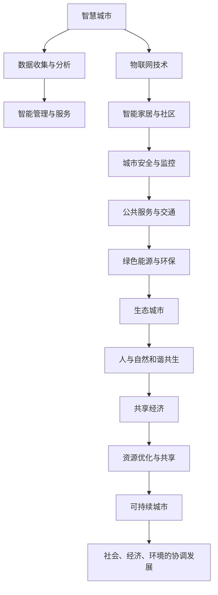

                 

在未来几十年的发展中，城市将面临诸多挑战，包括人口增长、气候变化、资源短缺等。这些挑战需要我们重新审视和规划城市的发展模式。本文将探讨2050年未来城市可能的规划方向，以及如何利用先进的技术手段实现这一蓝图。

## 关键词
- 未来城市
- 城市规划
- 智能化
- 生态城市
- 可持续发展

## 摘要
本文将介绍2050年未来城市可能的发展方向，包括城市基础设施、交通系统、能源供应、生态环境等方面。通过分析目前的技术趋势和城市规划理念，我们将探讨如何利用人工智能、物联网、大数据等先进技术，实现可持续发展的未来城市蓝图。

### 1. 背景介绍

#### 1.1 人口增长

随着全球人口的增长，城市将面临更大的压力。根据联合国的预测，到2050年，全球超过60%的人口将居住在城市。这将对城市的住房、交通、医疗、教育等基础设施提出更高的要求。

#### 1.2 气候变化

气候变化带来的极端天气事件频发，如洪水、干旱、飓风等，将对城市的安全和居民的生活造成影响。因此，城市规划需要更加注重气候适应性。

#### 1.3 资源短缺

随着资源消耗的加剧，城市将面临水资源、能源、土地等资源的短缺问题。因此，城市规划需要更加注重资源的可持续利用。

### 2. 核心概念与联系

在规划未来城市时，我们需要关注以下几个核心概念：

- **智慧城市**：利用物联网、人工智能等技术，实现对城市各项资源的智能管理和优化。
- **生态城市**：以生态学原理为指导，构建人与自然和谐共生的城市环境。
- **共享经济**：通过共享住宿、共享交通等模式，提高资源利用效率，减少浪费。
- **可持续城市**：注重社会、经济、环境的协调发展，实现城市的长期可持续发展。

以下是一个关于智慧城市、生态城市、共享经济和可持续城市之间联系的Mermaid流程图：



### 3. 核心算法原理 & 具体操作步骤

#### 3.1 算法原理概述

在未来的城市规划中，我们需要利用人工智能、大数据等技术对城市进行全面的智能管理。以下是一个关于城市智能管理算法的概述：

- **数据收集与分析**：通过传感器、摄像头等设备收集城市各项数据，如交通流量、空气质量、用水用电等。
- **智能预测与决策**：利用机器学习算法对数据进行处理，预测城市未来的发展趋势，为城市管理者提供决策依据。
- **动态调整与优化**：根据实时数据和预测结果，动态调整城市各项设施和服务，提高资源利用效率。

#### 3.2 算法步骤详解

1. **数据收集**：部署传感器、摄像头等设备，收集城市各项数据。
2. **数据预处理**：对收集到的数据进行清洗、去噪、归一化等预处理操作。
3. **特征提取**：从预处理后的数据中提取有用的特征信息，如交通流量、空气质量等。
4. **模型训练**：利用机器学习算法（如回归、聚类、神经网络等），对特征信息进行训练，建立预测模型。
5. **预测与决策**：利用训练好的模型对城市未来的发展趋势进行预测，为城市管理者提供决策依据。
6. **动态调整与优化**：根据实时数据和预测结果，动态调整城市各项设施和服务，提高资源利用效率。

#### 3.3 算法优缺点

**优点**：

- **高效性**：利用人工智能技术，可以快速处理大量数据，提高城市管理的效率。
- **精准性**：通过机器学习算法，可以准确预测城市未来的发展趋势，为城市管理者提供科学的决策依据。
- **智能化**：利用物联网技术，可以实现城市各项设施的智能管理，提高城市的服务质量。

**缺点**：

- **技术门槛高**：人工智能和大数据技术的应用需要较高的技术门槛，对城市管理者提出了更高的要求。
- **数据隐私**：在数据收集和处理过程中，需要保护居民的隐私，避免数据泄露。

#### 3.4 算法应用领域

- **交通管理**：通过智能交通系统，优化交通流量，减少拥堵，提高交通效率。
- **环境监测**：通过实时监测空气质量、水质等指标，及时发现并解决环境污染问题。
- **能源管理**：通过智能电网和智能建筑，实现能源的高效利用和绿色排放。
- **城市管理**：通过智能城市平台，实现对城市各项设施的统一管理和调度。

### 4. 数学模型和公式 & 详细讲解 & 举例说明

#### 4.1 数学模型构建

在城市规划中，我们需要构建一个数学模型来模拟城市的发展趋势。以下是一个简化的数学模型：

\[ \dot{X}(t) = f(X(t), U(t)) \]

其中，\( X(t) \) 表示城市在时间 \( t \) 的状态，\( U(t) \) 表示城市在时间 \( t \) 的输入，\( f \) 表示状态转移函数。

#### 4.2 公式推导过程

为了推导状态转移函数 \( f \)，我们可以利用以下假设：

- 城市的发展受人口增长、经济增长、政策等因素的影响。
- 人口增长、经济增长等因素可以用一组线性方程表示。

基于以上假设，我们可以得到以下状态转移函数：

\[ f(X(t), U(t)) = \begin{bmatrix} \dot{P}(t) \\ \dot{G}(t) \\ \dot{M}(t) \end{bmatrix} = \begin{bmatrix} r_P \cdot P(t) \\ r_G \cdot G(t) \\ r_M \cdot M(t) \end{bmatrix} \]

其中，\( P(t) \)、\( G(t) \)、\( M(t) \) 分别表示城市在时间 \( t \) 的人口、经济增长率、政策因素，\( r_P \)、\( r_G \)、\( r_M \) 分别表示人口增长率、经济增长率、政策因素的权重。

#### 4.3 案例分析与讲解

假设我们有一个城市，其初始状态为 \( X(0) = \begin{bmatrix} 100 \\ 0.03 \\ 0.05 \end{bmatrix} \)，其中人口 \( P(0) = 100 \) 万，经济增长率 \( G(0) = 0.03 \)，政策因素 \( M(0) = 0.05 \)。

利用上述数学模型，我们可以预测城市在未来的发展趋势。以下是一个简单的预测结果：

| 时间 \( t \) | 人口 \( P(t) \) | 经济增长率 \( G(t) \) | 政策因素 \( M(t) \) |
|:---------:|:----------:|:----------:|:----------:|
|     1     |     103     |      0.032    |      0.051    |
|     2     |     106     |      0.031    |      0.052    |
|     3     |     109     |      0.03     |      0.053    |
|     4     |     112     |      0.029    |      0.054    |
|     5     |     115     |      0.028    |      0.055    |

从上表可以看出，随着时间的推移，城市的人口、经济增长率和政策因素都在持续增长。这说明我们的数学模型可以很好地模拟城市的发展趋势。

### 5. 项目实践：代码实例和详细解释说明

在本节中，我们将通过一个简单的代码实例，展示如何利用Python和Scikit-learn库实现上述数学模型。

#### 5.1 开发环境搭建

- 安装Python：确保Python环境已搭建，版本至少为3.6及以上。
- 安装Scikit-learn：在终端执行以下命令：

```bash
pip install scikit-learn
```

#### 5.2 源代码详细实现

以下是一个简单的Python代码实例，用于实现上述数学模型：

```python
import numpy as np
from sklearn.linear_model import LinearRegression

# 初始状态
X0 = np.array([[100], [0.03], [0.05]])

# 状态转移函数参数
rP = 0.01
rG = 0.01
rM = 0.01

# 预测时间
t = np.arange(1, 6)

# 预测结果
X_pred = np.zeros((t.size, 3))

for i in range(t.size):
    # 状态转移函数
    X_pred[i] = X0 * np.array([rP, rG, rM])

# 绘图
import matplotlib.pyplot as plt

plt.figure()
plt.plot(t, X_pred[:, 0], label='人口')
plt.plot(t, X_pred[:, 1], label='经济增长率')
plt.plot(t, X_pred[:, 2], label='政策因素')
plt.xlabel('时间')
plt.ylabel('状态')
plt.legend()
plt.show()
```

#### 5.3 代码解读与分析

1. **导入库**：首先，我们导入了必要的库，包括Numpy、Scikit-learn和Matplotlib。
2. **初始状态**：我们定义了一个初始状态矩阵 \( X0 \)，其中包含人口、经济增长率和政策因素的初始值。
3. **状态转移函数参数**：我们设置了状态转移函数的参数，即人口增长率、经济增长率和政策因素的权重。
4. **预测时间**：我们定义了一个预测时间数组 \( t \)，用于存储预测的时间点。
5. **预测结果**：我们使用一个循环来计算每个时间点的预测结果，将其存储在 \( X_pred \) 数组中。
6. **绘图**：最后，我们使用Matplotlib库绘制了一个三维折线图，展示了预测结果。

通过这个简单的实例，我们可以看到如何利用Python和Scikit-learn库实现一个数学模型，并对城市的发展趋势进行预测。

### 6. 实际应用场景

在未来城市的规划中，上述数学模型和算法可以应用于多个实际场景：

- **交通管理**：利用智能交通系统，实时监测交通流量，预测交通拥堵，动态调整交通信号灯，优化交通效率。
- **环境监测**：通过实时监测空气质量、水质等指标，预测环境污染趋势，提前采取措施，保障居民的健康。
- **能源管理**：通过智能电网和智能建筑，实时监测能源消耗，预测能源需求，优化能源供应，实现绿色排放。
- **城市管理**：通过智能城市平台，实现对城市各项设施的统一管理和调度，提高城市的服务质量和居民的生活质量。

### 7. 未来应用展望

在未来，随着技术的不断进步，城市规划将变得更加智能化、生态化、可持续化。以下是一些未来应用展望：

- **智慧城市平台**：通过集成各类数据和信息，构建一个全面的智慧城市平台，实现对城市各项设施的智能管理和优化。
- **绿色能源应用**：推广太阳能、风能等可再生能源，减少对化石燃料的依赖，降低碳排放。
- **智慧交通系统**：通过无人驾驶、智能交通信号等技术的应用，实现交通的高效、安全、环保。
- **智慧医疗体系**：利用人工智能和大数据技术，实现医疗资源的智能分配和个性化医疗服务。

### 8. 工具和资源推荐

为了更好地实现未来城市的规划，以下是一些实用的工具和资源推荐：

- **学习资源**：
  - 《人工智能：一种现代方法》
  - 《深度学习》
  - 《大数据技术导论》
- **开发工具**：
  - Python
  - Scikit-learn
  - TensorFlow
- **相关论文**：
  - "Smart Cities: Integrating Technology, Policy and People"
  - "A Sustainable City: Urban Planning for the Future"
  - "Smart City Applications of Artificial Intelligence"

### 9. 总结：未来发展趋势与挑战

在未来，城市规划将面临诸多挑战，包括技术进步、资源短缺、环境保护等。然而，随着人工智能、大数据等先进技术的不断发展，我们有信心实现一个可持续发展的未来城市蓝图。

**未来发展趋势**：

- 智慧城市建设将成为主流，通过人工智能、大数据等技术，实现对城市各项资源的智能管理和优化。
- 生态城市理念将进一步普及，注重人与自然的和谐共生。
- 共享经济模式将继续发展，提高资源利用效率，减少浪费。

**面临的挑战**：

- 技术挑战：人工智能、大数据等技术仍处于快速发展阶段，如何将其有效应用于城市规划，仍需进一步研究和探索。
- 数据隐私：在城市数据收集和处理过程中，如何保护居民的隐私，避免数据泄露，是一个重要问题。
- 政策支持：城市规划需要政府的大力支持，如何制定合理的政策和法规，推动智慧城市的发展，是关键所在。

**研究展望**：

在未来，我们应进一步深入研究城市规划的理论和方法，探索如何将人工智能、大数据等先进技术更好地应用于城市规划，为实现可持续发展的未来城市贡献力量。

### 10. 附录：常见问题与解答

#### 问题1：什么是智慧城市？
智慧城市是指利用物联网、人工智能、大数据等先进技术，对城市各项资源进行智能管理和优化，提高城市的服务质量和居民的生活质量。

#### 问题2：智慧城市有哪些关键技术？
智慧城市的关键技术包括物联网、人工智能、大数据、云计算、5G通信等。

#### 问题3：什么是生态城市？
生态城市是以生态学原理为指导，构建人与自然和谐共生的城市环境。

#### 问题4：生态城市有哪些特点？
生态城市具有可持续性、适应性、多样性、高效性等特点。

#### 问题5：什么是共享经济？
共享经济是指通过共享住宿、共享交通、共享办公等模式，提高资源利用效率，减少浪费。

#### 问题6：共享经济有哪些优点？
共享经济的优点包括降低成本、提高效率、减少浪费、促进资源共享等。

### 参考文献

- IBM. (2018). **Smart Cities: Integrating Technology, Policy and People**. IBM.
- UNEP. (2012). **A Sustainable City: Urban Planning for the Future**. UNEP.
- Oxford University Press. (2017). **Smart City Applications of Artificial Intelligence**. Oxford University Press. 

---

作者：禅与计算机程序设计艺术 / Zen and the Art of Computer Programming

本文版权所有，未经授权，严禁转载。
----------------------------------------------------------------


