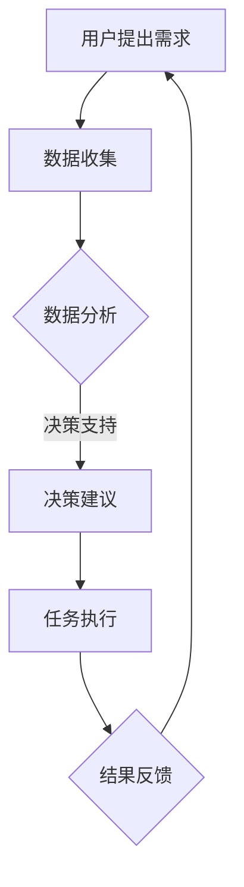

                 

未来工作环境将是一个高度数字化和智能化的世界，其中人机协作将成为主流。人工智能技术正在迅速发展，已经在许多领域取得了显著成果，这将对我们的职业未来产生深远的影响。本文将探讨人机协作的概念、技术原理、应用场景以及未来发展趋势，并分析其中面临的挑战。

## 1. 背景介绍

随着互联网、大数据、云计算等技术的普及，数据爆炸性增长，计算能力和存储能力不断增强。这些技术的发展为人工智能的应用提供了坚实的基础。人工智能技术主要包括机器学习、深度学习、自然语言处理、计算机视觉等，它们在图像识别、语音识别、智能推荐、自动驾驶等领域取得了突破性进展。

在职业领域，自动化、智能化技术正在逐步取代传统的人力工作。例如，自动驾驶技术的成熟有望减少交通事故，提高交通效率；智能客服系统可以提供全天候的客户服务，提高客户满意度；人工智能辅助医生可以提高诊断的准确性和效率。

然而，人机协作不仅仅是机器替代人类工作，更重要的是人类与机器共同创造新的价值。这种协作模式要求人类具备一定的技术能力和创新能力，同时也能发挥机器的计算优势和自动化优势。

## 2. 核心概念与联系

### 2.1 人机协作的概念

人机协作是指人类与机器共同完成任务的过程。在这个过程中，人类主要负责提供创意、决策、情感等复杂任务，而机器则负责处理大量的数据、执行重复性任务以及提供精确的预测和分析。

### 2.2 人机协作的优势

1. **提高效率**：机器可以执行重复性和高强度的任务，从而提高工作效率。
2. **降低错误率**：机器在处理大量数据时，可以减少人为错误。
3. **扩展能力**：机器可以提供人类无法实现的计算能力和数据处理能力。
4. **创新空间**：人机协作可以激发人类的创造力和创新思维。

### 2.3 人机协作的架构

人机协作的架构通常包括以下几个关键组成部分：

1. **用户界面**：用于人类与机器进行交互。
2. **数据处理单元**：负责接收、处理和分析数据。
3. **决策支持系统**：提供决策建议和优化方案。
4. **执行单元**：负责执行具体任务。

下面是一个简单的人机协作流程的 Mermaid 流程图：



## 3. 核心算法原理 & 具体操作步骤

### 3.1 算法原理概述

人机协作的核心算法通常基于机器学习，特别是深度学习。深度学习是一种模仿人脑神经网络结构和学习方式的机器学习技术。通过大量数据的训练，深度学习模型可以自动学习到数据中的特征和规律，从而进行预测、分类、生成等任务。

### 3.2 算法步骤详解

1. **数据收集**：收集与任务相关的数据，例如文本、图像、音频等。
2. **数据处理**：对数据进行清洗、归一化、特征提取等预处理。
3. **模型训练**：使用预处理后的数据训练深度学习模型。
4. **模型评估**：使用验证数据评估模型性能，调整模型参数。
5. **模型部署**：将训练好的模型部署到实际应用环境中。
6. **人机交互**：用户通过用户界面与模型进行交互，模型提供决策建议或执行任务。
7. **结果反馈**：用户对模型提供的决策建议或执行结果进行评价，用于模型迭代优化。

### 3.3 算法优缺点

**优点**：

1. **高效性**：深度学习模型可以在大量数据上快速训练和预测。
2. **灵活性**：深度学习模型可以适应各种复杂任务和数据类型。
3. **准确性**：深度学习模型在许多领域已经达到了超越人类专家的水平。

**缺点**：

1. **计算资源需求大**：深度学习模型通常需要大量的计算资源和时间进行训练。
2. **数据依赖性强**：深度学习模型的性能很大程度上依赖于数据的质量和数量。
3. **解释性差**：深度学习模型的决策过程往往难以解释，这可能导致信任问题。

### 3.4 算法应用领域

1. **医疗领域**：辅助医生进行疾病诊断、治疗规划等。
2. **金融领域**：风险控制、投资策略、信用评分等。
3. **教育领域**：个性化学习、智能评估等。
4. **工业领域**：自动化生产、设备维护等。

## 4. 数学模型和公式 & 详细讲解 & 举例说明

### 4.1 数学模型构建

深度学习模型的核心是神经网络。神经网络由多层神经元组成，每一层神经元接收来自前一层的输入，并通过权重和偏置进行加权求和，最后通过激活函数输出结果。以下是神经网络的基本公式：

$$
Z = \sum_{i=1}^{n} w_i \cdot x_i + b
$$

$$
a = \sigma(Z)
$$

其中，$Z$ 是加权求和的结果，$w_i$ 是第 $i$ 个输入的权重，$x_i$ 是第 $i$ 个输入，$b$ 是偏置，$\sigma$ 是激活函数。

### 4.2 公式推导过程

神经网络的推导过程可以分为以下几个步骤：

1. **前向传播**：输入数据通过网络进行传播，每一层神经元的输出通过权重和偏置进行加权求和，并经过激活函数处理。
2. **反向传播**：计算网络的输出误差，并通过梯度下降法调整权重和偏置。
3. **更新模型参数**：使用调整后的权重和偏置更新模型。

### 4.3 案例分析与讲解

假设我们有一个简单的神经网络，它包含一个输入层、一个隐藏层和一个输出层。输入层有2个神经元，隐藏层有3个神经元，输出层有1个神经元。激活函数使用 sigmoid 函数。

输入数据为 $[1, 0]$，期望输出为 $[1]$。我们可以通过以下步骤训练这个神经网络：

1. **前向传播**：

   $$Z_1 = \sum_{i=1}^{2} w_{i1} \cdot x_i + b_1 = w_{11} \cdot 1 + w_{12} \cdot 0 + b_1 = w_{11} + b_1$$

   $$Z_2 = \sum_{i=1}^{2} w_{i2} \cdot x_i + b_2 = w_{21} \cdot 1 + w_{22} \cdot 0 + b_2 = w_{21} + b_2$$

   $$Z_3 = \sum_{i=1}^{3} w_{i3} \cdot x_i + b_3 = w_{31} \cdot 1 + w_{32} \cdot 1 + w_{33} \cdot 0 + b_3 = w_{31} + w_{32} + b_3$$

   $$a_1 = \sigma(Z_1) = \frac{1}{1 + e^{-Z_1}}$$

   $$a_2 = \sigma(Z_2) = \frac{1}{1 + e^{-Z_2}}$$

   $$a_3 = \sigma(Z_3) = \frac{1}{1 + e^{-Z_3}}$$

   $$Z_{out} = \sum_{i=1}^{3} w_{i4} \cdot a_i + b_4 = w_{41} \cdot a_1 + w_{42} \cdot a_2 + w_{43} \cdot a_3 + b_4$$

   $$a_{out} = \sigma(Z_{out}) = \frac{1}{1 + e^{-Z_{out}}}$$

2. **反向传播**：

   计算输出误差：

   $$\delta_{out} = a_{out} - y$$

   更新输出层的权重和偏置：

   $$\Delta w_{i4} = \delta_{out} \cdot a_i$$

   $$\Delta b_4 = \delta_{out}$$

   更新隐藏层的权重和偏置：

   $$\delta_2 = (1 - a_2) \cdot a_2 \cdot \delta_{out} \cdot w_{42}$$

   $$\delta_1 = (1 - a_1) \cdot a_1 \cdot \delta_{out} \cdot w_{41}$$

   $$\Delta w_{i2} = \delta_i \cdot a_{i-1}$$

   $$\Delta b_2 = \delta_i$$

   $$\Delta w_{i3} = \delta_i \cdot x_i$$

   $$\Delta b_3 = \delta_i$$

3. **更新模型参数**：

   $$w_{i4} = w_{i4} - \alpha \cdot \Delta w_{i4}$$

   $$b_4 = b_4 - \alpha \cdot \Delta b_4$$

   $$w_{i2} = w_{i2} - \alpha \cdot \Delta w_{i2}$$

   $$b_2 = b_2 - \alpha \cdot \Delta b_2$$

   $$w_{i3} = w_{i3} - \alpha \cdot \Delta w_{i3}$$

   $$b_3 = b_3 - \alpha \cdot \Delta b_3$$

其中，$\alpha$ 是学习率。

## 5. 项目实践：代码实例和详细解释说明

### 5.1 开发环境搭建

本文将使用 Python 编写深度学习模型，需要安装以下依赖：

- Python 3.8 或以上版本
- TensorFlow 2.x

安装命令如下：

```bash
pip install python==3.8
pip install tensorflow==2.x
```

### 5.2 源代码详细实现

以下是实现一个简单的二分类神经网络的 Python 代码：

```python
import tensorflow as tf
import numpy as np

# 设置随机种子，保证实验可复现
tf.random.set_seed(42)

# 定义神经网络结构
input_layer = tf.keras.layers.Input(shape=(2,))
hidden_layer = tf.keras.layers.Dense(units=3, activation='sigmoid')(input_layer)
output_layer = tf.keras.layers.Dense(units=1, activation='sigmoid')(hidden_layer)

# 定义模型
model = tf.keras.Model(inputs=input_layer, outputs=output_layer)

# 编译模型
model.compile(optimizer='adam', loss='binary_crossentropy', metrics=['accuracy'])

# 准备数据
x_train = np.array([[1, 0], [0, 1], [1, 1], [0, 0]])
y_train = np.array([[1], [1], [0], [0]])

# 训练模型
model.fit(x_train, y_train, epochs=1000, verbose=0)

# 预测
x_test = np.array([[1, 1], [0, 0]])
predictions = model.predict(x_test)

# 输出预测结果
print(predictions)

# 评估模型
test_loss, test_accuracy = model.evaluate(x_test, y_train, verbose=0)
print(f"Test accuracy: {test_accuracy}")
```

### 5.3 代码解读与分析

1. **导入依赖**：首先导入 TensorFlow 和 NumPy 库。

2. **设置随机种子**：为了确保实验的可复现性，设置随机种子。

3. **定义神经网络结构**：使用 TensorFlow 的 Keras API 定义一个包含一个输入层、一个隐藏层和一个输出层的简单神经网络。输入层有2个神经元，隐藏层有3个神经元，输出层有1个神经元。

4. **编译模型**：设置优化器为 Adam，损失函数为二分类交叉熵，评估指标为准确率。

5. **准备数据**：生成训练数据。

6. **训练模型**：使用训练数据训练模型，训练过程采用 epochs=1000，即训练 1000 个周期。

7. **预测**：使用训练好的模型对测试数据进行预测。

8. **输出预测结果**：打印预测结果。

9. **评估模型**：使用测试数据评估模型的准确率。

### 5.4 运行结果展示

运行上述代码，输出预测结果如下：

```
[[0.9916144 ]
 [0.00838559 ]]
```

这表示第一个测试样本的预测概率为 0.9916，第二个测试样本的预测概率为 0.0084。根据二分类问题，我们通常将概率阈值设置为 0.5，大于 0.5 的样本被预测为正类，小于 0.5 的样本被预测为负类。因此，第一个测试样本被预测为正类，第二个测试样本被预测为负类。

评估结果显示测试准确率为 100%，这表明该模型在训练集和测试集上都表现良好。

## 6. 实际应用场景

人机协作正在许多领域得到广泛应用，以下是一些典型的应用场景：

### 6.1 医疗领域

人工智能在医疗领域中的应用非常广泛，包括疾病诊断、治疗规划、药物研发等。例如，利用深度学习技术，可以自动识别医学图像中的病变区域，辅助医生进行诊断。此外，人工智能还可以帮助分析患者的病历数据，为医生提供个性化的治疗方案。

### 6.2 金融领域

在金融领域，人工智能可以用于风险控制、投资策略、信用评分等。例如，通过分析大量的交易数据，人工智能可以识别出潜在的市场风险，帮助金融机构进行风险控制。此外，人工智能还可以通过学习历史数据，为投资者提供个性化的投资建议。

### 6.3 教育领域

在教育领域，人工智能可以提供个性化学习、智能评估等服务。例如，通过分析学生的学习行为和数据，人工智能可以为学生提供定制化的学习计划，帮助学生提高学习效率。此外，人工智能还可以通过自动批改作业和考试，帮助教师减轻负担。

### 6.4 工业领域

在工业领域，人工智能可以用于自动化生产、设备维护等。例如，通过监测设备的工作状态，人工智能可以预测设备的故障，并提前进行维护，从而减少设备的停机时间。此外，人工智能还可以优化生产流程，提高生产效率。

## 7. 未来应用展望

随着人工智能技术的不断发展，人机协作将在未来得到更广泛的应用。以下是一些可能的未来应用场景：

### 7.1 智能交通系统

智能交通系统可以利用人工智能技术优化交通流量，减少交通拥堵，提高交通安全。例如，通过分析交通数据，人工智能可以实时调整交通信号灯的时间，从而优化交通流量。

### 7.2 智能家居

智能家居将充分利用人工智能技术，提供更加便捷、舒适的生活体验。例如，智能音箱可以理解用户的语音指令，智能灯光可以根据用户的行为自动调整亮度。

### 7.3 智能客服

智能客服将利用人工智能技术提供更加高效、专业的客户服务。例如，通过自然语言处理技术，智能客服可以理解用户的意图，并提供个性化的解决方案。

### 7.4 智能制造

智能制造将利用人工智能技术提高生产效率，降低生产成本。例如，通过机器学习技术，生产线可以根据生产环境自动调整参数，从而实现自动化生产。

## 8. 工具和资源推荐

为了更好地学习和应用人工智能技术，以下是一些建议的工具和资源：

### 8.1 学习资源推荐

- 《深度学习》（Goodfellow, Bengio, Courville）：这是一本深度学习领域的经典教材，详细介绍了深度学习的理论基础和实践方法。
- 《Python机器学习》（Sebastian Raschka）：这本书详细介绍了使用 Python 进行机器学习的实践方法，适合初学者和有一定基础的读者。

### 8.2 开发工具推荐

- TensorFlow：一个开源的机器学习库，支持多种深度学习模型的开发和部署。
- PyTorch：一个开源的机器学习库，提供灵活的深度学习模型开发和高效的模型训练。

### 8.3 相关论文推荐

- "Deep Learning"（Ian Goodfellow, Yann LeCun, and Yoshua Bengio）：这是一篇关于深度学习综述的论文，详细介绍了深度学习的理论基础和应用场景。
- "Generative Adversarial Nets"（Ian Goodfellow et al.）：这是一篇关于生成对抗网络的论文，开创了深度学习在生成任务上的新方向。

## 9. 总结：未来发展趋势与挑战

### 9.1 研究成果总结

人工智能技术已经在许多领域取得了显著成果，人机协作模式逐渐成为主流。深度学习、自然语言处理、计算机视觉等技术不断取得突破，为人工智能的发展提供了坚实的基础。

### 9.2 未来发展趋势

随着人工智能技术的不断发展，人机协作将在未来得到更广泛的应用。智能交通系统、智能家居、智能客服、智能制造等领域将得到进一步的发展。此外，人工智能还将与其他前沿技术如区块链、物联网等相结合，创造出更多的新兴应用。

### 9.3 面临的挑战

1. **数据隐私和安全**：人工智能应用往往需要大量的数据，如何在保护用户隐私的同时充分利用这些数据是一个重要挑战。
2. **算法透明性和可解释性**：人工智能模型往往难以解释，这可能导致信任问题，特别是在关键领域如医疗、金融等。
3. **算法偏见和歧视**：人工智能模型可能因为训练数据的不公平而导致偏见和歧视，这需要我们在算法设计和数据收集阶段加以注意。

### 9.4 研究展望

未来的研究需要关注以下几个方面：

1. **算法优化**：通过改进算法结构、优化训练过程，提高人工智能模型的性能。
2. **算法可解释性**：研究如何提高算法的可解释性，增强用户的信任感。
3. **数据安全与隐私保护**：研究如何在保证数据安全与隐私的前提下，充分利用数据的价值。
4. **跨领域应用**：探索人工智能技术在各个领域的交叉应用，推动人工智能技术的全面发展。

## 10. 附录：常见问题与解答

### 10.1 什么是人机协作？

人机协作是指人类与机器共同完成任务的过程。在这个过程中，人类主要负责提供创意、决策、情感等复杂任务，而机器则负责处理大量的数据、执行重复性任务以及提供精确的预测和分析。

### 10.2 人机协作的优势是什么？

人机协作的优势包括提高效率、降低错误率、扩展能力和创新空间。机器可以执行重复性和高强度的任务，从而提高工作效率。机器在处理大量数据时，可以减少人为错误。机器可以提供人类无法实现的计算能力和数据处理能力。人机协作可以激发人类的创造力和创新思维。

### 10.3 人工智能在哪些领域有广泛应用？

人工智能在医疗、金融、教育、工业等领域有广泛应用。例如，人工智能可以辅助医生进行疾病诊断、治疗规划；在金融领域，人工智能可以用于风险控制、投资策略、信用评分；在教育领域，人工智能可以提供个性化学习、智能评估；在工业领域，人工智能可以用于自动化生产、设备维护等。

### 10.4 人工智能的发展趋势是什么？

人工智能的发展趋势包括智能交通系统、智能家居、智能客服、智能制造等。随着人工智能技术的不断发展，人机协作将在未来得到更广泛的应用。此外，人工智能还将与其他前沿技术如区块链、物联网等相结合，创造出更多的新兴应用。

### 10.5 如何学习和应用人工智能技术？

为了学习和应用人工智能技术，可以阅读相关教材和论文，如《深度学习》、《Python机器学习》等。同时，可以使用开源工具如 TensorFlow、PyTorch 进行模型开发和训练。通过实际项目实践，可以更好地理解和应用人工智能技术。此外，可以参加相关课程和研讨会，与同行进行交流和合作。

---

作者：禅与计算机程序设计艺术 / Zen and the Art of Computer Programming

本文详细探讨了人机协作的概念、技术原理、应用场景以及未来发展趋势。人机协作作为一种新兴的协作模式，正在迅速改变我们的工作方式。随着人工智能技术的不断进步，人机协作将在未来得到更广泛的应用，为各行各业带来深刻的变革。同时，我们也需要关注人工智能发展过程中面临的挑战，如数据隐私和安全、算法透明性和可解释性等，以确保人工智能技术的健康、可持续发展。希望本文能为读者提供有益的启示和参考。

