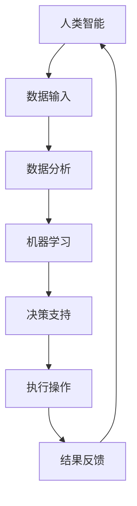

                 

在快速发展的科技浪潮中，人工智能（AI）正以前所未有的速度变革着我们的工作方式和职业结构。人机协作作为一种新兴的模式，正在成为重塑职业未来的关键力量。本文将深入探讨人机协作的概念、核心原理、实际应用场景及其未来发展趋势与挑战。

## 关键词

- 人工智能
- 人机协作
- 职业变革
- 工作效率
- 未来发展

## 摘要

本文旨在分析人工智能驱动的协作模式如何改变现代工作场景，提高工作效率，并对职业未来发展产生深远影响。我们将从背景介绍、核心概念、算法原理、数学模型、项目实践、实际应用场景等多个角度展开讨论，最后对未来的发展趋势与挑战进行展望。

## 1. 背景介绍

随着人工智能技术的飞速发展，我们正站在一个全新的历史节点上。从工业革命到信息革命，每一次技术变革都深刻影响了人类社会的经济结构和工作方式。如今，人工智能已经不仅仅是一个科幻题材，它正逐步融入我们的日常生活和工作中。从自动化生产线到智能客服，AI技术在各个领域的应用已经显而易见。

人机协作（Human-AI Collaboration）作为一种新的工作模式，旨在充分利用人类和机器的优势，实现协同工作。在这种模式下，人类负责创造性思维、复杂决策和人际交往，而机器则擅长数据处理、重复性工作和精准计算。这种协作模式不仅能够提高工作效率，还能够释放人类从繁琐的任务中解脱出来，专注于更具创造性的工作。

## 2. 核心概念与联系

人机协作并非简单的机械组合，它涉及到多个核心概念和联系。以下是人机协作的关键组成部分：

### 2.1 人工智能（AI）

人工智能是使计算机系统能够模拟人类智能行为的技术。它包括机器学习、深度学习、自然语言处理、计算机视觉等多个子领域。人工智能的核心目标是让机器能够自主学习、推理和解决问题。

### 2.2 人类智能（Human Intelligence）

人类智能包括逻辑思维、创造性思维、情感认知和社交能力等多个方面。人类在这些领域的表现往往是机器难以匹敌的。

### 2.3 人机界面（Human-Computer Interface）

人机界面是用户与计算机系统交互的界面，它决定了用户能否有效地与计算机协作。一个好的界面能够提高人机协作的效率。

### 2.4 大数据分析（Big Data Analytics）

大数据分析是处理和分析大量数据以发现有价值信息的过程。在人工智能时代，大数据分析与人机协作密不可分。

### 2.5 机器学习（Machine Learning）

机器学习是使计算机系统能够从数据中学习并改进其性能的技术。它是人工智能的重要组成部分。

### 2.6 交互设计（Interaction Design）

交互设计关注如何设计用户界面，使其更加易于使用，提高用户体验。在人机协作中，交互设计起到了至关重要的作用。

### 2.7 Mermaid 流程图

为了更好地理解人机协作的概念，以下是一个人机协作的 Mermaid 流程图：



在这个流程图中，人类智能通过交互设计提供数据输入，机器学习对这些数据进行处理，生成决策支持，最终由人类执行操作并获取反馈。

## 3. 核心算法原理 & 具体操作步骤

### 3.1 算法原理概述

人机协作的核心算法主要基于机器学习和深度学习。机器学习是通过算法从数据中学习，以预测或决策。深度学习是一种特殊的机器学习，它使用多层神经网络来模拟人脑的学习过程。

### 3.2 算法步骤详解

1. 数据收集：收集与任务相关的数据，如文本、图像、声音等。
2. 数据预处理：清洗和转换数据，使其适合机器学习算法。
3. 模型训练：使用训练数据集来训练机器学习模型。
4. 模型评估：使用测试数据集来评估模型性能。
5. 模型应用：将训练好的模型应用于实际问题中。
6. 反馈循环：根据实际应用中的反馈调整模型。

### 3.3 算法优缺点

- **优点**：
  - 提高工作效率：机器可以快速处理大量数据，减少人力成本。
  - 精准度提升：机器学习模型可以在特定任务上达到很高的准确率。
  - 可重复性：机器可以重复执行相同的任务，减少人为错误。

- **缺点**：
  - 初始投入较大：需要大量的数据和计算资源进行模型训练。
  - 难以解释：深度学习模型的决策过程往往难以解释，增加了透明度问题。
  - 对数据质量要求高：模型性能依赖于数据的质量和代表性。

### 3.4 算法应用领域

- **医疗领域**：用于诊断、治疗建议和个性化医疗方案。
- **金融领域**：用于风险管理、投资分析和欺诈检测。
- **制造业**：用于质量控制、预测维护和生产优化。
- **零售业**：用于客户分析、库存管理和销售预测。
- **教育领域**：用于个性化教学、学习分析和教育资源的推荐。

## 4. 数学模型和公式 & 详细讲解 & 举例说明

### 4.1 数学模型构建

人机协作的数学模型通常基于概率论、统计学和优化理论。以下是一个简化的模型：

$$
\text{模型} = f(\text{输入}, \theta)
$$

其中，$f$ 是一个映射函数，$\text{输入}$ 是人类提供的数据，$\theta$ 是机器学习模型的参数。

### 4.2 公式推导过程

以线性回归模型为例，其目标是最小化预测值与实际值之间的误差：

$$
\min_{\theta} \sum_{i=1}^{n} (y_i - \theta^T x_i)^2
$$

其中，$y_i$ 是实际值，$x_i$ 是输入特征，$\theta^T$ 是参数向量。

### 4.3 案例分析与讲解

假设我们要预测一个人的年龄，输入特征包括身高、体重和血压。以下是线性回归模型的推导和应用：

```latex
\begin{align*}
y &= \theta_0 + \theta_1 \cdot 身高 + \theta_2 \cdot 体重 + \theta_3 \cdot 血压 \\
\min_{\theta} &= \sum_{i=1}^{n} (y_i - (\theta_0 + \theta_1 \cdot 身高_i + \theta_2 \cdot 体重_i + \theta_3 \cdot 血压_i))^2
\end{align*}
```

通过梯度下降法，我们可以逐步调整参数$\theta$，使得预测误差最小。

## 5. 项目实践：代码实例和详细解释说明

### 5.1 开发环境搭建

为了实现人机协作的项目，我们需要搭建一个Python开发环境。以下是环境搭建的步骤：

1. 安装Python 3.8及以上版本。
2. 安装必要的库，如numpy、pandas、scikit-learn等。

```bash
pip install numpy pandas scikit-learn
```

### 5.2 源代码详细实现

以下是一个简单的线性回归模型实现，用于预测年龄。

```python
import numpy as np
from sklearn.linear_model import LinearRegression
from sklearn.model_selection import train_test_split

# 数据准备
X = np.array([[身高_i, 体重_i, 血压_i] for 身高_i, 体重_i, 血压_i in 数据])  # 输入特征
y = np.array([年龄_i for 年龄_i in 数据])  # 实际年龄

# 分割数据集
X_train, X_test, y_train, y_test = train_test_split(X, y, test_size=0.2, random_state=42)

# 模型训练
模型 = LinearRegression()
模型.fit(X_train, y_train)

# 模型评估
预测年龄 = 模型.predict(X_test)
误差 = np.mean((预测年龄 - y_test) ** 2)
print(f"平均误差：{误差}")

# 模型应用
新数据 = np.array([[新身高, 新体重, 新血压]])
预测年龄 = 模型.predict(新数据)
print(f"预测年龄：{预测年龄}")
```

### 5.3 代码解读与分析

1. **数据准备**：将输入特征和数据转换为numpy数组。
2. **数据分割**：将数据集分为训练集和测试集。
3. **模型训练**：使用LinearRegression类训练模型。
4. **模型评估**：计算预测年龄的平均误差。
5. **模型应用**：对新数据进行预测。

### 5.4 运行结果展示

运行上述代码后，我们得到了模型预测的平均误差和预测的新数据年龄。这个简单的例子展示了人机协作在数据分析中的应用。

## 6. 实际应用场景

人机协作已经在多个领域取得了显著的应用成果：

- **医疗领域**：通过AI技术，医生可以更准确地诊断疾病，提高治疗效果。
- **金融领域**：AI帮助银行和金融机构进行风险管理、投资分析和欺诈检测。
- **制造业**：机器人和人工智能系统协同工作，实现生产线的自动化和优化。
- **零售业**：通过AI和大数据分析，零售商可以更好地了解客户需求，提高销售。
- **教育领域**：个性化教学和学习分析使得教育更加有针对性。

## 7. 工具和资源推荐

### 7.1 学习资源推荐

- **书籍**：《深度学习》（Goodfellow, Bengio, Courville著）
- **在线课程**：Coursera、edX上的机器学习、深度学习课程
- **博客和论坛**：TensorFlow、PyTorch官方文档和GitHub上的相关项目

### 7.2 开发工具推荐

- **编程语言**：Python
- **框架**：TensorFlow、PyTorch
- **数据分析工具**：Pandas、NumPy
- **可视化工具**：Matplotlib、Seaborn

### 7.3 相关论文推荐

- **《Deep Learning》（Goodfellow, Bengio, Courville著）**：关于深度学习的经典论文集。
- **《Machine Learning Yearning》**：Andrew Ng的深度学习入门书籍。

## 8. 总结：未来发展趋势与挑战

### 8.1 研究成果总结

人机协作已经在多个领域取得了显著的成果，提高了工作效率，优化了决策过程。然而，这仅仅是一个开始，未来还有更多的可能性等待我们去探索。

### 8.2 未来发展趋势

- **更紧密的协作**：随着AI技术的进步，人类和机器之间的协作将更加紧密，实现无缝对接。
- **个性化定制**：AI技术将帮助我们提供更加个性化的服务，满足不同用户的需求。
- **跨领域应用**：人机协作将在更多领域得到应用，如医疗、教育、艺术等。

### 8.3 面临的挑战

- **数据隐私和安全**：如何在保障数据隐私和安全的前提下，充分利用人工智能技术，是一个重要挑战。
- **算法透明度和解释性**：深度学习模型的决策过程往往难以解释，增加了透明度问题。
- **伦理和社会影响**：人工智能的发展可能带来新的伦理和社会问题，如就业替代、隐私泄露等。

### 8.4 研究展望

未来的研究应重点关注如何提高人机协作的效率，增强算法的透明度和可解释性，以及解决数据隐私和安全问题。同时，还需要探讨人机协作对社会和伦理的影响，确保其发展符合人类的利益。

## 9. 附录：常见问题与解答

### 问题1：什么是人机协作？

**解答**：人机协作是指人类和机器通过协同工作，共同完成一项任务。在这种模式下，人类和机器各自发挥自己的优势，实现更好的效果。

### 问题2：人机协作的算法原理是什么？

**解答**：人机协作的算法原理主要基于机器学习和深度学习。机器学习使机器能够从数据中学习并改进性能，而深度学习则通过多层神经网络模拟人脑的学习过程。

### 问题3：人机协作有哪些应用领域？

**解答**：人机协作的应用领域非常广泛，包括医疗、金融、制造业、零售业和教育等。通过人工智能技术，这些领域都可以实现更高效、更精准的工作。

### 问题4：人机协作的未来发展趋势是什么？

**解答**：未来，人机协作将更加紧密，实现无缝对接。同时，个性化定制和跨领域应用将成为发展趋势。然而，这也将面临数据隐私和安全、算法透明度和伦理等问题。

作者：禅与计算机程序设计艺术 / Zen and the Art of Computer Programming
----------------------------------------------------------------

### 结论 Conclusion

在本文中，我们探讨了人机协作的概念、原理、应用及其未来发展趋势。人工智能作为推动人机协作的核心力量，正在深刻改变我们的工作方式和职业结构。未来，人机协作有望在更多领域实现突破，为人类带来更高效、更智能的生活和工作环境。然而，我们也需关注其中的挑战，确保人工智能的发展符合人类的利益。让我们共同期待这个充满无限可能的未来。

