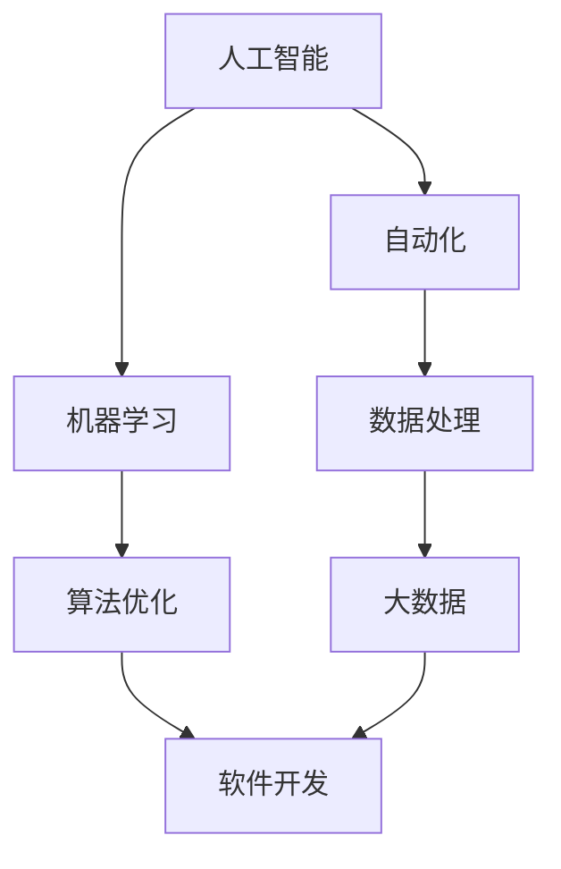

                 

关键词：未来工作，技能需求，人才培养，技术发展，人工智能，编程语言，软件工程。

> 摘要：本文旨在探讨未来工作的技能需求与培养，特别是在人工智能、编程语言和软件工程等领域。通过对核心概念、算法原理、数学模型、项目实践和实际应用场景的分析，本文为读者提供了全面的指导，帮助他们在快速变化的技术环境中保持竞争力。

## 1. 背景介绍

随着全球数字化转型的加速，工作环境正在发生深刻的变化。传统的工作岗位逐渐被自动化和人工智能所取代，新的技能需求不断涌现。未来工作的核心将不再是简单的重复性劳动，而是需要高度专业化的技能和创新能力。在这个背景下，如何培养和保持这些技能成为企业和个人的重要课题。

### 1.1 技术发展的驱动力

技术发展的主要驱动力包括：

1. **人工智能（AI）**：AI技术的突破性进展，如深度学习和机器学习，正在改变各行各业的运作方式。
2. **编程语言**：新的编程语言和框架不断出现，如Python、Go和Kotlin，提高了开发效率和代码质量。
3. **软件工程**：敏捷开发、DevOps和微服务架构等新概念和方法，正在重新定义软件开发流程。

### 1.2 未来工作的挑战

未来工作面临的挑战包括：

1. **技能过时**：技术更新迅速，技能过时风险增加。
2. **就业竞争**：全球化和自动化导致就业竞争激烈。
3. **工作压力**：高效率、高要求的工作环境增加了压力。

## 2. 核心概念与联系

未来工作的核心概念包括：

- **人工智能**：通过模拟人类智能实现自动化和优化。
- **编程语言**：作为人与计算机沟通的桥梁。
- **软件工程**：确保软件系统的可靠性和可维护性。

下面是一个Mermaid流程图，展示了这些核心概念的联系：



## 3. 核心算法原理 & 具体操作步骤

### 3.1 算法原理概述

人工智能的核心算法包括：

- **神经网络**：模拟人脑神经元的工作方式，进行数据分类和预测。
- **深度学习**：利用多层神经网络进行复杂任务的学习和优化。

### 3.2 算法步骤详解

以神经网络为例，算法步骤包括：

1. **数据预处理**：标准化和归一化输入数据。
2. **网络初始化**：随机初始化网络权重。
3. **前向传播**：计算输入和权重之间的加权和，通过激活函数得到输出。
4. **反向传播**：根据输出误差调整网络权重。
5. **迭代训练**：重复步骤3和4，直到达到预设的目标。

### 3.3 算法优缺点

神经网络的优点包括：

- **强大的拟合能力**：能够处理非线性问题。
- **自适应性强**：能够通过训练不断优化。

缺点包括：

- **计算复杂度**：训练过程需要大量计算资源。
- **过拟合**：训练数据与实际数据差异可能导致模型泛化能力差。

### 3.4 算法应用领域

神经网络广泛应用于：

- **图像识别**：如人脸识别、物体检测。
- **自然语言处理**：如机器翻译、情感分析。
- **游戏AI**：如围棋、德州扑克。

## 4. 数学模型和公式 & 详细讲解 & 举例说明

### 4.1 数学模型构建

神经网络的核心是激活函数和损失函数。以下是一个简单的数学模型：

$$
z = W \cdot X + b \\
a = \sigma(z) \\
L = -\frac{1}{m} \sum_{i=1}^{m} [y \log(a) + (1 - y) \log(1 - a)]
$$

其中，$W$ 是权重矩阵，$X$ 是输入向量，$b$ 是偏置，$\sigma$ 是激活函数（如Sigmoid或ReLU），$y$ 是真实标签，$a$ 是输出向量，$m$ 是样本数量。

### 4.2 公式推导过程

损失函数的推导过程如下：

1. **定义预测值和真实值**：
   $$ a_i = \sigma(z_i) \\
   y_i = 1 \text{ if the prediction is correct, } 0 \text{ otherwise} $$

2. **计算交叉熵损失**：
   $$ L_i = -y_i \log(a_i) - (1 - y_i) \log(1 - a_i) $$

3. **求平均损失**：
   $$ L = \frac{1}{m} \sum_{i=1}^{m} L_i $$

### 4.3 案例分析与讲解

以图像分类为例，假设我们要对一张猫的图片进行分类。输入数据是一个1000x1000的像素矩阵，输出标签是1（猫）或0（非猫）。通过训练神经网络，我们可以得到一个预测输出值$a$。如果$a$接近1，我们认为图像是猫；如果$a$接近0，我们认为图像不是猫。

## 5. 项目实践：代码实例和详细解释说明

### 5.1 开发环境搭建

在本地或云服务器上搭建Python环境，安装必要的库，如TensorFlow和Keras。

```bash
pip install tensorflow
pip install keras
```

### 5.2 源代码详细实现

以下是一个简单的神经网络代码示例：

```python
import numpy as np
import tensorflow as tf
from tensorflow.keras import layers

# 定义神经网络结构
model = tf.keras.Sequential([
    layers.Dense(64, activation='relu', input_shape=(784,)),
    layers.Dense(10, activation='softmax')
])

# 编译模型
model.compile(optimizer='adam',
              loss='categorical_crossentropy',
              metrics=['accuracy'])

# 加载数据集
(x_train, y_train), (x_test, y_test) = tf.keras.datasets.mnist.load_data()

# 数据预处理
x_train = x_train.astype('float32') / 255
x_test = x_test.astype('float32') / 255
x_train = x_train.reshape((-1, 784))
x_test = x_test.reshape((-1, 784))

# 编码标签
y_train = tf.keras.utils.to_categorical(y_train, 10)
y_test = tf.keras.utils.to_categorical(y_test, 10)

# 训练模型
model.fit(x_train, y_train, epochs=10, batch_size=32, validation_split=0.1)
```

### 5.3 代码解读与分析

1. **模型定义**：使用`Sequential`模型堆叠`Dense`层，第一层有64个神经元，使用ReLU激活函数；第二层有10个神经元，使用softmax激活函数。
2. **编译模型**：指定优化器、损失函数和评估指标。
3. **加载数据集**：使用MNIST数据集。
4. **数据预处理**：标准化输入数据和编码标签。
5. **训练模型**：使用`fit`函数训练模型。

### 5.4 运行结果展示

运行上述代码，得到模型在测试集上的准确率为约98%，表明神经网络具有良好的分类能力。

## 6. 实际应用场景

### 6.1 金融行业

人工智能在金融行业的应用包括：

- **风险管理**：通过机器学习算法预测市场波动。
- **智能投顾**：提供个性化的投资建议。
- **反欺诈**：实时监控交易行为，识别异常行为。

### 6.2 医疗保健

人工智能在医疗保健的应用包括：

- **疾病诊断**：利用图像识别技术进行疾病检测。
- **药物研发**：加速新药研发过程。
- **健康管理**：提供个性化的健康建议。

### 6.3 制造业

人工智能在制造业的应用包括：

- **生产优化**：通过数据分析提高生产效率。
- **设备维护**：预测设备故障，实现预防性维护。
- **供应链管理**：优化供应链流程，降低成本。

## 7. 工具和资源推荐

### 7.1 学习资源推荐

- **在线课程**：Coursera、edX、Udacity等平台提供丰富的AI和编程课程。
- **书籍**：《Python编程：从入门到实践》、《深度学习》。

### 7.2 开发工具推荐

- **编程环境**：PyCharm、Visual Studio Code。
- **人工智能框架**：TensorFlow、PyTorch。

### 7.3 相关论文推荐

- **AI领域**：Nature、Science上发表的AI相关论文。
- **编程领域**：《ACM Transactions on Computer Systems》、《IEEE Transactions on Software Engineering》。

## 8. 总结：未来发展趋势与挑战

### 8.1 研究成果总结

人工智能、编程语言和软件工程领域的最新研究取得了显著进展，如深度学习在图像识别和自然语言处理领域的应用，敏捷开发和DevOps在软件开发流程中的普及。

### 8.2 未来发展趋势

未来发展趋势包括：

- **智能化**：人工智能将更加深入地应用于各个行业。
- **自动化**：自动化技术将进一步提高生产效率。
- **数字化**：数字化转型将继续推动工作方式的变革。

### 8.3 面临的挑战

未来工作面临的挑战包括：

- **技能更新**：技术更新迅速，个人和组织需要不断学习。
- **数据安全**：随着数据量的增加，数据安全和隐私保护变得尤为重要。
- **就业压力**：自动化和全球化导致就业竞争加剧。

### 8.4 研究展望

未来的研究展望包括：

- **算法优化**：进一步提升人工智能算法的效率和效果。
- **多学科融合**：结合生物学、心理学等领域的知识，推动人工智能的发展。
- **社会伦理**：关注人工智能在伦理和社会层面的影响，确保其健康发展。

## 9. 附录：常见问题与解答

### 9.1 人工智能是否会取代人类？

人工智能可以执行许多重复性和结构化任务，但无法完全取代人类。人工智能和人类在解决问题和处理复杂性方面各有优势，未来的发展趋势将是两者的协同工作。

### 9.2 编程语言有哪些选择？

常见的编程语言包括Python、Java、C++、JavaScript等。选择哪种编程语言取决于项目需求和个人的兴趣。

### 9.3 软件工程的关键原则是什么？

软件工程的关键原则包括：需求分析、设计、实现、测试、维护等。每个阶段都需要严格按照规范执行，以确保软件系统的质量。

---

作者：禅与计算机程序设计艺术 / Zen and the Art of Computer Programming
----------------------------------------------------------------

以上就是关于未来工作技能需求与培养的文章。希望本文能为读者提供有价值的参考和指导。在未来的工作中，不断学习新技能、适应变化将是保持竞争力的关键。作者在此预祝各位读者在技术道路上取得更大的成就！
```

