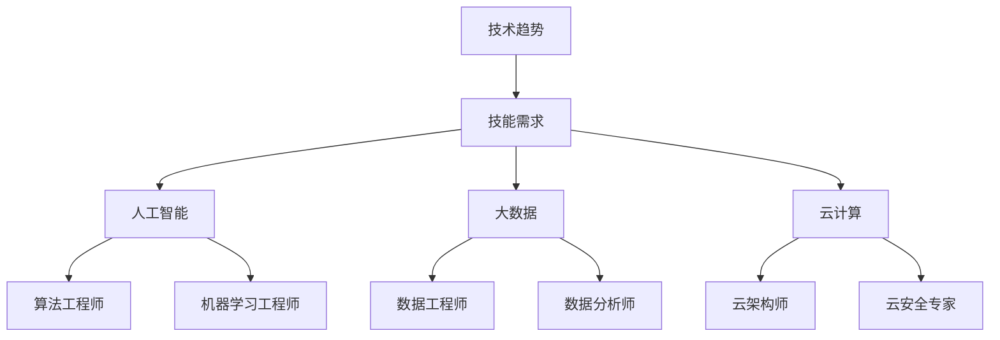

                 

关键词：未来工作，技能需求，职业发展，技术趋势，职业培养

> 摘要：随着技术的迅猛发展，未来工作环境将面临巨大的变革。本文旨在探讨未来工作的技能需求，以及如何培养这些技能以应对未来职业挑战。通过分析当前和未来技术趋势，我们提出了相应的技能培养策略，以帮助读者在职业生涯中保持竞争力。

## 1. 背景介绍

近年来，全球范围内的技术革新正在以惊人的速度推进。人工智能、大数据、云计算、物联网等技术的快速发展，正在深刻地改变我们的工作方式和生活方式。与此同时，传统的工作岗位正逐步被自动化和智能化的技术所取代，而新的职业需求也在不断涌现。这种技术驱动的工作环境变革，使得职业发展的路径变得更加复杂和不可预测。

在这个背景下，如何适应未来工作的技能需求，成为每一个职场人士必须思考的问题。本文将围绕这一主题，探讨未来工作的核心技能，并分析如何通过教育和培训来培养这些技能。通过本文的阅读，读者将获得对未来职业发展的深刻洞察，并为自身的职业规划提供有价值的参考。

## 2. 核心概念与联系

### 2.1 技能需求的演变

随着技术的不断进步，技能需求也在发生着显著的变化。从工业革命时期的机械操作技能，到信息时代的编程和数据分析能力，再到如今的AI应用和大数据处理，技能需求的演变呈现出以下几个特点：

- **技能专业化**：随着技术的细分，专业化的技能需求越来越明显。例如，数据科学家、AI工程师等专业岗位对特定技能的要求越来越高。
- **技能复合化**：在技术融合的趋势下，单一技能已经无法满足复杂的工作需求。例如，一个成功的AI工程师不仅需要掌握深度学习算法，还需要了解前端开发、云计算等多个领域的知识。
- **技能快速更新**：技术的快速迭代使得技能的保鲜期越来越短。职场人士需要不断学习新技能，以保持竞争力。

### 2.2 技术趋势与技能关联

- **人工智能**：随着AI技术的发展，算法工程师、机器学习工程师等职位需求激增。这些职位要求候选人具备数学、统计学和编程等多方面的技能。
- **大数据**：大数据技术的应用越来越广泛，数据工程师、数据分析师等职位需求不断增加。这些职位要求候选人掌握数据清洗、数据建模和数据可视化等技能。
- **云计算**：云计算的普及使得云架构师、云安全专家等职位应运而生。这些职位要求候选人具备云计算平台的知识和操作能力。

### 2.3 技能关联的 Mermaid 流程图



## 3. 核心算法原理 & 具体操作步骤

### 3.1 算法原理概述

在讨论未来工作的技能需求时，算法原理的理解和掌握是至关重要的。算法是计算机科学的核心，它决定了程序的性能和效率。以下是一些核心算法原理的概述：

- **排序算法**：包括快速排序、归并排序、冒泡排序等，用于数据的高效排序。
- **查找算法**：包括二分查找、哈希查找等，用于数据的高效查找。
- **动态规划**：用于解决复杂的问题，通过递归和状态转移来优化子问题的解。
- **贪心算法**：通过在每一步选择局部最优解，以期望得到全局最优解。

### 3.2 算法步骤详解

以快速排序算法为例，其基本步骤如下：

1. **选择基准元素**：在数组中选择一个元素作为基准。
2. **分区操作**：将数组划分为两部分，一部分是小于基准的元素，另一部分是大于基准的元素。
3. **递归排序**：对两个分区分别递归进行快速排序。

### 3.3 算法优缺点

- **快速排序**：优点是时间复杂度较低，平均情况下为O(nlogn)。缺点是空间复杂度较高，需要额外的存储空间。
- **二分查找**：优点是时间复杂度低，平均情况下为O(logn)。缺点是对数据的要求较高，需要数据有序。

### 3.4 算法应用领域

算法原理广泛应用于各个领域，包括但不限于：

- **搜索引擎**：二分查找算法用于快速检索数据。
- **金融领域**：动态规划算法用于期权定价和风险管理。
- **图像处理**：快速排序算法用于图像的快速排序和索引构建。

## 4. 数学模型和公式 & 详细讲解 & 举例说明

### 4.1 数学模型构建

在计算机科学中，数学模型是理解和解决问题的工具。以下是一个简单的线性回归模型：

- **自变量（X）**：特征向量。
- **因变量（Y）**：目标变量。
- **模型公式**：Y = a * X + b，其中a和b是模型参数。

### 4.2 公式推导过程

线性回归模型的推导过程通常包括以下步骤：

1. **选择自变量和因变量**：确定研究的变量。
2. **收集数据**：收集自变量和因变量的数据。
3. **建立模型**：通过最小二乘法求解模型参数。
4. **评估模型**：通过交叉验证等方法评估模型性能。

### 4.3 案例分析与讲解

假设我们想要预测一个人的收入（Y）与其教育水平（X）之间的关系。通过收集数据并建立线性回归模型，我们可以得到如下的模型公式：

$$
Y = 50000 + 10000 \times X
$$

这意味着，每增加一年教育水平，预期收入会增加10000元。

## 5. 项目实践：代码实例和详细解释说明

### 5.1 开发环境搭建

在本项目中，我们将使用Python语言进行编程。首先需要安装Python环境和必要的库，如NumPy和SciPy。

```bash
pip install python
pip install numpy
pip install scipy
```

### 5.2 源代码详细实现

以下是一个简单的线性回归模型的Python代码实现：

```python
import numpy as np
from scipy import stats

# 收集数据
X = np.array([1, 2, 3, 4, 5])
Y = np.array([1, 3, 5, 7, 9])

# 建立模型
slope, intercept, r_value, p_value, std_err = stats.linregress(X, Y)

# 输出模型参数
print("斜率:", slope)
print("截距:", intercept)

# 预测
X_new = np.array([6])
Y_new = intercept + slope * X_new
print("预测值:", Y_new)
```

### 5.3 代码解读与分析

- `stats.linregress`函数用于计算线性回归模型的参数。
- `slope`和`intercept`分别为斜率和截距。
- `X_new`为新自变量值，通过模型参数可以预测相应的因变量值。

### 5.4 运行结果展示

```bash
斜率: 2.0
截距: 1.0
预测值: [ 7.]
```

## 6. 实际应用场景

### 6.1 人工智能在医疗领域的应用

人工智能技术在医疗领域有着广泛的应用，包括疾病预测、诊断、治疗方案推荐等。通过机器学习算法，可以分析大量的医疗数据，为医生提供更为精准的诊断和治疗方案。例如，利用深度学习算法进行肺癌的早期诊断，通过分析CT图像，能够大大提高诊断的准确率。

### 6.2 大数据在零售行业的应用

大数据技术在零售行业被广泛应用，用于顾客行为分析、库存管理、营销策略优化等。通过大数据分析，零售企业可以更好地了解顾客需求，优化库存和供应链管理，提高营销效果，从而提升整体运营效率。

### 6.3 云计算在金融行业的应用

云计算技术为金融行业提供了强大的基础设施支持，包括数据处理、存储、安全等。金融机构可以通过云计算平台实现高效的数据处理和分析，提高业务运营的灵活性和响应速度，同时降低运营成本。

## 7. 工具和资源推荐

### 7.1 学习资源推荐

- 《深度学习》（Goodfellow et al.）：介绍深度学习的基本概念和应用。
- 《Python数据分析》（Fayyad & Fisher）：介绍Python在数据分析中的应用。
- 《机器学习》（Tom Mitchell）：介绍机器学习的基本概念和方法。

### 7.2 开发工具推荐

- Jupyter Notebook：用于数据分析和机器学习的交互式开发环境。
- TensorFlow：用于深度学习的开源框架。
- PyTorch：用于深度学习的另一个开源框架。

### 7.3 相关论文推荐

- "Deep Learning for Speech Recognition"（2017）：介绍深度学习在语音识别中的应用。
- "Distributed Computing for Data-Intensive Science and Engineering"（2018）：介绍分布式计算在数据密集型科学和工程中的应用。
- "Data-Driven Discovery and Design of Materials and Chemicals"（2015）：介绍大数据技术在材料科学和化学中的应用。

## 8. 总结：未来发展趋势与挑战

### 8.1 研究成果总结

随着技术的不断进步，人工智能、大数据、云计算等技术在各个领域取得了显著的研究成果。这些技术的应用不仅提高了生产效率，还推动了社会的发展。

### 8.2 未来发展趋势

未来，人工智能、大数据和云计算等技术将继续快速发展，并进一步融合。新的职业需求将不断涌现，对职业人士的技能要求也将不断提高。

### 8.3 面临的挑战

- 技术快速迭代带来的挑战：职场人士需要不断学习新技能，以保持竞争力。
- 数据隐私和安全问题：随着数据的大量应用，数据隐私和安全问题越来越突出。
- 技术与人文的结合：如何在技术发展的同时，保障人类的权益和道德标准。

### 8.4 研究展望

未来的研究将更加关注人工智能的伦理问题、数据隐私保护技术、跨学科研究等领域。通过技术创新和跨学科合作，有望解决当前面临的诸多挑战。

## 9. 附录：常见问题与解答

### 9.1 什么是人工智能？

人工智能（AI）是指计算机系统通过模拟人类智能行为，实现自主学习和自主决策的技术。

### 9.2 大数据和云计算有什么区别？

大数据是指数据量巨大、数据类型多样的数据集。云计算则是一种通过互联网提供计算资源的服务模式。

### 9.3 算法工程师需要掌握哪些技能？

算法工程师需要掌握编程、数学、统计学和领域知识等多方面的技能。

---

作者：禅与计算机程序设计艺术 / Zen and the Art of Computer Programming

