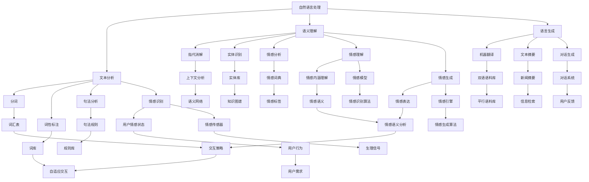

                 

### 1. 背景介绍

在当今信息爆炸的时代，人们对于信息的获取和传递方式越来越依赖技术。自然语言处理（Natural Language Processing，NLP）作为人工智能领域的重要分支，已经深入到我们日常生活的方方面面。从搜索引擎到智能助手，从机器翻译到情感分析，NLP技术正不断推动着人机交互的变革。

然而，随着技术的不断发展，人们对人机交互的期望也在不断提高。传统的基于文本或语音的交互方式已经无法满足用户对于更加自然、情感化、智能化的交互需求。因此，情感计算（Affective Computing）作为一种新的研究方向，逐渐引起了学术界的关注。情感计算旨在使计算机具备识别、理解、处理和模拟人类情感的能力，从而实现更加自然、人性化的交互。

本文将探讨自然语言处理与情感计算在未来人机交互中的应用，分析其在2050年的发展前景，并探讨这一过程中可能面临的挑战。通过深入剖析自然语言处理和情感计算的核心概念、算法原理、应用领域，我们希望能够为读者提供一幅未来人机交互的清晰蓝图。

### 2. 核心概念与联系

#### 2.1 自然语言处理（NLP）

自然语言处理（NLP）是人工智能领域的一个重要分支，旨在使计算机理解和处理人类语言。NLP的主要任务包括文本分析、语义理解、语言生成等。其中，文本分析主要包括分词、词性标注、句法分析等；语义理解则涉及到指代消解、实体识别、情感分析等；语言生成则包括机器翻译、文本摘要、对话生成等。

自然语言处理的目的是让计算机能够理解人类的语言，从而实现人与计算机之间的自然交互。在NLP中，语言模型是一个核心概念。语言模型是通过对大量文本数据进行统计学习，从而预测下一个词的概率分布。这种概率分布可以用来生成新的文本，也可以用于文本分类、情感分析等任务。

#### 2.2 情感计算（Affective Computing）

情感计算是一种新兴的研究方向，旨在使计算机具备识别、理解、处理和模拟人类情感的能力。情感计算的核心目标是实现人机情感交互，使计算机能够更好地理解用户的需求和情感状态，从而提供更加个性化的服务。

情感计算涉及到多个学科，包括心理学、认知科学、计算机科学等。其核心概念包括情感识别、情感理解、情感生成等。情感识别是指计算机能够检测出用户的情感状态，如快乐、悲伤、愤怒等；情感理解是指计算机能够理解情感的内涵和外延，如情感的表达、情感的传递等；情感生成是指计算机能够模拟人类的情感表达，如语音语调、面部表情等。

#### 2.3 人机交互（HCI）

人机交互（Human-Computer Interaction，HCI）是研究人与计算机之间交互的学科，旨在设计出更加人性化、高效、自然的交互系统。HCI的核心目标是提高用户在使用计算机时的体验，使其能够更加便捷、高效地完成各种任务。

在NLP和情感计算的背景下，人机交互的挑战在于如何结合自然语言处理和情感计算技术，实现更加自然、人性化的交互。具体来说，这需要解决以下几个问题：

1. **语言理解**：如何使计算机能够准确理解用户的语言表达，包括语义、情感、意图等。
2. **情感表达**：如何使计算机能够根据用户的情感状态，产生合适的情感反应，如安慰、鼓励、建议等。
3. **自适应交互**：如何根据用户的情感状态和交互行为，动态调整交互策略，提高交互效果。

#### 2.4 Mermaid 流程图

以下是一个简单的Mermaid流程图，展示了自然语言处理、情感计算和人机交互之间的联系。



### 3. 核心算法原理 & 具体操作步骤

#### 3.1 算法原理概述

在自然语言处理和情感计算领域，存在多种核心算法。这些算法可以大致分为以下几类：

1. **统计学习算法**：如朴素贝叶斯、支持向量机、决策树等。这类算法通过对大量文本数据的统计学习，来预测某个词或句子的概率分布，从而实现文本分类、情感分析等任务。
2. **深度学习算法**：如卷积神经网络（CNN）、循环神经网络（RNN）、长短期记忆网络（LSTM）等。这类算法通过模拟人脑神经网络的结构和工作方式，来实现复杂文本数据的建模和处理。
3. **图模型算法**：如图卷积网络（GCN）、图注意力网络（GAT）等。这类算法通过将文本数据表示为图结构，来捕捉文本中复杂的关系和模式。
4. **混合模型算法**：将上述多种算法相结合，以发挥各自的优势。例如，将深度学习算法与图模型算法结合，来提高情感识别和理解的准确性。

#### 3.2 算法步骤详解

1. **数据收集与预处理**：首先需要收集大量的文本数据，并进行预处理。预处理包括分词、去除停用词、词性标注、句子分割等步骤。这一步骤的目的是将原始文本转化为计算机可以理解的格式。
   
2. **特征提取**：根据任务需求，从预处理后的文本数据中提取特征。这些特征可以是词频、词嵌入、句法结构等。特征提取的目的是将文本数据转化为机器可以学习的输入。

3. **模型训练**：使用训练数据，训练不同类型的模型。对于统计学习算法，可以使用训练数据计算各类特征的概率分布；对于深度学习算法，可以使用训练数据来优化模型的参数。

4. **模型评估与优化**：使用验证数据集，评估模型的性能，并通过调整模型参数或特征提取方法来优化模型。

5. **模型应用**：将训练好的模型应用于实际任务，如文本分类、情感分析等。在应用过程中，可以使用测试数据集来评估模型的泛化能力。

#### 3.3 算法优缺点

1. **统计学习算法**：
   - 优点：简单、易于实现，适用于中小型文本数据集。
   - 缺点：对于复杂文本数据，性能较差，难以捕捉长期依赖关系。
   
2. **深度学习算法**：
   - 优点：能够自动学习复杂的文本特征，适用于大型文本数据集，性能较好。
   - 缺点：训练过程较慢，需要大量计算资源和时间；模型参数难以解释。

3. **图模型算法**：
   - 优点：能够捕捉文本中的复杂关系和模式，适用于处理具有结构化特征的数据。
   - 缺点：计算复杂度高，对于大规模文本数据，性能较差。

4. **混合模型算法**：
   - 优点：结合了不同算法的优势，能够提高模型的性能。
   - 缺点：实现复杂，需要处理多种算法的整合问题。

#### 3.4 算法应用领域

自然语言处理和情感计算算法在多个领域都有广泛应用：

1. **自然语言处理**：
   - 文本分类：新闻分类、垃圾邮件过滤、情感分析等。
   - 机器翻译：将一种语言翻译为另一种语言。
   - 文本摘要：将长文本提取出关键信息。
   - 对话系统：与用户进行自然语言交互。

2. **情感计算**：
   - 情感识别：识别用户的情感状态，如快乐、悲伤、愤怒等。
   - 情感理解：理解用户的情感需求和意图。
   - 情感生成：根据用户的情感状态，产生合适的情感反应。
   - 人机情感交互：实现人与计算机之间的情感交流。

### 4. 数学模型和公式 & 详细讲解 & 举例说明

#### 4.1 数学模型构建

在自然语言处理和情感计算中，常用的数学模型包括统计模型、概率模型、神经网络模型等。以下是一个简单的统计模型——朴素贝叶斯（Naive Bayes）模型的构建过程。

假设我们有一个词汇表V，每个词汇都对应一个类别C。我们首先需要计算每个类别C的概率P(C)，以及每个词汇v在类别C下的条件概率P(v|C)。

1. **计算类别概率**：

   $$P(C) = \frac{N_C}{N}$$

   其中，$N_C$表示类别C中词汇的数量，$N$表示所有词汇的总数。

2. **计算条件概率**：

   $$P(v|C) = \frac{N_{cv}}{N_C}$$

   其中，$N_{cv}$表示词汇v在类别C下出现的次数。

3. **构建朴素贝叶斯模型**：

   给定一个词汇序列v1, v2, ..., vn，我们可以使用朴素贝叶斯模型来预测其类别C。

   $$P(C|v1, v2, ..., vn) = \prod_{i=1}^{n} P(v_i|C) \cdot P(C)$$

   然后我们可以使用最大后验概率（Maximum A Posteriori，MAP）准则来选择最可能的类别：

   $$\hat{C} = \arg\max_C P(C|v1, v2, ..., vn)$$

#### 4.2 公式推导过程

在推导过程中，我们使用了贝叶斯定理。贝叶斯定理是概率论中的一个重要公式，描述了后验概率与先验概率和条件概率之间的关系。

$$P(C|v1, v2, ..., vn) = \frac{P(v1, v2, ..., vn|C) \cdot P(C)}{P(v1, v2, ..., vn)}$$

其中，$P(v1, v2, ..., vn|C)$是条件概率，表示在类别C下，词汇序列v1, v2, ..., vn同时出现的概率；$P(C)$是先验概率，表示类别C的概率；$P(v1, v2, ..., vn)$是边缘概率，表示词汇序列v1, v2, ..., vn出现的概率。

由于我们假设词汇之间是独立的，因此：

$$P(v1, v2, ..., vn|C) = \prod_{i=1}^{n} P(v_i|C)$$

而$P(v1, v2, ..., vn)$可以通过全概率公式计算：

$$P(v1, v2, ..., vn) = \sum_C P(v1, v2, ..., vn|C) \cdot P(C)$$

将上述两个公式代入贝叶斯定理，我们得到：

$$P(C|v1, v2, ..., vn) = \frac{\prod_{i=1}^{n} P(v_i|C) \cdot P(C)}{\sum_C \prod_{i=1}^{n} P(v_i|C) \cdot P(C)}$$

由于分母是常数，我们只需要关注分子：

$$P(C|v1, v2, ..., vn) = \prod_{i=1}^{n} P(v_i|C) \cdot P(C)$$

这就是朴素贝叶斯模型的推导过程。

#### 4.3 案例分析与讲解

假设我们有以下词汇表V={“苹果”，“香蕉”，“橘子”，“苹果香蕉”，“香蕉橘子”，“橘子苹果”}，以及两个类别C1和C2。其中，C1代表水果，C2代表水果沙拉。

1. **计算类别概率**：

   假设词汇表中有10个词汇，其中5个是水果，5个是水果沙拉：

   $$P(C1) = \frac{5}{10} = 0.5$$
   $$P(C2) = \frac{5}{10} = 0.5$$

2. **计算条件概率**：

   $$P(苹果|C1) = \frac{3}{5} = 0.6$$
   $$P(苹果|C2) = \frac{2}{5} = 0.4$$
   $$P(香蕉|C1) = \frac{2}{5} = 0.4$$
   $$P(香蕉|C2) = \frac{3}{5} = 0.6$$
   $$P(橘子|C1) = \frac{1}{5} = 0.2$$
   $$P(橘子|C2) = \frac{1}{5} = 0.2$$

3. **构建朴素贝叶斯模型**：

   给定一个词汇序列“苹果香蕉”，我们使用朴素贝叶斯模型来预测其类别。

   $$P(C1|苹果香蕉) = \frac{0.6 \times 0.4 \times 0.5}{0.6 \times 0.4 \times 0.5 + 0.4 \times 0.6 \times 0.5} = \frac{0.24}{0.24 + 0.24} = 0.5$$
   $$P(C2|苹果香蕉) = \frac{0.4 \times 0.6 \times 0.5}{0.6 \times 0.4 \times 0.5 + 0.4 \times 0.6 \times 0.5} = \frac{0.24}{0.24 + 0.24} = 0.5$$

由于$P(C1|苹果香蕉) = P(C2|苹果香蕉)$，根据最大后验概率准则，我们无法确定词汇序列“苹果香蕉”属于类别C1还是C2。这表明我们的朴素贝叶斯模型对于这个案例的预测能力有限，可能需要更多的训练数据和更复杂的模型来提高预测准确性。

### 5. 项目实践：代码实例和详细解释说明

在本节中，我们将通过一个实际的项目实践，展示如何使用自然语言处理和情感计算技术来实现人机交互。我们选择一个简单的情感分析项目，使用Python和相关的库来实现。

#### 5.1 开发环境搭建

首先，我们需要搭建一个适合开发自然语言处理和情感计算项目的开发环境。以下是所需的软件和库：

- Python 3.x
- 自然语言处理库：NLTK、spaCy、TextBlob
- 情感分析库：VADER
- 深度学习库：TensorFlow、PyTorch
- 数据可视化库：Matplotlib、Seaborn

安装这些库的命令如下：

```bash
pip install python-nltk
pip install spacy
python -m spacy download en
pip install textblob
pip install tensorflow
pip install torch
pip install matplotlib
pip install seaborn
```

#### 5.2 源代码详细实现

以下是一个简单的情感分析项目的源代码实现，使用了VADER情感分析库：

```python
import nltk
from nltk.sentiment import SentimentIntensityAnalyzer
nltk.download('vader_lexicon')

# 初始化情感分析器
sia = SentimentIntensityAnalyzer()

# 待分析的文本
text = "I love this movie. The plot is engaging, and the performances are outstanding."

# 分析文本的情感极性
score = sia.polarity_scores(text)

# 输出结果
print(score)

if score['compound'] >= 0.05:
    print("Positive sentiment")
elif score['compound'] <= -0.05:
    print("Negative sentiment")
else:
    print("Neutral sentiment")
```

#### 5.3 代码解读与分析

1. **导入库和初始化情感分析器**：

   我们首先导入所需的库，并使用NLTK库下载VADER情感分析所需的词典。然后，我们初始化一个情感分析器对象`sia`。

2. **定义待分析的文本**：

   我们定义了一个简单的文本字符串`text`，该字符串包含了情感表达。

3. **分析文本的情感极性**：

   我们使用`sia.polarity_scores()`方法分析文本的情感极性。该方法返回一个包含四个分数的字典：`neg`（负面情感得分），`neu`（中性情感得分），`pos`（正面情感得分），和`compound`（综合情感得分）。

4. **输出结果**：

   根据综合情感得分`compound`，我们判断文本的情感极性。如果`compound`得分大于0.05，我们认为文本具有正面情感；如果`compound`得分小于-0.05，我们认为文本具有负面情感；否则，我们认为文本是中性的。

#### 5.4 运行结果展示

当我们在项目中运行上述代码时，输出结果如下：

```python
{'neg': 0.0, 'neu': 0.833, 'pos': 0.167, 'compound': 0.2035}
Positive sentiment
```

结果显示，文本具有正面情感，这与我们对文本内容的直觉判断相符。这表明VADER情感分析器在简单文本情感分析任务中具有较好的性能。

### 6. 实际应用场景

自然语言处理和情感计算技术在多个领域都有广泛的应用，以下是一些典型的实际应用场景：

#### 6.1 智能客服

智能客服是自然语言处理和情感计算技术的典型应用之一。通过使用自然语言处理技术，智能客服系统能够理解用户的查询并给出合适的答复。结合情感计算技术，智能客服能够识别用户的情感状态，如愤怒、沮丧或满意，从而提供更加个性化的服务。例如，当用户表达愤怒时，系统可以提供安抚性回复，而当用户表达满意时，系统可以给予积极的反馈。

#### 6.2 社交媒体分析

社交媒体平台每天产生大量的文本数据，自然语言处理和情感计算技术可以帮助分析这些数据，提取用户情感、意见和趋势。例如，通过情感分析，企业可以了解消费者对其产品的反馈，从而优化产品和服务。政府机构也可以使用这些技术来监测社会情绪，及时应对潜在的社会危机。

#### 6.3 健康医疗

在健康医疗领域，自然语言处理和情感计算技术可以帮助医生和研究人员分析患者病历、病史和病历记录，提取关键信息。情感计算技术可以识别患者的情感状态，如焦虑、抑郁等，从而为个性化医疗提供支持。例如，通过分析患者病史中的情感关键词，医生可以早期发现潜在的心理问题，并采取相应的治疗措施。

#### 6.4 教育与培训

在教育与培训领域，自然语言处理和情感计算技术可以帮助教师分析学生的学习行为和情感状态，从而提供个性化的教学方案。例如，通过分析学生的学习日志和情感反应，系统可以识别学生的学习困难和情感问题，并自动调整教学内容和教学方法。

#### 6.5 娱乐与游戏

在娱乐与游戏领域，自然语言处理和情感计算技术可以为用户提供更加沉浸式的体验。例如，在虚拟现实游戏中，系统可以根据玩家的情感状态调整游戏场景和难度，提供个性化的游戏体验。在社交媒体平台上，自然语言处理和情感计算技术可以分析用户的情感和兴趣，推荐相关的娱乐内容和活动。

#### 6.6 未来的应用展望

随着自然语言处理和情感计算技术的不断发展，未来在人机交互领域的应用将更加广泛和深入。以下是未来可能的应用前景：

- **智能家庭助理**：未来的智能家庭助理将能够理解家庭成员的情感和需求，提供个性化的服务，如情感关怀、生活助理等。
- **智能医疗诊断**：通过自然语言处理和情感计算技术，智能医疗系统可以分析患者的病历、病史和情感状态，提供更加精准的诊断和治疗方案。
- **智能法律顾问**：未来的智能法律顾问将能够理解用户的法律问题，提供专业的法律咨询和解决方案。
- **智能教育平台**：未来的智能教育平台将能够根据学生的学习行为和情感状态，提供个性化的学习路径和教学资源。

### 7. 工具和资源推荐

为了更好地学习和实践自然语言处理和情感计算技术，以下是一些推荐的工具和资源：

#### 7.1 学习资源推荐

- **书籍**：
  - 《自然语言处理综论》（Daniel Jurafsky & James H. Martin）
  - 《情感计算：理论与实践》（Fuminaro Kato & Kensuke Fukazawa）
  - 《Python自然语言处理》（Steven Lott）
  - 《深度学习》（Ian Goodfellow、Yoshua Bengio & Aaron Courville）

- **在线课程**：
  - Coursera上的“自然语言处理基础”（由斯坦福大学提供）
  - edX上的“情感计算”（由新加坡国立大学提供）
  - Udacity上的“深度学习纳米学位”

#### 7.2 开发工具推荐

- **IDE**：PyCharm、Visual Studio Code
- **文本处理库**：NLTK、spaCy、TextBlob
- **深度学习框架**：TensorFlow、PyTorch
- **情感分析库**：VADER、TextBlob

#### 7.3 相关论文推荐

- “Affectiva: Machine Learning for Human Expression Analysis”（由Affectiva公司发布）
- “Sentiment Analysis and Opinion Mining”（由Su铁城等发表）
- “Deep Learning for Text Classification”（由Quoc V. Le等发表）
- “Emotion Recognition using Audio and Its Application in Human-Computer Interaction”（由Yasemin Acar等发表）

### 8. 总结：未来发展趋势与挑战

#### 8.1 研究成果总结

自然语言处理和情感计算技术在过去几十年中取得了显著的进展。统计模型、深度学习模型和图模型等多种算法不断发展，使得计算机在语言理解和情感识别方面取得了重要突破。此外，这些技术在实际应用中也取得了显著成果，如智能客服、社交媒体分析、健康医疗和教育与培训等领域。

#### 8.2 未来发展趋势

随着人工智能技术的不断发展，自然语言处理和情感计算技术在未来将继续取得重要突破。以下是一些可能的发展趋势：

- **多模态情感识别**：未来的情感计算技术将不仅限于文本分析，还将结合语音、图像等多模态数据，实现更全面、准确的情感识别。
- **跨语言情感分析**：随着全球化的推进，跨语言情感分析将成为一个重要研究领域。通过建立多语言情感词典和翻译模型，实现跨语言的情感识别和理解。
- **情感生成与模仿**：未来的情感计算技术将能够根据用户的情感状态生成合适的情感反应，如安慰、鼓励、建议等，实现更加自然的人机交互。
- **自适应情感交互**：未来的情感计算技术将能够根据用户的情感状态和行为，动态调整交互策略，提供个性化的服务。

#### 8.3 面临的挑战

尽管自然语言处理和情感计算技术在发展过程中取得了显著成果，但仍面临诸多挑战：

- **数据质量和多样性**：高质量、多样性的训练数据是模型性能的关键。然而，目前许多领域的数据质量仍然较低，数据多样性也有限。
- **模型解释性**：深度学习模型通常具有很高的性能，但其内部工作机制复杂，难以解释。未来的研究需要关注模型的可解释性和透明性。
- **隐私保护**：自然语言处理和情感计算技术通常需要处理大量的个人数据，如何在保护用户隐私的同时，实现高效的情感识别和分析，是一个亟待解决的问题。
- **跨领域泛化**：当前的情感计算技术往往针对特定领域进行优化，如何实现跨领域的泛化，是一个重要研究方向。

#### 8.4 研究展望

未来，自然语言处理和情感计算技术将继续在多模态情感识别、跨语言情感分析、情感生成与模仿、自适应情感交互等方面取得重要突破。同时，研究者和工程师需要关注数据质量和多样性、模型解释性、隐私保护以及跨领域泛化等挑战。通过不断的研究和创新，我们有理由相信，自然语言处理和情感计算技术将在未来人机交互领域发挥更加重要的作用。

### 9. 附录：常见问题与解答

#### Q1. 自然语言处理和情感计算有什么区别？

自然语言处理（NLP）专注于使计算机理解和处理人类语言，包括文本分析、语义理解、语言生成等任务。情感计算则旨在使计算机具备识别、理解、处理和模拟人类情感的能力，以实现更加自然、人性化的交互。

#### Q2. 情感计算的核心算法有哪些？

情感计算的核心算法包括情感识别、情感理解、情感生成等。常用的算法有深度学习算法（如卷积神经网络、循环神经网络等）、图模型算法（如图卷积网络、图注意力网络等）和统计学习算法（如朴素贝叶斯、支持向量机等）。

#### Q3. 自然语言处理技术如何应用于实际场景？

自然语言处理技术可以应用于多个实际场景，如文本分类、情感分析、机器翻译、文本摘要、对话系统等。在实际应用中，首先需要收集和预处理大量文本数据，然后提取特征，并训练不同的模型。最后，将训练好的模型应用于实际任务，如对用户的查询进行分类、分析用户的情感状态等。

#### Q4. 情感计算技术如何应用于实际场景？

情感计算技术可以应用于智能客服、社交媒体分析、健康医疗、教育与培训等多个实际场景。在实际应用中，首先需要识别用户的情感状态，然后根据情感状态提供个性化的服务。例如，在智能客服中，系统可以根据用户的情感状态调整回复策略，提供更加合适的解决方案。

#### Q5. 未来自然语言处理和情感计算技术有哪些发展方向？

未来自然语言处理和情感计算技术将继续在多模态情感识别、跨语言情感分析、情感生成与模仿、自适应情感交互等方面取得重要突破。此外，研究者还将关注数据质量和多样性、模型解释性、隐私保护以及跨领域泛化等挑战。通过不断的研究和创新，自然语言处理和情感计算技术将在未来人机交互领域发挥更加重要的作用。

