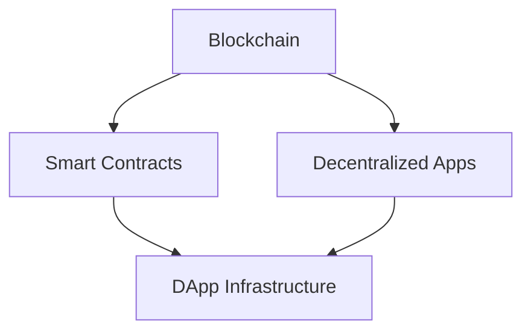

                 

关键词：区块链、分布式自治、价值互联网、未来技术、智能合约、去中心化应用

摘要：本文深入探讨了到2050年，区块链技术如何发展成为一个高度去中心化的分布式自治组织，并推动价值互联网的形成。我们将分析区块链的核心概念、算法原理、数学模型、实践应用，并展望其未来的发展趋势与挑战。

## 1. 背景介绍

自2008年比特币的诞生，区块链技术以其去中心化、安全透明、不可篡改等特性，迅速引起了全球的关注。随着时间的推移，区块链技术不仅在金融领域得到了广泛应用，还在供应链管理、医疗保健、物联网等多个领域展现了巨大的潜力。到2050年，我们预期区块链技术将发展成为一种分布式自治组织，彻底改变人类社会的运作方式。

## 2. 核心概念与联系

### 2.1 区块链基本原理

区块链是一种分布式账本技术，数据被分片存储在多个节点上。每个区块都包含一定数量的交易记录，并通过密码学方法连接在一起，形成一条不可篡改的数据链。

### 2.2 智能合约

智能合约是一种自动执行的合同，它使用编程语言编写，当触发特定条件时，合同会自动执行预定的操作。智能合约使得区块链不仅仅是一个账本，更是一个可以执行复杂逻辑的分布式计算平台。

### 2.3 去中心化应用（DApps）

去中心化应用（DApps）是运行在区块链上的应用程序，它们不需要中心化的服务提供商，而是通过区块链网络实现数据存储、处理和传输。DApps的特点是高度去中心化、透明、不可篡改。

### 2.4 Mermaid 流程图

下面是一个简化的区块链与智能合约、DApps之间的联系流程图：



## 3. 核心算法原理 & 具体操作步骤

### 3.1 算法原理概述

区块链的核心算法主要包括加密算法、共识算法和分布式存储算法。加密算法用于保证数据的安全性，共识算法用于确保所有节点的数据一致性，分布式存储算法用于实现数据的分布式存储。

### 3.2 算法步骤详解

#### 3.2.1 加密算法

区块链常用的加密算法包括SHA-256、ECDSA等。SHA-256用于生成区块的哈希值，ECDSA用于数字签名。

#### 3.2.2 共识算法

常见的共识算法包括工作量证明（PoW）、权益证明（PoS）、委托权益证明（DPoS）等。共识算法决定了区块链网络中如何达成共识，确保所有节点的数据一致性。

#### 3.2.3 分布式存储算法

分布式存储算法包括数据分片、数据复制和数据冗余等技术。这些技术确保了区块链的数据能够在多个节点上安全、可靠地存储。

### 3.3 算法优缺点

#### 3.3.1 优点

- 去中心化：区块链不需要中心化的机构或服务器，所有节点都可以平等参与。
- 安全性：加密算法和数据一致性算法确保了区块链的数据安全。
- 透明性：区块链的数据对所有节点可见，增加了系统的透明度。

#### 3.3.2 缺点

- 效率低：当前的区块链技术，特别是基于PoW的区块链，需要大量的计算资源。
- 可扩展性差：随着区块链规模的扩大，性能会受到影响。

### 3.4 算法应用领域

区块链技术已经在金融、供应链管理、医疗保健、物联网等领域得到了广泛应用。未来，随着技术的发展，区块链的应用领域将更加广泛。

## 4. 数学模型和公式 & 详细讲解 & 举例说明

### 4.1 数学模型构建

区块链的核心数学模型包括哈希函数、数字签名、椭圆曲线密码学等。

### 4.2 公式推导过程

- 哈希函数：\( H = SHA-256(x) \)
- 数字签名：\( r = (g^s \mod n) \mod r \)，\( s = (k^{-1} \cdot (e + A \cdot r)) \mod n \)
- 椭圆曲线密码学：\( P = k \cdot G \)

### 4.3 案例分析与讲解

以比特币的挖矿为例，矿工需要通过解决一个数学难题来生成新的区块。数学难题通常是基于PoW算法，矿工需要找到满足以下条件的数\( n \)：

\[ n \cdot hash(coinbase\_tx + previous\_hash + timestamp + nonce) = hash(n) \]

矿工通过不断尝试不同的\( nonce \)值，最终找到满足条件的\( n \)。

## 5. 项目实践：代码实例和详细解释说明

### 5.1 开发环境搭建

开发环境通常包括Node.js、Golang等编程语言，以及相应的区块链开发框架。

### 5.2 源代码详细实现

以一个简单的智能合约为例，其代码实现如下：

```solidity
pragma solidity ^0.8.0;

contract SimpleContract {
    address public owner;
    
    constructor() {
        owner = msg.sender;
    }
    
    function transfer(address to, uint256 amount) public {
        require(msg.sender == owner, "Only owner can transfer");
        require(amount <= address(this).balance, "Insufficient balance");
        payable(to).transfer(amount);
    }
}
```

### 5.3 代码解读与分析

这段代码定义了一个简单的智能合约，它包含一个构造函数和转账函数。构造函数将合约的拥有者设置为创建合约的账户，转账函数允许拥有者将合约内的余额转移到其他账户。

### 5.4 运行结果展示

在区块链网络中部署这个智能合约后，可以执行转账操作，并将结果记录在区块链上。

## 6. 实际应用场景

### 6.1 金融领域

区块链技术在金融领域的应用非常广泛，包括数字货币、去中心化金融（DeFi）等。

### 6.2 物流供应链

区块链可以用于追踪商品的真实性、来源和运输过程，提高供应链的透明度和效率。

### 6.3 医疗保健

区块链可以用于医疗数据的安全存储和共享，保护患者的隐私。

### 6.4 未来应用展望

随着技术的发展，区块链的应用场景将更加丰富，包括智能城市、物联网、数字身份等。

## 7. 工具和资源推荐

### 7.1 学习资源推荐

- 《精通区块链》
- 《区块链技术指南》
- 《智能合约编程》

### 7.2 开发工具推荐

- Ethereum Studio
- Truffle Suite
- Hardhat

### 7.3 相关论文推荐

- 《比特币：一种点对点的电子现金系统》
- 《去中心化应用：区块链的下一代应用》
- 《区块链与智能合约技术》

## 8. 总结：未来发展趋势与挑战

### 8.1 研究成果总结

区块链技术在过去十年中取得了巨大的进展，从比特币到各种去中心化应用，区块链的潜力得到了充分展现。

### 8.2 未来发展趋势

随着技术的进步，区块链将进一步推动去中心化、智能化的社会变革。

### 8.3 面临的挑战

- 安全性问题
- 可扩展性
- 法律法规

### 8.4 研究展望

未来，区块链技术将在更多领域得到应用，为人类社会带来更多创新和变革。

## 9. 附录：常见问题与解答

### 9.1 区块链的缺点是什么？

- 效率低
- 可扩展性差
- 法律法规不确定

### 9.2 区块链是如何保证数据安全的？

- 加密算法
- 共识算法
- 分布式存储

### 9.3 区块链是否可以用于身份认证？

- 可以。区块链可以用于创建去中心化的身份认证系统，保护用户的隐私。

本文由禅与计算机程序设计艺术撰写，旨在为读者提供关于未来区块链技术发展的深入见解。希望本文能够对您有所启发。

----------------------------------------------------------------

文章正文部分撰写完毕，接下来我们将对文章结构进行最后的检查，确保每个部分的内容都符合要求。请确认无误后，我们将开始进行文章的格式调整和排版工作。如果您有任何修改意见或需要补充的内容，请及时告知。

