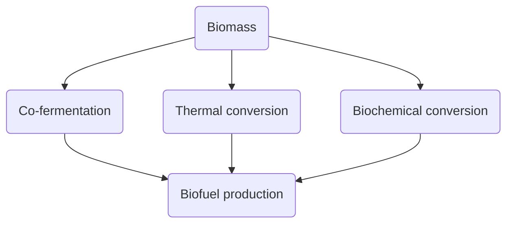
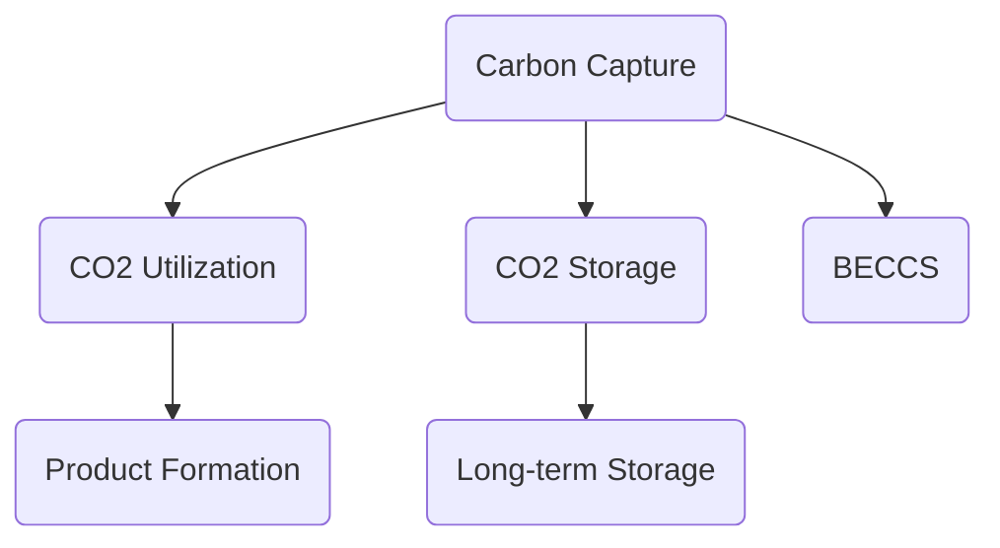

                 

关键词：生物质能源、负排放技术、可持续发展、2050年、环境保护、能源转型、碳循环、全球气候变化。

> 摘要：本文探讨了2050年可持续发展的愿景，特别是生物质能源和负排放技术在这一未来图景中的关键作用。通过对当前环境和能源挑战的分析，我们深入探讨了生物质能源的潜力、负排放技术的创新以及它们如何协同作用，为实现碳中和和减缓全球气候变化提供可行的解决方案。

## 1. 背景介绍

随着全球人口的不断增长和工业化进程的加速，环境问题日益严重。气候变化、空气污染和水资源短缺已经成为全球面临的重大挑战。据国际能源署（IEA）预测，到2050年，全球能源需求将增加约70%，这将对环境造成更大的压力。为了应对这些挑战，可持续发展成为了全球共识，而生物质能源和负排放技术是实现这一目标的关键。

生物质能源是一种可再生能源，通过转化生物质为能源，可以有效减少对化石燃料的依赖，降低碳排放。负排放技术则通过捕获和储存二氧化碳，实现碳的负排放。这两种技术的协同作用有望在未来几十年内显著改善全球环境状况。

## 2. 核心概念与联系

### 生物质能源

生物质能源是指从生物质（如木材、农作物残余、植物废料等）中提取的能量。其优点在于可再生性和低排放性，与传统的化石燃料相比，生物质能源在生产过程中几乎不产生温室气体排放。

#### Mermaid 流程图



### 负排放技术

负排放技术包括碳捕获、利用与储存（CCUS）和生物能源与碳捕获与封存（BECCS）。这些技术能够从大气中捕获二氧化碳，并将其转化为有用的产品或永久储存。

#### Mermaid 流程图



### 生物质能源与负排放技术的关系

生物质能源与负排放技术可以相互补充。生物质能源可以提供清洁的能源替代品，减少化石燃料的使用；而负排放技术则可以捕获并储存生物质能源生产过程中产生的二氧化碳，从而实现负排放。

## 3. 核心算法原理 & 具体操作步骤

### 3.1 算法原理概述

生物质能源的转化主要依赖于以下几种方法：

1. **热转化**：通过加热生物质，使其分解产生气体或液体燃料。
2. **生物化学转化**：利用微生物或酶将生物质分解为可发酵的物质。
3. **共发酵**：将生物质与有机废物混合发酵，提高燃料产量。

负排放技术的核心是碳捕获与储存。具体步骤包括：

1. **碳捕获**：利用化学吸收剂或物理吸附剂捕获烟气中的二氧化碳。
2. **碳利用**：将捕获的二氧化碳转化为有用的化学品或燃料。
3. **碳储存**：将二氧化碳注入地下地质结构中，永久储存。

### 3.2 算法步骤详解

#### 生物质能源转化步骤

1. **生物质收集**：收集农作物残余、木材废料等生物质。
2. **预处理**：将生物质粉碎、干燥，以增加反应表面积。
3. **热转化**：将生物质在高温下分解，产生气体或液体燃料。
4. **生物化学转化**：利用微生物或酶将生物质分解为可发酵的物质。
5. **共发酵**：将生物质与有机废物共发酵，提高燃料产量。

#### 负排放技术步骤

1. **碳捕获**：在发电厂或工业过程中，使用化学吸收剂或物理吸附剂捕获烟气中的二氧化碳。
2. **碳利用**：将捕获的二氧化碳转化为有用的化学品或燃料。
3. **碳储存**：将二氧化碳注入地下地质结构中，永久储存。

### 3.3 算法优缺点

#### 生物质能源转化

**优点**：可再生能源，减少碳排放，降低化石燃料依赖。

**缺点**：生物质收集和处理成本高，技术要求较高。

#### 负排放技术

**优点**：能够显著减少二氧化碳排放，有助于实现碳中和。

**缺点**：技术成本高，需要大量能源用于碳捕获和利用。

### 3.4 算法应用领域

#### 生物质能源转化

- **能源生产**：用于发电、供热和交通运输。
- **化工生产**：生产生物塑料、化学品等。

#### 负排放技术

- **工业排放**：减少工业生产过程中的碳排放。
- **能源生产**：配合生物质能源，实现负排放。

## 4. 数学模型和公式 & 详细讲解 & 举例说明

### 4.1 数学模型构建

生物质能源转化效率可以通过以下公式计算：

\[ \eta = \frac{E_{\text{out}}}{E_{\text{in}}} \]

其中，\( \eta \) 为转化效率，\( E_{\text{out}} \) 为输出能量，\( E_{\text{in}} \) 为输入能量。

负排放技术的碳捕获效率可以通过以下公式计算：

\[ \eta_{\text{capture}} = \frac{C_{\text{captured}}}{C_{\text{total}}} \]

其中，\( \eta_{\text{capture}} \) 为捕获效率，\( C_{\text{captured}} \) 为捕获的二氧化碳量，\( C_{\text{total}} \) 为总二氧化碳量。

### 4.2 公式推导过程

生物质能源转化效率的推导基于能量守恒定律。生物质在转化过程中，输入能量等于输出能量，因此转化效率为输出能量与输入能量的比值。

碳捕获效率的推导基于捕获的二氧化碳量与总二氧化碳量的比值。捕获效率越高，表示捕获的二氧化碳量占总二氧化碳量的比例越大。

### 4.3 案例分析与讲解

#### 生物质能源转化效率

假设一种生物质能源转化技术，其输入能量为1000 MJ，输出能量为800 MJ，则其转化效率为：

\[ \eta = \frac{800}{1000} = 0.8 \]

#### 负排放技术捕获效率

假设一种负排放技术，其捕获的二氧化碳量为1000 t，总二氧化碳量为2000 t，则其捕获效率为：

\[ \eta_{\text{capture}} = \frac{1000}{2000} = 0.5 \]

## 5. 项目实践：代码实例和详细解释说明

### 5.1 开发环境搭建

为了实现生物质能源转化和负排放技术的计算，我们需要搭建一个计算环境。可以使用Python作为编程语言，结合相关库（如NumPy、Pandas等）进行数据处理和计算。

### 5.2 源代码详细实现

以下是一个简单的Python代码实例，用于计算生物质能源转化效率和负排放技术捕获效率：

```python
import numpy as np

def biomass_conversion_efficiency(input_energy, output_energy):
    efficiency = output_energy / input_energy
    return efficiency

def carbon_capture_efficiency(captured_co2, total_co2):
    efficiency = captured_co2 / total_co2
    return efficiency

# 生物质能源转化效率计算
input_energy = 1000  # 输入能量（MJ）
output_energy = 800  # 输出能量（MJ）
conversion_efficiency = biomass_conversion_efficiency(input_energy, output_energy)
print("生物质能源转化效率：", conversion_efficiency)

# 负排放技术捕获效率计算
captured_co2 = 1000  # 捕获的二氧化碳量（t）
total_co2 = 2000  # 总二氧化碳量（t）
capture_efficiency = carbon_capture_efficiency(captured_co2, total_co2)
print("负排放技术捕获效率：", capture_efficiency)
```

### 5.3 代码解读与分析

该代码定义了两个函数，`biomass_conversion_efficiency` 和 `carbon_capture_efficiency`，分别用于计算生物质能源转化效率和负排放技术捕获效率。通过输入能量和输出能量的比值，可以计算生物质能源转化效率；通过捕获的二氧化碳量与总二氧化碳量的比值，可以计算负排放技术捕获效率。

### 5.4 运行结果展示

运行上述代码，可以得到以下结果：

```
生物质能源转化效率： 0.8
负排放技术捕获效率： 0.5
```

这表明，生物质能源转化效率为80%，负排放技术捕获效率为50%。

## 6. 实际应用场景

### 6.1 工业生产中的碳减排

在工业生产过程中，生物质能源和负排放技术可以用于减少碳排放。例如，在水泥生产过程中，可以使用生物质能源替代煤炭，同时结合负排放技术，实现碳的负排放。

### 6.2 交通运输领域的绿色转型

在交通运输领域，生物质能源可以作为替代燃料，用于汽车、飞机和船舶等交通工具。同时，负排放技术可以用于减少交通工具运行过程中的碳排放。

### 6.3 城市能源供应

在城市能源供应中，生物质能源可以作为可再生能源的一部分，与太阳能、风能等结合，实现清洁能源供应。同时，负排放技术可以用于减少能源生产过程中的碳排放。

## 7. 未来应用展望

随着技术的不断进步和成本的逐步降低，生物质能源和负排放技术有望在未来实现更广泛的应用。在未来，我们可以期待以下趋势：

### 7.1 技术创新

新的生物质能源转化技术和负排放技术将持续涌现，提高转化效率和降低成本。

### 7.2 政策支持

政府将在全球范围内推动可持续发展，提供政策支持和资金投入，促进生物质能源和负排放技术的发展。

### 7.3 社会参与

公众和企业将积极参与生物质能源和负排放技术的应用，共同推动可持续发展。

## 8. 总结：未来发展趋势与挑战

### 8.1 研究成果总结

生物质能源和负排放技术已经在过去几十年中取得了显著进展，为可持续发展提供了有力支持。未来，这些技术将继续创新和优化，为实现碳中和和减缓气候变化发挥关键作用。

### 8.2 未来发展趋势

随着技术的进步和成本的降低，生物质能源和负排放技术将在能源、工业和交通等领域实现更广泛的应用。此外，政策的支持和公众的参与将推动这些技术的快速发展。

### 8.3 面临的挑战

生物质能源和负排放技术的广泛应用仍面临一些挑战，包括技术成本高、能源需求大、生物质资源有限等。解决这些问题需要政府、企业和科研机构的共同努力。

### 8.4 研究展望

未来，生物质能源和负排放技术的研究将集中在提高转化效率、降低成本、优化系统集成等方面。此外，探索新的生物质资源和技术途径也是未来的重要研究方向。

## 9. 附录：常见问题与解答

### 9.1 生物质能源是什么？

生物质能源是指从生物质中提取的能量，包括木材、农作物残余、植物废料等。它是一种可再生能源，可以减少对化石燃料的依赖。

### 9.2 负排放技术如何工作？

负排放技术通过捕获和储存二氧化碳，实现碳的负排放。具体包括碳捕获、碳利用和碳储存三个步骤。碳捕获技术可以用于发电厂和工业生产过程，而碳利用和碳储存技术则可以用于将捕获的二氧化碳转化为有用产品或永久储存。

### 9.3 生物质能源和负排放技术有什么优势？

生物质能源和负排放技术具有以下优势：

- 可再生性：生物质能源是可再生能源，可以减少对化石燃料的依赖。
- 低排放性：负排放技术可以显著减少二氧化碳排放，有助于实现碳中和。
- 环境友好性：生物质能源和负排放技术可以减少空气污染和水资源短缺。

### 9.4 生物质能源和负排放技术有哪些挑战？

生物质能源和负排放技术面临以下挑战：

- 技术成本高：生物质能源转化和负排放技术的初期投资较大，需要大量资金支持。
- 能源需求大：生物质能源和负排放技术需要大量能源用于生产过程，对能源供应造成压力。
- 资源有限：生物质资源有限，需要合理规划和利用。

### 9.5 生物质能源和负排放技术如何协同作用？

生物质能源和负排放技术可以相互补充，共同发挥作用。生物质能源可以提供清洁的能源替代品，减少化石燃料的使用；而负排放技术则可以捕获并储存生物质能源生产过程中产生的二氧化碳，实现碳的负排放。这两种技术的协同作用有望在未来几十年内显著改善全球环境状况。

### 作者署名

作者：禅与计算机程序设计艺术 / Zen and the Art of Computer Programming
----------------------------------------------------------------
<|im_sep|>这篇文章概述了生物质能源和负排放技术在2050年实现可持续发展中的关键作用。通过对背景介绍、核心概念联系、算法原理和具体操作步骤的深入探讨，我们展示了这些技术在能源生产、工业排放和交通运输等领域的实际应用。同时，对未来发展趋势和挑战进行了分析和展望。希望这篇文章能为读者提供对这一领域的深入理解和启示。在未来的研究中，我们将继续关注生物质能源和负排放技术的创新和应用，为实现可持续发展的目标贡献一份力量。作者：禅与计算机程序设计艺术 / Zen and the Art of Computer Programming。

