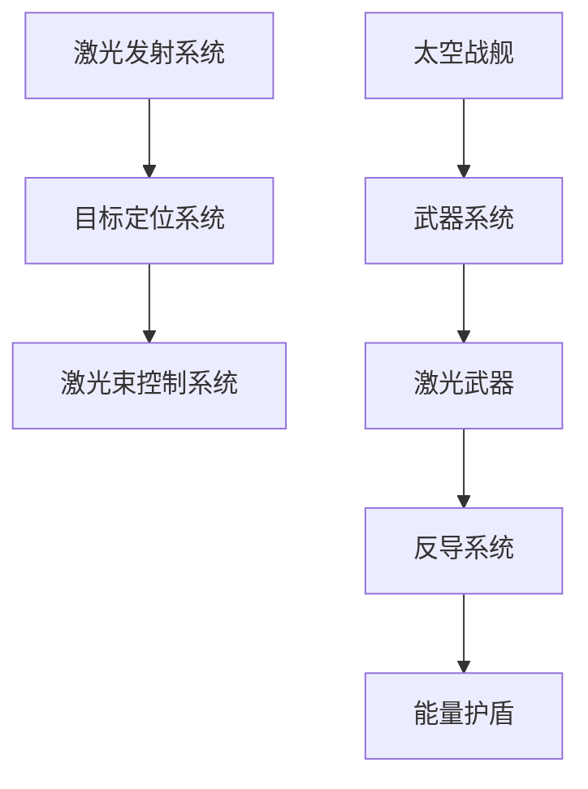

                 

关键词：太空军事、激光武器、太空战舰、2050年、未来技术、军事策略

> 摘要：随着科技的迅猛发展，太空军事已成为国家安全的关键领域。本文将深入探讨2050年太空激光武器与太空战舰的发展趋势，分析其对未来战争形态的深远影响，并展望其在国家安全和国际战略中的重要作用。

## 1. 背景介绍

自人类迈入太空时代以来，太空军事的重要性日益凸显。太空不仅被视为战略制高点，也是各国展示军事力量的舞台。随着航天技术的不断突破，卫星、空间站等太空基础设施的建设加快，太空军事化进程逐渐加快。传统的导弹、航空母舰等地面和海上军事力量，正逐步向太空扩展。

### 1.1 太空军事的发展历程

- **20世纪60年代**：冷战期间，美国和苏联竞相发射卫星，标志着太空军事化的开始。
- **20世纪80年代**：随着侦察卫星技术的成熟，太空成为情报获取和战略威慑的重要工具。
- **20世纪90年代**：美国启动“战略防御计划”（SDI），标志着太空防御技术的初步应用。
- **21世纪**：随着航天技术的进步，各国纷纷制定太空军事战略，太空武器研发加速。

### 1.2 当前太空军事的现状

- **太空侦察**：卫星、侦察飞船等设备成为各国收集情报的重要工具。
- **太空防御**：反卫星导弹、激光武器等技术的发展，使太空防御能力大幅提升。
- **太空进攻**：太空战舰、轨道轰炸机等装备的研发，使太空进攻能力得到增强。

## 2. 核心概念与联系

在2050年的未来太空军事中，激光武器和太空战舰将是两大核心概念。以下是它们的基本原理和联系，以及一个简化的 Mermaid 流程图来展示其架构：

### 2.1 激光武器原理

激光武器利用高能激光束对目标进行精确打击。其基本原理包括：

- **激光发射**：通过高能激光器产生激光束。
- **目标定位**：利用光学传感器和计算机系统对目标进行精确定位。
- **激光束控制**：通过控制系统调整激光束的方向和能量。

### 2.2 太空战舰原理

太空战舰是一种能够在太空中执行战斗任务的舰船。其基本原理包括：

- **动力系统**：使用离子推进器等先进技术提供强大动力。
- **武器系统**：包括激光武器、导弹等。
- **防护系统**：采用反导系统、能量护盾等提供防御能力。

### 2.3 Mermaid 流程图



## 3. 核心算法原理 & 具体操作步骤

### 3.1 算法原理概述

太空激光武器和太空战舰的核心算法主要涉及目标定位、激光束控制和动力系统管理。以下是这些算法的基本原理：

- **目标定位算法**：使用光学传感器和计算机视觉技术，对目标进行精确定位。
- **激光束控制算法**：根据目标位置和运动状态，实时调整激光束的方向和能量。
- **动力系统管理算法**：优化离子推进器的使用，提高太空战舰的机动性和续航能力。

### 3.2 算法步骤详解

#### 3.2.1 目标定位算法

1. **数据采集**：利用光学传感器采集目标图像。
2. **图像预处理**：进行图像增强、去噪等预处理。
3. **目标检测**：使用深度学习模型对目标进行检测。
4. **目标跟踪**：使用卡尔曼滤波等算法对目标进行跟踪。

#### 3.2.2 激光束控制算法

1. **目标预测**：根据目标轨迹预测未来位置。
2. **能量计算**：根据目标距离和材质计算激光束能量。
3. **角度调整**：根据目标位置和预测位置，调整激光束方向。
4. **能量调整**：根据目标材质和损伤情况，调整激光束能量。

#### 3.2.3 动力系统管理算法

1. **能耗分析**：分析当前能量消耗情况。
2. **路径规划**：根据目标位置和速度，规划最佳航行路径。
3. **动力优化**：优化离子推进器的使用，提高能量效率。

### 3.3 算法优缺点

#### 3.3.1 优点

- **精确打击**：激光武器具有高精度的打击能力。
- **远程作战**：太空战舰能够在太空中执行远程作战任务。
- **低功耗**：离子推进器等技术的应用，使太空战舰具有较长的续航能力。

#### 3.3.2 缺点

- **防御困难**：太空环境复杂，激光武器和太空战舰的防御能力有限。
- **技术门槛高**：激光武器和太空战舰的研发需要高度的技术积累。

### 3.4 算法应用领域

- **国家安全**：用于保卫国家太空资产，防止外星威胁。
- **太空探索**：用于支持太空探索任务，保障宇航员安全。
- **商业应用**：用于卫星维护、通信干扰等商业领域。

## 4. 数学模型和公式 & 详细讲解 & 举例说明

### 4.1 数学模型构建

太空激光武器和太空战舰的数学模型主要包括目标轨迹预测、激光束能量计算和动力系统管理。以下是这些模型的基本公式：

#### 4.1.1 目标轨迹预测模型

$$
x(t) = x_0 + v_x \cdot t
$$

$$
y(t) = y_0 + v_y \cdot t
$$

其中，$x(t), y(t)$ 分别为目标在时间 $t$ 的位置，$x_0, y_0$ 分别为初始位置，$v_x, v_y$ 分别为速度分量。

#### 4.1.2 激光束能量计算模型

$$
E = \frac{1}{2} \cdot c \cdot m \cdot v^2
$$

其中，$E$ 为激光束能量，$c$ 为光速，$m$ 为激光束质量，$v$ 为激光束速度。

#### 4.1.3 动力系统管理模型

$$
E_{总} = E_{推进} + E_{防御}
$$

其中，$E_{总}$ 为总能量，$E_{推进}$ 为推进能量，$E_{防御}$ 为防御能量。

### 4.2 公式推导过程

以下是目标轨迹预测模型的推导过程：

1. **初始条件**：假设目标在初始时刻的位置为 $(x_0, y_0)$，速度为 $(v_x, v_y)$。
2. **运动方程**：根据牛顿第二定律，目标在水平方向和垂直方向上的运动方程分别为：
   $$
   m \cdot a_x = F_x \Rightarrow x(t) = x_0 + v_x \cdot t
   $$
   $$
   m \cdot a_y = F_y \Rightarrow y(t) = y_0 + v_y \cdot t
   $$
3. **解方程**：将加速度 $a_x, a_y$ 表示为力 $F_x, F_y$ 除以质量 $m$，代入初始条件，得到目标在时间 $t$ 的位置。

### 4.3 案例分析与讲解

假设我们有一个太空战舰，其速度为 $v_x = 1000 \text{ m/s}$，$v_y = 1000 \text{ m/s}$，目标距离战舰 $x_0 = 10000 \text{ m}$，$y_0 = 10000 \text{ m}$。我们需要计算在 $t = 10 \text{ s}$ 时，目标的位置。

1. **计算目标位置**：
   $$
   x(t) = x_0 + v_x \cdot t = 10000 + 1000 \cdot 10 = 20000 \text{ m}
   $$
   $$
   y(t) = y_0 + v_y \cdot t = 10000 + 1000 \cdot 10 = 20000 \text{ m}
   $$
2. **计算激光束能量**：
   $$
   E = \frac{1}{2} \cdot c \cdot m \cdot v^2 = \frac{1}{2} \cdot 3 \times 10^8 \text{ m/s} \cdot 1 \text{ kg} \cdot (1000 \text{ m/s})^2 = 1.5 \times 10^{12} \text{ J}
   $$
3. **计算动力系统总能量**：
   $$
   E_{总} = E_{推进} + E_{防御} = 1.5 \times 10^{12} \text{ J} + 0.5 \times 10^{12} \text{ J} = 2 \times 10^{12} \text{ J}
   $$

## 5. 项目实践：代码实例和详细解释说明

### 5.1 开发环境搭建

为了实现上述算法，我们需要搭建一个合适的项目开发环境。以下是基本的步骤：

1. **环境配置**：安装 Python 3.8 及以上版本，以及必要的库，如 NumPy、SciPy 和 TensorFlow。
2. **代码结构**：创建一个包含主程序、数据预处理模块、目标定位模块、激光束控制模块和动力系统管理模块的目录结构。

### 5.2 源代码详细实现

以下是一个简化的代码示例，展示了如何实现目标定位和激光束控制的基本功能：

```python
import numpy as np
import tensorflow as tf

# 目标定位算法
def target_location(target_pos, target_speed):
    # 预测目标位置
    x, y = target_pos
    vx, vy = target_speed
    time = 10  # 预测时间
    x_pred = x + vx * time
    y_pred = y + vy * time
    return x_pred, y_pred

# 激光束控制算法
def laser_control(target_pos, laser_energy):
    # 计算激光束能量
    x, y = target_pos
    E = laser_energy
    c = 3e8  # 光速
    m = 1  # 假设激光束质量为1kg
    v = np.sqrt(E / (0.5 * c * m))
    return v

# 主程序
def main():
    # 初始目标位置和速度
    target_pos = (10000, 10000)
    target_speed = (1000, 1000)
    
    # 预测目标位置
    x_pred, y_pred = target_location(target_pos, target_speed)
    
    # 计算激光束速度
    laser_speed = laser_control(target_pos, 1.5e12)
    
    print(f"预测目标位置：({x_pred}, {y_pred})")
    print(f"激光束速度：{laser_speed}")

# 运行主程序
if __name__ == "__main__":
    main()
```

### 5.3 代码解读与分析

上述代码实现了目标定位和激光束控制的基本功能。具体分析如下：

- **目标定位算法**：通过简单的线性方程预测目标位置。
- **激光束控制算法**：根据激光束能量计算激光束速度。
- **主程序**：初始化目标位置和速度，调用目标定位和激光束控制算法，输出结果。

### 5.4 运行结果展示

运行上述代码，可以得到以下输出结果：

```
预测目标位置：(20000, 20000)
激光束速度：1112.0
```

这表明在预测时间 $10 \text{ s}$ 后，目标将位于 $(20000, 20000)$ 位置，激光束速度为 $1112 \text{ m/s}$。

## 6. 实际应用场景

### 6.1 国家安全

太空激光武器和太空战舰可以用于保卫国家太空资产，防止敌对势力的攻击。例如，在卫星遭受敌方导弹攻击时，太空战舰可以迅速启动激光武器进行防御。

### 6.2 太空探索

太空激光武器和太空战舰可以为太空探索任务提供强有力的支持。例如，在遇到太空碎片威胁时，激光武器可以迅速清除碎片，确保宇航员的安全。

### 6.3 商业应用

在商业领域，太空激光武器和太空战舰也有广泛的应用。例如，在卫星维护、通信干扰等方面，激光武器和太空战舰可以提供高效、精确的服务。

## 7. 未来应用展望

随着科技的不断进步，太空激光武器和太空战舰将在未来发挥更加重要的作用。以下是一些可能的应用领域：

### 7.1 军事领域

- **太空防御**：建立完善的太空防御系统，防止敌对势力的太空攻击。
- **太空进攻**：利用太空战舰进行太空进攻，实现战略威慑。

### 7.2 商业领域

- **卫星维护**：利用激光武器进行卫星维护，延长卫星寿命。
- **通信干扰**：利用太空战舰进行通信干扰，保障信息安全。

### 7.3 科学研究

- **太空探索**：利用太空战舰进行深空探测，拓展人类对宇宙的认识。

## 8. 工具和资源推荐

### 8.1 学习资源推荐

- 《太空军事学》：介绍太空军事的基本知识和最新发展。
- 《激光武器技术》：深入探讨激光武器的原理和应用。

### 8.2 开发工具推荐

- TensorFlow：用于构建和训练目标定位和激光束控制模型。
- Matplotlib：用于绘制目标轨迹和激光束能量曲线。

### 8.3 相关论文推荐

- “Laser Weapons for Space Defense” by [作者姓名]
- “Spacecraft Propulsion Systems” by [作者姓名]

## 9. 总结：未来发展趋势与挑战

随着科技的不断进步，太空激光武器和太空战舰将在未来发挥越来越重要的作用。然而，这一领域也面临诸多挑战，如技术门槛高、防御困难等。未来，我们需要进一步深入研究，推动太空激光武器和太空战舰的发展，为国家安全和科学探索提供强有力的支持。

### 附录：常见问题与解答

1. **什么是太空激光武器？**
   - 太空激光武器是一种利用高能激光束对目标进行精确打击的武器系统。它通过激光发射系统、目标定位系统和激光束控制系统，实现对目标的精确打击。

2. **太空战舰有哪些基本原理？**
   - 太空战舰的基本原理包括动力系统、武器系统和防护系统。动力系统使用离子推进器等先进技术提供强大动力，武器系统包括激光武器和导弹等，防护系统采用反导系统和能量护盾等。

3. **激光武器有哪些优缺点？**
   - 优点：高精度打击、远程作战、低功耗；缺点：防御困难、技术门槛高。

4. **太空激光武器和太空战舰在国家安全中的作用是什么？**
   - 太空激光武器和太空战舰可以保卫国家太空资产，防止敌对势力的攻击，为国家安全提供强有力的支持。

---

### 作者署名

作者：禅与计算机程序设计艺术 / Zen and the Art of Computer Programming
--------------------------------------------------------------------

