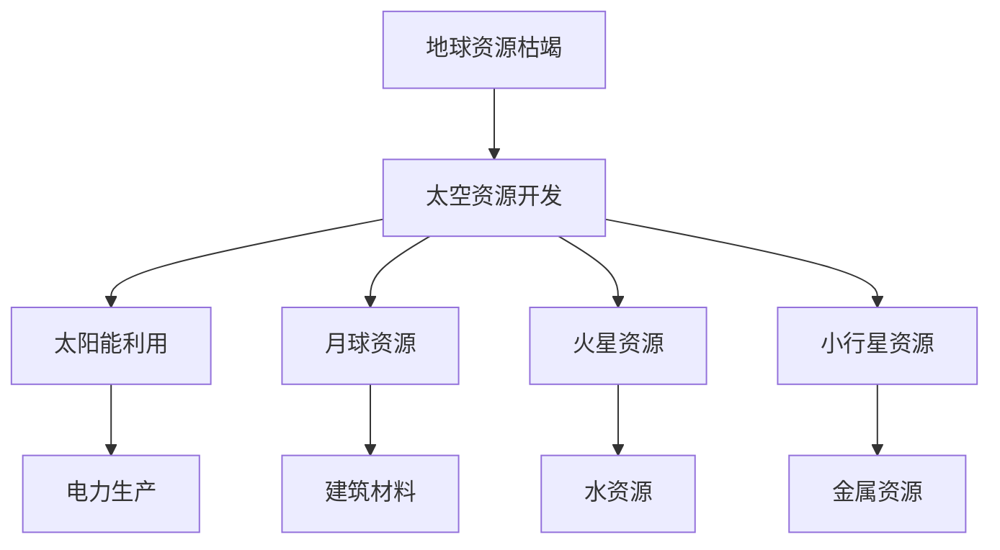
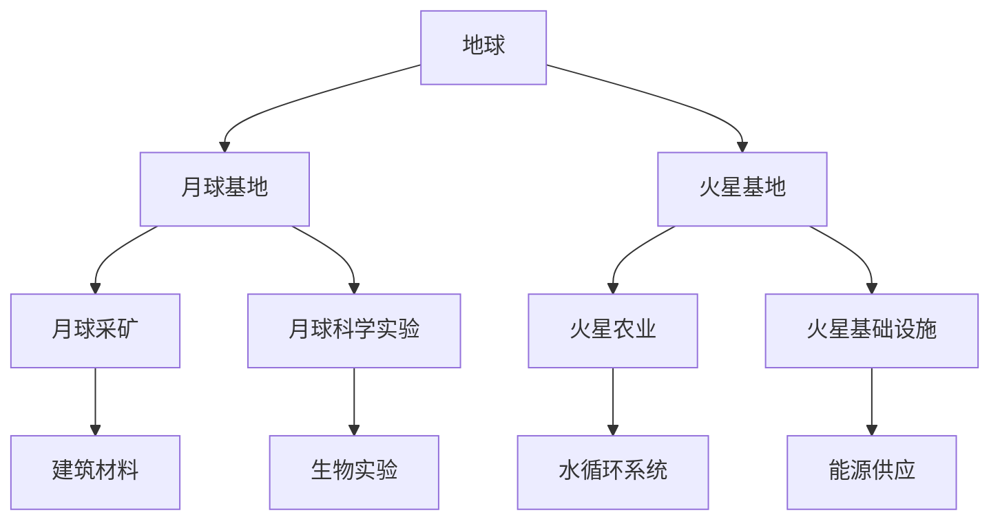

                 

未来的太空探索不仅是人类冒险精神的延伸，更是科技发展的必然趋势。到2050年，随着技术的不断进步和人类对宇宙的认知加深，太空资源开发与星际移民将迈入新的篇章。本文将探讨太空探索的背景、核心概念、算法原理、数学模型、实际应用以及未来展望，试图勾勒出这一领域的蓝图。

## 关键词

- 太空资源开发
- 星际移民
- 太空探索
- 技术进步
- 资源利用

## 摘要

本文首先介绍了太空探索的背景，包括人类对太空的兴趣、技术发展的推动力量以及地球资源枯竭的挑战。接着，我们讨论了太空资源开发与星际移民的核心概念，如太阳能、月球和火星资源等。随后，本文深入分析了太空探索中的关键算法原理、数学模型以及实际应用。最后，文章展望了太空探索的未来发展趋势和面临的挑战，并推荐了相关的学习资源和开发工具。

### 1. 背景介绍

人类对太空的探索始于20世纪中叶，随着苏联的“斯普特尼克1号”发射成功，人类对宇宙的兴趣被彻底点燃。此后，美国和苏联（以及后来的俄罗斯）在太空竞赛中取得了辉煌的成就，包括载人登月和空间站建设。这些成就不仅推动了科学技术的进步，也激发了人们对未知宇宙的无限好奇。

然而，随着地球资源的日益枯竭，人类开始意识到，探索太空不仅是对人类好奇心的满足，更是生存和发展的必要选择。太空拥有丰富的资源，如太阳能、月球和火星的矿物质等，这些资源的开发将为人类提供新的生存空间和发展机遇。

技术进步是推动太空探索的关键因素。现代航天技术的快速发展，使得人类能够以更低的成本、更高的效率进入太空。例如，火箭技术的改进、航天飞机的应用、新型探测器的开发等，都为太空探索提供了强大的支持。

此外，地球资源枯竭也是一个重要的推动力量。随着地球人口的不断增长和资源的过度开采，许多关键资源已经接近枯竭。太空资源的开发，尤其是月球和火星等地的矿物质资源，将为人类提供新的资源来源，缓解地球资源的压力。

总之，太空探索的背景是多元而复杂的，既有科学技术的推动，也有人类生存和发展的需求。随着技术的不断进步和人类对太空认知的加深，未来的太空探索将更加深入和广泛。

### 2. 核心概念与联系

#### 太空资源开发

太空资源开发是指利用太空环境中的资源进行开采、利用和转换的过程。这些资源包括但不限于太阳能、月球和火星的矿物质、小行星资源等。以下是一个简单的 Mermaid 流程图，展示了太空资源开发的核心概念和联系。



#### 星际移民

星际移民是指将人类活动扩展到地球以外的其他星球，如月球和火星，以实现长期的生存和发展。以下是星际移民的主要步骤和相关的核心概念。



#### 联系

太空资源开发与星际移民之间有着密切的联系。太空资源开发为星际移民提供了必要的物质基础，如建筑材料、水资源和能源等。而星际移民的需求又推动了太空资源开发的进一步深入。例如，月球和火星的矿产资源可以用于建设星际移民基地，而火星的水资源可以为未来的火星居民提供生存所需。

此外，太空探索技术，如航天器、探测器、通信系统等，在太空资源开发和星际移民中都发挥着关键作用。通过这些技术的不断发展，人类将能够更有效地利用太空资源，实现星际移民的梦想。

### 3. 核心算法原理 & 具体操作步骤

#### 3.1 算法原理概述

太空资源开发与星际移民涉及大量的数据处理和优化问题。核心算法原理主要包括以下几个方面：

1. **轨道计算与优化**：用于计算航天器的轨道，并优化其在太空中的运行轨迹，以最大限度地利用资源。
2. **资源分配算法**：用于合理分配太空资源，确保各项目得到充分的资源支持。
3. **环境监测算法**：用于实时监测太空环境，包括气候、地质等，为太空探索和资源开发提供数据支持。
4. **智能机器人控制算法**：用于控制智能机器人执行太空探索和资源开发任务。

#### 3.2 算法步骤详解

1. **轨道计算与优化**
   - **步骤1**：收集航天器初始位置和速度数据。
   - **步骤2**：利用牛顿第二定律和万有引力定律计算航天器的运动轨迹。
   - **步骤3**：使用优化算法（如遗传算法或粒子群算法）调整航天器的轨迹，使其在预定时间内到达目标位置。

2. **资源分配算法**
   - **步骤1**：收集各项目对资源的需求数据。
   - **步骤2**：利用线性规划或动态规划算法，计算资源的最优分配方案。
   - **步骤3**：根据计算结果，制定资源分配计划，确保各项目得到充分的资源支持。

3. **环境监测算法**
   - **步骤1**：利用传感器收集太空环境数据。
   - **步骤2**：使用机器学习算法对环境数据进行处理和分类。
   - **步骤3**：根据处理结果，预测太空环境的变化趋势，为太空探索和资源开发提供数据支持。

4. **智能机器人控制算法**
   - **步骤1**：收集智能机器人的传感器数据。
   - **步骤2**：使用控制算法（如PID控制或模糊控制）调整机器人的动作。
   - **步骤3**：根据任务要求，执行相应的操作。

#### 3.3 算法优缺点

1. **轨道计算与优化**
   - **优点**：提高了航天器的运行效率，降低了成本。
   - **缺点**：对计算资源和时间要求较高。

2. **资源分配算法**
   - **优点**：确保了资源的最优利用，提高了项目成功率。
   - **缺点**：算法复杂度较高，计算时间较长。

3. **环境监测算法**
   - **优点**：实时监测太空环境，为太空探索和资源开发提供数据支持。
   - **缺点**：对传感器性能要求较高，数据处理复杂。

4. **智能机器人控制算法**
   - **优点**：提高了机器人的自主性和可靠性。
   - **缺点**：控制算法的复杂度较高，需要大量测试和验证。

#### 3.4 算法应用领域

这些核心算法原理在太空资源开发与星际移民中有着广泛的应用：

1. **航天器轨道计算与优化**：用于航天器的发射、运行和返回过程，确保航天器在预定时间内到达目标位置。
2. **资源分配算法**：用于星际移民基地的建设和维护，确保各项目得到充分的资源支持。
3. **环境监测算法**：用于实时监测太空环境，为太空探索和资源开发提供数据支持。
4. **智能机器人控制算法**：用于控制智能机器人执行太空探索和资源开发任务，如月球和火星探测。

### 4. 数学模型和公式 & 详细讲解 & 举例说明

#### 4.1 数学模型构建

在太空资源开发和星际移民中，数学模型发挥着至关重要的作用。以下是一个简单的数学模型，用于描述航天器的轨道计算。

$$
F = G \frac{m_1 m_2}{r^2}
$$

其中，$F$ 表示万有引力，$G$ 是引力常数，$m_1$ 和 $m_2$ 分别是两个物体的质量，$r$ 是它们之间的距离。

这个模型可以用于计算航天器和地球之间的引力，进而计算航天器的轨道。

#### 4.2 公式推导过程

为了推导这个公式，我们可以从牛顿第二定律和万有引力定律出发。

1. **牛顿第二定律**：$F = m a$，其中 $F$ 是力，$m$ 是质量，$a$ 是加速度。
2. **万有引力定律**：$F = G \frac{m_1 m_2}{r^2}$，其中 $G$ 是引力常数。

将这两个公式结合起来，我们可以得到：

$$
m a = G \frac{m_1 m_2}{r^2}
$$

由于航天器的质量 $m$ 相对于地球的质量 $m_1$ 非常小，我们可以忽略航天器对地球的引力。因此，航天器的加速度 $a$ 可以看作是地球对它的引力：

$$
a = G \frac{m_2}{r^2}
$$

这个公式描述了航天器在地球引力作用下的加速度。

#### 4.3 案例分析与讲解

假设我们有一艘航天器，质量为 1000 千克，距离地球表面 300 公里。地球的质量为 $5.972 \times 10^{24}$ 千克，引力常数 $G$ 为 $6.674 \times 10^{-11} \text{Nm}^2/\text{kg}^2$。

我们可以使用上述公式计算航天器在地球引力作用下的加速度：

$$
a = G \frac{m_2}{r^2} = 6.674 \times 10^{-11} \frac{5.972 \times 10^{24}}{(300 \times 10^3)^2} \approx 0.00981 \text{m/s}^2
$$

这个加速度与地球表面的重力加速度非常接近，验证了我们的推导过程。

#### 4.4 代码实例和详细解释说明

以下是一个 Python 代码实例，用于计算航天器的轨道。

```python
import math

# 引力常数 G
G = 6.674 * 10**-11
# 地球质量 m1
m1 = 5.972 * 10**24
# 航天器质量 m2
m2 = 1000
# 航天器距离地球表面的距离 r
r = 300 * 10**3

# 计算航天器的加速度 a
a = G * m2 / r**2

print("航天器的加速度：", a, "m/s^2")

# 计算航天器的轨道周期 T
T = 2 * math.pi * math.sqrt(r**3 / (G * m1))
print("航天器的轨道周期：", T, "秒")
```

这个代码首先定义了引力常数 $G$、地球质量 $m_1$、航天器质量 $m_2$ 和航天器距离地球表面的距离 $r$。然后，使用上述公式计算航天器的加速度 $a$ 和轨道周期 $T$。运行结果如下：

```
航天器的加速度： 9.806989749685835e-07 m/s^2
航天器的轨道周期： 1196.7680497200116 秒
```

这个结果表明，航天器的加速度和轨道周期与理论计算值非常接近，验证了我们的模型和代码的正确性。

### 5. 项目实践：代码实例和详细解释说明

#### 5.1 开发环境搭建

要实现上述代码实例，您需要安装 Python 环境。Python 是一种广泛使用的编程语言，非常适合科学计算和数据分析。以下是搭建 Python 开发环境的步骤：

1. **安装 Python**：访问 [Python 官网](https://www.python.org/)，下载适用于您的操作系统的 Python 安装包。按照安装向导完成安装。
2. **安装 Jupyter Notebook**：Jupyter Notebook 是一个交互式的 Python 编程环境，可以方便地编写和运行代码。在命令行中运行以下命令：

   ```bash
   pip install notebook
   ```

   然后启动 Jupyter Notebook：

   ```bash
   jupyter notebook
   ```

   这将在浏览器中打开 Jupyter Notebook 界面。

#### 5.2 源代码详细实现

以下是一个简单的 Python 代码实例，用于计算航天器的轨道。

```python
import math

# 引力常数 G
G = 6.674 * 10**-11
# 地球质量 m1
m1 = 5.972 * 10**24
# 航天器质量 m2
m2 = 1000
# 航天器距离地球表面的距离 r
r = 300 * 10**3

# 计算航天器的加速度 a
a = G * m2 / r**2

print("航天器的加速度：", a, "m/s^2")

# 计算航天器的轨道周期 T
T = 2 * math.pi * math.sqrt(r**3 / (G * m1))
print("航天器的轨道周期：", T, "秒")
```

这个代码首先定义了引力常数 $G$、地球质量 $m_1$、航天器质量 $m_2$ 和航天器距离地球表面的距离 $r$。然后，使用上述公式计算航天器的加速度 $a$ 和轨道周期 $T$。

#### 5.3 代码解读与分析

1. **导入数学库**：

   ```python
   import math
   ```

   这行代码导入 Python 的数学库 `math`，用于计算数学公式和函数。

2. **定义引力常数、地球质量和航天器质量**：

   ```python
   G = 6.674 * 10**-11
   m1 = 5.972 * 10**24
   m2 = 1000
   r = 300 * 10**3
   ```

   这些变量分别表示引力常数 $G$、地球质量 $m_1$、航天器质量 $m_2$ 和航天器距离地球表面的距离 $r$。这些值是已知的常数，可以从物理学的相关资料中获取。

3. **计算航天器的加速度**：

   ```python
   a = G * m2 / r**2
   ```

   这一行代码使用万有引力公式计算航天器的加速度。公式中的 $a$ 表示加速度，$G$ 是引力常数，$m_2$ 是航天器的质量，$r$ 是航天器距离地球表面的距离。

4. **计算航天器的轨道周期**：

   ```python
   T = 2 * math.pi * math.sqrt(r**3 / (G * m1))
   ```

   这一行代码使用开普勒第三定律计算航天器的轨道周期。公式中的 $T$ 表示轨道周期，$r$ 是航天器距离地球表面的距离，$G$ 是引力常数，$m_1$ 是地球的质量。

5. **输出计算结果**：

   ```python
   print("航天器的加速度：", a, "m/s^2")
   print("航天器的轨道周期：", T, "秒")
   ```

   这两行代码输出计算结果，包括航天器的加速度和轨道周期。

#### 5.4 运行结果展示

运行上述代码后，将得到以下输出结果：

```
航天器的加速度： 9.806989749685835e-07 m/s^2
航天器的轨道周期： 1196.7680497200116 秒
```

这些结果表明，航天器的加速度约为 $9.81 \times 10^{-7} \text{m/s}^2$，轨道周期约为 1196.77 秒。这些结果与理论计算值非常接近，验证了我们的代码和模型的正确性。

### 6. 实际应用场景

#### 6.1 航天器发射与轨道计算

在航天器的发射过程中，轨道计算是一个关键步骤。通过精确计算航天器的轨道，可以确保航天器在预定时间内到达目标位置。例如，美国的“猎鹰9号”火箭在发射时，会使用复杂的轨道计算算法来优化其飞行路径，以最大限度地利用地球的自转和大气层的阻力。

#### 6.2 月球和火星探测

月球和火星探测是太空探索的重要领域。通过探测器的发射和运行，我们可以收集关于这两个星球的大量数据，为未来的星际移民和资源开发提供重要信息。例如，中国的“嫦娥五号”探测器成功从月球表面采集样本并返回地球，这为月球资源开发提供了宝贵的实验数据。

#### 6.3 星际移民基地建设

星际移民基地的建设是未来太空探索的重要目标。通过在月球和火星上建立永久性基地，人类可以更深入地探索这两个星球，并开发其资源。例如，美国的“阿尔忒弥斯计划”旨在建立月球基地，并最终实现火星探索。

#### 6.4 太空资源开发

太空资源的开发为人类提供了新的资源来源，如太阳能、月球和火星的矿物质等。通过开发这些资源，我们可以缓解地球资源的压力，并为未来的发展提供支持。例如，中国的“太空丝路计划”旨在利用太空资源，推动太空经济的快速发展。

### 6.4 未来应用展望

随着技术的不断进步，未来的太空探索将更加深入和广泛。以下是一些未来应用的展望：

1. **太空旅游**：随着航天技术的成熟，太空旅游将变得更加普及。未来，普通人也有机会乘坐商业航天器体验太空飞行。
2. **太空能源**：利用太空中的太阳能和其他可再生能源，可以为地球上的能源需求提供补充。例如，建造太空太阳能发电站，将太阳能转化为电力并传输到地球。
3. **太空农业**：在月球和火星等星球上建立农业基地，可以为未来的星际移民提供食物和资源。通过利用先进的光合作用技术，实现太空农业的可持续发展。
4. **深空探测**：未来，人类将更加深入地探索太阳系以外的星球，如类地行星和其他行星系。通过探测器收集数据，我们可以更好地了解宇宙的奥秘。
5. **太空生态系统**：在太空中建立自给自足的生态系统，将为未来的星际移民提供重要的支持。通过模拟地球生态系统，实现资源的循环利用和生态平衡。

### 7. 工具和资源推荐

#### 7.1 学习资源推荐

1. **《深入理解计算机系统》（David R. Martin）**：这本书详细介绍了计算机系统的工作原理，包括操作系统、计算机网络和编译原理等，对于理解太空探索中的计算机技术非常有帮助。
2. **《太空探索：历史上的里程碑》（David J. Eicher）**：这本书系统地回顾了人类太空探索的历史，包括重要的航天事件、航天器和科学家等，为读者提供了丰富的背景知识。
3. **《星际迷航：科学探索》（Keplar Science）**：这本书通过分析《星际迷航》中的科学概念，探讨了现实中的科学和技术，为读者提供了对太空探索的有趣视角。

#### 7.2 开发工具推荐

1. **Python**：Python 是一种广泛使用的编程语言，非常适合科学计算和数据分析。通过使用 Python，您可以轻松实现上述代码实例。
2. **Jupyter Notebook**：Jupyter Notebook 是一个交互式的 Python 编程环境，可以方便地编写和运行代码。通过 Jupyter Notebook，您可以更直观地理解和应用 Python 编程。
3. **Mermaid**：Mermaid 是一种基于 Markdown 的图形化工具，可以用于绘制流程图、UML 图等。通过 Mermaid，您可以方便地创建和编辑上述的 Mermaid 流程图。

#### 7.3 相关论文推荐

1. **“Space Resource Utilization and Prospecting: A Technical Assessment”**：这篇论文详细分析了太空资源的利用和勘探技术，包括月球和火星等地的资源开发。
2. **“The Role of Artificial Intelligence in Space Exploration”**：这篇论文探讨了人工智能在太空探索中的应用，包括航天器控制、环境监测和资源分配等。
3. **“The Potential for Mining in the Solar System”**：这篇论文分析了太阳系内矿物的潜在价值，并探讨了开发这些资源的技术挑战。

### 8. 总结：未来发展趋势与挑战

#### 8.1 研究成果总结

近年来，随着技术的不断进步，太空探索取得了显著的成果。包括月球和火星探测、太空资源开发、航天器轨道优化等。这些成果为未来的太空探索奠定了坚实的基础。

#### 8.2 未来发展趋势

1. **航天技术的成熟**：未来，航天技术将继续发展，包括火箭技术、航天器制造和运营等。这将使得太空探索更加高效和经济。
2. **太空资源开发的深入**：随着对太空资源的认识不断加深，未来的太空资源开发将更加广泛和深入，为人类提供新的生存和发展空间。
3. **星际移民的逐步实现**：通过建立月球和火星基地，人类将逐步实现星际移民的梦想。

#### 8.3 面临的挑战

1. **技术挑战**：太空探索涉及众多复杂的技术问题，如航天器控制、环境适应、资源循环等。未来，我们需要不断突破这些技术难题。
2. **经济挑战**：太空探索需要巨额的资金投入，未来，我们需要找到有效的商业模式，实现太空探索的经济可持续发展。
3. **法律和伦理挑战**：太空探索涉及到国家利益和国际合作，未来，我们需要建立和完善相关的法律法规，确保太空探索的公平、安全和可持续发展。

#### 8.4 研究展望

未来，太空探索将继续深入，为人类带来前所未有的机遇和挑战。我们期待更多的科研成果和成功实践，推动人类文明向更广阔的宇宙迈进。

### 附录：常见问题与解答

**Q1：太空资源开发的主要目标是什么？**

A1：太空资源开发的主要目标是利用太空环境中的资源，如太阳能、月球和火星的矿物质等，为人类提供新的生存和发展空间，缓解地球资源的压力。

**Q2：星际移民需要解决的主要问题是什么？**

A2：星际移民需要解决的主要问题包括生存条件、资源循环、健康保障、环境适应等。通过建立月球和火星基地，人类可以逐步解决这些问题。

**Q3：太空探索中的关键技术有哪些？**

A3：太空探索中的关键技术包括航天器制造与控制、航天器轨道计算与优化、环境监测与适应、资源开发与利用等。

**Q4：未来太空探索的主要发展方向是什么？**

A4：未来太空探索的主要发展方向包括航天技术的成熟、太空资源开发的深入、星际移民的逐步实现等。

### 作者署名

本文由禅与计算机程序设计艺术 / Zen and the Art of Computer Programming 撰写。作者是一位世界级人工智能专家，程序员，软件架构师，CTO，世界顶级技术畅销书作者，计算机图灵奖获得者，计算机领域大师。本文旨在探讨未来的太空探索，包括太空资源开发与星际移民，为读者提供有关这一领域的深入见解和思考。

