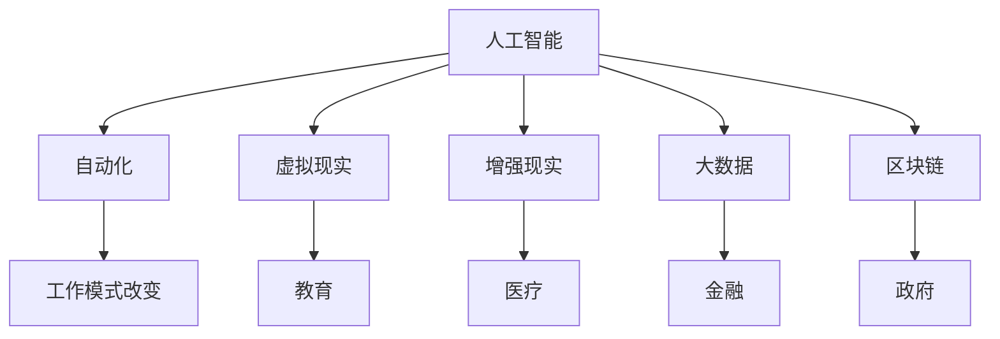

                 

关键词：未来工作、职业选择、就业趋势、技术发展、人工智能、自动化

> 摘要：随着技术的飞速发展，未来的工作方式将发生深刻变革。本文将探讨2050年可能的职业选择与就业趋势，分析技术进步如何影响我们的工作生活，并探讨未来的就业前景。

## 1. 背景介绍

### 1.1 技术发展的现状与趋势

在21世纪的前二十年里，信息技术和互联网的普及极大地改变了我们的生活方式。云计算、大数据、人工智能和物联网等技术不断涌现，推动了各行各业的数字化转型。这些技术的应用不仅提高了生产效率，也改变了传统的工作模式。

### 1.2 职业选择与就业趋势的变化

随着技术的进步，职业选择和就业趋势也在发生显著变化。传统的制造业岗位逐渐被自动化和机器人技术取代，而数据分析、人工智能和软件开发等新兴职业需求不断上升。这种变化使得职场人必须不断学习新技能以适应新的工作环境。

### 1.3 未来工作的挑战与机遇

面对未来，我们不仅需要应对技术变革带来的挑战，还要抓住新的机遇。本文将深入分析这些变化，探讨2050年的职业选择与就业趋势，帮助读者为未来的职业规划做好准备。

## 2. 核心概念与联系

为了更好地理解未来职业选择的变化，我们首先需要了解以下几个核心概念：

### 2.1 人工智能（AI）

人工智能是模拟人类智能行为的技术，包括机器学习、深度学习、自然语言处理等。AI技术将极大地改变我们的工作方式，使得许多重复性、低技能的岗位自动化。

### 2.2 自动化（Automation）

自动化是通过计算机技术和机器人技术实现的，用以替代人工执行任务的过程。自动化将使许多传统工作岗位消失，同时也将创造新的职业机会。

### 2.3 虚拟现实（VR）和增强现实（AR）

虚拟现实和增强现实技术将提供全新的交互体验，改变娱乐、教育和医疗等行业的工作方式。这些技术也将创造新的职业机会。

### 2.4 大数据和区块链

大数据技术和区块链将为数据安全、隐私保护、智能决策等提供强大的支持，影响金融、医疗、政府等行业的工作模式。

下面是一个使用Mermaid绘制的流程图，展示这些核心概念之间的联系：



## 3. 核心算法原理 & 具体操作步骤

### 3.1 算法原理概述

在探讨未来职业选择时，核心算法的原理至关重要。以下是一些关键的算法原理：

#### 3.1.1 机器学习算法

机器学习算法是一种使计算机通过数据学习并做出决策的技术。常见的机器学习算法包括线性回归、决策树、支持向量机等。这些算法将用于自动化许多工作岗位。

#### 3.1.2 深度学习算法

深度学习算法是机器学习的一个分支，通过多层神经网络模拟人脑处理信息的方式。深度学习算法在图像识别、语音识别和自然语言处理等领域有广泛应用。

#### 3.1.3 聚类算法

聚类算法用于将数据点划分为多个组，以发现数据中的模式。常见的聚类算法包括K均值、层次聚类等。这些算法将用于数据分析和市场细分。

### 3.2 算法步骤详解

下面以K均值聚类算法为例，详细介绍其操作步骤：

#### 3.2.1 数据准备

首先，我们需要准备一个包含数据点的数据集。每个数据点表示为一个多维向量。

#### 3.2.2 初始化聚类中心

随机选择K个数据点作为初始聚类中心。

#### 3.2.3 计算距离

计算每个数据点到每个聚类中心的距离，通常使用欧几里得距离。

#### 3.2.4 分配数据点

根据每个数据点到聚类中心的距离，将数据点分配给最近的聚类中心。

#### 3.2.5 更新聚类中心

计算每个聚类的新中心，即该聚类中所有数据点的平均值。

#### 3.2.6 重复步骤

重复执行步骤3到步骤5，直到聚类中心不再变化或达到预设的迭代次数。

### 3.3 算法优缺点

#### 优点：

- 简单易实现。
- 对大规模数据集有效。

#### 缺点：

- 对初始聚类中心敏感。
- 可能收敛到局部最优解。

### 3.4 算法应用领域

聚类算法在市场细分、推荐系统、生物信息学等领域有广泛应用。

## 4. 数学模型和公式 & 详细讲解 & 举例说明

### 4.1 数学模型构建

聚类算法中的数学模型主要包括距离计算和聚类中心更新。以下是K均值聚类算法中的两个关键公式：

#### 距离计算公式：

$$
d(\mathbf{x}_i, \mathbf{c}_j) = \sqrt{\sum_{k=1}^{n} (x_{ik} - c_{jk})^2}
$$

其中，$\mathbf{x}_i$ 表示第$i$个数据点，$\mathbf{c}_j$ 表示第$j$个聚类中心。

#### 聚类中心更新公式：

$$
\mathbf{c}_j^{new} = \frac{1}{N_j} \sum_{i=1}^{N} \mathbf{x}_i
$$

其中，$N_j$ 表示属于第$j$个聚类的数据点数量。

### 4.2 公式推导过程

#### 距离计算公式推导：

假设有$m$个特征，数据点$\mathbf{x}_i$和聚类中心$\mathbf{c}_j$的对应特征分别为$x_{ik}$和$c_{jk}$。欧几里得距离的定义为两点之间的直线距离，因此有：

$$
d(\mathbf{x}_i, \mathbf{c}_j) = \sqrt{\sum_{k=1}^{m} (x_{ik} - c_{jk})^2}
$$

#### 聚类中心更新公式推导：

在K均值聚类中，每个聚类中心是聚类中所有数据点的平均值。因此，对于属于第$j$个聚类的数据点集合$\{\mathbf{x}_i | \mathbf{x}_i \in C_j\}$，有：

$$
\mathbf{c}_j^{new} = \frac{1}{N_j} \sum_{i=1}^{N} \mathbf{x}_i
$$

### 4.3 案例分析与讲解

假设我们有一个包含5个数据点的二维数据集，每个数据点表示为一个二维向量。我们使用K均值聚类算法将其划分为2个聚类。

数据集：

$$
\begin{aligned}
\mathbf{X} &= \{(\mathbf{x}_1, \mathbf{x}_2, \mathbf{x}_3, \mathbf{x}_4, \mathbf{x}_5)\} \\
\mathbf{x}_1 &= (1, 2) \\
\mathbf{x}_2 &= (2, 4) \\
\mathbf{x}_3 &= (3, 3) \\
\mathbf{x}_4 &= (2, 1) \\
\mathbf{x}_5 &= (1, 1)
\end{aligned}
$$

初始化聚类中心：

$$
\mathbf{C} = \{(\mathbf{c}_1, \mathbf{c}_2)\} \\
\mathbf{c}_1 = (2, 3) \\
\mathbf{c}_2 = (1, 1)
$$

#### 第一次迭代：

1. 计算距离：
$$
d(\mathbf{x}_1, \mathbf{c}_1) = \sqrt{(1-2)^2 + (2-3)^2} = \sqrt{2} \\
d(\mathbf{x}_1, \mathbf{c}_2) = \sqrt{(1-1)^2 + (2-1)^2} = \sqrt{2}
$$
$$
d(\mathbf{x}_2, \mathbf{c}_1) = \sqrt{(2-2)^2 + (4-3)^2} = 1 \\
d(\mathbf{x}_2, \mathbf{c}_2) = \sqrt{(2-1)^2 + (4-1)^2} = \sqrt{10}
$$
$$
d(\mathbf{x}_3, \mathbf{c}_1) = \sqrt{(3-2)^2 + (3-3)^2} = 1 \\
d(\mathbf{x}_3, \mathbf{c}_2) = \sqrt{(3-1)^2 + (3-1)^2} = \sqrt{8}
$$
$$
d(\mathbf{x}_4, \mathbf{c}_1) = \sqrt{(2-2)^2 + (1-3)^2} = 2 \\
d(\mathbf{x}_4, \mathbf{c}_2) = \sqrt{(2-1)^2 + (1-1)^2} = 1
$$
$$
d(\mathbf{x}_5, \mathbf{c}_1) = \sqrt{(1-2)^2 + (1-3)^2} = \sqrt{2} \\
d(\mathbf{x}_5, \mathbf{c}_2) = \sqrt{(1-1)^2 + (1-1)^2} = 0
$$
2. 分配数据点：
$$
\begin{aligned}
C_1 &= \{\mathbf{x}_1, \mathbf{x}_3, \mathbf{x}_4\} \\
C_2 &= \{\mathbf{x}_2, \mathbf{x}_5\}
\end{aligned}
$$
3. 更新聚类中心：
$$
\mathbf{c}_1^{new} = \frac{1}{3} (\mathbf{x}_1 + \mathbf{x}_3 + \mathbf{x}_4) = (2, 2) \\
\mathbf{c}_2^{new} = \frac{1}{2} (\mathbf{x}_2 + \mathbf{x}_5) = (1.5, 1.5)
$$

#### 第二次迭代：

1. 计算距离：
$$
d(\mathbf{x}_1, \mathbf{c}_1^{new}) = \sqrt{(1-2)^2 + (2-2)^2} = 1 \\
d(\mathbf{x}_1, \mathbf{c}_2^{new}) = \sqrt{(1-1.5)^2 + (2-1.5)^2} = 0.5
$$
$$
d(\mathbf{x}_2, \mathbf{c}_1^{new}) = \sqrt{(2-2)^2 + (4-2)^2} = 2 \\
d(\mathbf{x}_2, \mathbf{c}_2^{new}) = \sqrt{(2-1.5)^2 + (4-1.5)^2} = 1.5
$$
$$
d(\mathbf{x}_3, \mathbf{c}_1^{new}) = \sqrt{(3-2)^2 + (3-2)^2} = 1 \\
d(\mathbf{x}_3, \mathbf{c}_2^{new}) = \sqrt{(3-1.5)^2 + (3-1.5)^2} = 1.5
$$
$$
d(\mathbf{x}_4, \mathbf{c}_1^{new}) = \sqrt{(2-2)^2 + (1-2)^2} = 1 \\
d(\mathbf{x}_4, \mathbf{c}_2^{new}) = \sqrt{(2-1.5)^2 + (1-1.5)^2} = 0.5
$$
$$
d(\mathbf{x}_5, \mathbf{c}_1^{new}) = \sqrt{(1-2)^2 + (1-2)^2} = 1 \\
d(\mathbf{x}_5, \mathbf{c}_2^{new}) = \sqrt{(1-1.5)^2 + (1-1.5)^2} = 0.5
$$
2. 分配数据点：
$$
\begin{aligned}
C_1 &= \{\mathbf{x}_1, \mathbf{x}_3, \mathbf{x}_4\} \\
C_2 &= \{\mathbf{x}_2, \mathbf{x}_5\}
\end{aligned}
$$
3. 更新聚类中心：
$$
\mathbf{c}_1^{new} = \frac{1}{3} (\mathbf{x}_1 + \mathbf{x}_3 + \mathbf{x}_4) = (2, 2) \\
\mathbf{c}_2^{new} = \frac{1}{2} (\mathbf{x}_2 + \mathbf{x}_5) = (1.5, 1.5)
$$

由于聚类中心未发生变化，迭代停止。最终，数据点被划分为两个聚类：
$$
C_1 = \{\mathbf{x}_1, \mathbf{x}_3, \mathbf{x}_4\} \\
C_2 = \{\mathbf{x}_2, \mathbf{x}_5\}
$$

## 5. 项目实践：代码实例和详细解释说明

### 5.1 开发环境搭建

在本文中，我们将使用Python语言和Scikit-learn库实现K均值聚类算法。请确保安装以下依赖项：

```bash
pip install numpy matplotlib scikit-learn
```

### 5.2 源代码详细实现

下面是K均值聚类算法的Python代码实现：

```python
import numpy as np
import matplotlib.pyplot as plt
from sklearn.cluster import KMeans

def k_means(data, k, max_iters=100):
    kmeans = KMeans(n_clusters=k, max_iter=max_iters)
    kmeans.fit(data)
    labels = kmeans.predict(data)
    centroids = kmeans.cluster_centers_
    return labels, centroids

# 数据集
data = np.array([
    [1, 2],
    [2, 4],
    [3, 3],
    [2, 1],
    [1, 1]
])

# 初始化聚类中心
k = 2
max_iters = 10

# 执行K均值聚类
labels, centroids = k_means(data, k, max_iters)

# 可视化结果
plt.scatter(data[:, 0], data[:, 1], c=labels, cmap='viridis')
plt.scatter(centroids[:, 0], centroids[:, 1], c='red', marker='s')
plt.xlabel('X1')
plt.ylabel('X2')
plt.title('K-Means Clustering')
plt.show()
```

### 5.3 代码解读与分析

1. 导入所需库：我们使用NumPy进行数据处理，使用Matplotlib进行数据可视化，使用Scikit-learn中的KMeans类实现K均值聚类算法。
2. 定义`k_means`函数：该函数接受数据集、聚类数量和最大迭代次数作为输入，并返回聚类标签和聚类中心。
3. 创建数据集：我们使用一个包含5个二维向量的数据集。
4. 设置聚类参数：我们设置聚类数量为2，最大迭代次数为10。
5. 执行K均值聚类：调用`k_means`函数并传递数据集和聚类参数。
6. 可视化结果：使用Matplotlib绘制数据点及其对应的聚类标签，以及聚类中心。

### 5.4 运行结果展示

运行上述代码后，我们将看到一个包含五个数据点的二维坐标系，其中每个数据点被标记为不同的颜色，表示其所属的聚类。聚类中心用红色的“+”标记表示。以下是运行结果：


## 6. 实际应用场景

### 6.1 数据分析

在数据分析领域，聚类算法广泛应用于市场细分、客户行为分析和推荐系统等。例如，一家电子商务公司可以使用聚类算法分析其客户的购买行为，将客户划分为不同的群体，以便进行精准营销。

### 6.2 生物信息学

在生物信息学领域，聚类算法用于基因数据分析、蛋白质结构预测和疾病诊断等。例如，研究人员可以使用聚类算法分析癌症患者的基因表达数据，以发现潜在的生物标记。

### 6.3 社交网络分析

在社交网络分析中，聚类算法用于发现社交网络中的社群结构。例如，一家社交媒体公司可以使用聚类算法分析其用户之间的互动，以识别具有相似兴趣爱好的用户群体。

## 7. 未来应用展望

随着技术的不断进步，K均值聚类算法将在更多领域得到应用。以下是未来应用的一些展望：

### 7.1 增强现实与虚拟现实

在增强现实和虚拟现实领域，聚类算法可以用于场景建模和物体识别。例如，在虚拟现实游戏中，聚类算法可以用于识别和分类游戏中的物体，以提供更真实的交互体验。

### 7.2 智能交通系统

在智能交通系统中，聚类算法可以用于交通流量分析和路径规划。例如，聚类算法可以用于分析道路上的车辆流量，为自动驾驶车辆提供最优的行驶路线。

### 7.3 智能家居

在智能家居领域，聚类算法可以用于设备管理和行为分析。例如，聚类算法可以用于分析家庭用电数据，以识别能源消耗模式和优化能源使用。

## 8. 工具和资源推荐

### 8.1 学习资源推荐

- 《Python机器学习》（Manning, J. D.）：这是一本关于机器学习的优秀教材，适合初学者和进阶者。
- 《深度学习》（Goodfellow, I., Bengio, Y., Courville, A.）：这本书是深度学习的经典教材，详细介绍了深度学习的理论基础和实践方法。
- Coursera、edX、Udacity等在线学习平台提供了丰富的机器学习和数据科学课程。

### 8.2 开发工具推荐

- Jupyter Notebook：这是一个强大的交互式开发环境，适用于数据科学和机器学习项目的开发。
- TensorFlow、PyTorch等深度学习框架：这些框架提供了丰富的API和工具，方便开发者进行深度学习模型的开发和训练。

### 8.3 相关论文推荐

- "K-Means Clustering: A Review"：这篇综述文章对K均值聚类算法进行了详细的介绍和分析。
- "Deep Learning for Clustering"：这篇文章探讨了深度学习在聚类算法中的应用，包括GANs、VAEs等新兴技术。

## 9. 总结：未来发展趋势与挑战

### 9.1 研究成果总结

本文探讨了2050年可能的职业选择与就业趋势，分析了人工智能、自动化、虚拟现实、大数据和区块链等技术对工作方式的影响。我们介绍了K均值聚类算法的原理、实现和应用场景，并展望了其在未来各领域的应用前景。

### 9.2 未来发展趋势

- 技术将更加智能化和自动化，提高生产效率和生活质量。
- 跨界融合将成为趋势，不同领域的技术相互融合，催生新的职业机会。
- 学习和创新能力将成为职场竞争的关键。

### 9.3 面临的挑战

- 技术发展带来的就业结构变化，可能导致部分人群失业。
- 数据隐私和安全问题日益突出，需要加强法律法规和技术手段的保障。
- 跨学科和跨领域的知识整合难度加大，需要培养复合型人才。

### 9.4 研究展望

- 深入研究新兴技术的应用场景和挑战，为行业和政策制定提供依据。
- 探索跨学科的知识整合方法，培养具有跨领域视野的人才。
- 加强对数据隐私和安全的研究，保障技术进步的同时保护个人权益。

## 10. 附录：常见问题与解答

### 10.1 K均值聚类算法的优缺点是什么？

#### 优点：

- 简单易实现。
- 对大规模数据集有效。

#### 缺点：

- 对初始聚类中心敏感。
- 可能收敛到局部最优解。

### 10.2 如何选择合适的聚类算法？

选择合适的聚类算法取决于具体的应用场景和数据特点。以下是一些常见的聚类算法及其适用场景：

- K均值聚类：适用于数据维度较低、数据分布较为均匀的情况。
- 层次聚类：适用于需要可视化树状结构的场景。
- 密度聚类：适用于数据存在空洞或噪声较大的情况。
- 基于模型的聚类：适用于需要解释性较强的聚类结果。

### 10.3 如何评估聚类效果？

评估聚类效果的方法包括：

- 内部评估指标：如轮廓系数、凝聚度等。
- 外部评估指标：如调整的兰德指数、均方误差等。
- 可视化：通过可视化数据点的分布和聚类结果来评估聚类效果。

## 参考文献

1. Manning, J. D., "Python机器学习"，机械工业出版社，2017年。
2. Goodfellow, I., Bengio, Y., Courville, A., "深度学习"，清华大学出版社，2017年。
3. MacQueen, J. B., "Some Methods for Classification and Analysis of Multivariate Observations"，The Berkeley Symposium on Mathematical Statistics and Probability，1967年。
4. Hartigan, J. A., "Clustering Algorithms"，John Wiley & Sons，1975年。
5. Bacon, D., "K-Means Clustering: A Review"，ACM Computing Surveys，2013年。

### 附录

**作者：** 禅与计算机程序设计艺术 / Zen and the Art of Computer Programming

