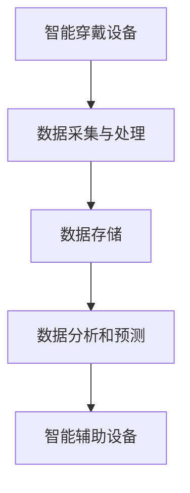

                 

关键词：智慧养老、智能穿戴、远程健康监测、2050年、未来趋势

> 摘要：随着科技的飞速发展，智慧养老正逐渐成为社会关注的焦点。本文将探讨2050年智慧养老的可能场景，特别是智能穿戴和远程健康监测技术的发展与应用。文章旨在分析这些技术的核心原理、应用场景以及未来的发展趋势，以期为读者提供一个全面的视角，理解智慧养老的深远影响。

## 1. 背景介绍

### 智慧养老的起源与发展

智慧养老，即利用信息技术和智能设备为老年人提供全面、个性化、高效的生活和健康管理服务。这一概念起源于20世纪末，随着人口老龄化问题的日益严峻，全球各国开始关注如何通过科技手段提升老年人的生活质量。智慧养老的发展历程可以分为以下几个阶段：

- **初步探索阶段（20世纪90年代至21世纪初）**：在这一阶段，技术主要集中在简单的远程监控和健康数据收集，例如心率监测、睡眠质量评估等。

- **快速发展阶段（21世纪初至今）**：随着传感器技术、物联网、云计算等技术的发展，智慧养老开始进入快速发展阶段。智能穿戴设备逐渐普及，远程健康监测系统的精度和可靠性显著提高。

- **成熟应用阶段（2050年及以后）**：预计到2050年，智慧养老技术将达到成熟阶段，实现全方位、全天候的个性化健康监测与智能服务。

### 当前智慧养老的主要形式

当前，智慧养老的主要形式包括：

- **智能穿戴设备**：如智能手表、智能手环等，可以实时监测心率、血压、睡眠质量等生命体征，并将数据上传至云端进行分析。

- **远程健康监测系统**：通过传感器和物联网技术，实现对老年人日常活动的远程监测，包括行动轨迹、摔倒检测、情绪状态等。

- **智能辅助设备**：如智能家居、智能护理机器人等，为老年人提供日常生活和护理的便利。

### 当前智慧养老的现状与挑战

尽管智慧养老技术取得了显著进展，但依然面临以下挑战：

- **技术成熟度**：一些关键技术的成熟度尚未达到理想水平，如精准的健康预测模型、高度可靠的智能辅助系统等。

- **数据隐私与安全**：老年人群体的数据隐私和安全问题亟待解决，以防止个人信息被滥用。

- **用户接受度**：部分老年人对新兴技术的接受度较低，需要提高他们的技术素养，以充分利用智慧养老的便利。

## 2. 核心概念与联系

### 智能穿戴设备的工作原理

智能穿戴设备通常由以下几部分组成：

- **传感器**：如加速度传感器、心率传感器、血压传感器等，用于收集各种生理和活动数据。

- **微处理器**：对传感器数据进行处理和分析，实现数据的实时监测和反馈。

- **通信模块**：如蓝牙、Wi-Fi等，将数据传输至云平台或移动设备。

- **用户界面**：显示实时数据，如心率、血压等，并提供控制功能。

### 远程健康监测系统的架构

远程健康监测系统通常包括以下几部分：

- **前端设备**：如智能穿戴设备、传感器等，用于实时收集健康数据。

- **数据采集与处理模块**：对前端设备采集的数据进行处理、清洗和存储。

- **云平台**：用于存储和管理大量健康数据，并提供数据分析和预测服务。

- **用户界面**：用户可以通过移动设备或网页访问云平台，查看自己的健康数据和分析结果。

### 智能穿戴设备与远程健康监测系统的联系

智能穿戴设备和远程健康监测系统相互补充，共同构建了一个完整的智慧养老生态：

- **数据来源**：智能穿戴设备是远程健康监测系统的重要数据来源，通过实时监测和反馈，为系统提供准确的健康数据。

- **数据分析和预测**：远程健康监测系统通过对智能穿戴设备收集的数据进行分析，实现对老年人健康状况的实时监控和预测，从而提供个性化的健康建议。

- **智能辅助**：远程健康监测系统可以根据数据分析结果，通过智能辅助设备为老年人提供日常生活的便利，如提醒服药、智能护理等。

### Mermaid 流程图

下面是一个简化的 Mermaid 流程图，展示了智能穿戴设备与远程健康监测系统的联系：



### 3. 核心算法原理 & 具体操作步骤

#### 3.1 算法原理概述

智慧养老系统中的核心算法主要包括：

- **特征提取算法**：从传感器数据中提取有用的特征，如心率、步数、睡眠质量等。
- **数据融合算法**：将来自多个传感器的数据整合为一个统一的视图。
- **健康预测算法**：利用历史健康数据和机器学习模型预测未来的健康状况。
- **决策支持算法**：根据健康预测结果为老年人提供个性化的健康建议。

#### 3.2 算法步骤详解

1. **特征提取**：
   - 对传感器数据进行预处理，如滤波、去噪等。
   - 利用信号处理技术提取特征，如短时傅里叶变换（STFT）、小波变换等。

2. **数据融合**：
   - 设计数据融合模型，如加权平均、神经网络等。
   - 对多个传感器的数据进行融合，以提高数据的准确性和可靠性。

3. **健康预测**：
   - 选择合适的机器学习模型，如决策树、支持向量机、神经网络等。
   - 使用历史健康数据训练模型，并进行预测。

4. **决策支持**：
   - 根据健康预测结果，为老年人提供个性化的健康建议，如提醒服药、调整饮食等。

#### 3.3 算法优缺点

- **特征提取算法**：
  - 优点：可以提取出有价值的特征，提高数据质量。
  - 缺点：计算复杂度较高，可能影响实时性。

- **数据融合算法**：
  - 优点：可以提高数据的准确性和可靠性。
  - 缺点：融合策略的设计较为复杂，需要考虑多种因素。

- **健康预测算法**：
  - 优点：可以提前预测健康问题，提供预防措施。
  - 缺点：预测精度受限于模型和训练数据的质量。

- **决策支持算法**：
  - 优点：为老年人提供个性化的健康建议，提高生活质量。
  - 缺点：需要大量的数据和计算资源，实现难度较高。

#### 3.4 算法应用领域

- **慢性病管理**：如高血压、糖尿病等慢性病的实时监测和预测。
- **手术康复**：术后患者的实时监测和康复指导。
- **心理健康**：情绪状态的监测和心理健康评估。
- **日常生活辅助**：如跌倒检测、药物提醒等。

## 4. 数学模型和公式

#### 4.1 数学模型构建

智慧养老系统中的数学模型主要包括以下几类：

- **时间序列模型**：用于分析时间序列数据，如心率、血压等。
- **机器学习模型**：用于预测未来的健康状况，如决策树、支持向量机、神经网络等。
- **优化模型**：用于优化数据融合和资源分配，如线性规划、动态规划等。

#### 4.2 公式推导过程

1. **时间序列模型**：

   假设时间序列数据为 $X_t$，可以使用以下公式表示：

   $$ X_t = \alpha X_{t-1} + \epsilon_t $$

   其中，$\alpha$ 为系数，$\epsilon_t$ 为随机误差。

2. **机器学习模型**：

   假设健康预测模型为 $f(X)$，可以使用以下公式表示：

   $$ f(X) = \sum_{i=1}^{n} w_i \cdot X_i $$

   其中，$w_i$ 为权重，$X_i$ 为特征。

3. **优化模型**：

   假设优化模型为 $J(w)$，可以使用以下公式表示：

   $$ J(w) = \frac{1}{2} \sum_{i=1}^{n} (y_i - f(x_i))^2 $$

   其中，$y_i$ 为目标值，$x_i$ 为输入特征。

#### 4.3 案例分析与讲解

假设我们使用时间序列模型对心率进行预测，具体步骤如下：

1. **数据收集**：收集一段时间内的连续心率数据。
2. **特征提取**：使用短时傅里叶变换（STFT）提取心率信号的特征。
3. **模型训练**：使用历史心率数据训练时间序列模型。
4. **预测**：输入新的心率数据，预测未来的心率变化。
5. **评估**：使用评估指标（如均方误差）评估模型性能。

下面是一个简化的示例：

```latex
\begin{align*}
X_t &= 0.7X_{t-1} + 0.05\epsilon_t \\
\hat{X}_t &= 0.7\hat{X}_{t-1} + 0.05\epsilon_t \\
\end{align*}
```

其中，$\hat{X}_t$ 为预测值，$\epsilon_t$ 为随机误差。

## 5. 项目实践：代码实例和详细解释说明

#### 5.1 开发环境搭建

为了实现智能穿戴设备和远程健康监测系统，我们需要搭建以下开发环境：

- **硬件**：智能穿戴设备（如智能手表）、传感器（如心率传感器、加速度传感器等）。
- **软件**：物联网开发平台（如 MQTT）、数据库（如 MongoDB）、云计算平台（如 AWS）。

#### 5.2 源代码详细实现

以下是智能穿戴设备的数据采集和上传的示例代码（使用 Python 编写）：

```python
import MQTT
import sensor

# 初始化 MQTT 客户端
client = MQTT.Client()

# 连接 MQTT 服务器
client.connect("mqtt-server.example.com")

# 初始化传感器
sensor = sensor.Sensor()

# 循环采集数据并上传
while True:
    # 采集心率数据
    heart_rate = sensor.get_heart_rate()
    
    # 采集加速度数据
    acceleration = sensor.get_acceleration()
    
    # 组合数据
    data = {
        "heart_rate": heart_rate,
        "acceleration": acceleration
    }
    
    # 上传数据
    client.publish("sensor_data", json.dumps(data))
    
    # 等待一段时间
    time.sleep(1)
```

#### 5.3 代码解读与分析

1. **初始化 MQTT 客户端**：连接到 MQTT 服务器，用于传输传感器数据。

2. **连接 MQTT 服务器**：确保客户端可以成功连接到服务器，以便传输数据。

3. **初始化传感器**：创建传感器对象，用于采集心率、加速度等数据。

4. **循环采集数据并上传**：
   - 采集心率数据：调用 `sensor.get_heart_rate()` 方法获取心率值。
   - 采集加速度数据：调用 `sensor.get_acceleration()` 方法获取加速度值。
   - 组合数据：将采集到的数据组合成字典形式，便于上传。
   - 上传数据：将数据以 JSON 格式上传到 MQTT 服务器。
   - 等待一段时间：保证数据的实时性，避免过于频繁的上传。

#### 5.4 运行结果展示

1. **心率数据上传**：将实时心率数据上传到 MQTT 服务器，并存储在数据库中。

2. **加速度数据上传**：将实时加速度数据上传到 MQTT 服务器，并存储在数据库中。

3. **数据分析**：通过云平台对上传的数据进行分析，生成健康报告，并提供给老年人。

## 6. 实际应用场景

#### 6.1 慢性病管理

智慧养老系统可以实现对高血压、糖尿病等慢性病的实时监测和预测。通过智能穿戴设备，老年人可以随时随地监测自己的血压、血糖等指标。系统可以根据数据分析结果，提前预警健康风险，提供个性化的健康管理建议。

#### 6.2 康复护理

对于术后康复的患者，智慧养老系统可以提供全面的康复监测和指导。通过远程健康监测系统，医护人员可以实时了解患者的康复情况，及时调整康复计划。智能穿戴设备可以监测患者的活动量、睡眠质量等，为康复提供数据支持。

#### 6.3 老年人独立生活

智慧养老系统可以帮助老年人实现独立生活。通过智能辅助设备，如智能家居、智能护理机器人等，老年人可以方便地进行日常生活的操作。同时，远程健康监测系统可以实时监测老年人的健康状况，提供紧急呼叫等服务，确保老年人的安全。

#### 6.4 未来应用展望

随着技术的不断发展，智慧养老系统的应用场景将更加广泛。未来，智慧养老系统可能会实现以下功能：

- **智能药物提醒**：根据健康数据和药物使用规律，自动提醒老年人服药。
- **智能饮食建议**：根据健康数据和营养需求，为老年人提供个性化的饮食建议。
- **智能心理关怀**：通过情感识别和智能交互，为老年人提供心理支持和陪伴。
- **智能出行辅助**：结合导航系统和智能穿戴设备，为老年人提供安全、便捷的出行服务。

## 7. 工具和资源推荐

#### 7.1 学习资源推荐

- **《智能健康监测系统设计与实现》**：详细介绍了智慧养老系统的设计与实现方法。
- **《物联网技术应用》**：讲解了物联网技术在智慧养老中的应用案例。
- **《深度学习实践与案例》**：介绍了深度学习在健康预测中的应用。

#### 7.2 开发工具推荐

- **Arduino**：一款开源硬件平台，适用于智能穿戴设备的开发。
- **MATLAB**：一款强大的数据分析工具，适用于数据融合和模型训练。
- **AWS**：一款云计算平台，适用于云服务和大数据处理。

#### 7.3 相关论文推荐

- **《基于物联网的智慧养老系统设计》**：提出了一种基于物联网的智慧养老系统架构。
- **《智能穿戴设备在健康监测中的应用》**：详细介绍了智能穿戴设备在健康监测中的技术原理和应用。
- **《基于深度学习的健康预测方法研究》**：探讨了深度学习在健康预测中的优势和应用前景。

## 8. 总结：未来发展趋势与挑战

#### 8.1 研究成果总结

智慧养老系统在近年来取得了显著进展，涵盖了智能穿戴设备、远程健康监测、智能辅助设备等多个领域。通过技术的不断创新，智慧养老系统已经能够实现对老年人健康状况的实时监测和预测，为老年人提供了更高质量的生活体验。

#### 8.2 未来发展趋势

未来，智慧养老系统将继续向以下几个方向发展：

- **技术融合**：将物联网、人工智能、云计算等先进技术深度融合，提高系统的智能化和协同能力。
- **个性化服务**：通过大数据分析和个性化推荐，为老年人提供更精准、更贴心的健康管理服务。
- **智能化护理**：开发更加智能、高效的护理机器人，提高护理质量和效率。
- **跨学科研究**：将医学、心理学、社会学等多学科知识融入智慧养老系统，提升整体解决方案的实用性和可操作性。

#### 8.3 面临的挑战

尽管智慧养老系统具有巨大的潜力，但在实际应用中仍面临以下挑战：

- **技术成熟度**：一些关键技术尚未达到理想水平，如高精度的健康预测模型、高度可靠的智能辅助系统等。
- **数据隐私与安全**：老年人群体的数据隐私和安全问题亟待解决，以防止个人信息被滥用。
- **用户接受度**：部分老年人对新兴技术的接受度较低，需要提高他们的技术素养，以充分利用智慧养老的便利。
- **政策支持**：政府和社会需要加强对智慧养老系统的政策支持，推动技术的普及和应用。

#### 8.4 研究展望

未来，智慧养老系统的研究将重点放在以下几个方面：

- **技术创新**：继续推动传感器技术、物联网技术、人工智能技术等关键技术的创新，提高系统的智能化和可靠性。
- **数据安全**：加强对老年人群体的数据隐私和安全保护，建立完善的数据安全体系。
- **用户研究**：深入研究老年人的需求和行为特点，开发更符合老年人生活习惯和需求的智慧养老系统。
- **跨学科合作**：促进医学、心理学、社会学等多学科的合作，构建全方位的智慧养老解决方案。

## 9. 附录：常见问题与解答

### Q：智慧养老系统的核心技术是什么？

A：智慧养老系统的核心技术包括智能穿戴设备、远程健康监测系统、云计算平台、大数据分析、人工智能等。

### Q：如何确保智慧养老系统的数据安全？

A：确保智慧养老系统的数据安全需要采取以下措施：

- **数据加密**：对传输和存储的数据进行加密，防止数据泄露。
- **身份认证**：采用多重身份认证机制，确保只有授权用户可以访问数据。
- **访问控制**：设置严格的访问控制策略，限制数据访问权限。
- **定期审计**：定期对系统进行安全审计，及时发现和修复安全漏洞。

### Q：智慧养老系统是否适用于所有老年人？

A：智慧养老系统适用于大多数老年人，但具体适用性取决于老年人的身体状况、生活习惯和技术接受度。对于健康状况良好、愿意尝试新技术的老年人，智慧养老系统可以提供显著的帮助。但对于身体状况较差或技术接受度较低的老年人，可能需要更多的辅助和支持。

### Q：智慧养老系统是否会侵犯老年人的隐私？

A：智慧养老系统的设计必须遵循数据隐私保护原则，确保老年人的隐私不被侵犯。系统应该：

- **明确数据用途**：确保收集的数据仅用于健康监测和护理，不用于其他目的。
- **最小化数据收集**：只收集必要的健康数据，避免过度收集。
- **匿名化处理**：对收集的数据进行匿名化处理，确保个人身份无法被识别。
- **用户知情同意**：在收集数据前，确保老年人了解数据收集的目的和使用方式，并取得他们的同意。

## 作者署名

作者：禅与计算机程序设计艺术 / Zen and the Art of Computer Programming
----------------------------------------------------------------


