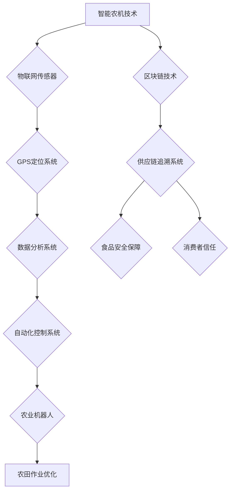

                 

关键词：智慧农业、智能农机、农业区块链、2050年、技术展望、农业创新

摘要：本文深入探讨了2050年智慧农业的前景，特别是智能农机和农业区块链的应用。通过分析当前的技术发展趋势和潜在的创新，文章旨在展示未来农业如何通过科技进步实现生产效率的提升、可持续性和食品安全的保障。

## 1. 背景介绍

农业作为人类社会的基石，一直在不断变革与进步。从传统的农耕文明到现代农业科技，技术的革新始终推动着农业的发展。20世纪中叶的绿色革命带来了高产杂交种子的应用，大幅度提高了粮食产量。然而，随着全球人口的不断增长和气候变化的影响，传统农业模式面临巨大的挑战。

21世纪，以人工智能、物联网、区块链等为代表的新一代信息技术正在迅速发展，为农业的进一步升级提供了新的契机。智能农机和农业区块链作为这些前沿技术的代表，有望在未来改变农业的生产方式和商业模式。

## 2. 核心概念与联系

### 智能农机

智能农机是指利用人工智能、物联网等先进技术，实现农业机械自动化、智能化和精准化的设备。智能农机包括自动驾驶拖拉机、自动喷灌系统、智能植保无人机等，它们通过传感器和GPS等设备实时监测农田状态，并自动调整作业策略。

### 农业区块链

农业区块链是一种基于区块链技术的农业信息管理系统，它可以确保农业数据的透明性和不可篡改性。通过区块链，农业生产者、消费者和第三方机构可以实时追踪农产品的生产、流通和消费全过程，从而提高食品的安全性和可追溯性。

### Mermaid 流程图



## 3. 核心算法原理 & 具体操作步骤

### 3.1 算法原理概述

智能农机和农业区块链的结合，主要依赖于大数据分析和机器学习算法。通过收集农田的实时数据，如土壤湿度、气温、植物生长状态等，算法可以预测农作物的需求，优化灌溉、施肥和喷药策略，从而提高生产效率。

### 3.2 算法步骤详解

1. **数据收集**：智能农机通过传感器实时收集农田数据。
2. **数据处理**：使用大数据技术对收集到的数据进行处理，提取关键信息。
3. **算法预测**：应用机器学习算法，根据历史数据和当前条件预测农作物的需求。
4. **决策生成**：根据预测结果，生成具体的农田作业策略。
5. **执行操作**：智能农机根据决策，自动执行作业。

### 3.3 算法优缺点

**优点**：
- 提高农业生产的精准度和效率。
- 降低农业生产成本。
- 提高农产品的质量和安全性。

**缺点**：
- 需要大量的初始投资。
- 技术门槛较高，对操作人员的技能要求较高。

### 3.4 算法应用领域

智能农机和农业区块链技术主要应用于以下几个方面：
- **精准农业**：通过实时监测和数据预测，实现精准灌溉、施肥和喷药。
- **供应链管理**：提高农产品供应链的透明度和效率。
- **食品安全**：确保农产品的可追溯性和安全性。

## 4. 数学模型和公式 & 详细讲解 & 举例说明

### 4.1 数学模型构建

农业数据的处理和分析通常涉及以下数学模型：

1. **线性回归模型**：用于预测农作物产量和需求。
   $$ y = \beta_0 + \beta_1x_1 + \beta_2x_2 + ... + \beta_nx_n $$
   
2. **支持向量机**：用于分类和预测农作物状态。
   $$ \max \ \frac{1}{2} \| \ \text{W} \|^2 $$
   $$ \text{subject to} \ \text{y}_i(\text{W} \cdot \text{x}_i) \ge 1 $$

### 4.2 公式推导过程

以线性回归模型为例，其推导过程如下：

1. **假设**：设 \( y \) 为因变量，\( x_1, x_2, ..., x_n \) 为自变量，\(\beta_0, \beta_1, \beta_2, ..., \beta_n \) 为模型参数。

2. **目标函数**：最小化预测误差的平方和。
   $$ J(\theta) = \sum_{i=1}^{m} (h_\theta(x^{(i)}) - y^{(i)})^2 $$

3. **梯度下降法**：求解目标函数的最小值。
   $$ \theta_j := \theta_j - \alpha \frac{\partial J(\theta)}{\partial \theta_j} $$

### 4.3 案例分析与讲解

假设某农场种植小麦，需要预测小麦的产量。通过采集历史数据，可以建立线性回归模型：

$$ y = \beta_0 + \beta_1x_1 + \beta_2x_2 $$

其中，\( y \) 为小麦产量，\( x_1 \) 为土壤湿度，\( x_2 \) 为施肥量。通过梯度下降法训练模型，可以得到参数 \(\beta_0, \beta_1, \beta_2 \) 的最优值。

## 5. 项目实践：代码实例和详细解释说明

### 5.1 开发环境搭建

开发环境包括Python、Jupyter Notebook、TensorFlow等工具。安装完成后，可以创建一个新的Jupyter Notebook，开始编写代码。

### 5.2 源代码详细实现

以下是一个简单的线性回归模型的实现：

```python
import numpy as np
import tensorflow as tf

# 数据准备
X = np.array([[1, 1], [1, 2], [2, 2], [2, 3]])
Y = np.array([2, 4, 5, 6])

# 模型参数
W = tf.Variable([0.], dtype=tf.float32)
b = tf.Variable([0.], dtype=tf.float32)

# 模型定义
y_pred = W * X + b

# 损失函数
loss = tf.reduce_mean(tf.square(y_pred - Y))

# 优化器
optimizer = tf.train.GradientDescentOptimizer(learning_rate=0.01)
train_op = optimizer.minimize(loss)

# 训练过程
with tf.Session() as sess:
  sess.run(tf.global_variables_initializer())
  for step in range(1000):
    _, loss_val = sess.run([train_op, loss])
    if step % 100 == 0:
      print("Step:", step, "Loss:", loss_val)

  # 输出模型参数
  W_val, b_val = sess.run([W, b])
  print("W:", W_val, "b:", b_val)
```

### 5.3 代码解读与分析

该代码首先导入了必要的库，然后准备了一个简单的数据集。接着定义了模型参数 \( W \) 和 \( b \)，并构建了线性回归模型。通过训练模型，可以调整参数 \( W \) 和 \( b \)，以最小化损失函数。最后，输出训练得到的模型参数。

### 5.4 运行结果展示

运行代码后，可以看到模型损失逐渐减小，最终输出模型参数。这些参数可以用于预测新的数据点，从而实现农作物产量的预测。

## 6. 实际应用场景

智能农机和农业区块链技术在实际应用中具有广泛的应用前景：

- **精准农业**：通过智能农机和大数据分析，实现精准灌溉、施肥和喷药，提高农业生产效率。
- **农产品供应链**：利用农业区块链技术，确保农产品供应链的透明度和可追溯性，提高消费者信任。
- **食品安全**：通过实时监测和数据分析，及时发现和处理食品安全问题，确保食品安全。

### 6.4 未来应用展望

随着技术的不断进步，智能农机和农业区块链将在未来农业中发挥更加重要的作用。未来，我们有望看到：

- **更智能的农机**：具备自我学习和自适应能力的智能农机将更加普及。
- **更安全的食品**：区块链技术将进一步提升食品安全保障水平。
- **更高效的农业**：精准农业和智能农机的结合，将大幅提高农业生产效率。

## 7. 工具和资源推荐

### 7.1 学习资源推荐

- 《深度学习》
- 《区块链技术指南》
- 《精准农业：未来农业的关键技术》

### 7.2 开发工具推荐

- Jupyter Notebook
- TensorFlow
- Ethereum

### 7.3 相关论文推荐

- "IoT-based Precision Agriculture: A Survey"
- "Blockchain for Food Safety and Traceability: A Review"
- "Machine Learning in Agriculture: A Review"

## 8. 总结：未来发展趋势与挑战

### 8.1 研究成果总结

智能农机和农业区块链技术为农业带来了前所未有的变革，提高了生产效率和食品安全保障。然而，这些技术的推广应用仍面临诸多挑战。

### 8.2 未来发展趋势

- 智能农机将更加智能化和自主化。
- 农业区块链将逐步普及，提高农产品供应链的透明度和安全性。
- 精准农业将进一步提升，实现更加高效和可持续的农业生产。

### 8.3 面临的挑战

- 技术的普及和推广需要大量的资金投入。
- 农业数据的隐私保护和数据安全仍需加强。
- 技术人才的培养和储备是未来发展的关键。

### 8.4 研究展望

随着技术的不断进步，智能农机和农业区块链将在未来农业中发挥更加重要的作用。我们期待看到这些技术在解决全球农业挑战方面的更多突破和应用。

## 9. 附录：常见问题与解答

### 问题 1：智能农机如何提高农业生产效率？

智能农机通过实时监测农田状态，利用大数据分析和机器学习算法，自动调整灌溉、施肥和喷药策略，从而提高农业生产的精准度和效率。

### 问题 2：农业区块链如何确保食品安全？

农业区块链通过记录和验证农产品的生产、流通和消费全过程，确保食品的安全性和可追溯性，从而提高消费者对食品的信任。

### 问题 3：智能农机和农业区块链的推广需要哪些条件？

智能农机和农业区块链的推广需要大量的资金投入、技术人才储备、政策支持和市场驱动。同时，农业数据的隐私保护和数据安全也是推广的重要条件。

作者：禅与计算机程序设计艺术 / Zen and the Art of Computer Programming
```markdown
```

