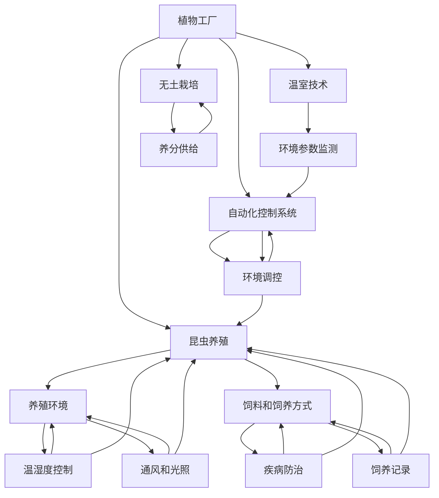

                 

关键词：智慧农业、植物工厂、昆虫养殖、2050年、未来趋势、技术发展

> 摘要：随着科技的不断进步，未来的智慧农业将迎来前所未有的变革。本文深入探讨了2050年的植物工厂与昆虫养殖技术，分析了这些新兴技术对农业产业的影响，以及面临的挑战和未来发展的方向。

## 1. 背景介绍

在过去的几十年中，农业技术取得了显著的进步，包括杂交育种、基因工程和精准农业等。然而，随着全球人口的增长和气候变化带来的挑战，传统农业模式已无法满足未来的需求。因此，智慧农业成为了全球关注的热点。

智慧农业的核心在于将信息技术、生物技术和机械工程技术相结合，实现农业生产的自动化、智能化和高效化。植物工厂和昆虫养殖作为智慧农业的重要组成部分，正逐渐成为研究的热点。

植物工厂通过利用温室技术、无土栽培和自动化控制系统，为作物生长提供了理想的环境，不仅提高了产量和质量，还减少了资源消耗和环境污染。

昆虫养殖则利用昆虫的生态价值和营养价值，将其应用于食品、药品和生物材料等领域。昆虫养殖不仅有助于减少农业废弃物，还能提供可持续的蛋白质来源。

## 2. 核心概念与联系

为了更好地理解植物工厂和昆虫养殖在智慧农业中的应用，我们需要探讨它们的核心概念和相互关系。

### 2.1 植物工厂

植物工厂是将温室技术、无土栽培和自动化控制系统相结合的一种新型农业生产方式。其核心概念包括：

- **温室技术**：通过人工控制环境条件，如温度、湿度、光照和通风，为作物提供最佳的生长环境。
- **无土栽培**：利用营养液替代土壤，为作物提供养分，从而减少土壤污染和病虫害。
- **自动化控制系统**：通过传感器、执行器和计算机控制系统，实现对环境参数的实时监测和调节。

植物工厂的架构可以概括为三个层次：感知层、控制层和执行层。

- **感知层**：包括各种传感器，如温度传感器、湿度传感器、光照传感器等，用于监测植物生长环境。
- **控制层**：由计算机控制系统组成，根据感知层的数据，进行环境参数的调控。
- **执行层**：包括各种执行器，如水泵、风扇、温室遮阳帘等，用于实现对环境参数的调节。

### 2.2 昆虫养殖

昆虫养殖是一种利用昆虫进行生产的新型农业方式。其核心概念包括：

- **昆虫种类**：昆虫养殖涉及多种昆虫，如蚕、蜜蜂、黄粉虫等，每种昆虫都有其特定的生态价值和营养价值。
- **养殖环境**：昆虫养殖需要提供适宜的生长环境，包括温度、湿度、光照和氧气等。
- **饲料和饲养方式**：昆虫的饲料和饲养方式直接影响其生长和发育，从而影响其产品质量。

昆虫养殖的架构可以概括为两个层次：养殖环境和饲养管理。

- **养殖环境**：包括温湿度控制、通风和光照等设施，用于提供适宜的养殖环境。
- **饲养管理**：包括饲料供应、疾病防治和饲养记录等，用于确保昆虫的健康和产品质量。

### 2.3 植物工厂与昆虫养殖的联系

植物工厂和昆虫养殖在智慧农业中具有密切的联系。

首先，植物工厂为昆虫养殖提供了理想的生长环境。通过植物工厂的自动化控制系统，可以精确调控温湿度、光照和通风等环境参数，从而为昆虫提供最佳的生长条件。

其次，昆虫养殖为植物工厂提供了可持续的有机肥料和生物防治手段。昆虫的排泄物和尸体可以作为植物的营养来源，减少对化学肥料的需求。同时，某些昆虫可以用来防治植物病虫害，减少农药的使用。

最后，植物工厂和昆虫养殖的协同作用可以形成一条完整的生态产业链。植物工厂产生的废弃物可以作为昆虫的饲料，昆虫的排泄物和尸体又可以返回植物工厂作为肥料，实现资源的循环利用。

### 2.4 Mermaid 流程图

以下是植物工厂与昆虫养殖的 Mermaid 流程图：



## 3. 核心算法原理 & 具体操作步骤

### 3.1 算法原理概述

在智慧农业中，核心算法的原理主要包括以下几个方面：

- **环境参数监测算法**：通过传感器实时监测温湿度、光照和二氧化碳浓度等环境参数，为自动化控制系统提供数据支持。
- **环境调控算法**：根据监测数据，利用计算机控制系统对温室环境进行实时调控，以保持作物和昆虫的最佳生长条件。
- **饲料和饲养管理算法**：根据昆虫的生长阶段和营养需求，制定科学的饲料配方和饲养计划，确保昆虫的健康和产品质量。

### 3.2 算法步骤详解

#### 3.2.1 环境参数监测算法

1. **传感器布置**：在植物工厂和昆虫养殖区布置各种传感器，如温度传感器、湿度传感器、光照传感器和二氧化碳传感器。
2. **数据采集**：传感器采集环境参数数据，通过无线传输模块上传至计算机控制系统。
3. **数据处理**：计算机控制系统对接收到的数据进行滤波、去噪和转换，得到准确的环境参数。
4. **数据存储**：将处理后的数据存储到数据库中，用于后续分析和调控。

#### 3.2.2 环境调控算法

1. **设定目标参数**：根据作物和昆虫的生长需求，设定理想的环境参数目标值。
2. **实时监测**：通过环境参数监测算法，实时获取当前的环境参数。
3. **偏差分析**：比较当前环境参数与目标参数的偏差，确定调控方向。
4. **执行调控**：根据偏差分析结果，自动执行相应的调控措施，如开启或关闭温室通风系统、调节光照强度等。
5. **调控反馈**：记录调控效果，进行下一次调控。

#### 3.2.3 饲料和饲养管理算法

1. **生长阶段判断**：根据昆虫的生长阶段，确定其营养需求。
2. **饲料配方制定**：根据营养需求，制定科学的饲料配方。
3. **饲料供应**：通过自动化设备，按照配方将饲料供应到昆虫饲养区。
4. **饲养记录**：记录昆虫的生长状态、饲料供应量和排泄物量等数据，用于后续分析和调控。

### 3.3 算法优缺点

#### 优点

- **高效性**：通过自动化和智能化手段，提高农业生产效率和产品质量。
- **可持续性**：减少对化学肥料和农药的依赖，降低环境污染。
- **灵活性**：根据环境变化和需求，灵活调整农业生产参数。

#### 缺点

- **初始投入成本高**：建设植物工厂和昆虫养殖设施需要大量资金投入。
- **技术门槛高**：需要具备一定的技术知识和操作技能，对从业人员的要求较高。
- **数据安全和隐私**：需要确保监测数据和调控策略的安全性，防止数据泄露和滥用。

### 3.4 算法应用领域

智慧农业的核心算法在多个领域具有广泛的应用前景：

- **植物工厂**：适用于蔬菜、水果、花卉等作物的生产。
- **昆虫养殖**：适用于蚕、蜜蜂、黄粉虫等昆虫的生产。
- **精准农业**：通过环境参数监测和调控，实现农田的精准管理。
- **生态农业**：通过资源循环利用，实现农业生产的可持续发展。

## 4. 数学模型和公式 & 详细讲解 & 举例说明

### 4.1 数学模型构建

在智慧农业中，数学模型用于描述植物生长和昆虫养殖的规律，从而实现精确预测和优化管理。以下是一个简单的数学模型构建过程：

#### 4.1.1 植物生长模型

植物生长模型通常基于光合作用、呼吸作用和水分利用等基本生物学过程。以下是植物光合作用的数学模型：

$$
A(t) = A_0 \times e^{-kt}
$$

其中，$A(t)$ 为植物光合作用速率，$A_0$ 为初始光合作用速率，$k$ 为光合作用速率随时间的变化率。

#### 4.1.2 昆虫生长模型

昆虫生长模型通常基于昆虫的发育阶段和生理特征。以下是昆虫发育的数学模型：

$$
t_d = \frac{N_h}{r_h}
$$

其中，$t_d$ 为昆虫发育所需时间，$N_h$ 为昆虫发育阶段数，$r_h$ 为每个发育阶段的生长速率。

### 4.2 公式推导过程

#### 4.2.1 植物光合作用速率模型

光合作用速率受光照强度、温度和二氧化碳浓度等因素的影响。假设光合作用速率与光照强度呈线性关系，与温度和二氧化碳浓度呈指数关系，可以推导出以下模型：

$$
A(t) = A_0 \times (1 - e^{-\alpha t}) \times e^{-\beta T} \times (1 + \gamma C)
$$

其中，$\alpha$ 为光照强度影响系数，$\beta$ 为温度影响系数，$\gamma$ 为二氧化碳浓度影响系数。

#### 4.2.2 昆虫发育模型

昆虫发育受温度、光照和营养等因素的影响。假设昆虫发育阶段数与温度和光照呈线性关系，与营养呈指数关系，可以推导出以下模型：

$$
t_d = \frac{N_h}{r_h} \times e^{-\delta T} \times (1 + \epsilon L)
$$

其中，$\delta$ 为温度影响系数，$\epsilon$ 为光照影响系数。

### 4.3 案例分析与讲解

#### 4.3.1 植物光合作用速率模型应用

假设植物工厂中的植物初始光合作用速率为 $A_0 = 10$ mol/(m²·s)，光照强度影响系数 $\alpha = 0.1$，温度影响系数 $\beta = 0.05$，二氧化碳浓度影响系数 $\gamma = 0.02$。现假设光照强度为 1000 W/m²，温度为 25℃，二氧化碳浓度为 400 ppm。可以计算出植物光合作用速率：

$$
A(t) = 10 \times (1 - e^{-0.1t}) \times e^{-0.05 \times 25} \times (1 + 0.02 \times 400) \approx 7.11 \times e^{-0.1t}
$$

随着时间推移，植物光合作用速率逐渐降低。

#### 4.3.2 昆虫发育模型应用

假设昆虫发育阶段数为 $N_h = 5$，每个发育阶段的生长速率 $r_h = 1$ d⁻¹，温度影响系数 $\delta = 0.01$，光照影响系数 $\epsilon = 0.1$。现假设温度为 25℃，光照强度为 1000 lx。可以计算出昆虫发育所需时间：

$$
t_d = \frac{5}{1} \times e^{-0.01 \times 25} \times (1 + 0.1 \times 1000) \approx 4.47 \text{ d}
$$

昆虫在适宜的温度和光照条件下，发育速度较快。

## 5. 项目实践：代码实例和详细解释说明

### 5.1 开发环境搭建

为了实现智慧农业的核心算法，我们需要搭建一个开发环境。以下是一个基于 Python 的开发环境搭建示例：

1. **安装 Python**：从 Python 官网下载并安装 Python 3.8 或以上版本。
2. **安装必备库**：通过 pip 命令安装 numpy、pandas、matplotlib 等必备库。

```bash
pip install numpy pandas matplotlib
```

### 5.2 源代码详细实现

以下是一个简单的智慧农业核心算法实现示例：

```python
import numpy as np
import pandas as pd
import matplotlib.pyplot as plt

# 定义光合作用速率模型
def photosynthesis_rate(A0, alpha, beta, T, C):
    return A0 * (1 - np.exp(-alpha * T)) * np.exp(-beta * T) * (1 + gamma * C)

# 定义昆虫发育模型
def insect_growth(Nh, rh, delta, T, L):
    return Nh / rh * np.exp(-delta * T) * (1 + epsilon * L)

# 示例参数
A0 = 10  # 初始光合作用速率
alpha = 0.1  # 光照强度影响系数
beta = 0.05  # 温度影响系数
gamma = 0.02  # 二氧化碳浓度影响系数
T = 25  # 温度
C = 400  # 二氧化碳浓度
Nh = 5  # 昆虫发育阶段数
rh = 1  # 每个发育阶段的生长速率
delta = 0.01  # 温度影响系数
epsilon = 0.1  # 光照影响系数

# 计算光合作用速率
A_t = photosynthesis_rate(A0, alpha, beta, T, C)

# 计算昆虫发育时间
t_d = insect_growth(Nh, rh, delta, T, L)

# 绘制光合作用速率曲线
t = np.linspace(0, 10, 100)
A_t_curve = photosynthesis_rate(A0, alpha, beta, t, C)

plt.plot(t, A_t_curve)
plt.xlabel('Time (days)')
plt.ylabel('Photosynthesis Rate (mol/(m²·s))')
plt.title('Photosynthesis Rate vs Time')
plt.show()

# 绘制昆虫发育曲线
L = np.linspace(0, 1000, 100)
t_d_curve = insect_growth(Nh, rh, delta, T, L)

plt.plot(L, t_d_curve)
plt.xlabel('Light Intensity (lx)')
plt.ylabel('Insect Growth Time (days)')
plt.title('Insect Growth Time vs Light Intensity')
plt.show()
```

### 5.3 代码解读与分析

上述代码实现了智慧农业核心算法的简单实现，主要包括以下部分：

- **光合作用速率模型**：定义了光合作用速率的数学模型，用于计算不同环境条件下植物的光合作用速率。
- **昆虫发育模型**：定义了昆虫发育的数学模型，用于计算不同环境条件下昆虫的发育时间。
- **示例参数**：设置了示例参数，包括初始光合作用速率、光照强度影响系数、温度影响系数等。
- **计算与绘图**：根据示例参数，计算光合作用速率和昆虫发育时间，并绘制相应的曲线图。

### 5.4 运行结果展示

运行上述代码后，将生成两个曲线图：

1. **光合作用速率曲线图**：展示了不同时间下植物的光合作用速率。随着时间推移，光合作用速率逐渐降低。
2. **昆虫发育曲线图**：展示了不同光照强度下昆虫的发育时间。随着光照强度增加，昆虫的发育时间逐渐缩短。

通过上述运行结果，可以直观地了解智慧农业核心算法在不同环境条件下的表现，为实际应用提供参考。

## 6. 实际应用场景

### 6.1 植物工厂

植物工厂在实际应用中已经取得了显著成果。例如，日本九州岛一家名为“九州环境农业”的企业，通过植物工厂技术实现了全年无休的蔬菜生产。该植物工厂采用无土栽培技术，利用营养液为作物提供养分，通过自动化控制系统精确调控温湿度、光照和通风等环境参数，使蔬菜的生长周期缩短了约 40%。此外，植物工厂还实现了农药和化肥的零使用，有效减少了环境污染。

### 6.2 昆虫养殖

昆虫养殖也在全球范围内得到了广泛应用。例如，荷兰的一家名为“Entocycle”的企业，通过养殖黄粉虫生产蛋白质饲料。黄粉虫以有机废弃物为食，将其转化为高蛋白质的饲料，实现了资源的循环利用。此外，黄粉虫的养殖过程无需大量水资源，且废物排放少，对环境友好。该企业通过自动化养殖系统，实现了黄粉虫养殖的智能化和高效化。

### 6.3 植物工厂与昆虫养殖的协同作用

植物工厂和昆虫养殖的协同作用在农业生产中具有巨大潜力。例如，荷兰的“生态农场”项目，通过植物工厂提供昆虫养殖所需的有机废弃物，昆虫养殖产生的排泄物和尸体返回植物工厂作为肥料，实现了资源的循环利用。该项目不仅提高了农业生产效率，还降低了环境污染，为智慧农业的发展提供了有益的实践经验。

## 7. 未来应用展望

### 7.1 植物工厂

随着科技的不断进步，植物工厂将在未来农业发展中发挥越来越重要的作用。以下是植物工厂的几个未来应用方向：

- **智能化种植**：通过大数据分析和人工智能技术，实现精准种植和病虫害防治，提高农作物产量和质量。
- **垂直农场**：利用建筑物内部的空间进行植物生产，实现土地资源的高效利用，缓解城市用地紧张问题。
- **生态循环**：通过植物工厂与昆虫养殖的协同作用，实现资源循环利用，降低农业生产对环境的影响。

### 7.2 昆虫养殖

昆虫养殖在未来的农业发展中同样具有广阔的应用前景。以下是昆虫养殖的几个未来应用方向：

- **高附加值产品**：利用昆虫的生态价值和营养价值，开发高附加值产品，如昆虫蛋白粉、昆虫保健品等。
- **可持续农业**：通过昆虫养殖减少农业废弃物，提高土壤肥力，实现农业的可持续发展。
- **生物防治**：利用昆虫的生态平衡作用，开发生物防治技术，减少农药使用，降低环境污染。

### 7.3 植物工厂与昆虫养殖的协同作用

植物工厂与昆虫养殖的协同作用在未来农业发展中具有重要意义。以下是几个协同作用的潜在应用：

- **废弃物处理**：植物工厂产生的有机废弃物可作为昆虫养殖的饲料，实现废弃物的资源化利用。
- **生态平衡**：昆虫养殖可促进农田生态系统的平衡，降低病虫害的发生。
- **资源循环**：通过植物工厂和昆虫养殖的协同作用，实现水、肥、能源的循环利用，降低农业生产对环境的影响。

## 8. 工具和资源推荐

### 8.1 学习资源推荐

- **《智慧农业技术》**：一本全面介绍智慧农业技术的权威著作，适合初学者和专业人士阅读。
- **《昆虫生理学》**：一本介绍昆虫生理学的基本原理和应用的书，有助于了解昆虫养殖技术。
- **《植物工厂设计与应用》**：一本关于植物工厂设计、建设和运营的实用指南，适合植物工厂从业人员阅读。

### 8.2 开发工具推荐

- **Python**：一种简单易学、功能强大的编程语言，适用于智慧农业算法的实现。
- **Matlab**：一种专门用于科学计算和数据分析的软件，适合进行复杂算法的建模和仿真。
- **R**：一种专门用于统计分析的编程语言，适用于农业数据分析和可视化。

### 8.3 相关论文推荐

- **“A Review on Vertical Farming: Technologies, Sustainability, and Market Opportunities”**：一篇关于垂直农场技术的综述性论文，全面介绍了垂直农场的现状和发展趋势。
- **“Insect Farming for Sustainable Food Production”**：一篇关于昆虫养殖的论文，探讨了昆虫养殖在可持续食品生产中的应用和潜力。
- **“Integrating Plant Factory and Insect Farming for Sustainable Agriculture”**：一篇关于植物工厂与昆虫养殖协同作用的论文，分析了二者在智慧农业中的协同效应。

## 9. 总结：未来发展趋势与挑战

### 9.1 研究成果总结

智慧农业技术作为现代农业发展的重要方向，取得了显著的成果。植物工厂和昆虫养殖作为智慧农业的重要组成部分，不仅在提高农业生产效率和产品质量方面发挥了重要作用，还实现了资源的循环利用和生态环境的保护。

### 9.2 未来发展趋势

随着科技的不断进步，智慧农业技术将继续发展，主要体现在以下几个方面：

- **智能化与自动化**：通过大数据、人工智能和物联网等技术的应用，实现农业生产过程的智能化和自动化。
- **生态化与可持续发展**：通过植物工厂和昆虫养殖的协同作用，实现农业生态系统的平衡和资源的循环利用。
- **多元化与高附加值**：开发高附加值的农产品和昆虫产品，满足消费者对高品质食品的需求。

### 9.3 面临的挑战

智慧农业技术发展过程中仍面临以下挑战：

- **技术门槛高**：智慧农业技术涉及多个领域，需要具备一定的技术知识和操作技能，对从业人员的要求较高。
- **初始投入成本高**：建设植物工厂和昆虫养殖设施需要大量资金投入，限制了其普及和应用。
- **数据安全和隐私**：需要确保监测数据和调控策略的安全性，防止数据泄露和滥用。

### 9.4 研究展望

未来，智慧农业技术的研究方向包括：

- **集成化与协同化**：将植物工厂和昆虫养殖技术进行整合，实现协同发展。
- **定制化与个性化**：根据不同地区和作物需求，制定个性化的农业生产方案。
- **生态化与可持续发展**：实现农业生产过程的全过程生态化，推动农业的可持续发展。

### 附录：常见问题与解答

**Q1**：植物工厂和昆虫养殖的区别是什么？

**A1**：植物工厂主要是通过人工控制环境条件，利用温室技术、无土栽培和自动化控制系统进行植物生产；昆虫养殖则是利用昆虫的生态价值和营养价值，进行昆虫生产。两者在技术原理和应用目标上有所不同。

**Q2**：植物工厂对环境的要求有哪些？

**A2**：植物工厂对环境的要求主要包括温度、湿度、光照、通风和二氧化碳浓度等。通过自动化控制系统，可以精确调控这些环境参数，为植物提供最佳的生长条件。

**Q3**：昆虫养殖的优势是什么？

**A3**：昆虫养殖的优势包括：1）资源循环利用，减少农业废弃物；2）提供可持续的蛋白质来源；3）对环境友好，废物排放少。

**Q4**：智慧农业技术对未来的农业发展有何影响？

**A4**：智慧农业技术将推动农业生产的智能化、自动化和生态化，提高农业生产效率和质量，减少对环境的污染，实现农业的可持续发展。同时，智慧农业技术还将促进农业产业链的整合和升级，为农业带来新的发展机遇。

