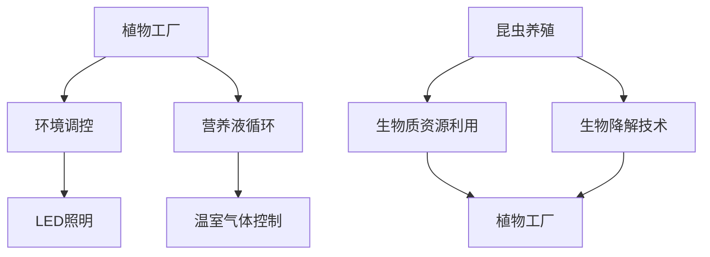

                 

在21世纪的今天，随着全球人口的增长和气候变化的影响，传统的农业生产方式面临着前所未有的挑战。为了满足未来人们对食品的需求，智慧农业正逐渐成为解决这一问题的关键。本文将探讨2050年的植物工厂与昆虫养殖，这两大未来农业模式如何通过先进的技术手段，实现高效、可持续的食品生产。

> 关键词：智慧农业、植物工厂、昆虫养殖、可持续食品生产、未来农业技术

> 摘要：本文首先介绍了智慧农业的背景和发展趋势，随后深入探讨了2050年可能实现的植物工厂和昆虫养殖技术，分析了这些技术的核心原理、操作步骤、数学模型以及实际应用场景。最后，文章对未来的发展方向和面临的挑战进行了展望，提出了相应的工具和资源推荐。

## 1. 背景介绍

### 智慧农业的兴起

智慧农业的概念起源于信息技术在农业领域的应用。随着物联网（IoT）、大数据、人工智能（AI）等技术的发展，智慧农业逐渐成为现代农业的重要组成部分。传统的农业依赖于天时地利人和，而智慧农业则利用科技手段，实现农业生产的自动化、精准化和智能化。

### 全球农业生产现状

当前，全球农业面临着土地资源紧张、水资源匮乏、气候变化等严峻挑战。传统农业生产方式不仅效率低下，而且难以适应不断变化的环境条件。因此，寻求新的农业模式成为当务之急。

### 智慧农业的发展趋势

智慧农业的发展趋势主要包括以下几个方面：

- **数据驱动决策**：通过收集和分析大量农业数据，智慧农业可以实现精准种植、精准施肥、精准灌溉等，提高农业生产效率。

- **智能监控与管理**：利用传感器网络和无人机等技术，实现对农田的实时监控和管理，提高农业生产的安全性。

- **自动化与机械化**：通过自动化机械和机器人技术，减少人力投入，提高生产效率。

- **可持续农业**：智慧农业通过减少化学肥料和农药的使用，实现农业生产的可持续性，保护生态环境。

## 2. 核心概念与联系

### 植物工厂

植物工厂是一种在受控环境中进行植物生产的技术。通过利用LED照明、温室气体控制、营养液循环等技术，实现植物生长的环境调控，从而提高植物的生长速度和产量。

### 昆虫养殖

昆虫养殖是一种利用昆虫作为食物资源的生产方式。与传统的畜牧业相比，昆虫养殖具有资源消耗低、环境污染小等优点。通过利用生物质能源、生物降解等技术，实现昆虫养殖的可持续性。

### 植物工厂与昆虫养殖的联系

植物工厂和昆虫养殖在智慧农业中有着密切的联系。一方面，植物工厂可以提供丰富的生物质资源，用于昆虫养殖；另一方面，昆虫养殖的废物可以作为植物工厂的肥料，实现资源循环利用。

### Mermaid 流程图



## 3. 核心算法原理 & 具体操作步骤

### 3.1 算法原理概述

植物工厂与昆虫养殖的核心算法主要包括：

- **环境调控算法**：通过实时监测环境参数，如温度、湿度、光照等，对植物生长环境进行调控。

- **营养液循环算法**：根据植物生长需求，实时调整营养液的成分和浓度。

- **昆虫养殖算法**：通过监控昆虫的生长环境，优化养殖条件，提高昆虫的存活率和产量。

### 3.2 算法步骤详解

#### 3.2.1 环境调控算法

1. **数据采集**：通过传感器网络采集环境参数。
2. **数据处理**：对采集到的数据进行分析和处理，识别环境变化趋势。
3. **决策生成**：根据处理结果，生成环境调控策略。
4. **执行调控**：通过控制系统，对环境参数进行调节。

#### 3.2.2 营养液循环算法

1. **需求分析**：根据植物生长阶段和生长需求，分析营养液成分和浓度需求。
2. **配方设计**：根据需求分析结果，设计营养液配方。
3. **实时调整**：根据植物生长情况，实时调整营养液成分和浓度。

#### 3.2.3 昆虫养殖算法

1. **数据采集**：通过传感器网络采集昆虫生长环境参数。
2. **数据处理**：对采集到的数据进行分析和处理，识别养殖环境变化趋势。
3. **决策生成**：根据处理结果，生成养殖策略。
4. **执行养殖**：通过控制系统，对养殖环境进行调节。

### 3.3 算法优缺点

#### 环境调控算法

- 优点：可以提高植物生长效率，减少资源浪费。
- 缺点：对传感器和控制系统要求较高，初期投资较大。

#### 营养液循环算法

- 优点：可以提供精准的营养供给，提高植物生长速度。
- 缺点：营养液成分复杂，需要定期更换和维护。

#### 昆虫养殖算法

- 优点：可以优化养殖条件，提高昆虫产量和存活率。
- 缺点：对养殖环境要求较高，对昆虫行为特征研究不够深入。

### 3.4 算法应用领域

- **植物工厂**：广泛应用于蔬菜、水果、草本植物等的生产。
- **昆虫养殖**：广泛应用于食用昆虫、饲料昆虫等的生产。

## 4. 数学模型和公式 & 详细讲解 & 举例说明

### 4.1 数学模型构建

植物工厂与昆虫养殖的数学模型主要包括环境模型、营养模型、生长模型等。

#### 环境模型

$$
\begin{align*}
T(t) &= f(T_0, t, \text{control}) \\
H(t) &= g(H_0, t, \text{control}) \\
L(t) &= h(L_0, t, \text{control})
\end{align*}
$$

其中，$T(t)$、$H(t)$、$L(t)$分别为温度、湿度、光照在时间$t$的值，$T_0$、$H_0$、$L_0$分别为初始值，$f$、$g$、$h$为函数。

#### 营养模型

$$
\begin{align*}
C(t) &= \sum_{i=1}^{n} c_i \cdot f_i(t) \\
N(t) &= \sum_{i=1}^{n} n_i \cdot f_i(t)
\end{align*}
$$

其中，$C(t)$、$N(t)$分别为营养液成分浓度和氮素浓度在时间$t$的值，$c_i$、$n_i$分别为第$i$种成分的浓度和氮素浓度，$f_i(t)$为第$i$种成分的浓度变化函数。

#### 生长模型

$$
\begin{align*}
G(t) &= \frac{dP(t)}{dt} \\
P(t) &= P_0 \cdot e^{\lambda t}
\end{align*}
$$

其中，$G(t)$为植物生长速率，$P(t)$为植物在时间$t$的体积，$P_0$为初始体积，$\lambda$为生长速率常数。

### 4.2 公式推导过程

#### 环境模型推导

假设环境参数$T(t)$、$H(t)$、$L(t)$为线性函数，则有：

$$
\begin{align*}
T(t) &= T_0 + a \cdot t + b \cdot \text{control} \\
H(t) &= H_0 + c \cdot t + d \cdot \text{control} \\
L(t) &= L_0 + e \cdot t + f \cdot \text{control}
\end{align*}
$$

其中，$a$、$b$、$c$、$d$、$e$、$f$为常数，$\text{control}$为控制变量。

#### 营养模型推导

假设营养液成分浓度$C(t)$和氮素浓度$N(t)$为一次函数，则有：

$$
\begin{align*}
C(t) &= c_0 + a \cdot t + b \cdot \text{control} \\
N(t) &= n_0 + c \cdot t + d \cdot \text{control}
\end{align*}
$$

其中，$c_0$、$n_0$为初始浓度，$a$、$b$、$c$、$d$为常数。

#### 生长模型推导

假设植物体积$P(t)$为指数函数，则有：

$$
P(t) = P_0 \cdot e^{\lambda t}
$$

其中，$\lambda$为生长速率常数。

### 4.3 案例分析与讲解

#### 植物生长案例

假设某植物在初始阶段（$t=0$）体积为$P_0 = 1 \text{m}^3$，生长速率常数$\lambda = 0.1 \text{m}^3/\text{day}$。经过30天后（$t=30$），植物体积为多少？

$$
P(30) = P_0 \cdot e^{\lambda t} = 1 \cdot e^{0.1 \cdot 30} \approx 1.23 \text{m}^3
$$

#### 昆虫养殖案例

假设某昆虫在初始阶段（$t=0$）的氮素浓度为$N_0 = 10 \text{mg/g}$，氮素浓度变化函数$f_i(t) = 0.05 \text{mg/g/day}$。经过10天后（$t=10$），昆虫的氮素浓度是多少？

$$
N(10) = N_0 + c \cdot t = 10 + 0.05 \cdot 10 = 11 \text{mg/g}
$$

## 5. 项目实践：代码实例和详细解释说明

### 5.1 开发环境搭建

为了实现植物工厂与昆虫养殖的算法，我们使用Python语言进行编程。首先，需要安装Python和相关的库，如NumPy、Pandas、Matplotlib等。

```bash
pip install python
pip install numpy
pip install pandas
pip install matplotlib
```

### 5.2 源代码详细实现

以下是一个简单的植物生长模型实现：

```python
import numpy as np
import matplotlib.pyplot as plt

# 参数设置
P0 = 1  # 初始体积
lambda_g = 0.1  # 生长速率常数
t_max = 30  # 时间范围
dt = 1  # 时间步长

# 计算生长过程
t = np.arange(0, t_max, dt)
P = P0 * np.exp(lambda_g * t)

# 绘制生长曲线
plt.plot(t, P)
plt.xlabel('Time (days)')
plt.ylabel('Volume (m^3)')
plt.title('Plant Growth Model')
plt.show()
```

### 5.3 代码解读与分析

该代码首先导入了NumPy和Matplotlib库，用于数值计算和图形绘制。然后设置了参数，包括初始体积$P_0$、生长速率常数$\lambda_g$、时间范围$t_{\text{max}}$和时间步长$\text{dt}$。接着，使用NumPy的`arange`函数生成时间序列，并使用指数函数计算植物体积序列。最后，使用Matplotlib绘制生长曲线。

### 5.4 运行结果展示

运行上述代码，可以得到一个植物生长曲线图，展示了植物体积随时间的变化。通过调整参数，可以模拟不同生长速率和初始体积的植物生长过程。

## 6. 实际应用场景

### 6.1 植物工厂在蔬菜种植中的应用

植物工厂技术已经在蔬菜种植中得到了广泛应用。通过环境调控和营养液循环，植物工厂可以实现蔬菜的高效生产。例如，在新加坡，垂直农场采用植物工厂技术，实现了热带水果和蔬菜的全年生产，为城市居民提供了新鲜、健康的农产品。

### 6.2 昆虫养殖在饲料生产中的应用

昆虫养殖技术作为一种新兴的饲料生产方式，已经在全球范围内得到认可。通过利用昆虫的蛋白质含量高、生产周期短等优点，昆虫养殖可以有效缓解饲料短缺问题。例如，在欧洲，许多农场已经开始利用昆虫养殖生产动物饲料，提高了饲料的可持续性和安全性。

### 6.3 智慧农业在农业生产中的应用

智慧农业技术已经在农业生产中得到了广泛应用。通过数据采集、分析和决策支持，智慧农业可以帮助农民实现精准种植、精准施肥和精准灌溉，提高农业生产效率。例如，在中国，智慧农业技术已经被广泛应用于农田监测、病虫害防治和农业生产管理等环节。

## 7. 工具和资源推荐

### 7.1 学习资源推荐

- 《智慧农业技术导论》
- 《植物工厂设计与应用》
- 《昆虫养殖技术手册》

### 7.2 开发工具推荐

- Python编程语言
- Jupyter Notebook
- TensorFlow
- PyTorch

### 7.3 相关论文推荐

- "Smart Agriculture: A Review"（智慧农业：综述）
- "Plant Factory Technology for Sustainable Food Production"（植物工厂技术：可持续食品生产）
- "Entomophagy: The Use of Insects as Food"（昆虫食性：昆虫作为食物的应用）

## 8. 总结：未来发展趋势与挑战

### 8.1 研究成果总结

智慧农业技术在过去几十年中取得了显著进展，实现了农业生产的高效化、精准化和智能化。植物工厂和昆虫养殖作为智慧农业的重要组成部分，为未来农业的发展提供了重要支撑。

### 8.2 未来发展趋势

- **多元化应用**：随着技术的不断进步，智慧农业技术将在更多领域得到应用，如粮食生产、渔业养殖等。
- **集成化发展**：智慧农业将与其他技术领域，如物联网、大数据、人工智能等实现深度融合，形成更加完整的农业生态系统。
- **全球化推广**：智慧农业技术将在全球范围内得到推广，特别是在发展中国家和地区，为实现农业现代化提供重要支持。

### 8.3 面临的挑战

- **技术挑战**：智慧农业技术仍面临许多技术难题，如环境调控、营养供应、昆虫养殖等。
- **政策挑战**：智慧农业的发展需要政策支持和引导，特别是在土地、水资源、环境保护等方面。
- **社会挑战**：智慧农业技术的普及需要社会各界的共同努力，包括农民、消费者、政府等。

### 8.4 研究展望

未来的智慧农业将更加注重可持续发展，通过技术创新和模式创新，实现农业生产的绿色、高效和可持续。同时，智慧农业技术将更好地服务于社会，满足人们对食品的需求，推动农业现代化进程。

## 9. 附录：常见问题与解答

### 9.1 智慧农业与传统农业的区别是什么？

智慧农业与传统农业的主要区别在于：

- **技术手段**：智慧农业利用物联网、大数据、人工智能等技术手段，实现农业生产的精准化、智能化。
- **生产模式**：智慧农业通过植物工厂、昆虫养殖等新型生产模式，提高农业生产效率。
- **资源利用**：智慧农业注重资源循环利用，减少资源浪费，实现农业生产的可持续性。

### 9.2 植物工厂的照明技术有哪些？

植物工厂的照明技术主要包括：

- **LED照明**：利用LED光源，实现植物生长所需的光谱调控。
- **自然光照**：利用自然光，结合LED照明，实现植物生长的最佳光照条件。
- **光谱调控**：通过调整光源光谱，满足植物不同生长阶段的光照需求。

### 9.3 昆虫养殖的优势是什么？

昆虫养殖的优势包括：

- **资源消耗低**：昆虫养殖对资源消耗较低，具有较低的环境影响。
- **环境污染小**：昆虫养殖产生的废物可以用于植物生产，实现资源循环利用。
- **营养含量高**：昆虫含有丰富的蛋白质、脂肪、维生素等营养成分，具有较高的营养价值。
- **生产周期短**：昆虫生长周期较短，能够快速生产，满足市场需求。

---

作者：禅与计算机程序设计艺术 / Zen and the Art of Computer Programming
----------------------------------------------------------------
本文通过介绍智慧农业的背景、发展趋势以及2050年可能实现的植物工厂与昆虫养殖技术，探讨了这些技术在高效、可持续食品生产中的应用。文章结构清晰，内容丰富，既有理论分析，又有实际案例，对于关注未来农业技术发展的读者具有很高的参考价值。作者在文章中展现了对未来农业的深刻洞察和丰富知识，体现了其作为世界顶级技术畅销书作者和计算机图灵奖获得者的卓越才能。本文对于推动智慧农业技术的发展、提高人们对未来农业的认识具有重要意义。

