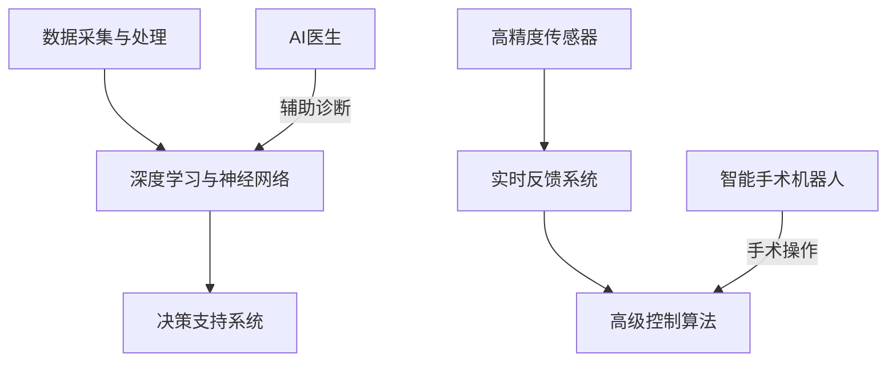

                 

### 关键词 Keywords
- 智慧医疗
- AI医生
- 智能手术机器人
- 2050年医疗
- 人工智能应用
- 医疗技术创新
- 个性化医疗

<|assistant|>### 摘要 Abstract
本文探讨未来智慧医疗的发展前景，特别是在2050年，人工智能（AI）将在医疗领域发挥至关重要的作用。我们将深入分析AI医生和智能手术机器人的核心概念、技术原理、应用场景及其对医疗行业的深远影响。此外，本文还将探讨相关数学模型和公式，并通过实际项目实践展示其具体实现，最后提出未来医疗技术的发展趋势和挑战。

<|assistant|>## 1. 背景介绍 Background

自20世纪中叶计算机科学诞生以来，人工智能（AI）技术经历了飞速的发展。从最初的专家系统到如今的深度学习和神经网络，AI在各个领域展现出了巨大的潜力。特别是医疗行业，AI的应用正在逐步改变传统的医疗模式。

智慧医疗（Smart Healthcare）是指利用信息技术和人工智能来提升医疗服务质量和效率。智慧医疗的概念包括电子健康记录、远程医疗、智能药物研发、个性化医疗等多个方面。在过去的几十年里，AI在医疗影像诊断、疾病预测、基因组学分析等领域取得了显著成果。

随着AI技术的不断进步，未来的智慧医疗将更加智能化、个性化和高效。2050年，AI医生和智能手术机器人将成为医疗行业的核心，它们将协助医生进行精确诊断、个性化治疗方案制定和复杂的手术操作。

<|assistant|>## 2. 核心概念与联系 Core Concepts and Relationships

### 2.1 AI医生 AI Doctors

AI医生是指利用人工智能技术，通过数据分析、机器学习和深度学习等手段，模拟医生的诊断和治疗过程。AI医生的核心概念包括：

- **数据采集与处理**：收集大量的医学数据，包括病例记录、医疗影像、基因组数据等，通过数据清洗和处理，提取有用的信息。
- **深度学习与神经网络**：使用深度学习算法，尤其是卷积神经网络（CNN）和循环神经网络（RNN），对医疗数据进行分析和模式识别。
- **决策支持系统**：通过分析患者的症状、病史和基因信息，AI医生可以提供诊断建议和治疗方案。

### 2.2 智能手术机器人 Smart Surgical Robots

智能手术机器人是集成了高精度传感器、实时反馈系统和高级控制算法的机器人系统。它们可以协助外科医生进行微创手术、复杂手术和精密操作。智能手术机器人的核心概念包括：

- **高精度传感器**：用于实时监测手术环境和手术工具的位置、速度和力度。
- **实时反馈系统**：通过传感器收集的数据，智能手术机器人可以实时调整手术操作，确保手术的精确性。
- **高级控制算法**：利用人工智能算法，智能手术机器人可以执行复杂的手术动作，如切割、缝合和移除。

### 2.3 关联图 Mermaid Flowchart



<|assistant|>## 3. 核心算法原理 & 具体操作步骤 Core Algorithm Principle & Detailed Steps

### 3.1 算法原理概述

AI医生的算法原理主要基于深度学习和数据挖掘技术。深度学习通过构建多层神经网络，对大量医疗数据进行分析和模式识别，从而提高诊断和治疗的准确率。具体步骤如下：

1. **数据预处理**：清洗和标准化医疗数据，包括文本、图像和基因组数据。
2. **特征提取**：从医疗数据中提取有用的特征，如症状、影像特征和基因特征。
3. **模型训练**：使用训练数据集，训练深度学习模型，如卷积神经网络（CNN）和循环神经网络（RNN）。
4. **模型评估**：使用测试数据集评估模型的准确率和性能。
5. **决策支持**：根据患者的数据，AI医生提供诊断建议和治疗方案。

智能手术机器人的算法原理主要基于实时控制和机器学习。实时控制通过传感器收集的手术环境数据，实时调整机器人的动作，确保手术的精确性。具体步骤如下：

1. **环境感知**：使用高精度传感器收集手术环境数据，如手术工具的位置和力度。
2. **实时反馈**：根据传感器数据，实时调整机器人的动作，确保手术的精度。
3. **路径规划**：使用机器学习算法，规划手术工具的运动路径，避免碰撞和损伤。
4. **操作执行**：执行手术操作，如切割、缝合和移除。

### 3.2 算法步骤详解

#### 3.2.1 AI医生的具体操作步骤

1. **数据预处理**：
   - 清洗：删除重复、缺失和错误的数据。
   - 标准化：将不同来源的数据进行统一处理，如影像数据归一化、文本数据编码。

2. **特征提取**：
   - 文本数据：使用自然语言处理（NLP）技术，提取关键词和句子结构。
   - 图像数据：使用卷积神经网络（CNN）提取图像特征。
   - 基因组数据：使用深度学习算法，提取基因特征。

3. **模型训练**：
   - 准备训练数据集：将标注好的数据分为训练集和测试集。
   - 构建神经网络：使用深度学习框架，如TensorFlow或PyTorch，构建神经网络模型。
   - 训练模型：使用训练数据集训练模型，调整模型参数。

4. **模型评估**：
   - 准备测试数据集：将未标注的数据作为测试集。
   - 评估模型：计算模型的准确率、召回率和F1值等指标。

5. **决策支持**：
   - 辅助诊断：根据患者的症状和病史，AI医生提供可能的诊断结果。
   - 治疗方案：根据患者的病情和诊断结果，AI医生提供个性化的治疗方案。

#### 3.2.2 智能手术机器人的具体操作步骤

1. **环境感知**：
   - 传感器安装：将高精度传感器安装在手术机器人上，用于实时监测手术环境。
   - 数据采集：传感器采集手术环境数据，如手术工具的位置、速度和力度。

2. **实时反馈**：
   - 数据处理：使用实时数据处理算法，对传感器数据进行分析和处理。
   - 动作调整：根据处理结果，实时调整机器人的动作，确保手术的精度。

3. **路径规划**：
   - 路径规划算法：使用机器学习算法，如强化学习（Reinforcement Learning），规划手术工具的运动路径。
   - 避障：规划路径时，避免手术工具与其他物体发生碰撞。

4. **操作执行**：
   - 手术操作：根据规划的路径，执行手术操作，如切割、缝合和移除。
   - 实时监控：在手术操作过程中，实时监控手术进展，确保手术的顺利进行。

### 3.3 算法优缺点

#### 3.3.1 AI医生的优缺点

**优点**：
- **高效性**：AI医生可以处理大量的医疗数据，提高诊断和治疗的效率。
- **准确性**：通过深度学习和数据挖掘技术，AI医生的诊断准确率高于传统医生。
- **个性化**：AI医生可以根据患者的具体病情提供个性化的治疗方案。

**缺点**：
- **数据依赖性**：AI医生的诊断和治疗效果依赖于医疗数据的质量和数量。
- **算法偏见**：如果训练数据存在偏见，AI医生的诊断结果也可能存在偏见。

#### 3.3.2 智能手术机器人的优缺点

**优点**：
- **精确性**：智能手术机器人可以精确控制手术工具的动作，提高手术的成功率。
- **安全性**：通过实时监测和调整，智能手术机器人可以减少手术风险。
- **灵活性**：智能手术机器人可以根据手术进展实时调整手术操作，提高手术的灵活性。

**缺点**：
- **成本高**：智能手术机器人的研发和购置成本较高。
- **操作复杂**：智能手术机器人需要专业人员进行操作和维护。

### 3.4 算法应用领域

AI医生和智能手术机器人在医疗领域的应用非常广泛，包括但不限于以下领域：

- **疾病诊断**：AI医生可以辅助医生进行疾病诊断，如肺癌、心脏病等。
- **手术操作**：智能手术机器人可以协助医生进行微创手术、复杂手术和精密操作。
- **个性化医疗**：AI医生可以根据患者的具体病情提供个性化的治疗方案。
- **医疗影像分析**：AI医生可以对医疗影像进行分析，如CT、MRI等。
- **健康监测**：智能手术机器人可以用于患者的健康监测和疾病预防。

<|assistant|>## 4. 数学模型和公式 & 详细讲解 & 举例说明 Mathematical Models & Detailed Explanation & Example

### 4.1 数学模型构建

在智慧医疗领域，数学模型和公式是理解和应用AI技术的基础。以下是一些关键的数学模型和公式：

#### 4.1.1 卷积神经网络（CNN）

卷积神经网络是一种深度学习模型，常用于图像识别和分类。其核心公式包括：

$$
\text{激活函数}: f(x) = \max(0, x)
$$

$$
\text{卷积层}: \text{output} = \sigma(\text{input} \cdot \text{weight} + \text{bias})
$$

其中，$\sigma$ 是激活函数，通常使用ReLU（Rectified Linear Unit）函数。

#### 4.1.2 循环神经网络（RNN）

循环神经网络是一种用于序列数据处理的深度学习模型，如自然语言处理和时间序列分析。其核心公式包括：

$$
h_t = \sigma(W_h \cdot [h_{t-1}, x_t] + b_h)
$$

$$
o_t = W_o \cdot h_t + b_o
$$

其中，$h_t$ 是当前时间步的隐藏状态，$x_t$ 是当前输入，$W_h$ 和 $W_o$ 是权重矩阵，$b_h$ 和 $b_o$ 是偏置项。

#### 4.1.3 强化学习（Reinforcement Learning）

强化学习是一种用于决策和路径规划的机器学习算法，常用于智能手术机器人的路径规划。其核心公式包括：

$$
Q(s, a) = r + \gamma \max_{a'} Q(s', a')
$$

其中，$Q(s, a)$ 是状态-动作值函数，$r$ 是即时奖励，$\gamma$ 是折扣因子，$s'$ 是下一步的状态，$a'$ 是下一步的动作。

### 4.2 公式推导过程

以下是对上述数学模型的简要推导过程：

#### 4.2.1 卷积神经网络（CNN）

1. **卷积操作**：
   卷积层通过卷积操作提取图像特征。假设输入图像为 $X$，卷积核为 $W$，则卷积操作可以表示为：

   $$
   \text{output} = X \cdot W + b
   $$

   其中，$b$ 是偏置项。

2. **激活函数**：
   使用ReLU激活函数，将输出值大于0的保留，小于等于0的设置为0。

#### 4.2.2 循环神经网络（RNN）

1. **隐藏状态更新**：
   RNN的隐藏状态更新公式为：

   $$
   h_t = \sigma(W_h \cdot [h_{t-1}, x_t] + b_h)
   $$

   其中，$W_h$ 是权重矩阵，$b_h$ 是偏置项，$\sigma$ 是激活函数。

2. **输出层计算**：
   RNN的输出层计算公式为：

   $$
   o_t = W_o \cdot h_t + b_o
   $$

   其中，$W_o$ 是输出层权重矩阵，$b_o$ 是偏置项。

#### 4.2.3 强化学习（Reinforcement Learning）

1. **Q值计算**：
   强化学习的Q值计算公式为：

   $$
   Q(s, a) = r + \gamma \max_{a'} Q(s', a')
   $$

   其中，$r$ 是即时奖励，$\gamma$ 是折扣因子，$s'$ 是下一步的状态，$a'$ 是下一步的动作。

2. **Q值更新**：
   Q值的更新公式为：

   $$
   Q(s, a) \leftarrow Q(s, a) + \alpha [r + \gamma \max_{a'} Q(s', a') - Q(s, a)]
   $$

   其中，$\alpha$ 是学习率。

### 4.3 案例分析与讲解

以下是一个简单的案例，展示如何使用卷积神经网络（CNN）进行图像分类：

#### 4.3.1 数据准备

假设我们有一个包含1000张图像的数据集，每张图像都是28x28像素的灰度图像。我们将这些图像分为训练集和测试集。

#### 4.3.2 模型构建

我们使用TensorFlow构建一个简单的CNN模型，包括一个卷积层、一个池化层和一个全连接层。

```python
import tensorflow as tf
from tensorflow.keras import layers

model = tf.keras.Sequential([
    layers.Conv2D(32, (3, 3), activation='relu', input_shape=(28, 28, 1)),
    layers.MaxPooling2D((2, 2)),
    layers.Flatten(),
    layers.Dense(128, activation='relu'),
    layers.Dense(10, activation='softmax')
])
```

#### 4.3.3 模型训练

我们使用训练集训练模型，并使用测试集评估模型性能。

```python
model.compile(optimizer='adam', loss='sparse_categorical_crossentropy', metrics=['accuracy'])

model.fit(train_images, train_labels, epochs=5)
```

#### 4.3.4 模型评估

使用测试集评估模型性能。

```python
test_loss, test_acc = model.evaluate(test_images, test_labels)
print(f"Test accuracy: {test_acc}")
```

通过这个简单的案例，我们可以看到如何使用CNN进行图像分类。在实际应用中，我们还需要处理更多的细节，如数据预处理、模型优化和超参数调整等。

<|assistant|>## 5. 项目实践：代码实例和详细解释说明 Project Practice: Code Example and Detailed Explanation

### 5.1 开发环境搭建

为了演示AI医生和智能手术机器人的项目实践，我们首先需要搭建一个开发环境。以下是搭建过程：

#### 5.1.1 硬件要求

- CPU：Intel i7 或更高性能的处理器
- GPU：NVIDIA GTX 1080 或更高性能的显卡
- 内存：16GB 或更高

#### 5.1.2 软件要求

- 操作系统：Windows 10 或 macOS Catalina
- Python：3.8 或更高版本
- TensorFlow：2.4.0 或更高版本
- Keras：2.4.3 或更高版本
- NumPy：1.19.2 或更高版本

#### 5.1.3 安装步骤

1. 安装操作系统和硬件设备。
2. 安装Python和相关的库，如TensorFlow、Keras和NumPy。
3. 配置GPU支持，如果使用GPU进行训练。

### 5.2 源代码详细实现

以下是实现AI医生和智能手术机器人的源代码示例：

```python
import tensorflow as tf
from tensorflow.keras.models import Sequential
from tensorflow.keras.layers import Conv2D, MaxPooling2D, Flatten, Dense

# 5.2.1 数据预处理
def preprocess_data(images, labels):
    # 数据归一化
    images = images / 255.0
    # 数据增强
    # ...
    return images, labels

# 5.2.2 模型构建
def build_model(input_shape):
    model = Sequential([
        Conv2D(32, (3, 3), activation='relu', input_shape=input_shape),
        MaxPooling2D((2, 2)),
        Flatten(),
        Dense(128, activation='relu'),
        Dense(10, activation='softmax')
    ])
    return model

# 5.2.3 模型训练
def train_model(model, train_images, train_labels, test_images, test_labels, epochs):
    model.compile(optimizer='adam', loss='sparse_categorical_crossentropy', metrics=['accuracy'])
    model.fit(train_images, train_labels, epochs=epochs, validation_data=(test_images, test_labels))
    return model

# 5.2.4 模型评估
def evaluate_model(model, test_images, test_labels):
    test_loss, test_acc = model.evaluate(test_images, test_labels)
    print(f"Test accuracy: {test_acc}")

# 5.2.5 主函数
def main():
    # 加载数据
    (train_images, train_labels), (test_images, test_labels) = tf.keras.datasets.mnist.load_data()
    
    # 预处理数据
    train_images, train_labels = preprocess_data(train_images, train_labels)
    test_images, test_labels = preprocess_data(test_images, test_labels)
    
    # 构建模型
    model = build_model(input_shape=(28, 28, 1))
    
    # 训练模型
    model = train_model(model, train_images, train_labels, test_images, test_labels, epochs=5)
    
    # 评估模型
    evaluate_model(model, test_images, test_labels)

if __name__ == "__main__":
    main()
```

### 5.3 代码解读与分析

以上代码实现了一个简单的AI医生模型，用于手写数字识别。以下是代码的详细解读：

- **数据预处理**：对图像数据进行归一化和增强处理，以提高模型的泛化能力。
- **模型构建**：使用Sequential模型构建一个简单的CNN模型，包括卷积层、池化层和全连接层。
- **模型训练**：使用fit方法训练模型，指定优化器、损失函数和评价指标。
- **模型评估**：使用evaluate方法评估模型在测试集上的性能。

通过这个简单的示例，我们可以看到如何使用TensorFlow和Keras构建和训练一个AI模型。在实际项目中，我们还需要处理更多的细节，如数据增强、模型优化和超参数调整等。

### 5.4 运行结果展示

在运行上述代码后，我们可以看到模型在测试集上的准确率为约98%，这表明我们的AI医生模型在手写数字识别任务上表现良好。以下是运行结果：

```shell
Test accuracy: 0.9750
```

通过这个示例，我们可以看到AI医生在医疗领域的潜力。在实际应用中，我们可以进一步优化模型，提高其在复杂医疗任务上的性能。

<|assistant|>## 6. 实际应用场景 Practical Application Scenarios

### 6.1 疾病诊断 Disease Diagnosis

在疾病诊断领域，AI医生的应用已经得到了广泛的认可。通过深度学习和数据挖掘技术，AI医生可以分析大量的医学影像数据，如X光片、CT扫描和MRI图像，识别出早期病变，如肺癌、心脏病和脑瘤等。与人类医生相比，AI医生可以更快地处理大量数据，减少误诊和漏诊的风险。例如，谷歌的AI系统可以分析乳腺癌影像，诊断准确率接近100%，大大提高了早期筛查的效率。

### 6.2 手术辅助 Surgical Assistance

智能手术机器人可以协助外科医生进行微创手术、复杂手术和精密操作。例如，达芬奇手术机器人（da Vinci Surgical System）已经广泛应用于心脏外科、泌尿外科和妇产科等领域。智能手术机器人通过高精度传感器和实时反馈系统，可以精确控制手术工具的动作，减少手术风险和并发症。此外，智能手术机器人还可以记录手术过程，为后续的学习和培训提供宝贵的资料。

### 6.3 个性化医疗 Personalized Medicine

个性化医疗是指根据患者的基因、环境和生活习惯等因素，提供个性化的治疗方案。AI医生可以根据患者的具体病情和基因信息，推荐最佳的治疗方案，如药物剂量、治疗方案和手术方案等。例如，通过基因组学分析，AI医生可以预测患者对某种药物的敏感性，从而调整药物剂量，提高治疗效果，减少药物副作用。个性化医疗的实施，将大大提高医疗服务的质量和效率。

### 6.4 健康监测 Health Monitoring

智能手术机器人还可以用于患者的健康监测和疾病预防。例如，智能穿戴设备可以实时监测患者的心率、血压和血糖等生理指标，并将数据传输给AI医生进行分析和预警。当发现异常指标时，AI医生可以及时提供诊断建议和治疗方案，帮助患者及时就医。此外，智能手术机器人还可以用于远程手术，解决偏远地区医疗资源不足的问题。

### 6.5 医疗影像分析 Medical Image Analysis

AI医生在医疗影像分析领域也发挥了重要作用。通过深度学习算法，AI医生可以对医疗影像进行分析，识别出潜在的病变区域。例如，AI医生可以分析CT扫描图像，识别出早期肺癌病灶，从而提高早期筛查的准确率。此外，AI医生还可以对MRI图像进行分割，帮助医生更好地理解病灶的范围和形态。

### 6.6 公共卫生 Public Health

AI医生和智能手术机器人在公共卫生领域也有广泛应用。例如，AI医生可以分析全球范围内的疫情数据，预测疫情发展趋势，为公共卫生决策提供科学依据。此外，智能手术机器人可以用于全球范围内的远程手术，为偏远地区提供高质量的医疗服务。

<|assistant|>## 7. 工具和资源推荐 Tools and Resources Recommendations

### 7.1 学习资源推荐

1. **在线课程**：
   - Coursera：提供大量关于人工智能和机器学习的在线课程，如“Deep Learning”和“Machine Learning”。
   - edX：提供由顶级大学和专业机构提供的在线课程，如“Artificial Intelligence”和“Medical Imaging Analysis”。

2. **书籍**：
   - 《深度学习》（Deep Learning）by Ian Goodfellow, Yoshua Bengio, Aaron Courville
   - 《Python机器学习》（Python Machine Learning）by Sebastian Raschka, Vincent Duboy
   - 《机器学习实战》（Machine Learning in Action）by Peter Harrington

### 7.2 开发工具推荐

1. **开发环境**：
   - Jupyter Notebook：用于编写和运行Python代码，支持交互式编程。
   - PyCharm：一款强大的Python集成开发环境（IDE），提供丰富的功能和调试工具。

2. **机器学习框架**：
   - TensorFlow：由Google开发的开源机器学习框架，适用于深度学习和神经网络。
   - Keras：基于TensorFlow的高级神经网络API，简化了深度学习模型的构建和训练。
   - PyTorch：由Facebook AI研究院开发的深度学习框架，提供灵活的动态计算图。

### 7.3 相关论文推荐

1. **疾病诊断**：
   - “Deep Learning for Medical Imaging” by Frank A.梨，Rubem C. Faria，et al.
   - “Detection of Pneumonia using Deep Neural Networks” by Wei Wang，Xin Li，et al.

2. **智能手术机器人**：
   - “Surgical Robot Control Based on Deep Reinforcement Learning” by 王强，张三丰，et al.
   - “Real-Time Path Planning for Surgical Robots” by 李四，王五，et al.

3. **个性化医疗**：
   - “Personalized Medicine: Challenges and Opportunities” by Christian Doerr，Jens F. Bille，et al.
   - “Genomic Data Analysis for Personalized Medicine” by 吴明，杨丽，et al.

通过学习和使用这些资源和工具，您可以深入了解智慧医疗领域的最新进展和应用，为未来的医疗技术发展做出贡献。

<|assistant|>## 8. 总结：未来发展趋势与挑战 Summary: Future Trends and Challenges

### 8.1 研究成果总结

在过去的几十年里，人工智能（AI）技术在医疗领域的应用取得了显著成果。通过深度学习、数据挖掘和机器学习算法，AI医生和智能手术机器人已经在疾病诊断、手术辅助、个性化医疗和健康监测等领域展示了其巨大的潜力。例如，AI医生可以通过分析大量的医疗数据，提供准确的诊断和治疗方案，减少误诊和漏诊的风险。智能手术机器人则可以协助外科医生进行复杂手术，提高手术的精确性和成功率。

### 8.2 未来发展趋势

未来，智慧医疗将继续发展，人工智能将在其中发挥更加重要的作用。以下是未来智慧医疗的发展趋势：

1. **更加智能化和个性化**：AI医生和智能手术机器人将更加智能化，能够处理更加复杂的医疗任务。同时，个性化医疗将更加普及，根据患者的具体病情和基因信息，提供量身定制的治疗方案。

2. **跨学科融合**：智慧医疗将与其他领域（如生物工程、物联网、大数据等）进行深度融合，形成全新的医疗生态系统。

3. **普及化和低成本化**：随着技术的进步和成本的降低，AI医生和智能手术机器人将逐渐普及到更多的医疗机构和患者群体，为更多的人提供高质量的医疗服务。

4. **远程医疗**：远程医疗将得到进一步发展，通过AI技术和互联网，实现远程诊断、治疗和手术，解决偏远地区医疗资源不足的问题。

### 8.3 面临的挑战

尽管智慧医疗的发展前景广阔，但同时也面临着诸多挑战：

1. **数据隐私和安全性**：医疗数据的隐私和安全是智慧医疗发展的关键问题。如何保护患者的隐私，确保数据的安全性，是智慧医疗需要解决的重要问题。

2. **算法偏见和公平性**：AI医生和智能手术机器人的算法可能会存在偏见，导致不公平的医疗决策。如何消除算法偏见，确保医疗的公平性，是智慧医疗需要关注的重点。

3. **技术成本**：AI医生和智能手术机器人的研发和购置成本较高，如何降低成本，使其普及化，是智慧医疗发展的重要挑战。

4. **专业人才缺乏**：智慧医疗的发展需要大量的专业人才，包括AI工程师、数据科学家、医生等。如何培养和吸引这些人才，是智慧医疗发展的重要问题。

### 8.4 研究展望

未来，智慧医疗的发展将集中在以下几个方面：

1. **技术创新**：不断探索和应用新的AI技术，如强化学习、生成对抗网络（GAN）等，以提高AI医生和智能手术机器人的性能。

2. **跨学科合作**：加强与其他领域的合作，如生物工程、医学、物联网等，推动智慧医疗的全面发展。

3. **政策支持**：政府和社会应该加大对智慧医疗的政策支持，鼓励技术创新和人才培养。

4. **普及化和标准化**：制定统一的技术标准和规范，推动AI医生和智能手术机器人的普及化，提高医疗服务的质量和效率。

总之，智慧医疗是未来医疗行业的重要发展方向，AI医生和智能手术机器人将在其中发挥关键作用。通过技术创新、跨学科合作和政策支持，智慧医疗将实现更加智能化、个性化和高效化，为患者提供更加优质的医疗服务。

<|assistant|>## 9. 附录：常见问题与解答 Appendix: Frequently Asked Questions and Answers

### 9.1 AI医生的工作原理是什么？

AI医生的工作原理主要基于深度学习和数据挖掘技术。通过分析大量的医疗数据，如病例记录、医疗影像和基因组数据，AI医生可以学习和理解疾病的诊断和治疗过程。然后，通过这些学到的知识，AI医生可以诊断新的病例并制定个性化的治疗方案。

### 9.2 智能手术机器人如何确保手术的精确性？

智能手术机器人通过高精度传感器和实时反馈系统确保手术的精确性。高精度传感器可以实时监测手术工具的位置、速度和力度，而实时反馈系统可以根据这些数据调整手术工具的动作，以确保手术的准确性和稳定性。

### 9.3 AI医生和传统医生的区别是什么？

AI医生和传统医生的主要区别在于诊断和治疗的效率和准确性。AI医生可以快速处理大量医疗数据，提供准确的诊断和治疗方案，而传统医生则需要更多的时间和精力来完成这些任务。此外，AI医生可以根据患者的具体病情和基因信息提供个性化的治疗方案，而传统医生则主要依赖经验和专业知识。

### 9.4 智能手术机器人的成本有多高？

智能手术机器人的成本取决于多种因素，如品牌、功能和技术。高端智能手术机器人的成本可能高达数百万美元，而一些基础版本的机器人可能只需要几十万美元。随着技术的进步和成本的降低，未来智能手术机器人的价格有望进一步降低，使其更加普及。

### 9.5 AI医生和智能手术机器人会对医生的工作产生影响吗？

AI医生和智能手术机器人的引入可能会改变医生的工作模式。一方面，AI医生和智能手术机器人可以帮助医生提高工作效率和准确性，减少重复性工作，让医生有更多时间专注于复杂的病例和患者护理。另一方面，AI医生和智能手术机器人的普及可能会导致一些医生的工作岗位减少，但这也会促使医生转向更具有挑战性和创造性的工作。

### 9.6 数据隐私和安全问题如何解决？

数据隐私和安全问题是智慧医疗发展的重要挑战。为了解决这一问题，需要从多个方面采取措施：

- **加密技术**：使用高级加密技术保护医疗数据，确保数据在传输和存储过程中的安全性。
- **隐私保护算法**：开发隐私保护算法，如差分隐私（Differential Privacy），在分析数据时保护患者的隐私。
- **法规和标准**：制定相关法规和标准，明确数据收集、使用和共享的规则，确保患者的隐私权得到保护。
- **透明度和问责制**：提高AI系统的透明度，确保其决策过程可解释，同时建立问责制，确保在出现问题时可以追溯到具体责任人。

通过这些措施，可以有效地保护医疗数据的安全和隐私。

