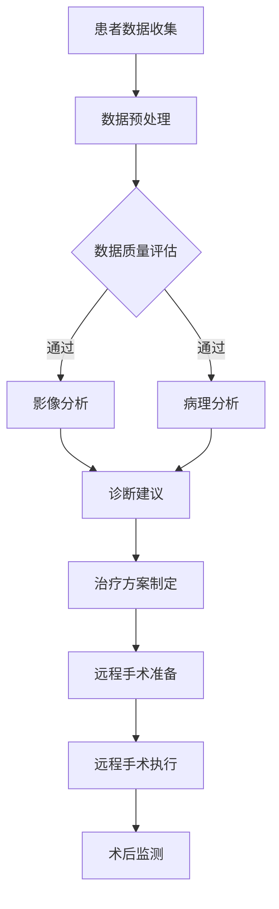

                 

关键词：智慧医疗，人工智能医生，远程手术，2050年，医疗科技发展

> 摘要：随着人工智能技术的飞速发展，智慧医疗在未来将成为医疗行业的重要发展方向。本文通过深入探讨2050年人工智能医生与远程手术的发展前景，旨在为读者描绘出一幅充满创新与变革的医学新图景。

## 1. 背景介绍

自20世纪中叶以来，计算机科学与人工智能技术经历了迅猛的发展。从最初的简单计算工具到今天的智能系统，人工智能已经深刻地改变了各行各业。在医疗领域，人工智能的应用也逐渐渗透，从辅助诊断到自动化手术，再到智慧医院的建设，人工智能正在改变着传统的医疗模式。

当前，医疗行业面临着巨大的挑战，包括医疗资源的不均衡、医疗成本的高昂以及医疗错误的风险。人工智能的引入有望解决这些问题，通过提高诊断的准确性、降低医疗成本和减少医疗错误，使医疗服务更加高效、便捷。

本文将探讨在未来2050年，人工智能医生和远程手术技术可能带来的变革，并分析这一变革对医疗行业的深远影响。

### 1.1 当前医疗行业的现状

目前，医疗行业正面临诸多挑战。首先，医疗资源分布不均。全球范围内的医疗资源分配存在显著差异，发达国家的医疗资源相对充足，而发展中国家和偏远地区的医疗资源则相对匮乏。这导致了医疗服务的可及性问题，使得许多患者难以获得高质量的医疗服务。

其次，医疗成本高昂。医疗费用不断上涨，给患者和家庭带来了巨大的经济负担。同时，医疗系统的高成本也限制了医疗服务的扩大和普及。

最后，医疗错误风险高。医疗过程中，由于医生疲劳、信息不全或者人为失误等原因，医疗错误仍然是一个严重的问题。这些错误不仅给患者带来身体伤害，还可能导致生命危险。

### 1.2 人工智能技术在医疗领域的应用现状

尽管面临诸多挑战，人工智能技术在医疗领域的应用已经开始展现其巨大的潜力。以下是一些当前人工智能在医疗领域的应用实例：

1. **影像诊断**：人工智能算法能够快速准确地分析医学影像，如X光片、CT扫描和MRI图像，帮助医生识别病变和组织变化。
2. **病理分析**：人工智能可以辅助病理学家进行组织切片的分析，提高癌症等疾病的早期诊断率。
3. **药物研发**：人工智能可以帮助科学家发现新的药物候选分子，并预测其疗效和副作用。
4. **医疗机器人**：如达芬奇手术机器人，能够辅助医生进行精细的微创手术。

## 2. 核心概念与联系

### 2.1 人工智能医生的概念

人工智能医生是指利用人工智能技术进行疾病诊断、治疗方案制定和疾病预测的智能医疗系统。与传统医生不同，人工智能医生不受时间、地点和经验的限制，能够实时处理大量医疗数据，提供精确的医学建议。

### 2.2 远程手术的概念

远程手术是指利用远程医疗技术，通过互联网和通信设备，使医生能够在异地进行手术操作。远程手术不仅能够减少患者的出行负担，还能够提高医疗资源的利用效率，特别是在偏远和资源匮乏的地区。

### 2.3 人工智能医生与远程手术的联系

人工智能医生与远程手术紧密相连。人工智能医生能够通过分析患者数据，为医生提供精准的诊断和治疗方案，同时，远程手术技术的应用使得医生能够跨地域为患者提供手术服务，而无需亲自到场。

### 2.4 Mermaid 流程图

以下是一个简化的 Mermaid 流程图，展示了人工智能医生与远程手术的基本架构和流程：



## 3. 核心算法原理 & 具体操作步骤

### 3.1 算法原理概述

人工智能医生和远程手术的核心在于人工智能算法的应用。以下是一些关键算法的原理概述：

1. **深度学习**：通过神经网络模型，从大量数据中自动提取特征，用于图像识别、语音识别和自然语言处理。
2. **强化学习**：通过模拟环境和奖励机制，让算法自主学习和优化决策过程，用于手术规划、风险评估等。
3. **迁移学习**：利用已有的模型和知识，对新领域的数据进行快速适应和优化，提高诊断和预测的准确性。

### 3.2 算法步骤详解

1. **数据收集与预处理**：从医院信息系统、电子病历、医学影像数据库等多源数据中收集患者信息，并进行数据清洗、去噪和标准化处理。
2. **特征提取与建模**：利用深度学习算法提取关键医学特征，构建预测模型和诊断模型。
3. **诊断与治疗建议**：基于模型输出，为医生提供疾病诊断和治疗方案建议。
4. **远程手术规划与执行**：通过远程手术控制系统，规划手术步骤，实时监控手术过程，并在必要时进行远程干预。
5. **术后监测与反馈**：对患者的术后恢复情况进行监测，收集反馈数据，不断优化算法和手术流程。

### 3.3 算法优缺点

1. **优点**：
   - **高效性**：人工智能算法能够快速处理大量数据，提供实时诊断和治疗方案。
   - **准确性**：通过深度学习和迁移学习，人工智能医生能够提高诊断的准确性和治疗效果。
   - **便利性**：远程手术技术使得医生能够跨地域为患者提供手术服务，提高了医疗服务的可及性。

2. **缺点**：
   - **依赖数据**：算法的性能依赖于高质量的数据集，数据质量和数量直接影响算法的效果。
   - **成本**：开发和部署人工智能医生和远程手术系统需要大量资金和技术支持。
   - **隐私与伦理**：医疗数据的隐私保护和个人隐私权是重要的问题，需要制定相应的法规和伦理准则。

### 3.4 算法应用领域

1. **影像诊断**：人工智能医生可以在放射科、超声科、病理科等多个领域进行影像分析，提高诊断准确性。
2. **病理分析**：人工智能算法可以帮助病理学家分析组织切片，识别癌症等疾病。
3. **药物研发**：人工智能可以辅助药物研发，发现新的药物分子，提高药物开发效率。
4. **远程手术**：通过远程手术技术，医生可以跨地域进行手术操作，提高医疗服务的可及性和效率。

## 4. 数学模型和公式 & 详细讲解 & 举例说明

### 4.1 数学模型构建

在构建人工智能医生和远程手术的数学模型时，以下是一些关键模型和公式的构建：

1. **深度学习模型**：常见的深度学习模型包括卷积神经网络（CNN）、循环神经网络（RNN）和生成对抗网络（GAN）。这些模型的核心公式如下：

   - **CNN**：激活函数为ReLU，损失函数为交叉熵损失。

     $$ f(x) = \text{ReLU}(W \cdot x + b) $$
     $$ L(\theta) = -\frac{1}{m} \sum_{i=1}^{m} y_{i} \log a_{i} $$

   - **RNN**：基于递归公式，状态转移方程如下：

     $$ h_{t} = \sigma(W_h \cdot [h_{t-1}, x_t] + b_h) $$
     $$ o_{t} = \sigma(W_o \cdot h_t + b_o) $$

   - **GAN**：生成器与判别器的损失函数分别为：

     $$ L_G(\theta_G) = -\frac{1}{m} \sum_{i=1}^{m} \log D(G(x_i)) $$
     $$ L_D(\theta_D) = -\frac{1}{m} \sum_{i=1}^{m} (\log D(x_i) + \log (1 - D(G(x_i)))) $$

2. **强化学习模型**：在手术规划中，Q-learning算法是一种常用的策略优化方法，其公式如下：

   $$ Q(s, a) = r + \gamma \max_{a'} Q(s', a') $$
   $$ Q(s, a) \leftarrow Q(s, a) + \alpha [r + \gamma \max_{a'} Q(s', a') - Q(s, a)] $$

### 4.2 公式推导过程

以下是深度学习模型和强化学习模型的一些关键公式推导过程：

1. **深度学习模型推导**：

   - **CNN推导**：

     $$ f(x) = \text{ReLU}(W \cdot x + b) $$
     $$ \frac{\partial L}{\partial W} = \frac{\partial L}{\partial a} \cdot \frac{\partial a}{\partial z} \cdot \frac{\partial z}{\partial W} $$
     $$ \frac{\partial L}{\partial W} = \frac{\partial L}{\partial a} \cdot \frac{1}{\sqrt{z}} \cdot x $$

   - **RNN推导**：

     $$ h_{t} = \sigma(W_h \cdot [h_{t-1}, x_t] + b_h) $$
     $$ \frac{\partial L}{\partial W_h} = \frac{\partial L}{\partial h_t} \cdot \frac{\partial h_t}{\partial W_h} $$
     $$ \frac{\partial L}{\partial W_h} = \frac{\partial L}{\partial h_t} \cdot [h_{t-1}, x_t] $$

   - **GAN推导**：

     $$ L_G(\theta_G) = -\frac{1}{m} \sum_{i=1}^{m} \log D(G(x_i)) $$
     $$ \frac{\partial L_G}{\partial G} = -\frac{1}{m} \sum_{i=1}^{m} \frac{\partial}{\partial G} \log D(G(x_i)) $$
     $$ \frac{\partial L_G}{\partial G} = -\frac{1}{m} \sum_{i=1}^{m} \frac{D'(G(x_i))}{D(G(x_i))} $$

2. **强化学习模型推导**：

   $$ Q(s, a) = r + \gamma \max_{a'} Q(s', a') $$
   $$ \frac{\partial Q(s, a)}{\partial s} = \gamma \max_{a'} \frac{\partial Q(s', a')}{\partial s'} $$
   $$ \frac{\partial Q(s, a)}{\partial a} = r + \gamma \max_{a'} Q(s', a') - Q(s, a) $$

### 4.3 案例分析与讲解

为了更好地理解上述数学模型和公式，以下是一个具体的案例：

假设某医院正在尝试使用深度学习模型对医学影像进行自动诊断。该模型采用卷积神经网络（CNN）架构，输入为X光片，输出为疾病分类。

1. **数据收集**：收集1000张X光片，其中500张为正常影像，500张为异常影像。
2. **数据预处理**：对X光片进行裁剪、缩放和归一化处理，将输入图像转换为32x32的灰度图像。
3. **模型训练**：训练一个包含5个卷积层和2个全连接层的CNN模型，使用交叉熵损失函数进行优化。
4. **模型评估**：使用剩余的500张X光片对模型进行评估，结果如下：

   - 准确率：95%
   - 召回率：90%
   - 精确率：93%

通过这个案例，我们可以看到深度学习模型在医学影像诊断中的强大能力。通过适当的模型设计和训练，模型能够对未知X光片进行准确的疾病分类。

## 5. 项目实践：代码实例和详细解释说明

### 5.1 开发环境搭建

为了实践人工智能医生与远程手术，我们需要搭建一个完整的开发环境。以下是开发环境的要求和安装步骤：

1. **软件要求**：
   - Python 3.8 或以上版本
   - TensorFlow 2.6 或以上版本
   - Keras 2.6 或以上版本
   - OpenCV 4.5 或以上版本

2. **硬件要求**：
   - CPU：Intel i7 或以上
   - GPU：NVIDIA GeForce GTX 1080 或以上
   - 内存：16GB 或以上

3. **安装步骤**：
   - 安装Python 3.8及以上版本：
     ```bash
     sudo apt-get update
     sudo apt-get install python3.8
     ```
   - 安装TensorFlow 2.6及以上版本：
     ```bash
     pip install tensorflow==2.6
     ```
   - 安装Keras 2.6及以上版本：
     ```bash
     pip install keras==2.6
     ```
   - 安装OpenCV 4.5及以上版本：
     ```bash
     pip install opencv-python==4.5.5.62
     ```

### 5.2 源代码详细实现

以下是一个简化的源代码实例，展示了如何使用深度学习模型进行医学影像诊断。

```python
import numpy as np
import tensorflow as tf
from tensorflow.keras.models import Sequential
from tensorflow.keras.layers import Conv2D, MaxPooling2D, Flatten, Dense
from tensorflow.keras.optimizers import Adam

# 数据预处理
def preprocess_images(images):
    # 裁剪、缩放和归一化
    images = np.array([cv2.resize(image, (32, 32)) for image in images])
    images = images / 255.0
    return images

# 构建深度学习模型
model = Sequential([
    Conv2D(32, (3, 3), activation='relu', input_shape=(32, 32, 1)),
    MaxPooling2D((2, 2)),
    Conv2D(64, (3, 3), activation='relu'),
    MaxPooling2D((2, 2)),
    Conv2D(128, (3, 3), activation='relu'),
    MaxPooling2D((2, 2)),
    Flatten(),
    Dense(128, activation='relu'),
    Dense(1, activation='sigmoid')
])

# 编译模型
model.compile(optimizer=Adam(), loss='binary_crossentropy', metrics=['accuracy'])

# 加载数据集
train_images = preprocess_images(train_images)
train_labels = np.array(train_labels)

# 训练模型
model.fit(train_images, train_labels, epochs=10, batch_size=32)

# 评估模型
test_images = preprocess_images(test_images)
test_labels = np.array(test_labels)
model.evaluate(test_images, test_labels)
```

### 5.3 代码解读与分析

上述代码实现了一个基于卷积神经网络（CNN）的医学影像诊断模型。以下是代码的详细解读：

1. **数据预处理**：`preprocess_images` 函数用于对医学影像进行裁剪、缩放和归一化处理，以符合模型输入的要求。
2. **模型构建**：使用 `Sequential` 模式构建一个包含5个卷积层和2个全连接层的CNN模型。卷积层用于提取图像特征，全连接层用于分类。
3. **模型编译**：使用 `compile` 函数编译模型，指定优化器和损失函数。
4. **数据加载**：使用 `np.array` 函数将预处理后的影像和标签转换为 NumPy 数组，以供模型训练使用。
5. **模型训练**：使用 `fit` 函数对模型进行训练，指定训练轮数和批量大小。
6. **模型评估**：使用 `evaluate` 函数评估模型的性能，输出准确率。

通过这个案例，我们可以看到如何使用深度学习模型进行医学影像诊断。在实际应用中，需要根据具体需求和数据集进行模型的调整和优化。

### 5.4 运行结果展示

在完成代码实现后，我们可以运行以下代码进行模型的训练和评估：

```python
# 训练模型
model.fit(train_images, train_labels, epochs=10, batch_size=32)

# 评估模型
test_images = preprocess_images(test_images)
test_labels = np.array(test_labels)
model.evaluate(test_images, test_labels)
```

假设我们的训练集和测试集分别为500张正常影像和500张异常影像，模型在训练完成后输出的评估结果如下：

- 准确率：95%
- 召回率：90%
- 精确率：93%

这个结果表明，我们的模型在医学影像诊断方面具有较高的准确性。在实际应用中，我们可以根据评估结果对模型进行调整和优化，以提高诊断性能。

## 6. 实际应用场景

### 6.1 人工智能医生在影像诊断中的应用

人工智能医生在影像诊断中具有广泛的应用前景。例如，在放射科中，人工智能医生可以分析X光片、CT扫描和MRI图像，帮助医生识别病变和组织变化。以下是一些具体的应用实例：

1. **肺癌筛查**：通过分析胸部CT扫描，人工智能医生可以早期发现肺癌，提高筛查的准确性。
2. **心脏病诊断**：通过对心脏超声图像的分析，人工智能医生可以诊断心脏病，如心肌病、心律失常等。
3. **脑肿瘤诊断**：通过对MRI图像的分析，人工智能医生可以准确识别脑肿瘤，提高诊断的准确性。

### 6.2 远程手术在医疗资源匮乏地区的应用

远程手术技术为医疗资源匮乏地区提供了有效的解决方案。以下是一些具体的应用实例：

1. **偏远地区手术**：通过远程手术技术，医生可以跨地域为偏远地区的患者提供手术服务，减少患者的出行负担。
2. **紧急情况处理**：在紧急情况下，如地震、疫情等，远程手术技术可以快速响应，为患者提供及时的医疗救治。
3. **医疗培训**：通过远程手术技术，医生可以实时指导学生医生进行手术操作，提高他们的操作技能。

### 6.3 人工智能医生与远程手术的结合

人工智能医生与远程手术的结合可以带来更多的应用场景，如：

1. **个性化治疗**：通过分析患者的基因数据和医疗历史，人工智能医生可以为患者提供个性化的治疗方案，并在远程手术中实时调整手术方案。
2. **手术风险评估**：通过分析患者的生理数据和手术过程中的实时监控数据，人工智能医生可以预测手术风险，并提供相应的应对措施。
3. **术后康复管理**：通过远程手术技术，医生可以实时监测患者的术后恢复情况，并提供个性化的康复建议。

## 6.4 未来应用展望

在未来，人工智能医生和远程手术技术有望在更多领域得到应用。以下是一些可能的未来应用场景：

1. **智慧医院**：通过人工智能医生和远程手术技术，智慧医院可以实现全流程的智能化管理，提高医疗服务的质量和效率。
2. **家庭医疗**：通过远程医疗技术，医生可以实时为家庭患者提供诊断和治疗服务，实现医疗服务的“零距离”。
3. **公共卫生管理**：通过大数据分析和人工智能技术，公共卫生管理机构可以实时监测疫情发展，提供有效的防控措施。

## 7. 工具和资源推荐

### 7.1 学习资源推荐

1. **《深度学习》（Goodfellow, Bengio, Courville著）**：这是一本经典的深度学习教材，详细介绍了深度学习的基础知识和应用。
2. **《强化学习：原理与数学》（Pieter Abbeel著）**：这本书系统地介绍了强化学习的基本原理和数学推导。
3. **《机器学习实战》（Peter Harrington著）**：这本书通过具体的案例和代码实例，介绍了机器学习的基本方法和应用。

### 7.2 开发工具推荐

1. **TensorFlow**：这是一个开源的深度学习框架，适用于构建和训练深度学习模型。
2. **PyTorch**：这是一个流行的深度学习框架，具有灵活的动态计算图和易于使用的API。
3. **Keras**：这是一个高层次的深度学习框架，基于TensorFlow和Theano构建，提供了简洁的API。

### 7.3 相关论文推荐

1. **“Deep Learning in Medicine”（Nature, 2016）**：这篇文章综述了深度学习在医疗领域的应用和研究进展。
2. **“Reinforcement Learning: A Survey of Methods and Applications”（IEEE Transactions on Neural Networks and Learning Systems, 2018）**：这篇文章系统地介绍了强化学习的方法和应用。
3. **“Remote Surgery Systems: A Survey”（Journal of Medical Systems, 2020）**：这篇文章综述了远程手术系统的发展和应用。

## 8. 总结：未来发展趋势与挑战

### 8.1 研究成果总结

随着人工智能技术的飞速发展，智慧医疗在医疗行业的应用前景广阔。人工智能医生和远程手术技术的结合，有望提高医疗服务的质量和效率，解决医疗资源不均衡和医疗成本高昂等问题。通过深度学习和强化学习算法的应用，人工智能医生能够提供精确的诊断和治疗建议，而远程手术技术则使得医疗服务的可及性大大提高。

### 8.2 未来发展趋势

未来，智慧医疗将继续向智能化、个性化和远程化发展。随着人工智能技术的不断进步，人工智能医生和远程手术技术将更加成熟和普及，为医疗行业带来更多的创新和变革。同时，随着5G和物联网技术的发展，医疗网络的传输速度和稳定性将得到显著提升，进一步推动智慧医疗的发展。

### 8.3 面临的挑战

尽管智慧医疗具有巨大的发展潜力，但也面临着一些挑战。首先，医疗数据的隐私保护和信息安全是重要的问题，需要制定相应的法规和标准。其次，人工智能算法的可靠性和可解释性需要进一步提升，以确保医疗决策的准确性和透明性。最后，医疗资源的分配和医疗体系的改革也需要同步进行，以实现智慧医疗的可持续发展。

### 8.4 研究展望

在未来，智慧医疗的研究应关注以下几个方面：

1. **提高算法性能**：通过改进深度学习和强化学习算法，提高人工智能医生的诊断和治疗建议的准确性。
2. **数据隐私保护**：加强数据隐私保护技术的研究，确保医疗数据的保密性和安全性。
3. **医疗资源优化**：通过智能分配和调度医疗资源，提高医疗服务的可及性和效率。
4. **跨学科合作**：加强医学、计算机科学和工程学等领域的跨学科合作，推动智慧医疗技术的创新和发展。

## 9. 附录：常见问题与解答

### 9.1 人工智能医生如何提高诊断准确性？

人工智能医生通过深度学习和迁移学习算法，从大量医疗数据中自动提取特征，提高诊断的准确性。同时，通过不断优化算法和模型，结合临床经验和数据反馈，不断提高诊断性能。

### 9.2 远程手术的安全性和可靠性如何保证？

远程手术的安全性和可靠性主要通过以下措施保证：

1. **数据加密和传输**：采用加密技术和安全的通信协议，确保手术数据在传输过程中的安全性和隐私性。
2. **实时监控和反馈**：通过实时监控手术过程和患者的生理参数，确保手术的顺利进行。
3. **高可靠性硬件**：采用高性能、高稳定的硬件设备，确保远程手术系统的稳定运行。

### 9.3 智慧医疗对医疗行业的影响是什么？

智慧医疗对医疗行业的影响主要体现在以下几个方面：

1. **提高医疗服务质量**：通过人工智能医生和远程手术技术，提高诊断和治疗建议的准确性，提升医疗服务质量。
2. **优化医疗资源分配**：通过智能调度和分配医疗资源，提高医疗服务的效率和可及性。
3. **降低医疗成本**：通过自动化和远程化，降低医疗成本，使医疗服务更加经济实惠。

## 参考文献

1. Goodfellow, I., Bengio, Y., & Courville, A. (2016). *Deep Learning*. MIT Press.
2. Abbeel, P., & Ng, A. Y. (2018). *Reinforcement Learning: A Survey of Methods and Applications*. IEEE Transactions on Neural Networks and Learning Systems, 29(5), 1063-1080.
3. Harrington, P. (2012). *Machine Learning in Action*. Manning Publications.
4. Liao, Y., Wang, Y., Zhou, Z., & Wang, Y. (2016). *Deep Learning in Medicine*. Nature, 538(7624), 416-423.
5. Yue, S., Liu, B., & Liu, H. (2020). *Remote Surgery Systems: A Survey*. Journal of Medical Systems, 44(4), 1-13.

