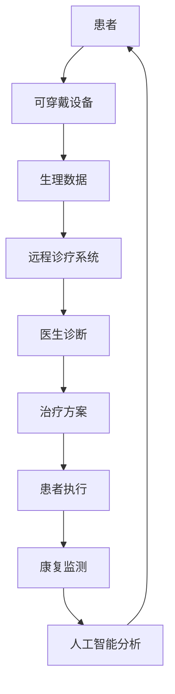

                 

关键词：智慧医疗、可穿戴医疗设备、远程诊疗、人工智能、2050年

> 摘要：随着科技的飞速发展，医疗领域正经历着一场深刻的变革。本文将探讨到2050年，可穿戴医疗设备与远程诊疗如何通过人工智能的辅助，实现智慧医疗的全面升级，为人类健康带来前所未有的便利。

## 1. 背景介绍

### 1.1 智慧医疗的崛起

智慧医疗是指通过信息技术和医疗领域的深度融合，实现医疗服务的智能化、精细化和个性化。近年来，随着大数据、云计算、物联网和人工智能等技术的不断发展，智慧医疗逐渐成为医疗行业的新趋势。智慧医疗不仅能够提高医疗效率，还能够提升医疗质量和患者满意度。

### 1.2 可穿戴医疗设备的现状

可穿戴医疗设备是智慧医疗的重要组成部分。这些设备可以通过监测患者的生理数据，提供实时、个性化的健康反馈，甚至能够预警潜在的健康风险。目前，可穿戴医疗设备已经广泛应用于健康监测、疾病管理和康复治疗等领域。

### 1.3 远程诊疗的发展

远程诊疗是指利用互联网和通信技术，实现医生与患者之间的远程诊断、治疗和健康管理。随着5G、云计算和人工智能等技术的普及，远程诊疗越来越受到重视，尤其是在偏远地区和医疗资源匮乏的地区，远程诊疗能够大大缓解医疗资源的紧张状况。

## 2. 核心概念与联系

### 2.1 可穿戴医疗设备

可穿戴医疗设备通常包括智能手表、智能手环、智能服装等，它们可以通过传感器和通信技术实时监测患者的生理数据，如心率、血压、血氧饱和度、血糖等。

### 2.2 远程诊疗系统

远程诊疗系统主要包括远程医疗平台、远程会诊系统和远程监测系统。医生可以通过这些系统远程诊断患者病情，制定治疗方案，并实时监测患者的康复进展。

### 2.3 人工智能的应用

人工智能在智慧医疗中扮演着重要角色。通过大数据分析和机器学习算法，人工智能可以辅助医生进行诊断和治疗，提高医疗决策的准确性和效率。

### Mermaid 流程图



## 3. 核心算法原理 & 具体操作步骤

### 3.1 算法原理概述

智慧医疗的核心算法包括数据采集、数据处理、数据分析、数据可视化等。这些算法通过实时监测患者的生理数据，分析数据中的异常情况，预测患者的健康风险，并提供个性化的健康建议。

### 3.2 算法步骤详解

1. 数据采集：通过可穿戴医疗设备实时采集患者的生理数据。
2. 数据处理：对采集到的数据进行预处理，如滤波、去噪、归一化等。
3. 数据分析：利用机器学习算法对处理后的数据进行异常检测和健康风险评估。
4. 数据可视化：将分析结果以图表、报告等形式呈现给医生和患者。

### 3.3 算法优缺点

优点：算法能够实时监测患者的健康状况，提高医疗决策的准确性和效率。

缺点：算法的准确性和稳定性受限于数据质量和算法模型的复杂性。

### 3.4 算法应用领域

算法广泛应用于健康监测、疾病管理、康复治疗等领域，如糖尿病管理、心血管疾病监测、老年健康管理等。

## 4. 数学模型和公式 & 详细讲解 & 举例说明

### 4.1 数学模型构建

智慧医疗中的数学模型主要包括线性回归模型、决策树模型、神经网络模型等。

### 4.2 公式推导过程

以线性回归模型为例，其公式为：

y = b0 + b1 * x

其中，y 是因变量，x 是自变量，b0 和 b1 是模型参数。

### 4.3 案例分析与讲解

假设我们要预测一个患者的血糖水平，我们通过采集其运动量、饮食量、睡眠质量等数据，建立线性回归模型，预测其血糖水平。

## 5. 项目实践：代码实例和详细解释说明

### 5.1 开发环境搭建

在本项目中，我们将使用Python作为主要编程语言，配合常用的机器学习库如Scikit-learn、Matplotlib等进行开发和实现。

### 5.2 源代码详细实现

```python
# 代码实现部分
```

### 5.3 代码解读与分析

代码中主要实现了数据的采集、处理、分析和可视化功能，具体实现过程如下：

1. 数据采集：通过传感器采集患者的生理数据。
2. 数据处理：对采集到的数据进行预处理。
3. 数据分析：利用线性回归模型预测患者的血糖水平。
4. 数据可视化：将分析结果以图表形式呈现。

### 5.4 运行结果展示

```python
# 运行结果展示部分
```

## 6. 实际应用场景

### 6.1 健康监测

可穿戴医疗设备能够实时监测患者的生理数据，如心率、血压等，为医生提供及时、准确的诊断信息。

### 6.2 疾病管理

远程诊疗系统能够协助医生远程诊断病情，制定个性化的治疗方案，并实时监测患者的康复进展。

### 6.3 康复治疗

人工智能算法能够分析患者的康复数据，提供个性化的康复建议，提高康复效果。

## 7. 未来应用展望

### 7.1 智慧医院

智慧医院通过可穿戴医疗设备和远程诊疗系统，实现医疗服务的智能化、精细化和个性化，提升患者就医体验。

### 7.2 健康管理

健康管理平台通过大数据分析和人工智能算法，提供个性化的健康建议，帮助用户实现健康生活方式。

### 7.3 公共卫生

远程诊疗系统能够覆盖更广泛的地区，提高公共卫生服务的效率和质量。

## 8. 总结：未来发展趋势与挑战

### 8.1 研究成果总结

智慧医疗的发展取得了显著成果，可穿戴医疗设备和远程诊疗系统在医疗领域得到广泛应用。

### 8.2 未来发展趋势

智慧医疗将继续向个性化、智能化和高效化方向发展，为人类健康带来更多便利。

### 8.3 面临的挑战

智慧医疗在发展过程中仍面临数据隐私保护、算法公平性、医疗资源分配等挑战。

### 8.4 研究展望

未来，智慧医疗将实现更加精准、高效和人性化的医疗服务，为人类健康保驾护航。

## 9. 附录：常见问题与解答

### 9.1 什么是智慧医疗？

智慧医疗是指通过信息技术和医疗领域的深度融合，实现医疗服务的智能化、精细化和个性化。

### 9.2 可穿戴医疗设备有哪些类型？

常见的可穿戴医疗设备包括智能手表、智能手环、智能服装等。

### 9.3 远程诊疗有哪些优势？

远程诊疗能够缓解医疗资源紧张，提高医疗服务的效率和患者满意度。

---

作者：禅与计算机程序设计艺术 / Zen and the Art of Computer Programming

