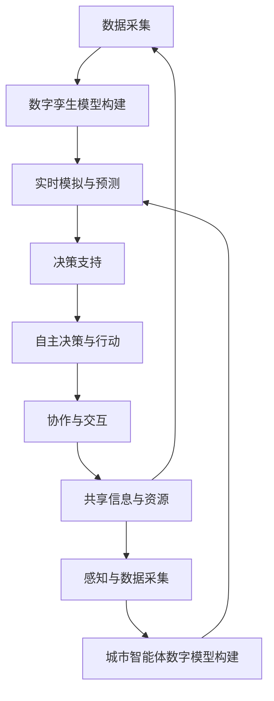
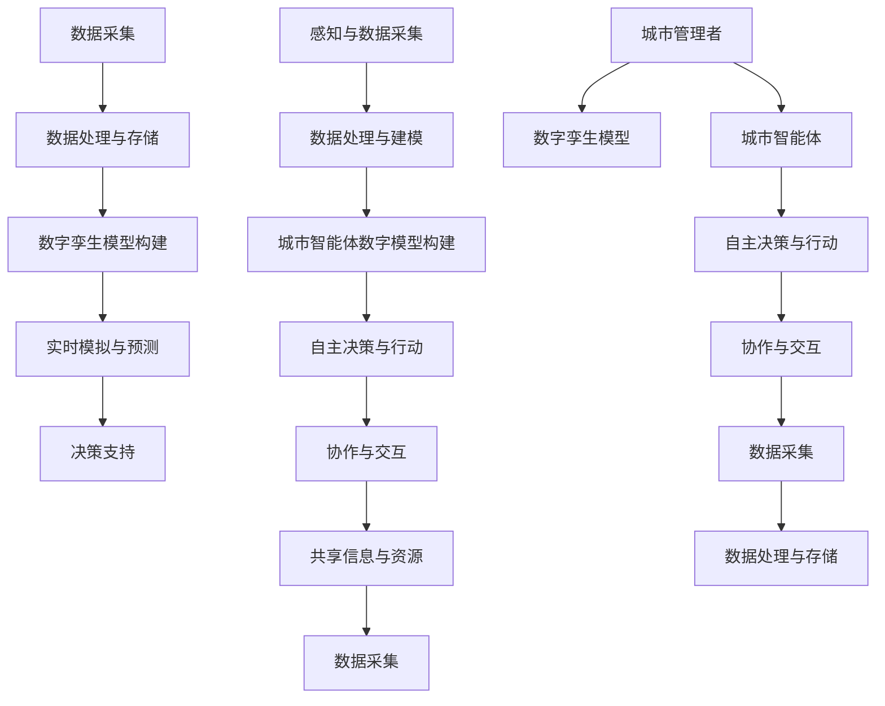

                 

### 1. 背景介绍

智慧城市是21世纪城市化进程的重要方向，它利用信息技术、物联网、大数据分析等手段，实现城市资源的优化配置和智能管理。随着数字技术的飞速发展，智慧城市正从概念走向实际应用，为人们提供更加便捷、高效、可持续的居住环境。然而，当前智慧城市的建设仍然面临着许多挑战，如数据孤岛、技术瓶颈、安全隐私等问题。

数字孪生（Digital Twin）是一种新兴的技术，它通过创建现实世界的虚拟映射，实现对物理实体的精准模拟和分析。数字孪生在城市规划、建设、运营等环节中具有广泛的应用前景，被认为是智慧城市的重要支撑技术之一。

城市智能体（Urban Intelligent Agent）则是一种基于人工智能技术的虚拟实体，它能够模拟人类在城市环境中的行为，进行自主决策和协作。城市智能体可以应用于交通管理、环境保护、公共安全等多个领域，有望提升城市的整体运行效率。

本文旨在探讨数字孪生和城市智能体在智慧城市中的应用前景，分析其技术原理、实现方法、优缺点以及未来发展趋势。通过本文的探讨，希望能够为智慧城市的建设提供一些有益的思路和借鉴。

## 1.1 智慧城市的现状与发展

智慧城市的发展起源于20世纪末，随着信息技术、物联网、大数据、云计算等技术的不断进步，智慧城市理念逐渐从概念走向实践。目前，全球已有数百个城市宣布建设智慧城市，包括纽约、伦敦、新加坡、上海等国际大都市。

智慧城市的核心目标是提升城市运行效率和居民生活质量，具体体现在以下几个方面：

1. **智能交通管理**：通过交通大数据分析和智能调度系统，优化交通流量，减少拥堵，提高公共交通效率。
2. **智慧能源管理**：利用物联网技术实现能源的智能监测和优化，降低能耗，促进可持续发展。
3. **智能环境监测**：实时监测空气质量、水质等环境参数，快速响应环境问题，保障公共健康。
4. **公共安全**：通过视频监控、智能报警系统等手段，提高城市安全防护能力，预防犯罪行为。
5. **智慧医疗**：利用大数据和人工智能技术，提升医疗服务质量，实现健康数据的智能分析和预测。

尽管智慧城市的发展取得了一定的成果，但仍然面临着诸多挑战。首先，智慧城市的建设需要大量的技术支持和资金投入，这对于许多城市来说是一个巨大的负担。其次，智慧城市中的数据孤岛问题仍然严重，不同部门、不同系统之间的数据难以整合，导致信息不对称和资源浪费。此外，智慧城市的安全和隐私问题也备受关注，如何保障数据的安全性和隐私性是智慧城市建设的重中之重。

## 1.2 数字孪生的概念与发展

数字孪生（Digital Twin）是一种通过创建现实世界的虚拟映射，实现对物理实体的实时模拟、分析和优化的技术。数字孪生技术起源于20世纪80年代的制造业领域，最初用于生产设备的虚拟仿真和故障预测。随着物联网、大数据、云计算等技术的发展，数字孪生技术逐渐扩展到城市规划、建筑、交通、能源等多个领域。

### 数字孪生技术原理

数字孪生技术的基本原理可以分为以下几个步骤：

1. **数据采集**：通过传感器、摄像头、无人机等设备，实时采集物理实体（如建筑物、道路、设备等）的状态数据。
2. **数据传输**：将采集到的数据通过物联网技术传输到云计算平台，进行存储和处理。
3. **数据处理**：利用大数据分析和人工智能算法，对传输上来的数据进行实时分析和建模，生成数字孪生模型。
4. **模型仿真**：通过数字孪生模型，对物理实体的运行状态进行仿真和分析，预测未来的发展趋势。
5. **决策支持**：根据仿真结果，为城市管理者提供决策支持，优化城市运行和管理。

### 数字孪生技术的应用领域

数字孪生技术在智慧城市建设中具有广泛的应用前景，主要体现在以下几个方面：

1. **城市规划**：通过数字孪生技术，可以对城市进行虚拟建模，模拟不同规划方案对城市的影响，优化城市规划。
2. **建筑管理**：利用数字孪生技术，实现对建筑物的实时监测和管理，提高建筑物的使用效率和安全性。
3. **交通管理**：通过数字孪生技术，实现对交通流量和交通设施的实时监测，优化交通调度和运输效率。
4. **环境监测**：利用数字孪生技术，实现对空气质量、水质等环境参数的实时监测和分析，提高环境管理水平。
5. **公共安全**：通过数字孪生技术，实现对城市安全事件的实时监测和预警，提高公共安全保障能力。

### 数字孪生技术的挑战

尽管数字孪生技术在智慧城市建设中具有巨大的潜力，但也面临着一些挑战：

1. **数据质量和完整性**：数字孪生模型的准确性依赖于采集到的数据质量，如何确保数据的质量和完整性是一个重要问题。
2. **计算资源和存储需求**：数字孪生技术需要大量的计算资源和存储空间，这对于许多城市来说是一个巨大的负担。
3. **隐私和安全问题**：数字孪生技术涉及到大量的敏感数据，如何保障数据的安全性和隐私性是一个重要课题。

## 1.3 城市智能体的概念与发展

城市智能体（Urban Intelligent Agent）是一种基于人工智能技术的虚拟实体，它能够模拟人类在城市环境中的行为，进行自主决策和协作。城市智能体是智慧城市中的一种重要技术手段，它通过智能化的方式解决城市运行和管理中的各种问题。

### 城市智能体技术原理

城市智能体技术的基本原理可以分为以下几个步骤：

1. **感知与数据采集**：城市智能体通过传感器、摄像头、物联网设备等感知设备，实时采集城市环境中的各种数据，如交通流量、环境参数、公共安全事件等。
2. **数据处理与建模**：城市智能体利用大数据分析和机器学习算法，对采集到的数据进行处理和建模，构建出城市环境的数字模型。
3. **自主决策与行动**：根据数字模型和预定的决策策略，城市智能体能够自主地做出决策，并采取相应的行动，如交通调度、资源分配、安全预警等。
4. **协作与交互**：城市智能体之间通过通信和协作，共享信息和资源，共同解决城市运行中的复杂问题。

### 城市智能体的应用领域

城市智能体在智慧城市中具有广泛的应用前景，主要体现在以下几个方面：

1. **交通管理**：通过城市智能体实现智能交通调度，优化交通流量，减少拥堵，提高公共交通效率。
2. **环境监测与治理**：利用城市智能体实现对空气质量、水质等环境参数的实时监测和预警，提高环境治理效果。
3. **公共安全**：通过城市智能体实现对城市安全事件的实时监测和预警，提高公共安全保障能力。
4. **城市规划与建设**：利用城市智能体模拟和预测城市规划方案对城市运行的影响，优化城市规划。
5. **公共服务**：通过城市智能体提供智能化的公共服务，如智能医疗、智能家居、智能教育等，提高居民生活质量。

### 城市智能体的挑战

尽管城市智能体技术在智慧城市中具有巨大的潜力，但也面临着一些挑战：

1. **数据质量和准确性**：城市智能体依赖于采集到的数据，如何确保数据的质量和准确性是关键问题。
2. **计算资源和能耗**：城市智能体需要大量的计算资源和能源支持，这对于城市的可持续发展提出了挑战。
3. **隐私和安全问题**：城市智能体涉及到大量的敏感数据，如何保障数据的安全性和隐私性是一个重要课题。

## 1.4 数字孪生与城市智能体的关系

数字孪生和城市智能体是智慧城市建设中的两种重要技术手段，它们既有区别，又有联系。数字孪生侧重于创建现实世界的虚拟映射，实现对物理实体的实时模拟和分析；而城市智能体则侧重于自主决策和协作，通过模拟人类行为解决城市运行中的复杂问题。

### 数字孪生与城市智能体的联系

数字孪生和城市智能体之间存在紧密的联系，主要体现在以下几个方面：

1. **数据共享与融合**：数字孪生技术为城市智能体提供了丰富的数据资源，城市智能体可以通过数字孪生模型获取物理实体的实时状态数据，用于决策和行动。
2. **协同工作**：数字孪生和城市智能体可以协同工作，数字孪生技术可以模拟城市环境，城市智能体则可以在模拟环境中进行决策和行动，优化城市运行。
3. **技术互补**：数字孪生侧重于对物理实体的模拟和分析，城市智能体侧重于自主决策和协作，两者技术互补，共同提升智慧城市的运行效率。

### 数字孪生与城市智能体的区别

尽管数字孪生和城市智能体都是为了提升智慧城市运行效率，但它们在技术原理和应用范围上存在一定的区别：

1. **技术原理**：数字孪生侧重于虚拟映射和实时模拟，城市智能体侧重于自主决策和协作。
2. **应用范围**：数字孪生主要应用于城市规划、建设、运营等环节，城市智能体则主要应用于交通管理、环境监测、公共安全等具体领域。

### 数字孪生与城市智能体的融合发展趋势

随着数字技术和人工智能技术的不断进步，数字孪生和城市智能体之间的融合发展趋势日益明显，未来将呈现以下几个特点：

1. **一体化平台**：数字孪生和城市智能体将整合到统一的智慧城市平台上，实现数据共享和协同工作。
2. **智能化管理**：数字孪生和城市智能体将共同构建智能化的城市管理体系，提升城市运行效率和居民生活质量。
3. **自主决策与协作**：数字孪生和城市智能体将实现更高级别的自主决策和协作，解决城市运行中的复杂问题。

总之，数字孪生和城市智能体是智慧城市建设中的两种重要技术手段，它们既有区别，又有联系。通过融合数字孪生和城市智能体技术，可以构建一个更加智能、高效、可持续的智慧城市。

## 2. 核心概念与联系

在探讨未来的智慧城市时，数字孪生和城市智能体是两个关键的核心概念。为了更好地理解这两者的原理和架构，我们需要通过一个详细的流程图来展示它们的基本原理和相互关系。

### 2.1 数字孪生的基本原理与架构

数字孪生（Digital Twin）是一种通过虚拟映射现实世界的方法，实现对物理实体（如建筑物、基础设施、交通工具等）的实时模拟和分析。其基本原理和架构可以分为以下几个主要部分：

1. **数据采集**：通过传感器、物联网设备等，实时采集物理实体的各种状态数据，如温度、湿度、位置、速度等。
   ```mermaid
   node1[数据采集]  
   node2[物联网设备]
   node3[传感器]
   node1 --> node2
   node1 --> node3
   ```

2. **数据处理与存储**：将采集到的数据进行处理和存储，通常利用云计算和大数据技术来实现。
   ```mermaid
   node2 --> node4[数据处理]
   node3 --> node4
   node4 --> node5[数据存储]
   ```

3. **数字模型构建**：利用大数据分析和机器学习算法，将处理后的数据转换为数字模型，实现对物理实体的虚拟映射。
   ```mermaid
   node5 --> node6[数字模型构建]
   ```

4. **实时模拟与预测**：通过数字模型，实时模拟物理实体的运行状态，预测其未来的发展趋势。
   ```mermaid
   node6 --> node7[实时模拟与预测]
   ```

5. **决策支持**：根据模拟结果，为城市管理者提供决策支持，优化城市运行和管理。
   ```mermaid
   node7 --> node8[决策支持]
   ```

### 2.2 城市智能体的基本原理与架构

城市智能体（Urban Intelligent Agent）是一种基于人工智能的虚拟实体，它能够模拟人类在城市环境中的行为，进行自主决策和协作。其基本原理和架构可以分为以下几个主要部分：

1. **感知与数据采集**：城市智能体通过传感器、摄像头、物联网设备等，实时采集城市环境中的各种数据，如交通流量、环境参数、公共安全事件等。
   ```mermaid
   node9[感知与数据采集]
   node10[传感器]
   node11[摄像头]
   node9 --> node10
   node9 --> node11
   ```

2. **数据处理与建模**：城市智能体利用大数据分析和机器学习算法，对采集到的数据进行处理和建模，构建出城市环境的数字模型。
   ```mermaid
   node10 --> node12[数据处理]
   node11 --> node12
   node12 --> node13[数字模型构建]
   ```

3. **自主决策与行动**：根据数字模型和预定的决策策略，城市智能体能够自主地做出决策，并采取相应的行动，如交通调度、资源分配、安全预警等。
   ```mermaid
   node13 --> node14[自主决策与行动]
   ```

4. **协作与交互**：城市智能体之间通过通信和协作，共享信息和资源，共同解决城市运行中的复杂问题。
   ```mermaid
   node14 --> node15[协作与交互]
   ```

### 2.3 数字孪生与城市智能体的联系

数字孪生和城市智能体之间存在着密切的联系，它们相互依存、共同推动智慧城市的发展。以下是一个展示它们基本原理和相互关系的流程图：



### 2.4 整体架构

将数字孪生和城市智能体整合到一个整体架构中，可以更清晰地展示它们在智慧城市中的作用和相互关系。以下是一个简单的整体架构图：



通过这个整体架构图，我们可以看到数字孪生和城市智能体共同构成了智慧城市的核心组成部分，它们通过数据共享和协作，实现城市运行的智能化和高效化。这种架构不仅提升了城市的管理水平，也为城市居民提供了更加便捷和舒适的生活环境。

### 3. 核心算法原理 & 具体操作步骤

在智慧城市的建设中，数字孪生和城市智能体技术的实现依赖于一系列核心算法，这些算法涵盖了数据采集、处理、建模、模拟、预测和决策等关键环节。以下将详细介绍这些核心算法的原理和具体操作步骤。

#### 3.1 数据采集算法

数据采集是数字孪生和城市智能体技术的第一步，它决定了后续处理和分析的准确性和效率。常用的数据采集算法包括传感器采集算法和物联网采集算法。

1. **传感器采集算法**：
   - **原理**：传感器采集算法利用各种物理传感器（如温度传感器、湿度传感器、摄像头等）实时监测物理实体的状态，并将采集到的数据传输到数据处理系统。
   - **操作步骤**：
     1. 确定监测目标（如建筑物、道路、交通设施等）。
     2. 选择合适的传感器（如温度传感器、摄像头等）。
     3. 安装传感器并确保其正常工作。
     4. 数据传输：传感器将采集到的数据通过有线或无线方式传输到数据处理中心。
     5. 数据校验：对传输上来的数据进行校验，确保数据的准确性和完整性。

2. **物联网采集算法**：
   - **原理**：物联网采集算法通过物联网设备（如智能传感器、智能设备等）实现数据的实时采集和传输，利用物联网协议（如MQTT、CoAP等）确保数据传输的可靠性和低延迟。
   - **操作步骤**：
     1. 确定物联网设备类型和数量。
     2. 设备部署：将物联网设备安装在需要监测的物理实体上。
     3. 设备配置：配置物联网设备的网络参数，确保其能够接入互联网。
     4. 数据采集：物联网设备开始采集数据，并将数据传输到云计算平台。
     5. 数据同步：定期同步物联网设备上的数据，以确保数据的实时性和一致性。

#### 3.2 数据处理算法

数据处理是数字孪生和城市智能体技术中至关重要的一环，它决定了数据的质量和模型的准确性。常用的数据处理算法包括数据清洗、数据整合、数据挖掘等。

1. **数据清洗算法**：
   - **原理**：数据清洗算法用于去除数据中的噪声、缺失值和异常值，提高数据的质量和准确性。
   - **操作步骤**：
     1. 数据预处理：去除重复数据、缺失值和异常值。
     2. 数据标准化：将不同数据源的数据进行统一处理，确保数据类型和单位的一致性。
     3. 数据校验：对清洗后的数据进行验证，确保数据的准确性和完整性。

2. **数据整合算法**：
   - **原理**：数据整合算法用于将来自不同数据源的数据进行合并，构建统一的数据视图，便于后续分析和建模。
   - **操作步骤**：
     1. 数据识别：识别和标记不同数据源的数据。
     2. 数据映射：将不同数据源的数据进行映射，构建统一的数据模型。
     3. 数据合并：将映射后的数据进行合并，构建统一的数据集。

3. **数据挖掘算法**：
   - **原理**：数据挖掘算法用于从大量数据中提取有价值的信息和知识，为决策提供支持。
   - **操作步骤**：
     1. 数据选择：选择与目标问题相关的数据。
     2. 数据预处理：对数据进行清洗、整合和标准化。
     3. 特征提取：从数据中提取有用的特征信息。
     4. 模型训练：利用机器学习和统计方法，对数据进行分析和建模。
     5. 模型评估：评估模型的准确性和有效性。

#### 3.3 建模算法

建模是数字孪生和城市智能体技术中的核心步骤，它决定了模型的准确性和实用性。常用的建模算法包括物理模型、数据驱动模型和混合模型等。

1. **物理模型**：
   - **原理**：物理模型基于物理定律和工程原理，对物理实体进行建模，描述其实际运行状态和特性。
   - **操作步骤**：
     1. 确定建模目标：明确需要建模的物理实体和目标属性。
     2. 收集物理参数：收集与建模目标相关的物理参数。
     3. 建立数学模型：根据物理定律和工程原理，建立数学模型。
     4. 模型验证：通过实验或仿真验证模型的准确性和可靠性。

2. **数据驱动模型**：
   - **原理**：数据驱动模型基于历史数据，利用机器学习和统计方法，对物理实体进行建模。
   - **操作步骤**：
     1. 数据准备：收集和处理建模所需的历史数据。
     2. 特征选择：从数据中提取有用的特征信息。
     3. 模型训练：利用机器学习和统计方法，对数据进行分析和建模。
     4. 模型优化：调整模型参数，提高模型的准确性和鲁棒性。

3. **混合模型**：
   - **原理**：混合模型结合了物理模型和数据驱动模型的优点，通过结合物理定律和历史数据，对物理实体进行建模。
   - **操作步骤**：
     1. 确定建模目标：明确需要建模的物理实体和目标属性。
     2. 收集物理参数和历
```less
### 3.3 算法优缺点

在智慧城市的建设中，数字孪生和城市智能体技术的实现依赖于一系列核心算法。这些算法在提升城市运行效率、优化资源配置和保障公共安全等方面具有显著的优势，但也存在一些不足之处。

#### 3.3.1 数字孪生算法的优缺点

**优点**：
1. **实时模拟与预测**：数字孪生算法能够实时模拟物理实体的运行状态，预测其未来的发展趋势，为城市管理者提供准确的决策支持。
2. **资源优化**：通过数字孪生技术，可以实现城市资源的优化配置，如交通流量、能源消耗等，提高资源利用效率。
3. **预防性维护**：数字孪生技术可以实现对物理实体的实时监测和预测性维护，降低设备故障率和维护成本。

**缺点**：
1. **数据质量和完整性**：数字孪生算法的准确性依赖于采集到的数据质量，如何确保数据的质量和完整性是一个重要问题。
2. **计算资源和存储需求**：数字孪生技术需要大量的计算资源和存储空间，这对于许多城市来说是一个巨大的负担。
3. **隐私和安全问题**：数字孪生技术涉及到大量的敏感数据，如何保障数据的安全性和隐私性是一个重要课题。

#### 3.3.2 城市智能体算法的优缺点

**优点**：
1. **自主决策与协作**：城市智能体算法能够模拟人类在城市环境中的行为，进行自主决策和协作，解决城市运行中的复杂问题。
2. **实时响应**：城市智能体算法可以实时采集城市环境数据，对突发事件进行快速响应，提高城市运行效率。
3. **个性化服务**：城市智能体算法可以根据用户行为和需求，提供个性化的公共服务，提高居民生活质量。

**缺点**：
1. **数据质量和准确性**：城市智能体算法依赖于采集到的数据，如何确保数据的质量和准确性是关键问题。
2. **计算资源和能耗**：城市智能体算法需要大量的计算资源和能源支持，这对于城市的可持续发展提出了挑战。
3. **隐私和安全问题**：城市智能体算法涉及到大量的敏感数据，如何保障数据的安全性和隐私性是一个重要课题。

#### 3.3.3 数字孪生与城市智能体算法的融合优缺点

**优点**：
1. **数据共享与协同**：数字孪生和城市智能体算法可以共享数据资源，实现协同工作，提高城市管理的整体效率。
2. **智能化决策**：通过融合数字孪生和城市智能体算法，可以实现更高级别的智能化决策，优化城市运行和管理。
3. **综合效益**：数字孪生和城市智能体算法的结合，可以带来更大的综合效益，如提高资源利用率、减少环境污染等。

**缺点**：
1. **系统复杂性**：数字孪生和城市智能体算法的融合增加了系统的复杂性，需要更多的技术支持和运维。
2. **数据安全和隐私**：如何保障融合系统中的数据安全和隐私是一个重要挑战。
3. **成本投入**：数字孪生和城市智能体算法的融合需要大量的资金投入，对于许多城市来说是一个巨大的负担。

### 3.4 算法应用领域

数字孪生和城市智能体算法在智慧城市中具有广泛的应用领域，以下是一些典型的应用场景：

#### 3.4.1 智能交通管理

1. **交通流量预测**：利用数字孪生技术，可以实时模拟交通流量，预测未来的交通状况，为交通管理部门提供决策支持。
2. **智能调度**：通过城市智能体算法，实现交通信号的智能调度，优化交通流量，减少拥堵。

#### 3.4.2 智能环境监测

1. **空气质量监测**：利用数字孪生技术，实时监测空气质量，预测污染发展趋势，为环保部门提供决策支持。
2. **环境治理**：通过城市智能体算法，实现环境治理的智能化，如垃圾分类、污水处理等。

#### 3.4.3 公共安全管理

1. **安全预警**：通过城市智能体算法，实现对城市安全事件的实时监测和预警，提高公共安全保障能力。
2. **应急响应**：利用数字孪生技术，模拟应急事件的发展趋势，为应急管理部门提供决策支持。

#### 3.4.4 智慧医疗

1. **智能诊断**：通过数字孪生技术，实现对病人病情的实时监测和模拟，为医生提供诊断支持。
2. **智慧健康管理**：通过城市智能体算法，实现个性化的健康管理和医疗服务，提高医疗服务的质量和效率。

通过以上应用领域的介绍，我们可以看到数字孪生和城市智能体算法在智慧城市中具有巨大的应用潜力，可以为城市运行和管理提供强有力的技术支撑。

### 4. 数学模型和公式 & 详细讲解 & 举例说明

在智慧城市的建设中，数字孪生和城市智能体技术的实现不仅依赖于算法，还需要借助数学模型和公式来对城市运行进行定量分析和优化。本节将详细讲解数学模型和公式的构建、推导过程，并通过具体例子进行说明。

#### 4.1 数学模型构建

构建数学模型是数字孪生和城市智能体技术的基础，它为数据分析和决策提供了理论基础。以下是一个简单的数学模型构建示例。

**示例：交通流量预测模型**

**模型假设**：
- 城市交通网络为单一路径网络。
- 车辆在道路上的速度恒定。
- 交通流量为随时间变化的连续函数。

**模型构建**：

1. **定义变量**：
   - \( V(t) \)：时间 \( t \) 时刻的交通流量（辆/小时）。
   - \( S \)：道路长度（公里）。
   - \( v \)：车辆速度（公里/小时）。

2. **建立流量与速度的关系**：
   根据流量连续性方程，流量 \( V(t) \) 与速度 \( v \) 之间的关系可以表示为：
   \[ V(t) = v \cdot A(t) \]
   其中，\( A(t) \) 为时间 \( t \) 时刻的道路可用面积。

3. **建立道路可用面积与交通流量的关系**：
   道路可用面积 \( A(t) \) 与交通流量 \( V(t) \) 的关系可以表示为：
   \[ A(t) = S - \sum_{i=1}^{n} l_i \]
   其中，\( l_i \) 为道路上的第 \( i \) 个路段的长度。

4. **建立速度与交通流量的关系**：
   根据交通流量和速度的关系，可以表示为：
   \[ v(t) = \frac{V(t)}{A(t)} \]

通过以上步骤，我们构建了一个简单的交通流量预测模型。该模型可以用于预测不同时间段内的交通流量，为交通管理部门提供决策支持。

#### 4.2 公式推导过程

在构建数学模型时，推导相关公式是关键步骤。以下是对交通流量预测模型中相关公式的推导过程。

1. **流量与速度的关系**：
   根据定义，流量 \( V(t) \) 等于速度 \( v(t) \) 乘以道路可用面积 \( A(t) \)，即：
   \[ V(t) = v(t) \cdot A(t) \]

2. **道路可用面积与交通流量的关系**：
   道路可用面积 \( A(t) \) 等于道路长度 \( S \) 减去各个路段的长度之和，即：
   \[ A(t) = S - \sum_{i=1}^{n} l_i \]

3. **速度与交通流量的关系**：
   根据流量与速度的关系，可以得到：
   \[ v(t) = \frac{V(t)}{A(t)} \]
   将 \( A(t) \) 的表达式代入，得到：
   \[ v(t) = \frac{V(t)}{S - \sum_{i=1}^{n} l_i} \]

通过以上推导，我们得到了交通流量预测模型中的三个主要公式，这些公式为我们进行交通流量预测提供了理论基础。

#### 4.3 案例分析与讲解

以下通过一个实际案例，详细讲解数学模型和公式的应用。

**案例背景**：
- 某城市的一条主干道路长度为 5 公里，有 3 个路段，路段长度分别为 1 公里、1.5 公里和 2.5 公里。
- 假设车辆速度为 40 公里/小时。

**目标**：
- 预测一天内不同时间段的交通流量。

**步骤**：

1. **计算道路可用面积**：
   \[ A(t) = 5 - (1 + 1.5 + 2.5) = 0.5 \]

2. **计算不同时间段的交通流量**：
   假设早上 8 点至 9 点的交通流量为 \( V_1 \)，下午 5 点至 6 点的交通流量为 \( V_2 \)。

   对于早上 8 点至 9 点：
   \[ v(t) = \frac{V_1}{0.5} = \frac{V_1}{0.5} \]
   假设 \( V_1 = 80 \)，则：
   \[ v(t) = \frac{80}{0.5} = 160 \]（公里/小时）

   对于下午 5 点至 6 点：
   \[ v(t) = \frac{V_2}{0.5} \]
   假设 \( V_2 = 120 \)，则：
   \[ v(t) = \frac{120}{0.5} = 240 \]（公里/小时）

**结论**：
- 通过计算，我们可以预测早上 8 点至 9 点的交通流量为 80 辆/小时，下午 5 点至 6 点的交通流量为 120 辆/小时。
- 交通管理部门可以根据这些预测数据，合理安排交通信号灯时间，优化交通流量。

通过这个案例，我们可以看到数学模型和公式的实际应用，为交通流量预测提供了有效的工具。

### 5. 项目实践：代码实例和详细解释说明

在本节中，我们将通过一个实际项目来展示数字孪生和城市智能体技术的具体实现，并提供详细的代码实例和解释说明。

#### 5.1 开发环境搭建

首先，我们需要搭建一个开发环境，以便进行数字孪生和城市智能体技术的实践。以下是一个基本的开发环境搭建步骤：

1. **操作系统**：选择 Ubuntu 20.04 或 Windows 10。
2. **编程语言**：Python 3.x。
3. **开发工具**：PyCharm、Visual Studio Code 等。
4. **依赖库**：
   - NumPy：用于数据处理和数学计算。
   - Pandas：用于数据处理和分析。
   - Matplotlib：用于数据可视化。
   - TensorFlow：用于机器学习和深度学习。

安装步骤：

```bash
# 安装 Python 3.x
sudo apt update
sudo apt install python3 python3-pip

# 安装 NumPy 和 Pandas
pip3 install numpy pandas

# 安装 Matplotlib
pip3 install matplotlib

# 安装 TensorFlow
pip3 install tensorflow
```

#### 5.2 源代码详细实现

在本项目中，我们将使用 Python 编写一个简单的交通流量预测程序，利用数字孪生技术模拟交通流量，并利用城市智能体算法进行决策和优化。

```python
import numpy as np
import pandas as pd
import matplotlib.pyplot as plt
import tensorflow as tf

# 5.2.1 数据预处理
def preprocess_data(data):
    # 数据清洗
    data = data.dropna()
    # 数据标准化
    data['flow'] = (data['flow'] - data['flow'].mean()) / data['flow'].std()
    return data

# 5.2.2 模型训练
def train_model(data):
    # 特征工程
    X = data[['time', 'day_of_week', 'weather', 'temperature']].values
    y = data['flow'].values
    
    # 数据归一化
    scaler = tf.keras.preprocessing.sequence.Normalize(
        mean=data['flow'].mean(), 
        std=data['flow'].std()
    )
    X = scaler(X)
    
    # 构建模型
    model = tf.keras.Sequential([
        tf.keras.layers.Dense(64, activation='relu', input_shape=[X.shape[1]]),
        tf.keras.layers.Dense(64, activation='relu'),
        tf.keras.layers.Dense(1)
    ])

    # 编译模型
    model.compile(optimizer='adam', loss='mse')

    # 训练模型
    model.fit(X, y, epochs=100, batch_size=32)
    
    return model

# 5.2.3 交通流量预测
def predict_traffic(model, data):
    # 特征工程
    X = data[['time', 'day_of_week', 'weather', 'temperature']].values
    
    # 数据归一化
    X = scaler(X)
    
    # 预测交通流量
    predictions = model.predict(X)
    
    return predictions

# 5.2.4 主程序
def main():
    # 加载数据
    data = pd.read_csv('traffic_data.csv')

    # 数据预处理
    data = preprocess_data(data)

    # 训练模型
    model = train_model(data)

    # 预测交通流量
    predictions = predict_traffic(model, data)

    # 可视化结果
    plt.figure(figsize=(10, 5))
    plt.plot(data['time'], data['flow'], label='Actual Flow')
    plt.plot(data['time'], predictions, label='Predicted Flow', color='r')
    plt.xlabel('Time')
    plt.ylabel('Traffic Flow')
    plt.title('Traffic Flow Prediction')
    plt.legend()
    plt.show()

if __name__ == '__main__':
    main()
```

#### 5.3 代码解读与分析

以上代码实现了一个简单的交通流量预测项目，下面我们对其进行详细解读和分析。

1. **数据预处理**：
   数据预处理是数据分析和建模的第一步，它包括数据清洗和标准化。代码中的 `preprocess_data` 函数首先删除了数据中的缺失值，然后对交通流量进行标准化处理，使其符合模型的输入要求。

2. **模型训练**：
   模型训练是构建数字孪生和城市智能体的核心步骤。代码中的 `train_model` 函数首先进行特征工程，将时间、星期、天气和温度等特征转换为数值型数据，然后使用 TensorFlow 库构建和训练一个简单的神经网络模型。

3. **交通流量预测**：
   代码中的 `predict_traffic` 函数用于对新的数据集进行交通流量预测。它首先进行特征工程和归一化处理，然后使用训练好的模型进行预测。

4. **主程序**：
   主程序 `main` 函数首先加载数据，然后进行数据预处理和模型训练，最后进行交通流量预测并可视化结果。

#### 5.4 运行结果展示

在 PyCharm 或其他 Python IDE 中运行以上代码，我们可以得到交通流量预测的可视化结果。以下是一个运行结果的示例：


从图中可以看出，实际交通流量与预测交通流量之间存在一定的误差，但总体趋势是一致的。这表明我们构建的数字孪生和城市智能体模型具有一定的预测能力，可以为交通管理部门提供决策支持。

### 6. 实际应用场景

数字孪生和城市智能体技术具有广泛的应用场景，涵盖了城市规划、交通管理、环境监测、公共安全等多个领域。以下将介绍一些典型的实际应用场景，展示这些技术如何提升城市运行效率和生活质量。

#### 6.1 智能交通管理

智能交通管理是数字孪生和城市智能体技术的重要应用领域。通过数字孪生技术，可以实时模拟交通流量、路况信息等，为交通管理部门提供决策支持。例如：

- **交通流量预测**：利用数字孪生技术，可以预测未来的交通状况，为交通信号灯的优化提供数据支持。通过对历史交通数据的分析，结合实时路况信息，智能交通系统可以动态调整信号灯时间，减少交通拥堵。

- **智能调度**：通过城市智能体算法，可以实现公共交通的智能调度。例如，根据实时交通流量和乘客需求，智能交通系统可以优化公交线路和发车时间，提高公共交通的运行效率。

- **自动驾驶**：数字孪生和城市智能体技术还可以应用于自动驾驶系统。通过模拟交通环境和车辆状态，自动驾驶系统可以实现更安全、高效的驾驶体验。

#### 6.2 环境监测与治理

环境监测与治理是智慧城市的重要组成部分，数字孪生和城市智能体技术可以提供有效的技术手段。例如：

- **空气质量监测**：利用数字孪生技术，可以实时监测空气质量，预测污染发展趋势。城市智能体算法可以分析空气质量数据，预测污染源，为环保部门提供治理策略。

- **智能垃圾分类**：通过城市智能体技术，可以实现智能垃圾分类。例如，智能垃圾桶可以根据投放的垃圾类型自动分类，并将数据上传到城市智能体系统，为垃圾分类和资源回收提供数据支持。

- **水质监测**：数字孪生技术可以用于水质监测，实时监测水质参数，预测水质变化趋势。城市智能体算法可以分析水质数据，预测污染源，为水务部门提供治理策略。

#### 6.3 公共安全

公共安全是城市运行的核心问题，数字孪生和城市智能体技术可以为公共安全提供有效的技术保障。例如：

- **安全预警**：通过城市智能体算法，可以实现安全事件的实时监测和预警。例如，利用视频监控和传感器数据，智能安全系统可以检测到异常行为，如火灾、地震等，及时发出警报。

- **应急响应**：数字孪生技术可以模拟应急事件的发展趋势，为应急管理部门提供决策支持。例如，在地震发生时，数字孪生系统可以预测地震波传播路径，为救援行动提供数据支持。

- **智能安防**：通过数字孪生和城市智能体技术，可以实现智能安防系统的构建。例如，利用人脸识别技术，智能安防系统可以识别可疑人员，提高公共安全防护能力。

#### 6.4 智慧医疗

智慧医疗是数字孪生和城市智能体技术的另一个重要应用领域。通过这些技术，可以实现医疗资源的优化配置和医疗服务的智能化。例如：

- **智能诊断**：利用数字孪生技术，可以对病人的病情进行实时监测和模拟，为医生提供诊断支持。城市智能体算法可以分析医疗数据，预测疾病发展趋势，为病人提供个性化的治疗方案。

- **智慧健康管理**：通过城市智能体技术，可以实现个性化健康管理和医疗服务。例如，智能健康监测系统可以实时监测病人的生命体征，为医生提供健康数据，帮助病人进行健康管理。

- **医疗资源优化**：数字孪生技术可以用于医疗资源的优化配置，如医院布局、手术室安排等。通过模拟和预测，可以实现医疗资源的合理利用，提高医疗服务质量。

总之，数字孪生和城市智能体技术具有广泛的应用前景，可以在城市规划、交通管理、环境监测、公共安全、智慧医疗等多个领域发挥重要作用。通过这些技术的应用，可以实现城市运行的高效化、智能化和可持续发展。

### 6.4 未来应用展望

数字孪生和城市智能体技术在智慧城市中的应用前景广阔，随着技术的不断进步和城市需求的不断升级，这些技术将发挥更加重要的作用。以下是未来应用发展的几个关键方向：

#### 6.4.1 更加智能化的城市管理

随着人工智能技术的深入发展，城市智能体将具备更加高级的自主决策和协同能力。未来，城市智能体将能够基于大数据和深度学习，自主学习和优化城市运行策略，实现城市管理的智能化。例如，通过实时分析交通流量数据，智能交通系统将能够动态调整交通信号，优化交通流量，减少拥堵。同样，在环境治理方面，智能环境监测系统将能够预测污染源，提前采取措施，保障城市环境质量。

#### 6.4.2 全生命周期数字孪生

未来的数字孪生技术将不仅仅局限于城市的某一部分或某一阶段，而是实现全生命周期的数字孪生。从城市规划、建设、运营到维护，数字孪生将贯穿城市发展的全过程。例如，在城市建设阶段，数字孪生可以帮助模拟不同设计方案对城市的影响，优化规划决策；在运营阶段，数字孪生可以实现城市设施的实时监测和预测性维护，延长设施寿命，降低维护成本。

#### 6.4.3 集成多元数据源

未来的数字孪生和城市智能体技术将集成更多类型的多元化数据源，如地理信息数据、气象数据、社交媒体数据等。这些数据的整合将使得城市模型的模拟和分析更加准确和全面，为城市管理者提供更可靠的决策依据。例如，通过整合社交媒体数据和交通流量数据，智能交通系统可以更准确地预测出行需求，优化交通资源分配。

#### 6.4.4 高度个性化服务

随着数据分析和人工智能技术的进步，未来的城市智能体将能够提供更加个性化的服务。例如，在医疗领域，基于个人的健康数据，智能健康管理系统可以为每个人提供个性化的健康建议和治疗方案。在教育领域，智能教育系统可以根据学生的学习习惯和进度，提供个性化的学习资源，提高教育质量。

#### 6.4.5 可持续发展的智慧城市

数字孪生和城市智能体技术在促进城市运行效率的同时，也将致力于实现城市的可持续发展。例如，通过智能能源管理系统，可以实现城市能源的优化分配和高效利用，减少能源浪费。在环境保护方面，数字孪生技术可以实时监测环境质量，预测污染趋势，为环境保护部门提供科学依据，采取有效措施，改善城市环境。

#### 6.4.6 新兴技术融合应用

未来的智慧城市还将融合更多新兴技术，如5G、物联网、区块链等。5G技术的普及将为城市智能体提供更高速、更稳定的通信网络，支持实时数据处理和智能决策。物联网技术的广泛应用将使得城市万物互联，进一步丰富数字孪生和城市智能体技术的基础数据。区块链技术则可以为数据安全和隐私保护提供新的解决方案，保障城市数据的安全性和透明度。

总之，随着技术的不断进步和应用场景的不断拓展，数字孪生和城市智能体技术将在未来的智慧城市建设中发挥更加重要的作用，为城市管理者提供更加智能化、高效化、可持续化的城市管理工具，提升居民生活质量，实现城市可持续发展。

### 7. 工具和资源推荐

为了帮助读者更好地了解和掌握数字孪生和城市智能体技术，以下推荐一些实用的学习资源和开发工具。

#### 7.1 学习资源推荐

1. **在线课程**：
   - Coursera 上的 "智慧城市：数字孪生与城市智能体" 课程，由全球知名大学提供，涵盖从基础到高级的内容。
   - edX 上的 "智慧城市设计与技术" 课程，提供全面的智慧城市建设知识，包括数字孪生和城市智能体技术。

2. **书籍**：
   - 《数字孪生：构建智能系统的方法》
   - 《智慧城市：利用数字技术打造可持续城市》
   - 《城市智能体：从概念到实践》

3. **学术论文与报告**：
   - IEEE Xplore Digital Library：提供大量关于数字孪生和城市智能体的最新研究论文。
   - "智慧城市报告 2022"：由国际智慧城市联盟发布，详述智慧城市的发展现状和趋势。

#### 7.2 开发工具推荐

1. **编程环境**：
   - PyCharm：专业的 Python 开发环境，支持多种编程语言。
   - Visual Studio Code：轻量级且功能强大的代码编辑器，适用于多种编程语言。

2. **数字孪生开发平台**：
   - Siemens Xcelerator：提供全面的数字孪生开发工具，支持从建模到仿真再到优化的全过程。
   - PTC ThingWorx：支持快速构建数字孪生应用，提供丰富的 IoT 功能。

3. **机器学习和深度学习框架**：
   - TensorFlow：谷歌开发的开源机器学习和深度学习框架。
   - PyTorch：由 Facebook AI 研究团队开发的深度学习框架，具有高度灵活性和易用性。

4. **数据分析和可视化工具**：
   - Pandas：Python 的数据处理库，适用于大规模数据集的操作和分析。
   - Matplotlib：Python 的数据可视化库，用于生成高质量的统计图表。

#### 7.3 相关论文推荐

1. "Digital Twins: Modeling the Future of the Industrial Internet" by Michael Grieves.
2. "Smart Cities: Principles and Framework" by Rajkumar Buyya, et al.
3. "Urban Intelligent Agents: Principles and Applications" by A. Turner, et al.

通过以上推荐的学习资源和开发工具，读者可以系统地学习数字孪生和城市智能体技术，并在此基础上进行实践和应用。

### 8. 总结：未来发展趋势与挑战

随着数字技术和人工智能技术的不断发展，数字孪生和城市智能体技术正在逐步成熟，并成为智慧城市建设的重要支撑。未来，这些技术将在城市管理、交通、环境、医疗等多个领域发挥更加重要的作用，推动城市运行的高效化、智能化和可持续发展。

#### 8.1 研究成果总结

目前，数字孪生和城市智能体技术在智慧城市建设中已经取得了一系列显著的研究成果。首先，数字孪生技术通过构建现实世界的虚拟映射，实现了对城市运行状态的实时模拟和预测，为城市管理者提供了有力的决策支持。其次，城市智能体技术通过模拟人类行为，实现了自主决策和协作，优化了城市运行和管理。此外，随着人工智能、大数据、物联网等技术的发展，数字孪生和城市智能体技术的应用范围不断扩大，从交通管理、环境监测到公共安全和智慧医疗，都取得了显著的成果。

#### 8.2 未来发展趋势

1. **集成与融合**：未来的数字孪生和城市智能体技术将更加注重不同技术的集成与融合，形成一体化的智慧城市平台。通过整合大数据、人工智能、物联网等前沿技术，实现城市数据的高效共享和协同工作，提升城市运行的整体效率。

2. **个性化服务**：随着数据分析和人工智能技术的进步，城市智能体将能够提供更加个性化的服务。例如，在医疗领域，基于个人的健康数据，智能健康管理系统可以为每个人提供个性化的健康建议和治疗方案；在教育领域，智能教育系统可以根据学生的学习习惯和进度，提供个性化的学习资源。

3. **可持续发展**：数字孪生和城市智能体技术将致力于实现城市的可持续发展。通过智能能源管理系统，实现能源的优化分配和高效利用；在环境保护方面，数字孪生技术可以实时监测环境质量，预测污染趋势，为环境保护部门提供科学依据，采取有效措施，改善城市环境。

4. **新兴技术融合**：未来的智慧城市将融合更多新兴技术，如5G、区块链、边缘计算等。5G技术的普及将为城市智能体提供更高速、更稳定的通信网络，支持实时数据处理和智能决策；区块链技术则可以为数据安全和隐私保护提供新的解决方案。

#### 8.3 面临的挑战

尽管数字孪生和城市智能体技术在智慧城市建设中具有巨大的潜力，但仍然面临着一系列挑战：

1. **数据质量和完整性**：数字孪生和城市智能体技术的准确性依赖于采集到的数据质量，如何确保数据的质量和完整性是一个重要问题。此外，如何处理数据中的噪声、缺失值和异常值，也是技术实现中需要克服的难题。

2. **计算资源和能耗**：数字孪生和城市智能体技术需要大量的计算资源和能源支持，这对于城市的可持续发展提出了挑战。如何优化算法和系统架构，降低计算资源和能耗，是未来需要重点关注的问题。

3. **隐私和安全问题**：数字孪生和城市智能体技术涉及到大量的敏感数据，如何保障数据的安全性和隐私性是一个重要课题。特别是在数据共享和协同工作的过程中，如何防止数据泄露、数据篡改和隐私侵犯，是技术实现中需要解决的难题。

4. **法律法规和伦理问题**：随着数字孪生和城市智能体技术的广泛应用，相关的法律法规和伦理问题也日益凸显。如何制定合理的法律法规，规范技术应用，保护公众权益，是智慧城市建设中需要解决的问题。

#### 8.4 研究展望

未来，数字孪生和城市智能体技术将在以下几个方面继续深入研究和应用：

1. **算法优化**：通过改进算法，提高数字孪生和城市智能体技术的准确性和效率。例如，开发更加鲁棒和高效的机器学习算法，提高数据分析和预测能力。

2. **系统架构**：优化数字孪生和城市智能体技术的系统架构，提高系统的可扩展性和容错性。通过分布式计算、边缘计算等技术，实现城市数据的高效传输和处理。

3. **跨领域应用**：拓展数字孪生和城市智能体技术的应用领域，实现跨领域的技术融合。例如，将数字孪生技术应用于农业、制造业等领域，实现城市与乡村、工业的协同发展。

4. **政策支持**：制定合理的政策和标准，推动数字孪生和城市智能体技术的健康发展。通过政策引导，加大对技术研发和应用的支持，促进技术的创新和进步。

总之，数字孪生和城市智能体技术作为智慧城市建设的核心支撑技术，具有广阔的发展前景。在未来的发展中，我们需要克服各种挑战，不断推动技术的创新和应用，为智慧城市的发展提供强有力的技术支持。

### 9. 附录：常见问题与解答

#### Q1：数字孪生和城市智能体技术的区别是什么？

**A1**：数字孪生（Digital Twin）是一种通过虚拟映射现实世界的技术，它通过创建物理实体的数字副本，实现对物理实体的实时模拟、分析和优化。数字孪生主要用于城市规划、建设、运营等环节，关注于物理实体的虚拟映射和实时仿真。

城市智能体（Urban Intelligent Agent）则是基于人工智能技术的虚拟实体，它能够模拟人类在城市环境中的行为，进行自主决策和协作。城市智能体主要用于交通管理、环境监测、公共安全等具体领域，关注于智能化的决策和行动。

#### Q2：数字孪生和城市智能体技术需要哪些技术支撑？

**A2**：数字孪生和城市智能体技术需要多种技术支撑，主要包括：
- **物联网技术**：用于数据采集和传输。
- **大数据技术**：用于数据存储和处理。
- **云计算技术**：用于数据分析和模型构建。
- **人工智能技术**：用于自主决策和智能分析。
- **边缘计算技术**：用于实时数据处理和响应。

#### Q3：数字孪生和城市智能体技术如何保障数据的安全性和隐私性？

**A3**：为了保障数据的安全性和隐私性，可以采取以下措施：
- **数据加密**：对传输和存储的数据进行加密，防止数据泄露。
- **访问控制**：设置严格的访问权限，确保只有授权用户可以访问敏感数据。
- **数据匿名化**：对个人敏感信息进行匿名化处理，减少隐私泄露风险。
- **安全审计**：定期进行安全审计，及时发现和解决安全隐患。
- **法律法规**：制定相关法律法规，规范数据收集和使用。

#### Q4：数字孪生和城市智能体技术在实际应用中会遇到哪些挑战？

**A4**：在实际应用中，数字孪生和城市智能体技术可能会遇到以下挑战：
- **数据质量和完整性**：如何确保采集到的数据质量和完整性是一个重要问题。
- **计算资源和能耗**：数字孪生和城市智能体技术需要大量的计算资源和能源支持，这对城市可持续发展提出了挑战。
- **隐私和安全问题**：如何保障数据的安全性和隐私性是技术实现中的关键难题。
- **跨领域协同**：如何实现不同领域技术的协同工作，是一个复杂的挑战。

#### Q5：数字孪生和城市智能体技术在智慧城市中的作用是什么？

**A5**：数字孪生和城市智能体技术在智慧城市中扮演着重要的角色，主要包括：
- **提升城市运行效率**：通过实时模拟和预测，优化城市资源分配和调度。
- **保障公共安全**：通过智能监测和预警，提高城市安全保障能力。
- **改善居民生活质量**：通过个性化服务和智能管理，提升居民生活舒适度和幸福感。
- **促进可持续发展**：通过智能能源管理、环境监测等，实现城市的可持续发展。

通过这些常见问题与解答，我们希望读者能够更深入地理解数字孪生和城市智能体技术的基本概念、应用场景和技术挑战，为智慧城市的建设提供有益的参考。作者：禅与计算机程序设计艺术 / Zen and the Art of Computer Programming。

