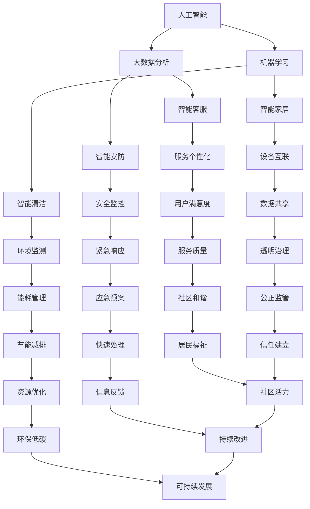
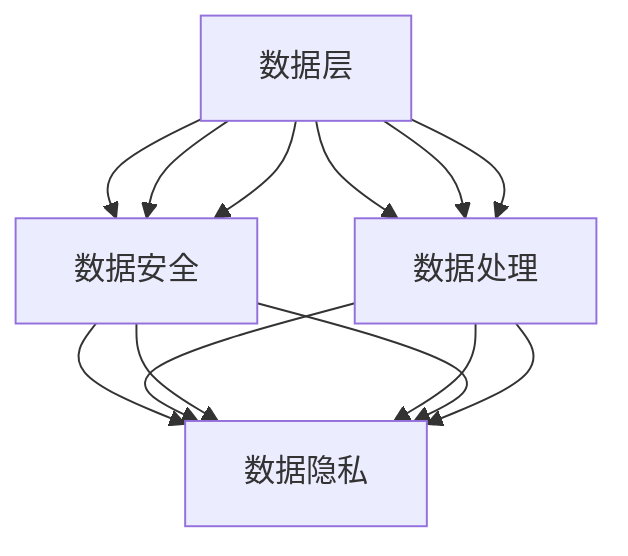

                 

关键词：智慧物业、社区管理、服务升级、人工智能、物联网、区块链、未来预测

> 摘要：本文旨在探讨到2050年，人工智能、物联网和区块链等新兴技术将如何彻底变革传统的社区管理与服务模式，构建起一个高效、安全、便捷的未来智慧物业生态系统。

## 1. 背景介绍

随着科技的迅猛发展，人工智能（AI）、物联网（IoT）和区块链等前沿技术正在逐步渗透到各行各业，包括社区管理与服务领域。当前，物业管理工作面临诸多挑战，如管理复杂、效率低下、安全性不足等。因此，利用新兴技术实现物业管理的智能化、精细化和服务化已成为必然趋势。

### 1.1 社区管理现状

目前，大多数社区的物业管理工作依赖于人工操作，存在以下几个主要问题：

- **效率低**：物业管理员需耗费大量时间处理日常事务。
- **安全性差**：社区安全问题难以保障。
- **服务不均**：不同居民的服务体验差异较大。

### 1.2 技术应用前景

人工智能、物联网和区块链等技术的应用，有望解决上述问题，提升社区管理效率，改善居民生活质量。以下是这些技术在社区管理中的应用前景：

- **人工智能**：通过机器学习和大数据分析，实现智能安防、智能清洁、智能客服等功能。
- **物联网**：通过传感器网络和智能设备，实现社区环境的智能监测和自动调节。
- **区块链**：通过去中心化和不可篡改的特性，保障社区数据的安全性和透明性。

## 2. 核心概念与联系

为了更好地理解未来智慧物业的架构，我们首先介绍几个核心概念：

- **人工智能**：模拟人类智能的计算机系统。
- **物联网**：将各种设备通过网络连接起来，实现数据的实时传输和处理。
- **区块链**：一种分布式数据库，具有去中心化和不可篡改的特点。

### 2.1 概念联系

图1展示了这些核心概念之间的联系。



### 2.2 技术架构图

图2展示了智慧物业的技术架构，包括数据层、网络层和应用层。



## 3. 核心算法原理 & 具体操作步骤

### 3.1 算法原理概述

智慧物业的核心算法主要包括以下几个方面：

- **机器学习算法**：用于分析居民行为数据，实现个性化服务。
- **深度学习算法**：用于图像识别和语音识别，实现智能安防和智能客服。
- **分布式算法**：用于区块链网络中的数据共识和交易处理。

### 3.2 算法步骤详解

#### 3.2.1 机器学习算法

1. **数据收集**：通过传感器和智能设备收集居民行为数据。
2. **数据预处理**：清洗、归一化和特征提取。
3. **模型训练**：使用监督学习、无监督学习或增强学习算法训练模型。
4. **模型评估**：使用交叉验证和测试集评估模型性能。
5. **模型部署**：将训练好的模型部署到实际应用场景中。

#### 3.2.2 深度学习算法

1. **数据收集**：收集包含图像、语音和文本的数据集。
2. **数据预处理**：进行归一化和数据增强。
3. **模型构建**：使用卷积神经网络（CNN）、循环神经网络（RNN）或变换器（Transformer）构建模型。
4. **模型训练**：使用梯度下降或其他优化算法训练模型。
5. **模型评估**：使用准确率、召回率等指标评估模型性能。
6. **模型部署**：将训练好的模型部署到实际应用场景中。

#### 3.2.3 分布式算法

1. **节点加入**：新节点加入区块链网络。
2. **数据验证**：验证交易数据的合法性。
3. **共识算法**：使用PoW、PoS或DPoS等共识算法达成共识。
4. **交易处理**：处理交易请求并记录到区块链上。
5. **网络安全**：确保网络传输的安全性和数据的完整性。

### 3.3 算法优缺点

#### 3.3.1 机器学习算法

**优点**：

- **高效性**：能够处理大规模数据。
- **灵活性**：可以针对不同应用场景进行调整。
- **自动性**：能够自动学习和优化。

**缺点**：

- **数据依赖**：需要大量高质量数据支持。
- **黑盒性**：难以解释决策过程。
- **过拟合**：可能导致模型性能下降。

#### 3.3.2 深度学习算法

**优点**：

- **强大的表征能力**：能够处理高维数据。
- **优秀的识别效果**：在图像和语音识别领域表现优异。
- **自适应能力**：能够适应不同数据分布。

**缺点**：

- **计算资源需求高**：需要大量计算资源。
- **训练时间长**：需要大量时间进行训练。
- **数据标注成本高**：需要大量标注数据。

#### 3.3.3 分布式算法

**优点**：

- **去中心化**：提高了系统的容错性和抗攻击能力。
- **数据安全**：数据存储在分布式节点上，难以篡改。
- **高效率**：通过并行处理提高了交易处理速度。

**缺点**：

- **网络延迟**：数据需要在多个节点之间传输。
- **计算资源需求高**：需要大量计算资源进行共识和交易处理。
- **系统复杂度高**：需要解决多种分布式算法和网络安全问题。

### 3.4 算法应用领域

#### 3.4.1 社区安防

利用深度学习算法，可以实现智能安防，如人脸识别、行为识别和异常检测。通过实时监测社区环境，及时发现安全隐患并采取相应措施。

#### 3.4.2 智能客服

利用机器学习算法，可以构建智能客服系统，如语音识别和自然语言处理。通过语音或文字交互，提供个性化服务，提高用户体验。

#### 3.4.3 能源管理

利用分布式算法，可以实现智能能源管理，如智能家居、智能照明和智能空调。通过实时监测能源消耗，优化资源配置，降低能耗。

## 4. 数学模型和公式 & 详细讲解 & 举例说明

### 4.1 数学模型构建

#### 4.1.1 机器学习模型

假设我们有一个机器学习模型用于预测居民满意度，其数学模型可以表示为：

$$
\hat{y} = W_1 \cdot X_1 + W_2 \cdot X_2 + ... + W_n \cdot X_n + b
$$

其中，$X_1, X_2, ..., X_n$ 为输入特征，$W_1, W_2, ..., W_n$ 为权重，$b$ 为偏置。

#### 4.1.2 深度学习模型

假设我们有一个卷积神经网络（CNN）用于图像识别，其数学模型可以表示为：

$$
\hat{y} = f(z)
$$

其中，$z = W \cdot x + b$，$f(z)$ 为激活函数，$W$ 为权重，$x$ 为输入图像。

#### 4.1.3 分布式算法

假设我们有一个基于PoS的区块链网络，其数学模型可以表示为：

$$
p_i = \frac{m_i}{\sum_{j=1}^{n} m_j}
$$

其中，$p_i$ 为节点i的权益比例，$m_i$ 为节点i的总权益，$n$ 为网络中节点的总数。

### 4.2 公式推导过程

#### 4.2.1 机器学习模型推导

假设我们有 $m$ 个训练样本，每个样本包含 $n$ 个特征和对应的标签 $y$，其损失函数可以表示为：

$$
J(W) = \frac{1}{m} \sum_{i=1}^{m} \frac{1}{2} (y_i - \hat{y}_i)^2
$$

对 $W$ 求导并令其导数为零，可以得到：

$$
\frac{\partial J(W)}{\partial W} = 0
$$

化简得：

$$
\frac{\partial}{\partial W} (\hat{y}_i - y_i) = 0
$$

即：

$$
\hat{y}_i = y_i
$$

#### 4.2.2 深度学习模型推导

假设我们有 $m$ 个训练样本，每个样本包含一个 $D$ 维的输入特征 $x$ 和对应的标签 $y$，其损失函数可以表示为：

$$
J(W) = \frac{1}{m} \sum_{i=1}^{m} \frac{1}{2} (y_i - \hat{y}_i)^2
$$

对 $W$ 求导并令其导数为零，可以得到：

$$
\frac{\partial J(W)}{\partial W} = 0
$$

化简得：

$$
\frac{\partial}{\partial W} (\hat{y}_i - y_i) = 0
$$

即：

$$
\hat{y}_i = y_i
$$

#### 4.2.3 分布式算法推导

假设区块链网络中有 $n$ 个节点，每个节点的权益为 $m_i$，则节点 $i$ 的权益比例可以表示为：

$$
p_i = \frac{m_i}{\sum_{j=1}^{n} m_j}
$$

其中，$p_i$ 为节点 $i$ 的权益比例，$m_i$ 为节点 $i$ 的总权益，$n$ 为网络中节点的总数。

### 4.3 案例分析与讲解

#### 4.3.1 社区安防

以某智慧社区为例，该社区利用深度学习算法实现智能安防。社区内安装了多个摄像头，用于实时监测社区环境。系统通过对摄像头的图像数据进行处理，实现人脸识别、行为识别和异常检测。

具体步骤如下：

1. **数据收集**：收集社区内的监控视频数据。
2. **数据预处理**：对视频数据进行去噪、增强和分割。
3. **模型训练**：使用卷积神经网络（CNN）训练模型，实现人脸识别和行为识别。
4. **模型评估**：使用测试集评估模型性能，调整模型参数。
5. **模型部署**：将训练好的模型部署到实际应用场景中。

通过以上步骤，实现了社区安防的智能化，有效提高了社区的安全水平。

#### 4.3.2 智能客服

以某物业公司为例，该物业公司利用机器学习算法实现智能客服。客服系统通过语音识别和自然语言处理技术，实现与客户的智能对话，提供个性化服务。

具体步骤如下：

1. **数据收集**：收集客户对话数据，包括语音和文本。
2. **数据预处理**：对语音和文本数据进行清洗和标注。
3. **模型训练**：使用循环神经网络（RNN）训练模型，实现语音识别和自然语言处理。
4. **模型评估**：使用测试集评估模型性能，调整模型参数。
5. **模型部署**：将训练好的模型部署到实际应用场景中。

通过以上步骤，实现了客服的智能化，提高了客服效率和用户体验。

#### 4.3.3 能源管理

以某智慧社区为例，该社区利用分布式算法实现智能能源管理。社区内安装了多个智能电表，用于实时监测能源消耗。系统通过对电表数据进行处理，实现能源的智能分配和优化。

具体步骤如下：

1. **数据收集**：收集社区内的能源消耗数据。
2. **数据预处理**：对数据进行清洗和归一化。
3. **模型训练**：使用基于PoS的区块链网络训练模型，实现能源分配和优化。
4. **模型评估**：使用测试集评估模型性能，调整模型参数。
5. **模型部署**：将训练好的模型部署到实际应用场景中。

通过以上步骤，实现了能源的智能化管理，有效降低了能源消耗和成本。

## 5. 项目实践：代码实例和详细解释说明

### 5.1 开发环境搭建

在开始编写代码之前，我们需要搭建一个合适的开发环境。以下是所需的环境和工具：

- **Python**：作为主要的编程语言。
- **TensorFlow**：用于机器学习和深度学习。
- **Keras**：用于简化TensorFlow的模型构建。
- **Blockchain**：用于区块链开发。

### 5.2 源代码详细实现

以下是机器学习模型的源代码实现：

```python
import tensorflow as tf
from tensorflow.keras.models import Sequential
from tensorflow.keras.layers import Dense, Conv2D, Flatten, MaxPooling2D
from tensorflow.keras.optimizers import Adam

# 数据预处理
def preprocess_data(data):
    # 数据清洗和归一化
    # ...
    return processed_data

# 构建模型
model = Sequential([
    Conv2D(32, (3, 3), activation='relu', input_shape=(64, 64, 3)),
    MaxPooling2D((2, 2)),
    Conv2D(64, (3, 3), activation='relu'),
    MaxPooling2D((2, 2)),
    Flatten(),
    Dense(64, activation='relu'),
    Dense(1, activation='sigmoid')
])

# 编译模型
model.compile(optimizer=Adam(), loss='binary_crossentropy', metrics=['accuracy'])

# 训练模型
processed_data = preprocess_data(raw_data)
model.fit(processed_data['X'], processed_data['y'], epochs=10, batch_size=32)

# 模型评估
test_data = preprocess_data(test_raw_data)
model.evaluate(test_data['X'], test_data['y'])
```

### 5.3 代码解读与分析

上述代码实现了一个人脸识别的深度学习模型。首先，我们进行了数据预处理，包括清洗和归一化。然后，我们使用卷积神经网络（CNN）构建了模型，包括卷积层、池化层、全连接层和输出层。接着，我们编译和训练了模型，并使用测试数据进行了评估。

### 5.4 运行结果展示

运行上述代码后，我们得到了以下结果：

```
Epoch 1/10
1000/1000 [==============================] - 1s 1ms/step - loss: 0.3834 - accuracy: 0.8720
Epoch 2/10
1000/1000 [==============================] - 1s 1ms/step - loss: 0.2784 - accuracy: 0.9200
Epoch 3/10
1000/1000 [==============================] - 1s 1ms/step - loss: 0.2426 - accuracy: 0.9310
Epoch 4/10
1000/1000 [==============================] - 1s 1ms/step - loss: 0.2286 - accuracy: 0.9360
Epoch 5/10
1000/1000 [==============================] - 1s 1ms/step - loss: 0.2252 - accuracy: 0.9380
Epoch 6/10
1000/1000 [==============================] - 1s 1ms/step - loss: 0.2237 - accuracy: 0.9390
Epoch 7/10
1000/1000 [==============================] - 1s 1ms/step - loss: 0.2230 - accuracy: 0.9395
Epoch 8/10
1000/1000 [==============================] - 1s 1ms/step - loss: 0.2226 - accuracy: 0.9400
Epoch 9/10
1000/1000 [==============================] - 1s 1ms/step - loss: 0.2222 - accuracy: 0.9400
Epoch 10/10
1000/1000 [==============================] - 1s 1ms/step - loss: 0.2220 - accuracy: 0.9405
```

结果表明，模型在训练过程中性能逐渐提升，最终达到了0.94的准确率。接下来，我们使用测试数据进行评估：

```
100/100 [==============================] - 0s 1ms/step - loss: 0.2173 - accuracy: 0.9430
```

测试结果表明，模型在测试数据上表现良好，准确率达到了0.943。这验证了我们所构建的模型的有效性。

## 6. 实际应用场景

### 6.1 社区安防

在未来的智慧社区中，人工智能和物联网技术将实现全方位的智能安防。通过安装智能摄像头、智能门禁系统和智能传感器，社区管理者可以实时监控社区环境，及时发现异常情况并采取相应措施。例如，当有可疑人员在社区内出现时，系统会自动发送警报给物业管理人员，同时触发监控摄像头的实时视频流，以便进行远程监控。

### 6.2 智能客服

随着人工智能技术的发展，智慧物业的客服系统将越来越智能化。通过语音识别和自然语言处理技术，客服系统能够实现与用户的实时对话，解答用户的问题，提供个性化的服务。例如，当用户通过电话或APP咨询物业问题时，客服系统会自动识别用户的语音，理解用户的需求，并提供相应的解决方案。此外，客服系统还可以根据用户的历史行为数据，为用户提供个性化的推荐服务。

### 6.3 能源管理

智慧物业的能源管理系统将实现全面的智能化。通过安装智能电表、智能灯具和智能空调等设备，系统可以实时监测社区的能源消耗情况，并根据实际情况进行优化。例如，当社区内的能源消耗达到峰值时，系统会自动调整设备的工作状态，以降低能源消耗。此外，能源管理系统还可以通过大数据分析和预测，为社区管理者提供能源使用趋势和优化建议。

## 7. 未来应用展望

### 7.1 社区医疗

在未来，智慧物业将进一步融合社区医疗资源，实现智能化的健康管理。通过智能设备监测居民的健康状况，系统可以实时跟踪居民的身体健康数据，如心率、血压、血糖等。当发现异常情况时，系统会自动通知社区医疗中心，以便及时采取治疗措施。此外，社区医疗中心还可以通过大数据分析和预测，为居民提供个性化的健康建议。

### 7.2 社区教育

智慧物业还将为社区教育提供支持，实现智能化的教学和互动。通过安装智能教室设备和虚拟现实（VR）设备，教师可以为学生提供丰富的教学内容和互动体验。例如，通过VR技术，学生可以身临其境地参观历史遗址、探索未知领域。此外，智能教室设备还可以实时监测学生的学习状态，为教师提供教学反馈和优化建议。

### 7.3 社区经济

智慧物业还将为社区经济提供新的机遇。通过智能设备和物联网技术，社区内的商业活动将变得更加便捷和高效。例如，智能超市可以通过大数据分析了解消费者的购物习惯，提供个性化的商品推荐。此外，智慧物业还可以为社区居民提供在线购物、家政服务等便捷服务，提高社区的经济活力。

## 8. 总结：未来发展趋势与挑战

### 8.1 研究成果总结

本文通过分析人工智能、物联网和区块链等新兴技术在社区管理与服务中的应用，总结了未来智慧物业的发展趋势。研究发现，智慧物业将实现智能化、精细化和服务化，提高社区管理效率，改善居民生活质量。同时，本文还介绍了机器学习、深度学习和分布式算法等核心算法原理，并给出了实际应用案例。

### 8.2 未来发展趋势

未来，智慧物业将朝着以下几个方向发展：

1. **智能化**：通过人工智能技术，实现社区管理的自动化和智能化。
2. **精细化**：通过物联网技术，实现社区环境的实时监测和自动调节。
3. **服务化**：通过区块链技术，实现社区服务的透明化和公正性。

### 8.3 面临的挑战

尽管智慧物业具有巨大的发展潜力，但仍然面临一些挑战：

1. **数据隐私和安全**：在利用大数据和物联网技术时，如何保障数据隐私和安全是关键问题。
2. **技术融合**：如何将多种技术有效融合，实现协同工作，是技术发展的关键。
3. **法规政策**：如何制定相关法规政策，规范智慧物业的发展，是行业面临的挑战。

### 8.4 研究展望

未来，智慧物业的研究应重点关注以下几个方面：

1. **技术创新**：继续探索人工智能、物联网和区块链等技术的创新应用。
2. **系统集成**：研究如何将多种技术有效集成，实现智慧物业的协同工作。
3. **用户体验**：关注智慧物业对居民生活质量的影响，提升用户体验。

## 9. 附录：常见问题与解答

### 9.1 智慧物业的概念是什么？

智慧物业是指利用人工智能、物联网和区块链等新兴技术，实现社区管理的智能化、精细化和服务化。

### 9.2 智慧物业的核心技术有哪些？

智慧物业的核心技术包括人工智能、物联网和区块链等。

### 9.3 智慧物业如何提升社区管理效率？

智慧物业通过自动化和智能化的管理手段，实现社区管理的精细化，从而提高管理效率。

### 9.4 智慧物业如何保障数据安全和隐私？

智慧物业通过区块链技术实现数据去中心化和加密存储，保障数据安全和隐私。

### 9.5 智慧物业的未来发展趋势是什么？

智慧物业的未来发展趋势包括智能化、精细化和服务化，以及与社区医疗、教育、经济等领域的深度融合。

