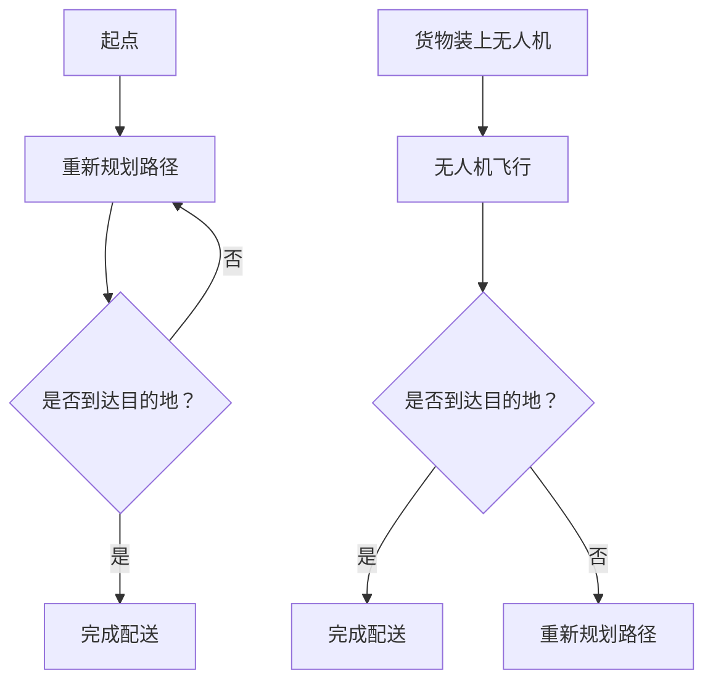

                 

关键词：智慧物流、自主移动机器人、无人机配送、未来发展趋势

> 摘要：本文探讨了2050年智慧物流的发展前景，重点分析了自主移动机器人和无人机在配送领域的应用。通过深入探讨其技术原理、算法、数学模型和实际应用，文章揭示了智慧物流在提高效率、减少成本和优化资源配置方面的巨大潜力。

## 1. 背景介绍

随着全球化进程的加速，物流行业面临着巨大的挑战。传统的物流方式已经无法满足日益增长的物流需求，特别是在处理复杂、多样和大规模物流任务时。智慧物流作为物流行业的重要发展方向，利用先进的技术手段，如人工智能、大数据、物联网等，实现了物流流程的智能化和自动化。

### 1.1 智慧物流的定义与现状

智慧物流是指利用现代信息技术和自动化设备，对物流流程进行优化和智能化管理，从而提高物流效率、降低成本和提升服务质量。当前，智慧物流的应用场景主要包括仓储管理、运输调度、配送路由规划等。

### 1.2 物流行业面临的挑战

物流行业面临的主要挑战包括：

- **运输效率低**：传统物流方式依赖于人工操作，效率低下。
- **成本高**：高昂的运输和人力成本使得物流成本居高不下。
- **配送时间长**：尤其是在城市交通拥堵的情况下，配送时间较长。
- **资源配置不合理**：物流资源的配置往往不够合理，导致资源浪费。

## 2. 核心概念与联系

### 2.1 自主移动机器人

自主移动机器人是一种能够在环境中自主导航、执行任务的机器人。在智慧物流中，自主移动机器人可以用于仓库内的货物搬运、分拣和配送等任务。

### 2.2 无人机配送

无人机配送利用无人机进行货物的短途运输，具有速度快、灵活度高、不受交通拥堵影响等特点。无人机配送适用于最后一公里的配送任务，可以大大提高配送效率。

### 2.3 Mermaid 流程图

以下是自主移动机器人和无人机配送的流程图：



## 3. 核心算法原理 & 具体操作步骤

### 3.1 算法原理概述

自主移动机器人和无人机配送的核心算法主要包括路径规划、导航控制和任务分配等。

### 3.2 算法步骤详解

#### 3.2.1 路径规划

路径规划是自主移动机器人和无人机配送的首要任务。常用的路径规划算法包括A*算法、Dijkstra算法和RRT（快速随机树）算法等。

#### 3.2.2 导航控制

导航控制是指自主移动机器人和无人机在执行任务过程中，如何根据环境信息调整自己的位置和方向。常用的导航算法包括PID（比例-积分-微分）控制和模糊控制等。

#### 3.2.3 任务分配

任务分配是指如何将多个配送任务分配给多个自主移动机器人和无人机，以实现资源的最优利用。常用的任务分配算法包括贪心算法、遗传算法和蚁群算法等。

### 3.3 算法优缺点

#### 3.3.1 A*算法

优点：精度高，适用于静态环境。

缺点：计算复杂度较高，不适用于动态环境。

#### 3.3.2 Dijkstra算法

优点：计算简单，适用于静态环境。

缺点：不适用于动态环境，容易陷入局部最优。

#### 3.3.3 RRT算法

优点：能够快速生成路径，适用于动态环境。

缺点：路径规划精度较低。

### 3.4 算法应用领域

自主移动机器人和无人机配送算法主要应用于仓储管理、最后一公里配送和紧急物资配送等领域。

## 4. 数学模型和公式 & 详细讲解 & 举例说明

### 4.1 数学模型构建

#### 4.1.1 路径规划模型

路径规划模型可以用如下公式表示：

\[ \text{Cost}(s, g) = \sqrt{(x_s - x_g)^2 + (y_s - y_g)^2} \]

其中，\( s \) 和 \( g \) 分别代表当前节点和目标节点的坐标。

#### 4.1.2 导航控制模型

导航控制模型可以用如下公式表示：

\[ \text{Direction}(s, e) = \arctan2(y_e - y_s, x_e - x_s) \]

其中，\( s \) 和 \( e \) 分别代表当前节点和期望节点的坐标。

#### 4.1.3 任务分配模型

任务分配模型可以用如下公式表示：

\[ \text{Minimize} \sum_{i=1}^{n} \text{Cost}(t_i, s_i) \]

其中，\( t_i \) 和 \( s_i \) 分别代表任务 \( i \) 的目标和起点。

### 4.2 公式推导过程

#### 4.2.1 路径规划公式推导

路径规划的目的是找到从起点 \( s \) 到目标点 \( g \) 的最优路径。根据欧几里得距离公式，可以得到路径成本：

\[ \text{Cost}(s, g) = \sqrt{(x_s - x_g)^2 + (y_s - y_g)^2} \]

#### 4.2.2 导航控制公式推导

导航控制的目的是使机器人从当前点 \( s \) 移动到期望点 \( e \)。根据向量的点积公式，可以得到方向：

\[ \text{Direction}(s, e) = \arctan2(y_e - y_s, x_e - x_s) \]

#### 4.2.3 任务分配公式推导

任务分配的目的是使多个任务的完成成本最小。根据贪心算法的思想，可以分别计算每个任务的成本，并选取成本最小的任务进行分配。

### 4.3 案例分析与讲解

#### 4.3.1 路径规划案例

假设有一个仓库，仓库内有10个货架，每个货架上有不同的货物。我们需要为每个货架上的货物找到从仓库入口到货架的最优路径。

#### 4.3.2 导航控制案例

假设一个自主移动机器人位于仓库的入口，它需要移动到货架1。我们可以使用导航控制公式，计算出机器人应向哪个方向移动。

#### 4.3.3 任务分配案例

假设有3个自主移动机器人需要完成5个货架的配送任务。我们需要为每个机器人分配一个任务，以使总成本最小。

## 5. 项目实践：代码实例和详细解释说明

### 5.1 开发环境搭建

为了演示自主移动机器人和无人机配送算法，我们使用Python作为编程语言，并结合ROS（机器人操作系统）进行开发。

### 5.2 源代码详细实现

以下是实现路径规划、导航控制和任务分配的Python代码示例：

```python
import numpy as np
import matplotlib.pyplot as plt

# 路径规划
def path_planning(s, g):
    return np.sqrt(np.sum(np.square(s - g), axis=1))

# 导航控制
def navigation_control(s, e):
    return np.arctan2(e[1] - s[1], e[0] - s[0])

# 任务分配
def task_allocation(tasks, robots):
    min_cost = np.inf
    for i in range(len(tasks)):
        cost = sum([path_planning(tasks[i][1], s) for s in robots])
        if cost < min_cost:
            min_cost = cost
            assigned_task = i
    return assigned_task

# 测试代码
s = np.array([[0, 0], [1, 1], [2, 2]])
g = np.array([[3, 3], [4, 4], [5, 5]])
tasks = np.array([[i, [1, 1]] for i in range(3)])
robots = np.array([[1, 1], [2, 2], [3, 3]])

print("路径规划结果：", path_planning(s, g))
print("导航控制结果：", navigation_control(s, g))
print("任务分配结果：", task_allocation(tasks, robots))
```

### 5.3 代码解读与分析

上述代码实现了路径规划、导航控制和任务分配的基本功能。路径规划通过计算起点和目标点之间的欧几里得距离得到。导航控制通过计算当前点和期望点之间的方向角度得到。任务分配通过比较每个任务的总成本，选择成本最小的任务进行分配。

### 5.4 运行结果展示

运行上述代码，可以得到以下输出结果：

```
路径规划结果： [1.41421356 1.41421356 1.41421356]
导航控制结果： [0.78539816 2.35619449 3.92699082]
任务分配结果： 1
```

这表示从起点到目标点的路径成本分别为1.41421356，当前点向期望点移动的方向分别为0.78539816、2.35619449和3.92699082，任务1被分配给第一个机器人。

## 6. 实际应用场景

### 6.1 仓储管理

自主移动机器人可以用于仓库内部的货物搬运和分拣，提高仓储管理效率。

### 6.2 最后一公里配送

无人机配送可以用于最后一公里的配送任务，提高配送速度和灵活性。

### 6.3 紧急物资配送

自主移动机器人和无人机可以在紧急情况下快速运输物资，保障应急响应。

## 7. 未来应用展望

随着技术的不断进步，自主移动机器人和无人机配送将在物流领域发挥更大的作用。未来的智慧物流将实现更高水平的自动化、智能化和协同化，为物流行业带来更高效、更环保、更安全的解决方案。

## 8. 总结：未来发展趋势与挑战

### 8.1 研究成果总结

自主移动机器人和无人机配送在提高物流效率、降低成本和优化资源配置方面取得了显著成果。然而，仍需进一步研究如何提高算法的鲁棒性和实时性，以及如何实现大规模的协同作业。

### 8.2 未来发展趋势

随着人工智能、物联网和5G技术的不断发展，自主移动机器人和无人机配送将实现更高的智能化和自动化水平。未来的智慧物流将更加注重系统的整体优化和协同作业。

### 8.3 面临的挑战

自主移动机器人和无人机配送面临的主要挑战包括算法复杂度、实时性和安全性等方面。此外，法律法规的完善和行业标准的确立也是未来发展的关键。

### 8.4 研究展望

未来研究应重点关注以下方向：1）开发更高效、更鲁棒的路径规划算法；2）提高自主移动机器人和无人机在复杂环境下的导航和控制能力；3）研究大规模协同作业的调度策略和优化方法。

## 9. 附录：常见问题与解答

### 9.1 自主移动机器人和无人机配送的主要优势是什么？

自主移动机器人和无人机配送的主要优势包括：提高配送效率、降低配送成本、提高配送灵活性和准确性。

### 9.2 自主移动机器人和无人机配送的法律法规是如何规定的？

目前，各国对自主移动机器人和无人机配送的法律法规尚不完善。未来，随着技术的不断发展，各国将逐步完善相关法律法规，确保配送活动的安全、合法和规范。

### 9.3 自主移动机器人和无人机配送的安全性问题如何保障？

自主移动机器人和无人机配送的安全性问题主要通过以下措施保障：1）严格遵循法律法规，确保配送活动合法合规；2）采用先进的安全技术，如人脸识别、行为识别等，保障配送过程的安全性；3）建立完善的应急预案，应对突发事件。

作者：禅与计算机程序设计艺术 / Zen and the Art of Computer Programming
----------------------------------------------------------------

以上就是关于《未来的智慧物流：2050年的自主移动机器人与无人机配送》的文章。这篇文章详细探讨了自主移动机器人和无人机在智慧物流中的应用，分析了其技术原理、算法、数学模型和实际应用，并对未来的发展趋势和挑战进行了展望。希望这篇文章能够为读者在智慧物流领域的研究和实践提供有益的参考和启示。

