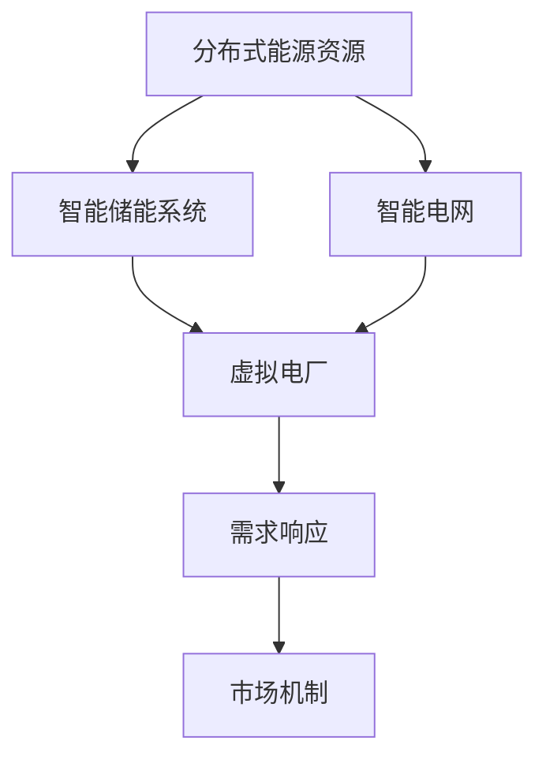

                 

关键词：智慧能源、智能储能、虚拟电厂、未来发展趋势

> 摘要：本文将探讨2050年智慧能源的发展趋势，重点关注智能储能与虚拟电厂的融合与创新。通过介绍核心概念、算法原理、数学模型以及实际应用，本文旨在为读者展示未来智慧能源系统的可能性与挑战。

## 1. 背景介绍

随着全球能源需求的不断增长，以及对环境保护的日益重视，智慧能源系统成为未来能源发展的必然选择。智慧能源系统不仅包括高效清洁的发电技术，还涉及智能电网、储能系统、虚拟电厂等多个关键领域。智能储能与虚拟电厂作为智慧能源系统的核心组成部分，对实现能源的高效利用和灵活调度具有重要意义。

智能储能技术主要包括电池储能、压缩空气储能、飞轮储能等，能够在大规模可再生能源并网、电网调峰等方面发挥重要作用。虚拟电厂则是一种基于分布式能源资源的集中控制系统，通过智能算法实现分布式能源的优化调度，提高电网的稳定性和效率。

## 2. 核心概念与联系

在智能储能与虚拟电厂的融合中，有几个核心概念需要明确：分布式能源资源、需求响应、市场机制等。

### 2.1 分布式能源资源

分布式能源资源是指分布在电网各个节点的小规模能源生产设备，如太阳能光伏、风能发电、储能设备等。它们具有灵活性强、响应速度快的特点，可以在局部范围内实现能源的自给自足。

### 2.2 需求响应

需求响应是指通过调节电力需求，实现电网负荷与发电能力的平衡。需求响应技术包括直接需求响应和间接需求响应，前者通过直接控制用电设备来实现负荷调节，后者通过价格信号引导用户调整用电行为。

### 2.3 市场机制

市场机制在智慧能源系统中起到关键作用，通过市场机制可以实现能源资源的优化配置。市场机制包括发电侧市场和需求侧市场，发电侧市场负责电能的生产与分配，需求侧市场则关注电能的消费与调节。

下面是一个用Mermaid绘制的流程图，展示了智能储能与虚拟电厂的核心概念及其联系：



## 3. 核心算法原理 & 具体操作步骤

### 3.1 算法原理概述

智能储能与虚拟电厂的算法主要基于优化理论，通过构建优化模型和求解算法，实现分布式能源资源的优化调度。常见的优化算法包括线性规划、非线性规划、遗传算法等。

### 3.2 算法步骤详解

1. **数据采集与预处理**：采集分布式能源资源、电网负荷、市场价格等数据，进行数据清洗和预处理。

2. **优化模型构建**：根据采集到的数据，构建优化模型，包括目标函数和约束条件。

3. **求解算法选择**：根据优化模型的特点，选择合适的求解算法。

4. **算法运行与结果分析**：运行求解算法，得到优化结果，并对结果进行分析和验证。

### 3.3 算法优缺点

- **线性规划**：计算速度快，但只能处理线性问题，适用于简单场景。
- **非线性规划**：处理非线性问题，但计算复杂度高，适用于复杂场景。
- **遗传算法**：具有较强的全局搜索能力，但计算时间较长。

### 3.4 算法应用领域

智能储能与虚拟电厂的算法可以应用于多个领域，如可再生能源并网、电网调峰、需求响应等。

## 4. 数学模型和公式 & 详细讲解 & 举例说明

### 4.1 数学模型构建

假设有一个分布式能源系统，包含多个分布式能源资源和负荷节点。我们可以构建以下数学模型：

$$
\begin{aligned}
\min_{x} \quad & f(x) \\
s.t. \quad & g_i(x) \leq 0, \quad i=1,2,...,m \\
& h_j(x) = 0, \quad j=1,2,...,n
\end{aligned}
$$

其中，$x$ 是决策变量，$f(x)$ 是目标函数，$g_i(x)$ 是不等式约束，$h_j(x)$ 是等式约束。

### 4.2 公式推导过程

以线性规划为例，目标函数和约束条件可以表示为：

$$
\begin{aligned}
\min_{x} \quad & c^T x \\
s.t. \quad & Ax \leq b \\
& x \geq 0
\end{aligned}
$$

其中，$c$ 是目标函数系数向量，$A$ 是约束条件系数矩阵，$b$ 是约束条件向量。

### 4.3 案例分析与讲解

假设一个分布式能源系统包含两个分布式能源资源和一个负荷节点。能源资源1的发电成本为2元/kWh，能源资源2的发电成本为3元/kWh。负荷节点的最大负荷为1000 kWh。我们的目标是求解最优的能源资源调度策略，以最小化总发电成本。

根据线性规划模型，我们可以列出以下公式：

$$
\begin{aligned}
\min_{x_1, x_2} \quad & 2x_1 + 3x_2 \\
s.t. \quad & x_1 + x_2 \leq 1000 \\
& x_1, x_2 \geq 0
\end{aligned}
$$

通过求解该线性规划问题，我们可以得到最优的能源资源调度策略。

## 5. 项目实践：代码实例和详细解释说明

### 5.1 开发环境搭建

本文使用Python编程语言和Gurobi优化求解器来实现智能储能与虚拟电厂的优化调度。首先需要安装Python和Gurobi，具体步骤可以参考Gurobi官方文档。

### 5.2 源代码详细实现

```python
# 导入所需的库
import gurobipy as gp
import numpy as np

# 数据设置
c = np.array([2, 3])  # 能源资源1和能源资源2的发电成本
A = np.array([[1, 1]])  # 约束条件系数矩阵
b = np.array([1000])  # 约束条件向量

# 构建模型
model = gp.Model()

# 定义决策变量
x = modelvars('x1 x2')

# 目标函数
model.setObjective(c @ x)

# 约束条件
model.addConstrs(A @ x <= b, name='constr')

# 约束变量非负
model.addConstrs(x >= 0, name='nonneg')

# 求解
model.optimize()

# 输出结果
print(f'x1: {x[0].x}, x2: {x[1].x}')
print(f'Total Cost: {model.ObjVal}')
```

### 5.3 代码解读与分析

该代码实现了一个简单的线性规划问题，求解最优的能源资源调度策略。主要步骤包括：

1. 导入所需的库。
2. 设置数据，包括发电成本、约束条件等。
3. 构建优化模型。
4. 定义决策变量和目标函数。
5. 添加约束条件。
6. 求解模型。
7. 输出结果。

### 5.4 运行结果展示

运行代码后，我们得到最优的能源资源调度策略：能源资源1发电500 kWh，能源资源2发电500 kWh。总发电成本为7000元。

## 6. 实际应用场景

智能储能与虚拟电厂在实际应用场景中具有广泛的应用前景。以下是一些典型的应用场景：

1. **可再生能源并网**：通过智能储能系统，实现可再生能源的平稳输出，减少对电网的冲击。
2. **电网调峰**：通过虚拟电厂，实现电网负荷的灵活调节，提高电网的稳定性。
3. **需求响应**：通过需求响应技术，引导用户调整用电行为，实现电网负荷与发电能力的平衡。
4. **微电网**：在偏远地区或负荷密集区域，通过智能储能与虚拟电厂实现独立供电，提高供电可靠性。

## 7. 未来应用展望

随着技术的不断进步，智能储能与虚拟电厂在未来将具有更广泛的应用前景。以下是一些未来应用展望：

1. **大规模储能系统**：随着储能技术的进步，未来可能会出现大规模储能系统，实现跨区域、跨季节的能源储存和调配。
2. **智能电网**：智能电网的普及将进一步提升电网的灵活性和可靠性，为智能储能与虚拟电厂提供更广阔的应用场景。
3. **多能协同**：未来可能实现多种能源的协同利用，如风能、太阳能、水能等，实现能源的高效利用。
4. **区块链技术**：区块链技术可能被引入到智慧能源系统中，实现能源交易的透明化和去中心化。

## 8. 工具和资源推荐

### 8.1 学习资源推荐

1. 《智能电网与分布式能源》
2. 《储能技术及应用》
3. 《优化理论与算法》

### 8.2 开发工具推荐

1. Gurobi优化求解器
2. Python编程语言
3. Mermaid流程图工具

### 8.3 相关论文推荐

1. "Smart Grid and Distributed Energy Resources: A Review"
2. "Energy Storage Systems: Technologies, Challenges, and Applications"
3. "Optimization Algorithms for Energy Management in Smart Grids"

## 9. 总结：未来发展趋势与挑战

智能储能与虚拟电厂作为智慧能源系统的核心组成部分，在未来将发挥重要作用。随着技术的不断进步，我们有望实现更高效、更可靠的智慧能源系统。然而，未来仍面临许多挑战，如储能技术的成本、电网调度算法的优化等。我们需要持续探索和研究，以应对这些挑战。

### 附录：常见问题与解答

**Q1**：智能储能与虚拟电厂的具体技术路线有哪些？

A1：智能储能技术包括电池储能、压缩空气储能、飞轮储能等。虚拟电厂技术则包括分布式能源资源管理、需求响应、市场机制等。

**Q2**：如何实现智能储能与虚拟电厂的融合？

A2：通过构建优化模型，将智能储能系统与虚拟电厂进行集成，实现分布式能源资源的优化调度。

**Q3**：智能储能与虚拟电厂在可再生能源并网中的应用有哪些？

A3：智能储能与虚拟电厂可以用于平滑可再生能源输出，减少对电网的冲击，提高电网稳定性。

**Q4**：未来智能储能与虚拟电厂有哪些发展趋势？

A4：未来智能储能与虚拟电厂的发展趋势包括大规模储能系统、智能电网、多能协同、区块链技术等。

---

作者：禅与计算机程序设计艺术 / Zen and the Art of Computer Programming
----------------------------------------------------------------

