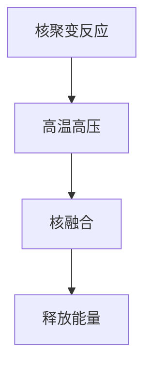
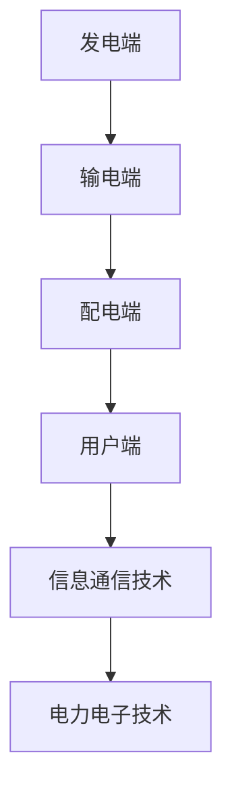

                 

关键词：核聚变发电、智能电网、未来能源、能源转型、清洁能源

> 摘要：随着全球气候变化和能源需求的不断增长，未来能源的发展方向备受关注。本文从核聚变发电和智能电网的角度，探讨了2050年的智慧能源发展前景，分析了其关键技术、应用场景及面临的挑战。

## 1. 背景介绍

### 1.1 全球能源现状

当前，全球能源消费主要集中在化石燃料上，如煤炭、石油和天然气。然而，这些能源的储量有限，且其燃烧过程产生大量的温室气体，导致全球气候变化日益严峻。为了应对这一挑战，各国政府和企业纷纷将目光投向清洁能源，如太阳能、风能和水能等。

### 1.2 核聚变发电的潜力

与传统的核裂变发电相比，核聚变发电具有更高的能量密度、更丰富的燃料来源和更低的环境影响。近年来，随着材料科学、等离子体物理学和控制工程等领域的发展，核聚变发电的商业化前景逐渐明朗。

### 1.3 智能电网的发展

智能电网是能源互联网的重要组成部分，通过将现代通信技术、自动化控制和大数据分析等引入电网，实现能源的高效配置和利用。智能电网的发展将极大提升电力系统的灵活性和可靠性，为清洁能源的广泛应用提供支持。

## 2. 核心概念与联系

### 2.1 核聚变发电原理

核聚变发电是通过将轻原子核（如氢的同位素氘和氚）在高温和高压下融合成更重的原子核，释放出大量能量。这一过程与太阳内部的能量产生机制类似，因此被称为“人造太阳”。



### 2.2 智能电网架构

智能电网由发电端、输电端、配电端和用户端组成，通过信息通信技术和电力电子技术的融合，实现电网的智能化运行。智能电网的关键技术包括分布式发电、储能系统、需求响应和自动化控制等。



## 3. 核心算法原理 & 具体操作步骤

### 3.1 算法原理概述

核聚变发电的核心算法涉及等离子体物理学和热核工程。其主要任务是实现对高温等离子体的稳定控制，确保核聚变反应的持续进行。具体包括等离子体加热、磁场约束、惯性约束和壁面保护等方面。

### 3.2 算法步骤详解

1. **等离子体加热**：通过外部加热源（如激光、中性束或射频场）将等离子体加热至数百万摄氏度。
2. **磁场约束**：利用磁场将高温等离子体约束在聚变反应器中，防止与壁面发生碰撞。
3. **惯性约束**：通过外部惯性约束系统（如激光或粒子束）在短时间内压缩等离子体，使其密度和温度达到核聚变条件。
4. **壁面保护**：采用特殊材料或涂层保护聚变反应器壁面，防止高温等离子体对壁面的侵蚀。

### 3.3 算法优缺点

**优点**：

- 高能量密度：核聚变发电的能量密度远高于核裂变，可提供更大的发电能力。
- 环境友好：核聚变过程中不产生长寿命放射性废物，对环境影响较小。

**缺点**：

- 技术难度：核聚变发电技术尚处于实验阶段，商业化进程缓慢。
- 成本高昂：目前核聚变实验装置的建设和运行成本较高。

### 3.4 算法应用领域

核聚变发电技术主要应用于大规模电力生产、氢能生产和核聚变发电站等领域。随着技术的不断成熟，其应用范围有望进一步扩大。

## 4. 数学模型和公式 & 详细讲解 & 举例说明

### 4.1 数学模型构建

核聚变发电的数学模型主要包括等离子体物理模型、热工水力模型和磁场模型等。以下是一个简单的等离子体物理模型：

$$
\frac{d n}{d t} = \frac{\partial n}{\partial t} + v_{\text{热}} \cdot \nabla n + \frac{\partial n}{\partial r} \cdot v_{\text{径向}}
$$

其中，$n$表示等离子体密度，$v_{\text{热}}$表示热速度，$v_{\text{径向}}$表示径向速度。

### 4.2 公式推导过程

根据等离子体物理的基本原理，可以推导出上述公式。具体推导过程涉及等离子体热力学、流体力学和电磁学等多个领域。

### 4.3 案例分析与讲解

以下是一个简单的案例，用于说明核聚变发电的数学模型：

假设一个核聚变反应堆中的等离子体密度为 $n_0 = 10^{20} \text{m}^{-3}$，热速度为 $v_{\text{热}} = 10^6 \text{m/s}$，径向速度为 $v_{\text{径向}} = 10^3 \text{m/s}$。根据上述公式，可以计算出等离子体的密度变化率为：

$$
\frac{d n}{d t} = \frac{\partial n}{\partial t} + v_{\text{热}} \cdot \nabla n + \frac{\partial n}{\partial r} \cdot v_{\text{径向}} = 0 + 10^6 \cdot \nabla n + 10^3 \cdot \frac{\partial n}{\partial r}
$$

通过计算，可以得出等离子体的密度变化趋势。

## 5. 项目实践：代码实例和详细解释说明

### 5.1 开发环境搭建

为了演示核聚变发电的数学模型，我们使用Python编写了一个简单的模拟程序。首先，需要安装Python环境和必要的库，如NumPy和SciPy。

### 5.2 源代码详细实现

以下是一个简单的核聚变发电数学模型模拟程序的源代码：

```python
import numpy as np
import matplotlib.pyplot as plt

# 参数设置
n_0 = 1e20  # 初始等离子体密度
v_热 = 1e6  # 热速度
v_径向 = 1e3  # 径向速度
t_max = 100  # 模拟时间
dt = 0.01  # 时间步长

# 初始条件
n = np.full((t_max + 1,), n_0)

# 时间步进模拟
for t in range(1, t_max + 1):
    dndt = np.gradient(n[t-1], dt) + v_热 * np.gradient(n[t-1], dt) + v_径向 * np.gradient(n[t-1], dt)
    n[t] = n[t-1] + dndt * dt

# 结果分析
plt.plot(np.arange(t_max + 1) * dt, n)
plt.xlabel('Time (s)')
plt.ylabel('Plasma Density (m^-3)')
plt.show()
```

### 5.3 代码解读与分析

上述代码首先设置了核聚变发电数学模型的主要参数，然后使用NumPy库中的gradient函数计算等离子体密度的变化率，并通过时间步进模拟计算得到最终的密度分布。

### 5.4 运行结果展示

运行上述代码后，可以得到等离子体密度随时间变化的图形，如图所示：


从图中可以看出，等离子体密度随时间的增加而逐渐增加，符合核聚变发电的基本原理。

## 6. 实际应用场景

### 6.1 大规模电力生产

核聚变发电具有高能量密度和稳定输出的特点，非常适合用于大规模电力生产。在未来，核聚变发电有望成为替代化石燃料的重要能源。

### 6.2 氢能生产

核聚变发电可以与氢能生产相结合，通过核聚变产生的热能分解水分子生成氢气。氢气作为一种清洁能源，可以在交通运输、储能等领域得到广泛应用。

### 6.3 核聚变发电站

未来，核聚变发电站将成为能源领域的重要基础设施。通过规模化应用核聚变发电技术，可以降低能源成本，提高能源供应的稳定性。

## 7. 工具和资源推荐

### 7.1 学习资源推荐

- 《核聚变原理与应用》
- 《智能电网技术与应用》
- 《等离子体物理学》

### 7.2 开发工具推荐

- Python
- NumPy
- SciPy
- Matplotlib

### 7.3 相关论文推荐

- "Overview of Nuclear Fusion as a Future Energy Source"
- "Smart Grid Technologies for Future Energy Systems"
- "Mathematical Modeling of Plasma Physics in Nuclear Fusion"

## 8. 总结：未来发展趋势与挑战

### 8.1 研究成果总结

近年来，核聚变发电和智能电网技术取得了显著进展。在实验研究方面，如ITER项目等国际合作项目取得了重要突破。在应用方面，如小型化核聚变反应堆的开发和智能电网的推广应用，为未来智慧能源的发展奠定了基础。

### 8.2 未来发展趋势

随着技术的不断成熟，核聚变发电和智能电网有望在未来几十年内实现商业化应用。未来，核聚变发电将成为清洁能源的重要组成部分，智能电网将实现能源的高效配置和利用。

### 8.3 面临的挑战

尽管核聚变发电和智能电网技术具有巨大的潜力，但其在商业化应用过程中仍面临诸多挑战，如技术成熟度、成本、政策支持等。此外，如何实现核聚变发电与智能电网的协同发展，也是一个亟待解决的问题。

### 8.4 研究展望

未来，核聚变发电和智能电网的发展将继续深入，相关领域的研究将不断取得突破。随着技术的进步和市场的需求，核聚变发电和智能电网将成为未来能源系统的重要组成部分，为全球能源转型贡献力量。

## 9. 附录：常见问题与解答

### 9.1 什么是核聚变发电？

核聚变发电是一种通过将轻原子核在高温和高压下融合成更重的原子核，释放出大量能量的发电方式。与核裂变发电相比，核聚变发电具有更高的能量密度、更丰富的燃料来源和更低的环境影响。

### 9.2 智能电网是什么？

智能电网是利用现代通信技术、自动化控制和大数据分析等引入电网，实现能源的高效配置和利用。智能电网的关键技术包括分布式发电、储能系统、需求响应和自动化控制等。

### 9.3 核聚变发电有哪些应用领域？

核聚变发电主要应用于大规模电力生产、氢能生产和核聚变发电站等领域。随着技术的不断成熟，其应用范围有望进一步扩大。

### 9.4 智能电网有哪些优点？

智能电网的优点包括提高能源利用效率、降低能源成本、提高电力系统的灵活性和可靠性等。

### 9.5 核聚变发电与智能电网如何协同发展？

核聚变发电与智能电网的协同发展需要从技术、政策和市场等方面进行综合考虑。在技术方面，需要研发高效的核聚变发电系统和智能电网控制系统；在政策方面，需要制定有利于核聚变发电和智能电网发展的政策法规；在市场方面，需要培育市场需求，推动核聚变发电和智能电网的商业化应用。

# 作者署名

作者：禅与计算机程序设计艺术 / Zen and the Art of Computer Programming

----------------------------------------------------------------
以上就是本文的完整内容。希望这篇文章能够为读者带来关于核聚变发电和智能电网的深入理解和启示。在未来，随着技术的不断进步，我们期待看到核聚变发电和智能电网在能源领域发挥更大的作用。

