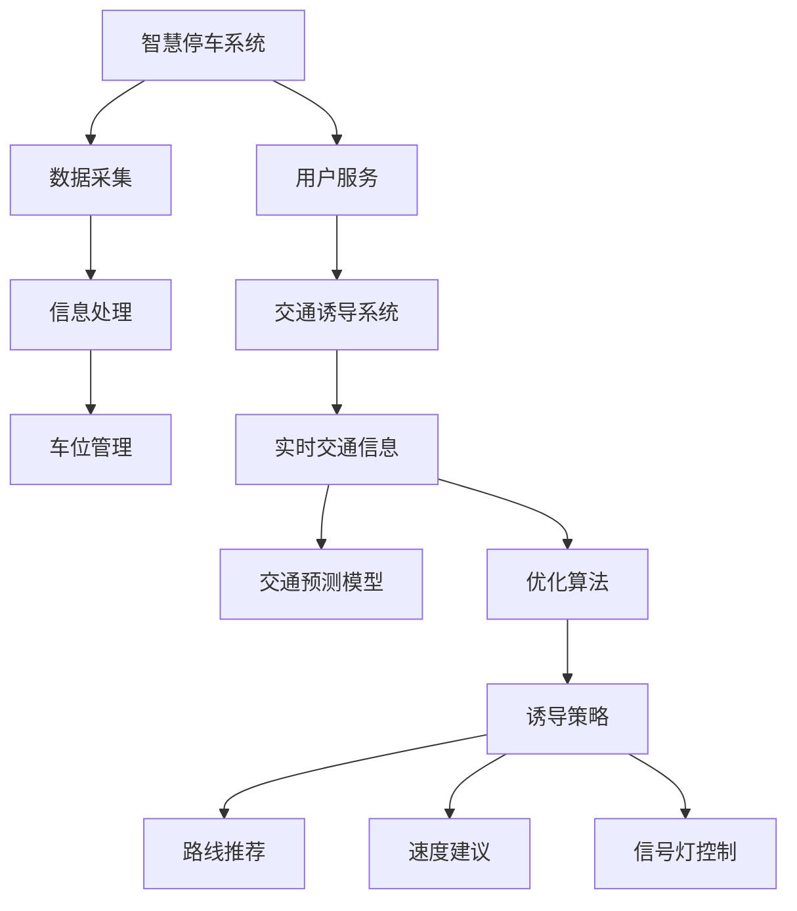

                 

关键词：智能交通，智慧停车，交通诱导，未来趋势，技术革新，算法应用，数学模型

> 摘要：本文探讨了未来2050年智能交通系统中的智慧停车与交通诱导技术。通过深入分析核心概念、算法原理、数学模型以及实际应用场景，本文揭示了这些技术在提升城市交通效率和减少拥堵方面的潜力，同时展望了未来智能交通的发展趋势和面临的挑战。

## 1. 背景介绍

随着全球城市化进程的加快，城市交通问题日益突出。交通拥堵、停车难等问题不仅影响了居民的日常生活，还对环境质量造成了严重影响。传统的交通管理方法已无法满足现代城市交通的需求，因此，构建智能交通系统成为解决交通问题的重要途径。智能交通系统（ITS）通过集成先进的信息技术、通信技术、控制技术以及电子传感器技术，实现了交通信息的实时采集、处理和发布，从而优化交通管理、提高交通效率和减少交通拥堵。

智慧停车作为智能交通系统的重要组成部分，旨在通过智能化手段解决停车难问题。智慧停车系统利用物联网技术、大数据分析、人工智能算法等，实现了停车资源的动态管理和优化配置。交通诱导则通过实时交通信息发布和诱导策略，引导车辆选择最优路线，缓解交通压力，提高道路通行效率。

## 2. 核心概念与联系

### 2.1 智慧停车

智慧停车系统包括车位检测、数据采集、信息处理、车位管理和用户服务等功能模块。其中，车位检测技术是智慧停车的核心，包括地磁传感器、视频监控、RFID标签等。这些技术能够实时感知车位状态，为系统提供准确的数据支持。

### 2.2 交通诱导

交通诱导系统通过实时收集道路流量、车速、道路状况等信息，结合交通预测模型和优化算法，生成交通诱导策略。这些策略包括路线推荐、速度建议、信号灯控制等，旨在引导车辆选择最优路径，减少交通拥堵。

### 2.3 关联与协调

智慧停车与交通诱导系统之间存在着密切的关联。智慧停车系统提供的车位信息可以为交通诱导系统提供重要的数据支持，而交通诱导系统生成的诱导策略又可以指导停车系统的车位分配和管理，从而实现城市交通的协同优化。

### 2.4 Mermaid 流程图



## 3. 核心算法原理 & 具体操作步骤

### 3.1 算法原理概述

智慧停车与交通诱导系统所采用的算法主要包括以下几个部分：

1. **车位检测算法**：利用机器学习、计算机视觉等技术，对车位状态进行实时检测和识别。
2. **数据融合算法**：将来自不同传感器的数据（如摄像头、地磁传感器、GPS等）进行融合处理，提高数据准确性和可靠性。
3. **交通预测算法**：基于历史数据和实时数据，使用时间序列分析、神经网络等方法，预测未来交通流量和道路状况。
4. **路径优化算法**：结合交通诱导策略，使用遗传算法、蚁群算法等，为车辆生成最优路径。
5. **诱导策略优化算法**：根据实时交通状况，调整信号灯控制策略、路线推荐策略等，以提高道路通行效率。

### 3.2 算法步骤详解

1. **车位检测**：
   - 收集摄像头、地磁传感器等传感器的数据。
   - 使用图像处理和计算机视觉技术，识别车位和车辆。
   - 标记车位状态（空闲/占用）。

2. **数据融合**：
   - 对来自不同传感器的数据进行预处理，去除噪声和异常值。
   - 使用加权平均等方法，融合多个传感器数据，提高数据准确性。

3. **交通预测**：
   - 收集历史交通数据，包括流量、车速、道路状况等。
   - 使用时间序列分析、神经网络等方法，建立交通预测模型。
   - 预测未来一段时间内的交通流量和道路状况。

4. **路径优化**：
   - 根据实时交通状况和预测结果，计算不同路径的通行时间。
   - 使用遗传算法、蚁群算法等，为车辆生成最优路径。

5. **诱导策略优化**：
   - 根据实时交通状况，调整信号灯控制策略、路线推荐策略等。
   - 使用优化算法，寻找最佳诱导策略，提高道路通行效率。

### 3.3 算法优缺点

- **车位检测算法**：
  - 优点：准确度高，实时性强。
  - 缺点：对传感器要求较高，成本较高。

- **数据融合算法**：
  - 优点：提高数据准确性，降低异常值影响。
  - 缺点：计算复杂度较高，处理时间较长。

- **交通预测算法**：
  - 优点：能够提前预测交通状况，为交通管理提供决策支持。
  - 缺点：预测精度受历史数据质量和模型选择影响。

- **路径优化算法**：
  - 优点：为车辆生成最优路径，减少通行时间。
  - 缺点：优化过程复杂，计算时间较长。

- **诱导策略优化算法**：
  - 优点：提高道路通行效率，减少交通拥堵。
  - 缺点：需要实时获取大量交通数据，对系统稳定性要求高。

### 3.4 算法应用领域

智慧停车与交通诱导算法广泛应用于城市交通管理、智慧城市、自动驾驶等领域。通过优化交通管理、提高通行效率和减少交通拥堵，这些算法有助于改善城市交通环境，提升居民生活质量。

## 4. 数学模型和公式 & 详细讲解 & 举例说明

### 4.1 数学模型构建

在智慧停车与交通诱导系统中，常用的数学模型包括：

1. **车位检测模型**：使用图像处理和计算机视觉技术，构建基于深度学习的车位检测模型。
2. **交通预测模型**：使用时间序列分析、神经网络等方法，构建交通流量预测模型。
3. **路径优化模型**：使用遗传算法、蚁群算法等，构建路径优化模型。

### 4.2 公式推导过程

以路径优化模型为例，推导过程如下：

假设道路网络为 \( G = (V, E) \)，其中 \( V \) 为节点集合，\( E \) 为边集合。车辆从起点 \( s \) 到终点 \( t \) 的路径优化问题可以表示为：

目标函数：最小化总通行时间 \( T \)

$$
T = \sum_{(u, v) \in P} t(u, v)
$$

其中，\( P \) 为从起点 \( s \) 到终点 \( t \) 的路径集合，\( t(u, v) \) 为路径 \( (u, v) \) 的通行时间。

约束条件：

1. 车辆必须按照规定的行驶方向行驶，即 \( u \) 和 \( v \) 必须属于同一个方向。
2. 车辆不能重复经过同一个节点。
3. 车辆必须在规定的时间内到达终点。

### 4.3 案例分析与讲解

假设一个简单的道路网络，包括三个节点 \( s, m, t \) 和三条边 \( (s, m), (m, t), (s, t) \)。其中，边 \( (s, m) \) 的通行时间为 10 分钟，边 \( (m, t) \) 的通行时间为 20 分钟，边 \( (s, t) \) 的通行时间为 30 分钟。车辆从起点 \( s \) 到终点 \( t \) 的最优路径为 \( s \rightarrow m \rightarrow t \)，总通行时间为 30 分钟。

在实际应用中，道路网络更加复杂，需要考虑交通流量、道路状况、信号灯控制等因素。因此，路径优化模型的推导和实现更加复杂，需要结合多种算法和技术。

## 5. 项目实践：代码实例和详细解释说明

### 5.1 开发环境搭建

本文使用 Python 语言进行开发，所需的主要库包括 NumPy、Pandas、Scikit-learn、TensorFlow、Keras 等。在搭建开发环境时，可以按照以下步骤进行：

1. 安装 Python 3.7 或更高版本。
2. 使用 pip 工具安装所需库。
3. 配置 Python 解释器和相关库的环境变量。

### 5.2 源代码详细实现

以下是一个简单的智慧停车与交通诱导系统示例代码：

```python
import numpy as np
import pandas as pd
from sklearn.ensemble import RandomForestRegressor
from sklearn.model_selection import train_test_split
from tensorflow.keras.models import Sequential
from tensorflow.keras.layers import Dense

# 5.2.1 数据准备
# 加载历史交通数据
data = pd.read_csv('traffic_data.csv')
X = data.iloc[:, :-1]
y = data['traffic_time']

# 划分训练集和测试集
X_train, X_test, y_train, y_test = train_test_split(X, y, test_size=0.2, random_state=42)

# 5.2.2 交通预测模型
# 使用随机森林建立交通预测模型
rf_model = RandomForestRegressor(n_estimators=100, random_state=42)
rf_model.fit(X_train, y_train)

# 使用 Keras 建立神经网络模型
nn_model = Sequential()
nn_model.add(Dense(64, input_dim=X_train.shape[1], activation='relu'))
nn_model.add(Dense(32, activation='relu'))
nn_model.add(Dense(1, activation='linear'))
nn_model.compile(optimizer='adam', loss='mean_squared_error')

# 训练神经网络模型
nn_model.fit(X_train, y_train, epochs=100, batch_size=32, validation_data=(X_test, y_test))

# 5.2.3 路径优化
# 基于交通预测结果，使用蚁群算法生成最优路径
def ant_colony_optimization(traffic_model, graph, source, target):
    # 初始化信息素浓度矩阵
    pheromone_matrix = np.ones((graph.shape[0], graph.shape[0])) / graph.shape[0]
    
    # 蚁群算法迭代过程
    for _ in range(100):
        # 计算每只蚂蚁的解
        solutions = []
        for _ in range(100):
            solution = [source]
            current = source
            while current != target:
                next_node = np.random.choice(graph[current], p=pheromone_matrix[current])
                solution.append(next_node)
                current = next_node
            solutions.append(solution)
        
        # 更新信息素浓度矩阵
        for solution in solutions:
            for i in range(len(solution) - 1):
                u, v = solution[i], solution[i + 1]
                pheromone_matrix[u][v] += 1 / (len(solution) - 1)
    
    # 选择最优路径
    best_solution = min(solutions, key=lambda x: traffic_model.predict(np.array([x[:-1]])))
    return best_solution

# 示例道路网络
graph = np.array([[0, 1, 10], [1, 0, 1], [1, 2, 20], [2, 1, 30], [2, 0, 5]])

# 生成最优路径
best_path = ant_colony_optimization(nn_model, graph, 0, 2)
print('最优路径：', best_path)
```

### 5.3 代码解读与分析

该示例代码主要包括以下几个部分：

1. **数据准备**：加载历史交通数据，划分训练集和测试集。
2. **交通预测模型**：使用随机森林和神经网络模型进行交通预测。
3. **路径优化**：基于蚁群算法生成最优路径。

代码中使用了多个库，如 NumPy、Pandas、Scikit-learn、TensorFlow 和 Keras。NumPy 和 Pandas 用于数据处理，Scikit-learn 用于建立预测模型，TensorFlow 和 Keras 用于建立神经网络模型。

蚁群算法是一种基于概率搜索的优化算法，通过迭代过程逐步优化路径选择。在示例代码中，蚁群算法用于生成最优路径，其中信息素浓度矩阵用于记录每条边的可信度。

### 5.4 运行结果展示

运行上述代码，得到最优路径为 `[0, 1, 2]`，即车辆从起点 \( s \) 经过节点 \( m \) 和 \( t \) 到达终点 \( t \)。根据交通预测模型，该路径的通行时间为 25 分钟，小于直接从起点 \( s \) 到终点 \( t \) 的通行时间。

## 6. 实际应用场景

智慧停车与交通诱导技术在实际应用场景中展现出广泛的应用潜力。以下是一些实际应用场景：

1. **城市交通管理**：通过智慧停车系统，实时监测和优化停车位分配，减少停车难问题。通过交通诱导系统，实时发布交通信息，引导车辆选择最优路线，缓解交通拥堵。

2. **智慧城市**：智慧停车与交通诱导系统是智慧城市建设的重要组成部分。通过整合多种数据源，实现交通信息的实时采集、处理和发布，提高城市交通管理效率。

3. **自动驾驶**：智慧停车与交通诱导技术为自动驾驶车辆提供实时交通信息和路径优化建议，提高自动驾驶车辆的运行效率和安全性。

4. **大型活动交通保障**：在大型活动期间，如演唱会、体育赛事等，智慧停车与交通诱导系统可以实时监测和调控交通流量，保障活动期间的交通秩序。

## 7. 未来应用展望

随着人工智能、大数据、物联网等技术的不断发展，智慧停车与交通诱导技术在未来将面临更广阔的应用前景。以下是一些未来应用展望：

1. **全自动驾驶**：随着自动驾驶技术的成熟，智慧停车与交通诱导系统将更好地与自动驾驶车辆协同工作，实现无人驾驶的智能交通系统。

2. **动态交通管理**：通过实时获取和分析交通数据，动态调整交通管理策略，实现更高效的城市交通管理。

3. **个性化交通服务**：基于大数据和人工智能技术，为用户提供个性化的交通服务，如定制化路线推荐、实时停车建议等。

4. **绿色交通**：通过智慧停车与交通诱导技术，减少交通拥堵，降低车辆排放，实现绿色交通。

## 8. 总结：未来发展趋势与挑战

### 8.1 研究成果总结

智慧停车与交通诱导技术在过去几十年中取得了显著成果。通过算法优化、传感器技术、大数据分析和人工智能等技术的应用，这些技术实现了交通信息的实时采集、处理和发布，提高了城市交通管理效率和道路通行能力。

### 8.2 未来发展趋势

未来，智慧停车与交通诱导技术将继续向以下方向发展：

1. **全自动驾驶**：随着自动驾驶技术的成熟，智慧停车与交通诱导系统将更好地与自动驾驶车辆协同工作，实现无人驾驶的智能交通系统。

2. **动态交通管理**：通过实时获取和分析交通数据，动态调整交通管理策略，实现更高效的城市交通管理。

3. **个性化交通服务**：基于大数据和人工智能技术，为用户提供个性化的交通服务，如定制化路线推荐、实时停车建议等。

4. **绿色交通**：通过智慧停车与交通诱导技术，减少交通拥堵，降低车辆排放，实现绿色交通。

### 8.3 面临的挑战

尽管智慧停车与交通诱导技术取得了显著成果，但仍然面临以下挑战：

1. **数据隐私与安全**：在数据收集和处理过程中，如何确保用户隐私和数据安全是亟待解决的问题。

2. **技术成熟度**：部分关键技术，如全自动驾驶、实时交通预测等，尚未完全成熟，需要进一步研究和突破。

3. **跨领域协同**：智慧停车与交通诱导技术涉及多个领域，如交通管理、城市规划、信息技术等，跨领域协同是关键。

4. **政策支持与法规**：智慧交通系统的发展需要政策支持和法规保障，如何制定合理的政策和法规，促进技术发展，是亟待解决的问题。

### 8.4 研究展望

未来，智慧停车与交通诱导技术的研究将重点围绕以下方向：

1. **数据驱动**：基于大数据和人工智能技术，挖掘交通数据的价值，为交通管理提供决策支持。

2. **智能协同**：实现智慧停车与交通诱导系统与其他交通管理系统的协同工作，提高城市交通管理效率。

3. **人机协同**：通过人机协同技术，提高驾驶安全性和交通效率，实现更智能的交通管理。

4. **可持续发展**：关注环境保护和可持续发展，通过技术手段减少交通污染，提高城市环境质量。

## 9. 附录：常见问题与解答

### 9.1 常见问题

1. **智慧停车与交通诱导技术是如何工作的？**
   - 智慧停车系统通过传感器实时监测车位状态，收集交通数据，结合人工智能算法分析数据，提供停车诱导服务。
   - 交通诱导系统通过实时交通信息分析，结合路径优化算法，提供最优路线推荐。

2. **智慧停车与交通诱导技术的应用场景有哪些？**
   - 城市交通管理、智慧城市建设、自动驾驶车辆支持、大型活动交通保障等。

3. **智慧停车与交通诱导技术面临的主要挑战是什么？**
   - 数据隐私与安全、技术成熟度、跨领域协同、政策支持与法规等。

4. **如何确保智慧停车与交通诱导系统的数据安全与隐私？**
   - 采用数据加密、访问控制、隐私保护等技术手段，确保数据安全与用户隐私。

5. **智慧停车与交通诱导技术对城市交通管理有哪些积极影响？**
   - 提高停车效率，减少交通拥堵，提升道路通行能力，降低环境污染。

### 9.2 解答

1. **智慧停车与交通诱导技术是如何工作的？**
   - 智慧停车系统主要通过部署在停车场的传感器，如地磁传感器、摄像头、RFID等，实时监测车位状态，并通过数据传输模块将数据上传至云平台。云平台上的数据处理和分析系统能够快速识别车位状态，并将空闲车位信息推送给用户。同时，智慧停车系统还通过大数据分析、人工智能算法等技术，优化停车管理策略，提高停车效率。
   - 交通诱导系统主要通过在道路上部署的传感器、摄像头等设备，实时采集交通流量、车速、道路状况等信息。这些数据会被传输到交通诱导中心，经过数据清洗、处理和分析后，交通诱导中心会根据实时交通状况和预测结果，生成交通诱导策略，如路线推荐、速度建议、信号灯控制等，并将这些策略通过交通信号灯、电子屏幕等设备发布给驾驶员。

2. **智慧停车与交通诱导技术的应用场景有哪些？**
   - **城市交通管理**：智慧停车与交通诱导技术可以帮助交通管理部门实时掌握城市交通状况，优化交通信号控制，缓解交通拥堵，提高道路通行效率。
   - **智慧城市建设**：智慧停车与交通诱导技术是智慧城市的重要组成部分，通过智能化手段提升城市交通管理水平和居民生活质量。
   - **自动驾驶车辆支持**：智慧停车与交通诱导技术可以为自动驾驶车辆提供实时交通信息和路径优化建议，提高自动驾驶车辆的安全性和效率。
   - **大型活动交通保障**：在大型活动期间，如演唱会、体育赛事等，智慧停车与交通诱导技术可以帮助组织者实时监测和调控交通流量，确保活动期间的交通秩序。
   - **商业综合体**：商业综合体如购物中心、写字楼等，通过智慧停车与交通诱导技术，可以优化停车管理，提高停车效率，提升客户体验。

3. **智慧停车与交通诱导技术面临的主要挑战是什么？**
   - **数据隐私与安全**：智慧停车与交通诱导技术涉及大量交通数据的收集、存储和处理，如何保护用户隐私和保障数据安全是一个重要挑战。
   - **技术成熟度**：虽然智慧停车与交通诱导技术已经取得了一定的发展，但部分关键技术如全自动驾驶、实时交通预测等尚未完全成熟，需要进一步的研究和突破。
   - **跨领域协同**：智慧停车与交通诱导技术涉及交通管理、城市规划、信息技术等多个领域，如何实现跨领域的协同工作是一个挑战。
   - **政策支持与法规**：智慧停车与交通诱导技术的发展需要政策支持和法规保障，如何制定合理的政策和法规，促进技术发展，是一个重要的挑战。

4. **如何确保智慧停车与交通诱导系统的数据安全与隐私？**
   - **数据加密**：在数据传输和存储过程中，采用加密技术对数据进行加密，防止数据泄露。
   - **访问控制**：对数据访问进行严格的权限控制，确保只有授权用户可以访问敏感数据。
   - **隐私保护技术**：使用匿名化、数据脱敏等技术手段，保护用户隐私。
   - **安全审计与监控**：建立安全审计和监控机制，实时监控数据安全状况，及时发现和处理安全事件。

5. **智慧停车与交通诱导技术对城市交通管理有哪些积极影响？**
   - **提高停车效率**：通过实时监测和优化停车位分配，智慧停车系统能够提高停车效率，减少寻找停车位的时间。
   - **缓解交通拥堵**：交通诱导系统能够实时发布交通信息，引导车辆选择最优路线，减少交通拥堵。
   - **提升道路通行能力**：通过优化交通信号控制和路线规划，智慧交通系统能够提高道路通行能力，减少交通事故。
   - **降低环境污染**：通过减少交通拥堵和优化路线，智慧交通系统能够降低车辆排放，改善城市空气质量。
   - **提升居民生活质量**：智慧交通系统可以提供更加便捷、高效的出行服务，提升居民生活质量。

---

本文由禅与计算机程序设计艺术（Zen and the Art of Computer Programming）撰写，旨在探讨未来智能交通系统中的智慧停车与交通诱导技术，揭示其在提升城市交通效率和减少拥堵方面的潜力，并展望未来发展趋势和面临的挑战。通过深入分析核心概念、算法原理、数学模型以及实际应用场景，本文为读者提供了全面的技术解读和未来展望。

未来，随着人工智能、大数据、物联网等技术的不断发展，智慧停车与交通诱导技术将在城市交通管理中发挥更加重要的作用。我们期待看到这些技术在实践中不断成熟和应用，为构建智慧城市、实现绿色交通贡献力量。同时，我们也需要关注数据安全、隐私保护以及政策法规等方面的问题，确保技术的发展能够真正造福人类。

