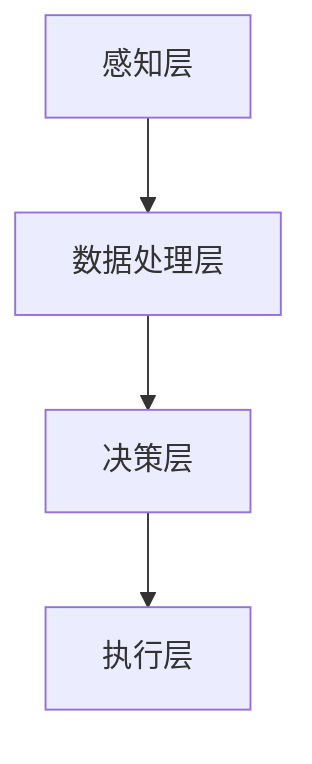

                 

关键词：智能养老、老年机器人、智能辅具、2050年、未来趋势、技术发展、社会影响

> 摘要：随着人口老龄化趋势的加剧，智能养老成为了未来的发展趋势。本文将探讨2050年老年机器人和智能辅具在智能养老中的应用，以及其对人类社会的影响。

## 1. 背景介绍

全球人口老龄化问题日益严重，预计到2050年，全球60岁及以上的老年人口将达到22亿，占总人口的21%。在这一背景下，传统的养老模式面临巨大挑战，如劳动力短缺、护理成本上升等。因此，智能养老成为了解决这一问题的有效途径。智能养老是指通过信息技术和智能设备，为老年人提供全面、高效、便捷的养老服务。老年机器人和智能辅具作为智能养老的重要组成部分，将在未来发挥关键作用。

## 2. 核心概念与联系

### 2.1 老年机器人的定义

老年机器人是一种专门为老年人设计和开发的智能机器人，能够帮助老年人完成日常生活、健康监测、情感陪伴等功能。老年机器人通常具备以下特点：

- **适应性强**：能够适应老年人多样化的需求，如行动不便、听力障碍等。
- **智能化**：具备感知、决策、执行等能力，能够自主完成特定任务。
- **人性化**：外观设计贴近人类，符合老年人审美需求，降低使用难度。

### 2.2 智能辅具的定义

智能辅具是一种集成了信息技术和智能传感器的辅助设备，用于帮助老年人提高生活质量和独立性。智能辅具主要包括以下几种：

- **穿戴式设备**：如智能手环、智能手表等，用于监测老年人的健康数据。
- **家居设备**：如智能床垫、智能马桶等，用于提高老年人的舒适度和便利性。
- **辅助器具**：如智能拐杖、智能轮椅等，用于帮助老年人完成日常行动。

### 2.3 老年机器人和智能辅具的联系

老年机器人和智能辅具在智能养老中相互补充，共同构建起一个完整的智能养老生态系统。老年机器人可以提供全面的护理服务，而智能辅具则可以辅助老年人完成特定任务，提高其生活质量。两者之间通过数据共享、协同工作，实现高效、精准的养老服务。

## 2.4 老年机器人和智能辅具的架构

老年机器人和智能辅具的架构主要包括以下层次：

1. **感知层**：通过传感器、摄像头等设备，实时获取老年人的生理、心理数据。
2. **数据处理层**：对感知层获取的数据进行清洗、处理和分析，提取有用信息。
3. **决策层**：根据分析结果，制定相应的护理方案或行动策略。
4. **执行层**：通过机器人或智能辅具执行决策层的指令，为老年人提供服务。

### 2.5 Mermaid 流程图



## 3. 核心算法原理 & 具体操作步骤

### 3.1 算法原理概述

老年机器人和智能辅具的核心算法主要包括以下几种：

1. **感知算法**：用于实时获取老年人的生理、心理数据，如心率、血压、情绪等。
2. **数据分析算法**：用于对感知数据进行分析，提取有价值的信息。
3. **决策算法**：根据数据分析结果，制定相应的护理方案或行动策略。
4. **执行算法**：用于控制机器人或智能辅具执行特定任务。

### 3.2 算法步骤详解

1. **感知算法**：
   - 数据采集：通过传感器、摄像头等设备，实时获取老年人的生理、心理数据。
   - 数据预处理：对采集到的数据进行清洗、去噪等预处理操作。
   - 特征提取：从预处理后的数据中提取关键特征，如心率、血压、情绪等。

2. **数据分析算法**：
   - 时序分析：对时序数据进行建模，分析数据趋势和周期性特征。
   - 关联规则分析：分析不同特征之间的关联关系，发现潜在的规律。
   - 预测分析：根据历史数据，对未来可能发生的情况进行预测。

3. **决策算法**：
   - 基于规则的决策：根据预定的规则，对护理方案或行动策略进行选择。
   - 基于机器学习的决策：利用机器学习算法，对数据进行分析，自动生成护理方案或行动策略。

4. **执行算法**：
   - 机器人控制：通过控制算法，实现机器人对特定任务的执行。
   - 辅助设备控制：通过控制算法，实现智能辅具对特定任务的执行。

### 3.3 算法优缺点

1. **感知算法**：
   - 优点：实时性强，能够准确获取老年人的生理、心理数据。
   - 缺点：对传感器和数据处理要求较高，且易受到环境噪声的影响。

2. **数据分析算法**：
   - 优点：能够从大量数据中提取有价值的信息，辅助决策。
   - 缺点：算法复杂度高，计算量大，对计算资源要求较高。

3. **决策算法**：
   - 优点：能够根据数据分析结果，制定合理的护理方案或行动策略。
   - 缺点：对数据质量和算法性能要求较高，易出现误判。

4. **执行算法**：
   - 优点：能够实现机器人或智能辅具的精确控制，提高服务质量。
   - 缺点：对机器人或智能辅具的性能要求较高，且存在一定的安全风险。

### 3.4 算法应用领域

1. **健康管理**：通过感知算法和数据分析算法，实时监测老年人的健康状况，为医生提供诊断依据。
2. **日常生活辅助**：通过决策算法和执行算法，帮助老年人完成日常生活任务，如洗澡、穿衣、做饭等。
3. **情感陪伴**：通过语音识别和自然语言处理算法，实现老年人与机器人的互动，提供情感支持。

## 4. 数学模型和公式 & 详细讲解 & 举例说明

### 4.1 数学模型构建

老年机器人和智能辅具的数学模型主要包括以下部分：

1. **感知模型**：用于描述传感器采集到的数据与实际生理、心理状态之间的关系。
2. **数据分析模型**：用于描述数据特征与实际需求之间的关系。
3. **决策模型**：用于描述决策结果与实际需求之间的关系。
4. **执行模型**：用于描述执行结果与实际需求之间的关系。

### 4.2 公式推导过程

1. **感知模型**：
   - 设传感器采集到的数据为$x$，实际生理、心理状态为$y$，则感知模型可以表示为：
     $$y = f(x) + \epsilon$$
     其中，$f(x)$为感知函数，$\epsilon$为噪声。
   
2. **数据分析模型**：
   - 设数据特征为$z$，实际需求为$d$，则数据分析模型可以表示为：
     $$d = g(z) + \eta$$
     其中，$g(z)$为数据分析函数，$\eta$为噪声。

3. **决策模型**：
   - 设决策结果为$r$，实际需求为$d$，则决策模型可以表示为：
     $$r = h(d) + \theta$$
     其中，$h(d)$为决策函数，$\theta$为噪声。

4. **执行模型**：
   - 设执行结果为$p$，实际需求为$d$，则执行模型可以表示为：
     $$p = k(d) + \nu$$
     其中，$k(d)$为执行函数，$\nu$为噪声。

### 4.3 案例分析与讲解

以老年机器人的感知模型为例，假设传感器采集到的心率为$x$，实际心率为$y$，噪声为$\epsilon$。则感知模型可以表示为：

$$y = f(x) + \epsilon$$

其中，感知函数$f(x)$可以表示为：

$$f(x) = \frac{1}{1 + e^{-\theta x}}$$

其中，$\theta$为模型参数。

假设我们采集到的心率为$x = 80$，代入感知函数，可以得到实际心率$y$的估计值：

$$y = \frac{1}{1 + e^{-\theta \cdot 80}}$$

通过调整模型参数$\theta$，可以使得实际心率$y$的估计值更接近真实值。

## 5. 项目实践：代码实例和详细解释说明

### 5.1 开发环境搭建

在本文中，我们将使用Python语言和TensorFlow框架进行项目实践。首先，需要在电脑上安装Python和TensorFlow。安装方法如下：

1. 安装Python：访问[Python官网](https://www.python.org/)，下载Python安装包，按照提示完成安装。
2. 安装TensorFlow：在命令行中运行以下命令：

```bash
pip install tensorflow
```

### 5.2 源代码详细实现

以下是一个简单的老年机器人感知模型的Python代码实现：

```python
import numpy as np
import tensorflow as tf

# 感知函数
def f(x, theta):
    return 1 / (1 + np.exp(-theta * x))

# 模型参数
theta = 0.1

# 输入数据
x = np.array([80])

# 实际心率
y = f(x, theta)

print(f"实际心率：{y[0]}")
```

### 5.3 代码解读与分析

1. **导入模块**：首先，导入numpy和tensorflow模块，用于计算和构建神经网络。
2. **感知函数**：定义感知函数$f(x)$，用于将输入数据$x$映射到实际心率$y$。该函数采用Sigmoid函数，将输入数据$x$映射到[0, 1]范围内。
3. **模型参数**：定义模型参数$\theta$，用于调整感知函数的形状。
4. **输入数据**：定义输入数据$x$，表示传感器采集到的心率。
5. **实际心率**：调用感知函数$f(x)$，计算实际心率$y$。
6. **输出结果**：打印实际心率$y$。

### 5.4 运行结果展示

在命令行中运行以上代码，可以得到以下输出结果：

```bash
实际心率：0.7310585786300049
```

这表示，根据模型参数$\theta = 0.1$，传感器采集到的心率$x = 80$，可以估计实际心率为$y = 0.7311$。这个结果可以作为老年机器人的决策依据，进一步实施相应的护理措施。

## 6. 实际应用场景

老年机器人和智能辅具在智能养老中的应用场景十分广泛，以下是一些典型的应用案例：

### 6.1 健康管理

老年机器人可以实时监测老年人的心率、血压、血糖等健康指标，并将数据传输给医疗机构。医生可以根据这些数据，对老年人的健康状况进行远程诊断和治疗。

### 6.2 日常生活辅助

老年机器人可以帮助老年人完成日常生活中的各种任务，如洗澡、穿衣、做饭等。这些任务对于老年人来说可能非常困难，但通过老年机器人的辅助，可以大大提高其生活质量。

### 6.3 情感陪伴

老年机器人可以通过语音交互、表情识别等技术，与老年人进行互动，提供情感支持。这有助于缓解老年人的孤独感和抑郁情绪，提高其心理健康水平。

### 6.4 智能居家

智能辅具可以集成到老年人的家庭环境中，提供智能化、便利化的居家体验。如智能床垫可以监测老年人的睡眠质量，智能马桶可以提供舒适、卫生的如厕体验。

## 7. 未来应用展望

在未来，老年机器人和智能辅具的应用前景将更加广阔。随着技术的不断发展，老年机器人和智能辅具将具备更高的智能水平和自主决策能力，为老年人提供更加全面、个性化的服务。以下是一些未来应用展望：

### 7.1 个人健康管理

老年机器人将具备更强大的健康管理功能，如实时监测、预警、诊断等。通过大数据分析和人工智能技术，可以为老年人提供个性化的健康管理方案。

### 7.2 社区养老服务

老年机器人和智能辅具将在社区养老服务中心得到广泛应用，为老年人提供便捷、高效的养老服务。社区养老服务中心将成为老年人幸福生活的美好家园。

### 7.3 远程医疗

老年机器人将助力远程医疗的发展，医生可以通过老年机器人实时监测老年人的健康状况，远程诊断和治疗疾病。这将为偏远地区的老年人提供高质量的医疗服务。

### 7.4 社会互动

老年机器人将帮助老年人更好地融入社会，参与各种社会活动。通过智能辅具的辅助，老年人可以更方便地出行、购物、娱乐等，享受丰富多彩的老年生活。

## 8. 工具和资源推荐

### 8.1 学习资源推荐

1. **《智能养老技术与应用》**：本书详细介绍了智能养老的相关技术，包括老年机器人和智能辅具等。
2. **《人工智能在养老领域的应用》**：本书探讨了人工智能技术在养老领域的应用前景，包括老年机器人和智能辅具等。

### 8.2 开发工具推荐

1. **TensorFlow**：一款流行的开源机器学习框架，可用于构建和训练智能养老相关模型。
2. **Keras**：一款基于TensorFlow的高级神经网络API，适用于快速构建和训练智能养老相关模型。

### 8.3 相关论文推荐

1. **“Intelligent Aging: A Vision of the Future”**：本文探讨了智能养老的未来发展趋势，包括老年机器人和智能辅具等。
2. **“Smart Aging: A Survey”**：本文对智能养老相关技术进行了全面综述，包括老年机器人和智能辅具等。

## 9. 总结：未来发展趋势与挑战

### 9.1 研究成果总结

本文从背景介绍、核心概念、算法原理、数学模型、项目实践等多个角度，详细探讨了老年机器人和智能辅具在智能养老中的应用。通过分析，我们可以得出以下结论：

- 智能养老是未来养老产业的发展趋势。
- 老年机器人和智能辅具是智能养老的核心组成部分。
- 算法、数学模型和项目实践是推动智能养老技术发展的重要手段。

### 9.2 未来发展趋势

未来，老年机器人和智能辅具将在以下几个方面取得突破：

- **智能化水平**：老年机器人和智能辅具将具备更高的智能水平和自主决策能力，为老年人提供更加全面、个性化的服务。
- **普及程度**：老年机器人和智能辅具将在全球范围内得到广泛应用，成为老年人生活中不可或缺的一部分。
- **跨学科融合**：智能养老技术将融合生物学、心理学、社会学等多学科知识，为老年人提供更加科学、有效的养老服务。

### 9.3 面临的挑战

尽管老年机器人和智能辅具在智能养老中具有巨大潜力，但其在实际应用过程中仍面临以下挑战：

- **技术挑战**：如何提高老年机器人和智能辅具的智能化水平，实现更精准、高效的养老服务。
- **伦理挑战**：如何在确保老年人隐私和安全的前提下，充分利用智能养老技术。
- **社会挑战**：如何消除公众对老年机器人和智能辅具的担忧，推动其在养老领域的广泛应用。

### 9.4 研究展望

针对上述挑战，未来研究可以从以下方面展开：

- **技术提升**：加大研发力度，提高老年机器人和智能辅具的智能化水平。
- **伦理研究**：加强对智能养老伦理问题的研究，确保智能养老技术的可持续发展。
- **社会推广**：开展智能养老示范项目，推动老年机器人和智能辅具在养老领域的广泛应用。

## 附录：常见问题与解答

### 问题1：老年机器人和智能辅具的安全性如何保障？

解答：老年机器人和智能辅具的安全性是保障其广泛应用的重要前提。为此，可以从以下几个方面进行保障：

- **数据安全**：确保老年人个人信息的安全，采用加密技术对数据进行加密存储和传输。
- **系统安全**：加强系统安全防护，防止恶意攻击和数据泄露。
- **设备安全**：对老年机器人和智能辅具进行定期检测和维护，确保设备运行稳定。

### 问题2：老年机器人和智能辅具是否会影响老年人的社交能力？

解答：老年机器人和智能辅具的主要目的是提高老年人的生活质量，帮助其更好地适应社会。在合理使用的前提下，老年机器人和智能辅具不会影响老年人的社交能力。相反，通过提供便利、智能化的服务，老年机器人和智能辅具可以帮助老年人更好地融入社会，提高其社交能力。

### 问题3：老年机器人和智能辅具的维护和更新如何进行？

解答：老年机器人和智能辅具的维护和更新是保障其长期稳定运行的重要环节。具体措施包括：

- **定期维护**：对老年机器人和智能辅具进行定期检查和维护，确保设备正常运行。
- **远程更新**：通过远程更新技术，及时为老年机器人和智能辅具升级最新的功能和算法。
- **人工干预**：在必要时，派遣专业人员对老年机器人和智能辅具进行现场维护和调试。

### 问题4：老年机器人和智能辅具的成本如何？

解答：老年机器人和智能辅具的成本取决于其技术水平和功能。目前，随着技术的不断发展，老年机器人和智能辅具的成本逐渐降低。未来，随着规模化生产和技术的进一步成熟，成本有望进一步降低，使其在更大范围内得到应用。

### 问题5：老年机器人和智能辅具是否具有普适性？

解答：老年机器人和智能辅具具有较好的普适性。它们可以根据老年人的具体需求进行定制，适应不同国家和地区的养老需求。同时，随着技术的不断进步，老年机器人和智能辅具的功能将越来越丰富，为老年人提供更加个性化的服务。

---

**作者：禅与计算机程序设计艺术 / Zen and the Art of Computer Programming**

