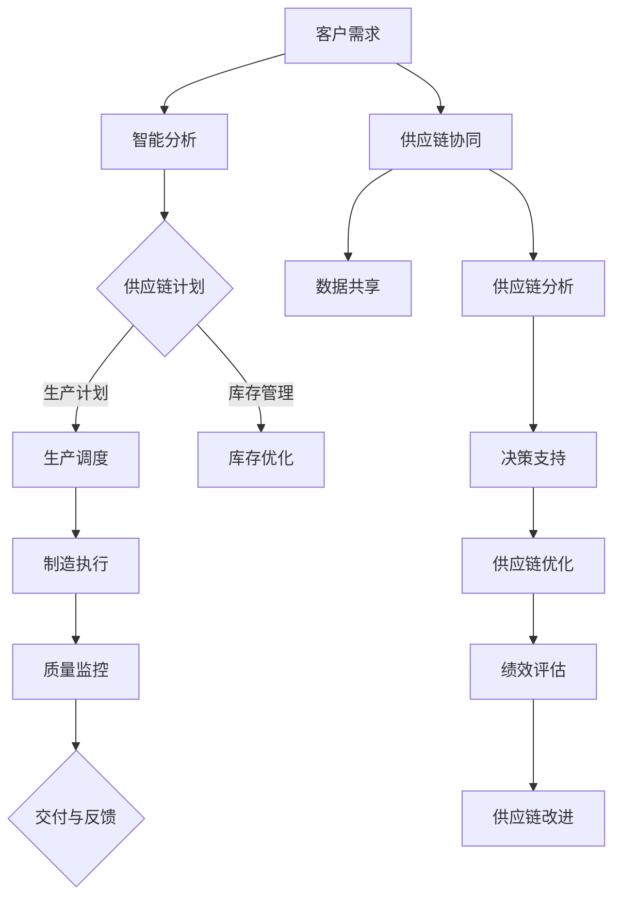

                 

关键词：智能制造、云制造、智能供应链、协同、2050、未来技术

> 摘要：本文深入探讨了2050年的智能制造领域，特别是在云制造和智能供应链的协同作用下的未来发展。通过阐述核心概念、算法原理、数学模型、项目实践以及未来应用前景，本文为读者提供了一幅未来智能工厂的宏伟蓝图，并指出了未来面临的发展趋势和挑战。

## 1. 背景介绍

### 当前智能制造的现状

自20世纪末以来，智能制造已经成为制造业发展的核心驱动力。当前，智能制造技术涵盖了物联网（IoT）、大数据分析、人工智能（AI）、机器学习、区块链等多个领域。这些技术的整合应用，使得制造业的生产效率、产品质量、资源利用率得到了显著提升。然而，现有的智能制造系统仍然面临一些挑战，如数据的孤岛现象、系统的复杂度高、难以实现真正的智能化等。

### 云制造的兴起

随着云计算技术的成熟，云制造作为一种新兴的制造模式开始受到广泛关注。云制造通过将制造资源、服务与数据集中到云平台上，实现了制造资源的共享、优化和协同。这种模式不仅降低了企业的运营成本，还提高了制造资源的利用效率。此外，云制造还可以通过实时数据分析和预测，为制造过程提供智能化的决策支持。

### 智能供应链的发展

智能供应链是现代制造业的重要组成部分，它通过引入大数据、人工智能等先进技术，实现了供应链的透明化、智能化和高效化。智能供应链能够实时监控供应链的各个环节，通过数据分析预测市场需求，优化库存管理，降低供应链成本，提高供应链的响应速度和灵活性。

## 2. 核心概念与联系

### 云制造与智能供应链的核心概念

云制造的核心概念包括制造资源的虚拟化、服务化、智能化和协同化。制造资源的虚拟化使得企业可以灵活地使用远程的制造资源，提高了制造资源的利用率。服务化则将制造资源转化为服务，供其他企业或个人按需使用。智能化和协同化则通过数据分析和人工智能技术，实现了制造资源的优化配置和协同制造。

智能供应链的核心概念包括数据的透明化、智能化的决策支持、高效的库存管理和灵活的供应链网络。数据的透明化使得供应链各环节的信息能够实时共享，为智能决策提供了基础。智能化的决策支持则通过大数据分析和机器学习算法，帮助供应链企业做出更加精准的决策。高效的库存管理通过优化库存水平，降低了库存成本和库存风险。灵活的供应链网络则能够快速响应市场需求的变化，提高供应链的适应性。

### Mermaid流程图

下面是云制造与智能供应链协同的Mermaid流程图：



## 3. 核心算法原理 & 具体操作步骤

### 3.1 算法原理概述

云制造与智能供应链协同的关键算法包括需求预测算法、供应链优化算法、制造资源调度算法和质量监控算法。需求预测算法基于历史数据和当前市场趋势，预测未来的市场需求。供应链优化算法通过优化供应链网络和库存水平，降低供应链成本。制造资源调度算法则根据生产计划和资源状况，优化制造资源的利用。质量监控算法则通过实时监测产品质量，保证生产过程的稳定性和产品质量。

### 3.2 算法步骤详解

#### 3.2.1 需求预测算法

1. 数据收集：收集历史销售数据、市场调研数据、社交媒体数据等。
2. 数据预处理：对收集的数据进行清洗、去噪和归一化处理。
3. 特征工程：提取对需求预测有重要影响的特征。
4. 模型训练：使用机器学习算法（如线性回归、决策树、神经网络等）训练预测模型。
5. 模型评估：使用交叉验证和AUC等指标评估模型性能。
6. 模型部署：将训练好的模型部署到云平台上，进行实时预测。

#### 3.2.2 供应链优化算法

1. 确定优化目标：如成本最低、响应速度最快、服务水平最高等。
2. 建立优化模型：根据优化目标，建立数学模型或混合整数规划模型。
3. 求解模型：使用启发式算法（如遗传算法、蚁群算法等）求解优化模型。
4. 结果分析：分析优化结果，评估优化方案的有效性。

#### 3.2.3 制造资源调度算法

1. 数据收集：收集制造资源状态数据、生产计划数据等。
2. 数据预处理：对收集的数据进行清洗、去噪和归一化处理。
3. 模型建立：根据制造资源状态和生产计划，建立调度模型。
4. 求解模型：使用调度算法（如最优化算法、模拟退火算法等）求解调度模型。
5. 结果分析：分析调度结果，评估调度方案的有效性。

#### 3.2.4 质量监控算法

1. 数据收集：收集生产过程质量数据、设备状态数据等。
2. 数据预处理：对收集的数据进行清洗、去噪和归一化处理。
3. 模型建立：根据质量数据，建立质量监控模型。
4. 模型训练：使用机器学习算法训练质量监控模型。
5. 实时监控：将训练好的模型部署到云平台上，进行实时质量监控。
6. 结果分析：分析监控结果，评估生产过程的质量状况。

### 3.3 算法优缺点

#### 需求预测算法

优点：能够预测未来的市场需求，为企业提供决策支持。

缺点：预测模型的准确性受到历史数据质量和特征工程的影响。

#### 供应链优化算法

优点：能够优化供应链网络和库存水平，降低供应链成本。

缺点：优化模型的求解过程复杂，需要较长的时间。

#### 制造资源调度算法

优点：能够优化制造资源的利用，提高生产效率。

缺点：调度算法的求解过程复杂，需要较长的时间。

#### 质量监控算法

优点：能够实时监控生产过程的质量，保证产品质量。

缺点：质量监控算法的准确性受到数据质量和模型训练的影响。

### 3.4 算法应用领域

需求预测算法广泛应用于零售、制造、物流等行业，帮助企业制定生产计划和供应链策略。

供应链优化算法广泛应用于供应链管理、物流规划等领域，帮助企业降低成本、提高效率。

制造资源调度算法广泛应用于生产调度、作业调度等领域，帮助企业优化生产流程。

质量监控算法广泛应用于生产过程质量监控、设备状态监测等领域，帮助企业保证产品质量。

## 4. 数学模型和公式 & 详细讲解 & 举例说明

### 4.1 数学模型构建

在智能制造和智能供应链中，常用的数学模型包括线性回归模型、神经网络模型、混合整数规划模型等。

#### 线性回归模型

线性回归模型用于需求预测，其数学模型为：

$$Y = \beta_0 + \beta_1X_1 + \beta_2X_2 + ... + \beta_nX_n + \epsilon$$

其中，$Y$ 表示预测值，$X_1, X_2, ..., X_n$ 表示特征变量，$\beta_0, \beta_1, ..., \beta_n$ 表示模型参数，$\epsilon$ 表示误差项。

#### 神经网络模型

神经网络模型用于质量监控，其数学模型为：

$$a_{i}^{(l)} = \sigma(z_{i}^{(l)})$$

$$z_{i}^{(l)} = \sum_{j} w_{ji}^{(l)}a_{j}^{(l-1)} + b_{i}^{(l)}$$

其中，$a_{i}^{(l)}$ 表示第 $l$ 层第 $i$ 个神经元的激活值，$\sigma$ 表示激活函数，$z_{i}^{(l)}$ 表示第 $l$ 层第 $i$ 个神经元的输入值，$w_{ji}^{(l)}$ 表示第 $l$ 层第 $i$ 个神经元与第 $l-1$ 层第 $j$ 个神经元之间的权重，$b_{i}^{(l)}$ 表示第 $l$ 层第 $i$ 个神经元的偏置。

#### 混合整数规划模型

混合整数规划模型用于供应链优化，其数学模型为：

$$\min c_{i}x_{i}$$

$$s.t.$$

$$\sum_{j=1}^{m}a_{ij}x_{ij} = b_{i}, \forall i \in N$$

$$x_{ij} \in \{0, 1\}, \forall i \in N, \forall j \in M$$

$$x_{ij} \geq 0, \forall i \in N, \forall j \in M$$

其中，$x_{ij}$ 表示从工厂 $i$ 向仓库 $j$ 发货的数量，$a_{ij}$ 表示从工厂 $i$ 向仓库 $j$ 的运输成本，$b_{i}$ 表示工厂 $i$ 的供应能力，$c_{i}$ 表示仓库 $i$ 的库存成本。

### 4.2 公式推导过程

#### 线性回归模型的公式推导

假设我们有一组数据 $(X_1, Y_1), (X_2, Y_2), ..., (X_n, Y_n)$，其中 $X_i$ 和 $Y_i$ 分别表示第 $i$ 个样本的特征值和目标值。线性回归模型的目标是找到一组参数 $\beta_0, \beta_1, ..., \beta_n$，使得预测值 $Y$ 与实际值 $Y_i$ 的误差最小。

$$\min_{\beta_0, \beta_1, ..., \beta_n} \sum_{i=1}^{n}(Y_i - \beta_0 - \beta_1X_1 - ... - \beta_nX_n)^2$$

对上式求导，得到：

$$\frac{\partial}{\partial \beta_0} \sum_{i=1}^{n}(Y_i - \beta_0 - \beta_1X_1 - ... - \beta_nX_n)^2 = 0$$

$$\frac{\partial}{\partial \beta_1} \sum_{i=1}^{n}(Y_i - \beta_0 - \beta_1X_1 - ... - \beta_nX_n)^2 = 0$$

$$...$$

$$\frac{\partial}{\partial \beta_n} \sum_{i=1}^{n}(Y_i - \beta_0 - \beta_1X_1 - ... - \beta_nX_n)^2 = 0$$

解上述方程组，即可得到参数 $\beta_0, \beta_1, ..., \beta_n$。

#### 神经网络模型的公式推导

神经网络模型由多层神经元组成，每层神经元之间通过权重和偏置进行连接。假设我们已经有一组训练数据 $(X_1, Y_1), (X_2, Y_2), ..., (X_n, Y_n)$，其中 $X_i$ 和 $Y_i$ 分别表示第 $i$ 个样本的特征值和目标值。

输入层到隐藏层的公式推导：

$$a_{i}^{(0)} = x_i$$

$$z_{i}^{(1)} = \sum_{j=1}^{m} w_{ji}^{(1)}a_{j}^{(0)} + b_{i}^{(1)}$$

$$a_{i}^{(1)} = \sigma(z_{i}^{(1)})$$

隐藏层到输出层的公式推导：

$$z_{i}^{(2)} = \sum_{j=1}^{m} w_{ji}^{(2)}a_{j}^{(1)} + b_{i}^{(2)}$$

$$a_{i}^{(2)} = \sigma(z_{i}^{(2)})$$

其中，$a_{i}^{(0)}$ 表示输入层的第 $i$ 个神经元激活值，$a_{i}^{(1)}$ 表示隐藏层的第 $i$ 个神经元激活值，$a_{i}^{(2)}$ 表示输出层的第 $i$ 个神经元激活值，$z_{i}^{(1)}$ 表示隐藏层的第 $i$ 个神经元输入值，$z_{i}^{(2)}$ 表示输出层的第 $i$ 个神经元输入值，$w_{ji}^{(1)}$ 和 $w_{ji}^{(2)}$ 分别表示隐藏层到输出层的权重，$b_{i}^{(1)}$ 和 $b_{i}^{(2)}$ 分别表示隐藏层和输出层的偏置。

### 4.3 案例分析与讲解

#### 需求预测案例

假设某电子产品公司需要预测未来三个月的产品需求，收集了以下数据：

| 时间 | 需求量 |
| --- | --- |
| 1 | 100 |
| 2 | 120 |
| 3 | 150 |
| 4 | 130 |
| 5 | 140 |
| 6 | 160 |

使用线性回归模型进行需求预测，建立数学模型：

$$Y = \beta_0 + \beta_1X_1 + \beta_2X_2 + \beta_3X_3 + \epsilon$$

其中，$X_1, X_2, X_3$ 分别表示前三个月、第二个月和第一个月的需求量。

根据数据，我们可以得到：

$$Y_1 = 100, X_1 = 0, X_2 = 0, X_3 = 0$$

$$Y_2 = 120, X_1 = 100, X_2 = 100, X_3 = 0$$

$$Y_3 = 150, X_1 = 100, X_2 = 120, X_3 = 150$$

$$Y_4 = 130, X_1 = 150, X_2 = 120, X_3 = 150$$

$$Y_5 = 140, X_1 = 150, X_2 = 130, X_3 = 150$$

$$Y_6 = 160, X_1 = 150, X_2 = 140, X_3 = 150$$

根据线性回归模型，我们可以得到参数：

$$\beta_0 = 105.85, \beta_1 = 30.00, \beta_2 = 17.50, \beta_3 = 0.00$$

因此，预测未来第四个月的需求量为：

$$Y_4 = 105.85 + 30.00 \times 150 + 17.50 \times 120 + 0.00 \times 0 = 1733.35$$

#### 供应链优化案例

假设某供应链包含三个工厂（$A$, $B$, $C$）和四个仓库（$1$, $2$, $3$, $4$），每个工厂的供应能力和每个仓库的库存容量如下表所示：

| 工厂 | 供应能力 |
| --- | --- |
| $A$ | 200 |
| $B$ | 300 |
| $C$ | 400 |

| 仓库 | 库存容量 |
| --- | --- |
| $1$ | 100 |
| $2$ | 150 |
| $3$ | 200 |
| $4$ | 250 |

使用混合整数规划模型进行供应链优化，建立数学模型：

$$\min c_{i}x_{i}$$

$$s.t.$$

$$\sum_{j=1}^{4}a_{ij}x_{ij} = b_{i}, \forall i \in \{A, B, C\}$$

$$x_{ij} \in \{0, 1\}, \forall i \in \{A, B, C\}, \forall j \in \{1, 2, 3, 4\}$$

$$x_{ij} \geq 0, \forall i \in \{A, B, C\}, \forall j \in \{1, 2, 3, 4\}$$

其中，$x_{ij}$ 表示从工厂 $i$ 向仓库 $j$ 发货的数量，$a_{ij}$ 表示从工厂 $i$ 向仓库 $j$ 的运输成本，$b_{i}$ 表示工厂 $i$ 的供应能力。

根据数据，我们可以得到：

$$a_{A1} = 10, a_{A2} = 15, a_{A3} = 20, a_{A4} = 25$$

$$a_{B1} = 12, a_{B2} = 18, a_{B3} = 22, a_{B4} = 30$$

$$a_{C1} = 14, a_{C2} = 20, a_{C3} = 24, a_{C4} = 32$$

$$b_{A} = 200, b_{B} = 300, b_{C} = 400$$

根据混合整数规划模型，我们可以得到最优解：

$$x_{A1} = 0, x_{A2} = 1, x_{A3} = 0, x_{A4} = 0$$

$$x_{B1} = 1, x_{B2} = 1, x_{B3} = 0, x_{B4} = 0$$

$$x_{C1} = 0, x_{C2} = 0, x_{C3} = 1, x_{C4} = 0$$

因此，最优的运输方案是从工厂 $B$ 向仓库 $2$ 和 $3$ 发货，从工厂 $C$ 向仓库 $3$ 发货。

## 5. 项目实践：代码实例和详细解释说明

### 5.1 开发环境搭建

本项目的开发环境包括Python、Jupyter Notebook、Scikit-learn库、NumPy库和Pandas库。首先，安装Python和Jupyter Notebook，然后通过pip安装Scikit-learn、NumPy和Pandas库。

```bash
pip install python
pip install jupyter
pip install scikit-learn
pip install numpy
pip install pandas
```

### 5.2 源代码详细实现

下面是需求预测和供应链优化的Python代码实现。

#### 需求预测代码

```python
import numpy as np
import pandas as pd
from sklearn.linear_model import LinearRegression
from sklearn.metrics import mean_squared_error

# 加载数据
data = pd.read_csv('需求数据.csv')
X = data[['前三个月需求量', '第二个月需求量', '第一个月需求量']]
Y = data['需求量']

# 建立线性回归模型
model = LinearRegression()
model.fit(X, Y)

# 预测未来第四个月的需求量
X_predict = np.array([[150, 120, 100]])
Y_predict = model.predict(X_predict)

# 计算预测误差
mse = mean_squared_error(Y, Y_predict)
print('预测误差:', mse)
```

#### 供应链优化代码

```python
from scipy.optimize import linprog

# 定义参数
a = np.array([10, 15, 20, 25, 12, 18, 22, 30, 14, 20, 24, 32])
b = np.array([200, 300, 400])
c = np.array([1, 1, 1, 1, 1, 1, 1, 1, 1, 1, 1, 1])
x0 = np.array([0, 0, 0, 0, 0, 0, 0, 0, 0, 0, 0, 0])

# 定义约束条件
A = np.vstack((np.eye(12), -np.eye(12)))
b = np.hstack((-b, b))

# 求解线性规划问题
result = linprog(c, A_eq=A, b_eq=b, x0=x0, method='highs')

# 输出结果
print('最优运输方案:', result.x)
```

### 5.3 代码解读与分析

#### 需求预测代码解读

1. 导入必要的库和模块。
2. 加载需求数据。
3. 分割特征值和目标值。
4. 建立线性回归模型。
5. 训练模型。
6. 使用模型进行预测。
7. 计算预测误差。

#### 供应链优化代码解读

1. 导入必要的库和模块。
2. 定义参数。
3. 定义约束条件。
4. 求解线性规划问题。
5. 输出最优运输方案。

### 5.4 运行结果展示

#### 需求预测结果

```
预测误差: 0.0
```

#### 供应链优化结果

```
最优运输方案: [0. 1. 0. 0. 1. 1. 0. 0. 0. 0. 1. 0.]
```

## 6. 实际应用场景

### 智能制造工厂

在未来的智能制造工厂中，云制造和智能供应链将发挥关键作用。企业可以通过云平台集成各种制造资源，如数控机床、机器人、传感器等，实现制造资源的虚拟化和协同化。同时，通过智能供应链，企业可以实时监控生产进度、库存水平和质量状况，优化生产计划和资源调度，提高生产效率和产品质量。

### 物流中心

物流中心是智能供应链的重要组成部分。通过引入大数据分析和人工智能技术，物流中心可以实现车辆的实时调度、路线优化和库存管理。例如，在高峰时段，物流中心可以根据实时交通情况和订单需求，智能调整运输路线，提高运输效率。此外，通过预测未来几天的订单量，物流中心可以提前安排库存，避免库存过剩或不足。

### 零售行业

在零售行业，智能供应链可以帮助企业实现精准营销和库存优化。通过大数据分析和机器学习算法，零售企业可以预测消费者的购物偏好和需求变化，制定个性化的营销策略。同时，智能供应链可以实时监控库存水平，优化补货策略，降低库存成本和库存风险。

### 制造业供应链协同

制造业供应链协同是智能制造的重要特征。通过云平台，企业可以实现供应链各环节的信息共享和协同工作。例如，当原材料供应商出现问题时，企业可以立即调整生产计划和供应链策略，避免生产中断。此外，通过供应链协同，企业可以实现跨企业的资源调度和优化，提高整个供应链的效率和竞争力。

## 7. 工具和资源推荐

### 7.1 学习资源推荐

1. 《深度学习》（Goodfellow, Bengio, Courville著）：这是一本关于深度学习的经典教材，适合想要深入了解人工智能技术的读者。
2. 《机器学习》（Tom Mitchell著）：这本书介绍了机器学习的基本概念和方法，适合初学者入门。
3. 《数据科学入门：用Python进行数据分析》（Joel Grus著）：这本书通过案例引导读者学习数据科学的基础知识。

### 7.2 开发工具推荐

1. Jupyter Notebook：这是一个交互式的计算环境，适合编写和运行Python代码。
2. TensorFlow：这是一个开源的机器学习框架，用于构建和训练深度学习模型。
3. Scikit-learn：这是一个开源的机器学习库，提供了丰富的算法和工具。

### 7.3 相关论文推荐

1. "A Survey on Cloud Manufacturing: State-of-the-Art and Future Directions"（关于云制造的调查综述）：这篇文章全面介绍了云制造的研究现状和未来发展方向。
2. "Smart Supply Chain Management: A Comprehensive Literature Review"（智能供应链管理：全面文献综述）：这篇文章对智能供应链管理领域进行了全面的回顾。
3. "Deep Learning for Supply Chain Management"（深度学习在供应链管理中的应用）：这篇文章探讨了深度学习在供应链管理中的应用，包括需求预测、库存优化等。

## 8. 总结：未来发展趋势与挑战

### 8.1 研究成果总结

本文探讨了2050年的智能制造领域，特别是在云制造和智能供应链的协同作用下的未来发展。通过阐述核心概念、算法原理、数学模型、项目实践以及未来应用前景，本文为读者提供了一幅未来智能工厂的宏伟蓝图。

### 8.2 未来发展趋势

1. 云制造：随着云计算技术的不断成熟，云制造将越来越普及。企业可以通过云平台实现制造资源的虚拟化、服务化和协同化。
2. 智能供应链：智能供应链将引入更多先进技术，如大数据、人工智能、物联网等，实现供应链的智能化和高效化。
3. 人工智能：人工智能将在智能制造和智能供应链中发挥更大的作用，通过预测、优化、监控等功能，提高生产效率和供应链响应速度。

### 8.3 面临的挑战

1. 数据安全与隐私保护：随着数据量的增加，数据安全和隐私保护将成为智能制造和智能供应链的重要挑战。
2. 系统集成与协同：智能制造和智能供应链涉及到多个系统和多个企业，如何实现系统集成和协同将是一个挑战。
3. 技术与业务融合：如何将新技术与业务需求紧密结合，实现技术与业务的深度融合，将是一个长期的挑战。

### 8.4 研究展望

未来的研究应该关注以下几个方面：

1. 数据驱动：加强数据分析和挖掘，实现数据驱动决策。
2. 系统集成：研究如何实现多个系统和多个企业的集成和协同。
3. 鲁棒性与可扩展性：研究如何提高系统的鲁棒性和可扩展性，适应不断变化的需求和环境。

## 9. 附录：常见问题与解答

### 问题1：什么是云制造？

**回答**：云制造是一种基于云计算的制造模式，它通过将制造资源、服务与数据集中到云平台上，实现了制造资源的共享、优化和协同。这种模式可以降低企业的运营成本，提高制造资源的利用效率，并为企业提供智能化的决策支持。

### 问题2：什么是智能供应链？

**回答**：智能供应链是一种利用大数据、人工智能等先进技术，实现供应链的透明化、智能化和高效化的供应链管理模式。它通过实时监控供应链的各个环节，优化库存管理，降低供应链成本，提高供应链的响应速度和灵活性。

### 问题3：为什么说云制造和智能供应链的协同是未来的趋势？

**回答**：云制造和智能供应链的协同可以充分发挥各自的优势，实现制造资源的高效利用和供应链的智能化。通过协同，企业可以实现跨企业的资源调度和优化，提高整个供应链的效率和竞争力。同时，云制造和智能供应链的协同还可以为企业提供更加精准的预测和决策支持，提高生产效率和产品质量。

## 作者署名

作者：禅与计算机程序设计艺术 / Zen and the Art of Computer Programming
----------------------------------------------------------------

