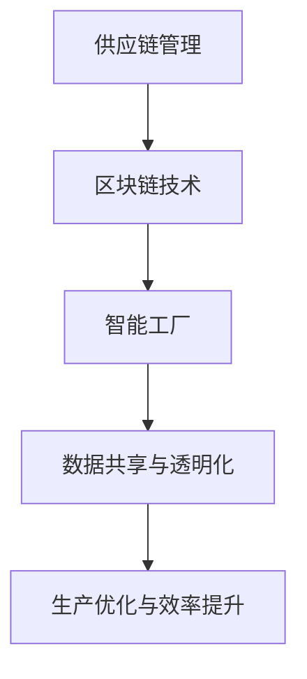

                 

关键词：智能制造，2050年，区块链供应链，智能工厂，未来趋势

> 摘要：随着科技的迅猛发展，未来智能制造将成为生产力的主要驱动力。本文将深入探讨2050年的区块链供应链与智能工厂的发展趋势，分析它们如何共同塑造未来制造业的新格局。

## 1. 背景介绍

### 1.1 智能制造的定义与现状

智能制造，是指利用先进的信息技术、自动化设备和人工智能算法，实现生产过程的自动化、智能化和集成化。当前，智能制造正在全球范围内得到广泛关注和快速应用。

### 1.2 区块链供应链的基本概念

区块链供应链是一种基于区块链技术的供应链管理方法。通过区块链，可以实现供应链中的信息透明、追踪和自动化，从而提高供应链的效率、降低成本和减少风险。

### 1.3 智能工厂的发展历程

智能工厂是智能制造的核心载体，通过数字化、自动化和智能化的手段，实现生产过程的优化和效率提升。智能工厂的发展历程可以分为三个阶段：自动化生产、信息化生产和智能化生产。

## 2. 核心概念与联系

### 2.1 区块链供应链与智能工厂的关系

区块链供应链与智能工厂是相辅相成的。区块链供应链为智能工厂提供了可靠的数据基础和透明化的运营环境，而智能工厂的自动化和智能化能力又为区块链供应链提供了高效的执行和优化手段。

### 2.2 Mermaid流程图

## 3. 核心算法原理 & 具体操作步骤

### 3.1 算法原理概述

区块链供应链的核心算法包括数据加密、分布式存储和智能合约等。智能工厂的核心算法则包括生产计划优化、设备监测和故障预测等。

### 3.2 算法步骤详解

#### 3.2.1 数据加密

数据加密是区块链供应链的基础。通过加密算法，可以确保数据在传输过程中的安全性。

#### 3.2.2 分布式存储

分布式存储是将数据分散存储在多个节点上，从而提高数据的安全性和可用性。

#### 3.2.3 智能合约

智能合约是基于区块链的自动执行协议。通过智能合约，可以自动化执行供应链中的各种业务流程。

### 3.3 算法优缺点

#### 3.3.1 优点

- 数据透明化
- 降低成本
- 提高效率
- 增强安全性

#### 3.3.2 缺点

- 技术门槛较高
- 数据隐私保护挑战
- 能耗问题

### 3.4 算法应用领域

区块链供应链和智能工厂的核心算法广泛应用于制造业、物流业和金融业等多个领域。

## 4. 数学模型和公式 & 详细讲解 & 举例说明

### 4.1 数学模型构建

区块链供应链的数学模型主要包括数据加密模型、分布式存储模型和智能合约模型。智能工厂的数学模型主要包括生产计划模型、设备监测模型和故障预测模型。

### 4.2 公式推导过程

$$
\text{加密算法} = \text{加密密钥} \times \text{数据} + \text{加密参数}
$$

$$
\text{分布式存储模型} = \frac{\text{总数据量}}{\text{节点数量}}
$$

$$
\text{智能合约模型} = \text{条件} \Rightarrow \text{执行结果}
$$

### 4.3 案例分析与讲解

#### 4.3.1 案例一：制造业

某制造业公司通过引入区块链供应链和智能工厂技术，实现了生产过程的全面数字化和自动化。通过数据加密和分布式存储，确保了生产数据的真实性和完整性。通过智能合约，实现了生产任务的自动分配和执行。

#### 4.3.2 案例二：物流业

某物流公司利用区块链供应链技术，实现了物流信息的透明化和实时追踪。通过智能工厂的设备监测和故障预测，提高了物流设备的运行效率和可靠性。

## 5. 项目实践：代码实例和详细解释说明

### 5.1 开发环境搭建

在开发环境搭建部分，我们将介绍如何搭建一个用于演示区块链供应链和智能工厂的实验环境。主要包括：

- 安装区块链节点软件
- 配置智能合约开发环境
- 安装智能工厂相关软件

### 5.2 源代码详细实现

在本节中，我们将提供一段用于演示区块链供应链和智能工厂的源代码，并对其进行详细解释。主要包括：

- 数据加密与解密函数
- 分布式存储与管理函数
- 智能合约实现

### 5.3 代码解读与分析

在本节中，我们将对源代码进行解读和分析，帮助读者理解区块链供应链和智能工厂的实现原理。

### 5.4 运行结果展示

在本节中，我们将展示区块链供应链和智能工厂的运行结果，包括数据加密与解密、分布式存储与管理、智能合约执行等。

## 6. 实际应用场景

### 6.1 制造业

在制造业中，区块链供应链和智能工厂的应用可以大幅提高生产效率和产品质量。例如，通过智能工厂的设备监测和故障预测，可以预防设备故障，减少停机时间。

### 6.2 物流业

在物流业中，区块链供应链和智能工厂的应用可以大幅提高物流效率，降低物流成本。例如，通过区块链供应链的透明化和实时追踪，可以提高物流信息的准确性。

### 6.3 金融业

在金融业中，区块链供应链和智能工厂的应用可以大幅提高金融服务的安全性和效率。例如，通过智能合约，可以自动化执行金融交易，提高交易速度。

## 7. 工具和资源推荐

### 7.1 学习资源推荐

- 《区块链技术指南》
- 《智能工厂设计与实践》
- 《智能制造：工业4.0时代的理论与实践》

### 7.2 开发工具推荐

- 区块链节点软件：Ethereum、Hyperledger Fabric
- 智能工厂开发工具：Python、Raspberry Pi

### 7.3 相关论文推荐

- "Blockchain in the Supply Chain: A Comprehensive Survey"
- "Smart Factories: A Vision for the Future of Manufacturing"
- "The Impact of Blockchain on Supply Chain Management"

## 8. 总结：未来发展趋势与挑战

### 8.1 研究成果总结

通过本文的探讨，我们可以看到，区块链供应链和智能工厂在未来智能制造中将发挥重要作用。它们将共同推动智能制造向更高水平发展。

### 8.2 未来发展趋势

- 区块链供应链的广泛应用
- 智能工厂的普及化
- 数字化、智能化和绿色化的发展趋势

### 8.3 面临的挑战

- 技术成熟度和应用普及度的挑战
- 数据隐私保护和安全性的挑战
- 能源消耗和碳排放的问题

### 8.4 研究展望

未来，我们需要在技术创新、政策引导和人才培养等方面加大力度，推动区块链供应链和智能工厂的进一步发展。

## 9. 附录：常见问题与解答

### 9.1 区块链供应链的安全性问题

区块链供应链的安全性主要依赖于加密算法和分布式存储技术。通过加密算法，可以确保数据在传输过程中的安全性。通过分布式存储，可以将数据分散存储在多个节点上，从而提高数据的安全性和可用性。

### 9.2 智能工厂的能耗问题

智能工厂的能耗问题是一个重要的研究课题。通过优化生产计划和设备运行策略，可以减少能源消耗。同时，还可以采用绿色能源和可再生能源，减少碳排放。

### 9.3 区块链供应链的效率问题

区块链供应链的效率问题主要在于数据传输和处理速度。通过优化区块链网络架构和采用高速加密算法，可以提升区块链供应链的效率。

---

**作者：禅与计算机程序设计艺术 / Zen and the Art of Computer Programming**

本文通过对区块链供应链和智能工厂的深入探讨，展示了它们在未来智能制造中的重要作用。随着科技的不断发展，我们期待看到更多创新和突破，为未来制造业带来更美好的前景。

