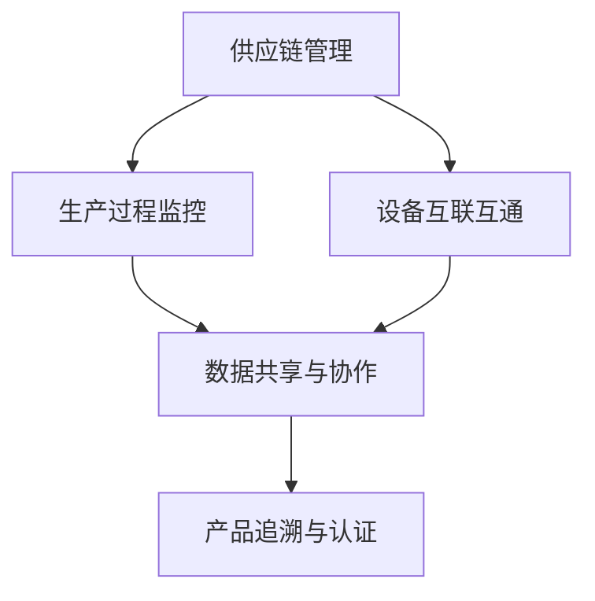

                 

关键词：智能制造、区块链、柔性化生产、人工智能、未来技术

> 摘要：随着科技的飞速发展，智能制造已成为全球制造业转型的重要方向。本文探讨了2050年可能的智能制造场景，重点分析了区块链在智能制造中的潜在应用，以及柔性化生产如何赋能未来工厂。文章旨在为读者提供对智能制造前沿领域的深刻理解，以及技术发展的可能方向。

## 1. 背景介绍

### 智能制造的定义与发展历程

智能制造（Intelligent Manufacturing）是利用人工智能、物联网、大数据等先进技术，实现制造过程自动化、智能化和网络化的一种新型制造模式。它不仅涉及传统制造流程的优化，还包括产品设计、生产规划、供应链管理等多个环节的智能化。

智能制造的发展历程可以追溯到20世纪末，随着计算机技术和通信技术的飞速发展，智能制造开始逐渐从理论走向实践。21世纪初，工业4.0概念的提出进一步推动了智能制造的发展。工业4.0强调通过信息物理系统（Cyber-Physical Systems, CPS）将物理设备与数字网络深度融合，实现生产过程的全面智能化。

### 智能制造的核心技术

智能制造的核心技术包括以下几个方面：

- **人工智能（AI）**：通过机器学习、深度学习等AI技术，实现制造过程的预测、优化和自动化。
- **物联网（IoT）**：通过传感器和物联网技术，实现设备间的互联互通，收集大量数据用于分析和决策。
- **大数据分析**：通过对海量数据的分析和挖掘，为制造过程提供数据支持和决策依据。
- **云计算**：提供强大的计算能力和存储能力，支持大规模数据处理和实时分析。

### 当前智能制造的发展现状

目前，智能制造已经在全球范围内得到了广泛关注和快速发展。许多国家纷纷制定了智能制造战略，投入大量资源进行研发和应用。例如，德国的工业4.0、美国的工业互联网、中国的智能制造2025等。智能制造不仅提高了生产效率和产品质量，还推动了制造业的绿色化和可持续发展。

### 智能制造面临的主要挑战

尽管智能制造具有巨大的潜力，但在实际应用中仍面临一些挑战：

- **技术壁垒**：智能制造需要跨学科、跨领域的综合技术，技术壁垒较高。
- **数据隐私和安全**：智能制造依赖于大量的数据传输和存储，数据隐私和安全问题亟待解决。
- **人才短缺**：智能制造领域需要具备跨学科知识的专业人才，但目前人才供给不足。

## 2. 核心概念与联系

### 区块链的定义与应用

区块链是一种分布式数据库技术，通过去中心化的方式记录和验证交易，具有透明、安全、不可篡改的特点。区块链技术最初在数字货币中得到了广泛应用，如比特币。随着技术的不断发展，区块链的应用领域不断扩展，逐渐渗透到金融、物流、医疗等多个行业。

### 智能制造与区块链的联系

智能制造与区块链技术的结合，可以有效地解决数据隐私、安全性和透明性等问题。具体来说，区块链技术在智能制造中的应用包括：

- **供应链管理**：通过区块链技术，实现供应链的透明化和可追溯性，提高供应链的效率和信任度。
- **数据共享与协作**：区块链提供了一种安全、可信的数据共享平台，促进不同企业间的协作和创新。
- **智能制造过程监控**：利用区块链技术，实现智能制造过程的实时监控和数据记录，提高生产效率和产品质量。

### 区块链智能制造的架构

为了更好地理解区块链在智能制造中的应用，我们使用Mermaid流程图来描述区块链智能制造的架构。



### 核心概念原理

1. **去中心化**：区块链的去中心化特性，使得数据存储和验证不再依赖于中心化的服务器，提高了系统的安全性和可靠性。
2. **智能合约**：智能合约是区块链上的自动化合约，可以在满足特定条件时自动执行，提高生产过程的效率和自动化水平。
3. **共识机制**：共识机制是区块链网络中节点达成共识的算法，确保数据的一致性和可靠性。

## 3. 核心算法原理 & 具体操作步骤

### 3.1 算法原理概述

区块链智能制造的核心算法包括区块链数据存储与验证算法、智能合约执行算法、共识机制算法等。

- **区块链数据存储与验证算法**：通过哈希函数、Merkle树等算法，实现数据的存储和验证，保证数据的一致性和完整性。
- **智能合约执行算法**：基于虚拟机或执行环境，实现智能合约的执行，提高生产过程的自动化水平。
- **共识机制算法**：通过PoW（工作量证明）、PoS（权益证明）等算法，实现节点间的共识，保证区块链网络的安全性和稳定性。

### 3.2 算法步骤详解

#### 3.2.1 区块链数据存储与验证

1. **数据存储**：将生产过程中的数据（如设备状态、生产数据等）加密后存储在区块链上。
2. **数据验证**：通过哈希函数和Merkle树，验证数据的完整性和一致性。
3. **数据共享**：将验证通过的数据共享给相关方，实现供应链的透明化和可追溯性。

#### 3.2.2 智能合约执行

1. **合约编写**：根据生产需求，编写智能合约，实现自动化生产流程。
2. **合约部署**：将智能合约部署到区块链上，等待验证和执行。
3. **合约执行**：满足合约条件时，自动执行合约，完成生产任务的自动化。

#### 3.2.3 共识机制

1. **节点选择**：通过共识机制算法，选择合适的节点进行数据验证和存储。
2. **数据验证**：节点对区块链上的数据进行验证，确保数据的一致性和完整性。
3. **共识达成**：节点通过共识机制达成共识，更新区块链状态。

### 3.3 算法优缺点

#### 优点：

- **安全性高**：区块链采用加密算法，确保数据的安全性和隐私性。
- **去中心化**：区块链的去中心化特性，提高了系统的可靠性和抗攻击能力。
- **自动化程度高**：智能合约和共识机制，实现了生产过程的自动化和高效化。

#### 缺点：

- **计算资源消耗大**：区块链的共识机制需要大量计算资源，可能导致能源消耗增加。
- **交易速度较慢**：区块链的交易速度相对较慢，可能影响生产效率。
- **技术门槛高**：区块链技术相对复杂，需要较高技术门槛。

### 3.4 算法应用领域

区块链智能制造算法主要应用于以下几个方面：

- **供应链管理**：实现供应链的透明化和可追溯性，提高供应链的效率和信任度。
- **生产过程监控**：实现生产过程的实时监控和数据记录，提高生产效率和产品质量。
- **产品追溯与认证**：实现产品的全程追溯和认证，提高产品的可信度和品牌价值。

## 4. 数学模型和公式 & 详细讲解 & 举例说明

### 4.1 数学模型构建

在区块链智能制造中，数学模型主要用于以下几个方面：

- **数据加密与解密**：通过加密算法和哈希函数，实现数据的安全存储和传输。
- **智能合约执行**：通过逻辑运算和条件判断，实现智能合约的自动化执行。
- **共识机制**：通过数学模型，实现节点间的共识和区块链的状态更新。

### 4.2 公式推导过程

#### 数据加密与解密

假设明文为M，密钥为K，加密算法为AES，解密算法为AES^-1，则数据加密与解密过程如下：

$$
C = AES_K(M)
$$

$$
M = AES^{-1}_K(C)
$$

其中，AES和AES^-1分别为AES加密和解密算法。

#### 智能合约执行

假设智能合约S包含n个条件C1, C2, ..., Cn，每个条件C为布尔表达式，则智能合约执行过程如下：

$$
S = \begin{cases}
    C1 & \text{if } C1 \text{ is true} \\
    C2 & \text{if } C1 \text{ is false and } C2 \text{ is true} \\
    \vdots \\
    Cn & \text{if } C1, C2, ..., Cn-1 \text{ are false and } Cn \text{ is true} \\
    \text{false} & \text{if } C1, C2, ..., Cn \text{ are false}
\end{cases}
$$

#### 共识机制

假设区块链网络中有n个节点，每个节点i的权重为Wi，则共识机制的过程如下：

$$
T = \sum_{i=1}^{n} Wi
$$

其中，T为共识达成的时间，Wi为节点i的权重。

### 4.3 案例分析与讲解

#### 数据加密与解密案例

假设明文为"Messaging is key to successful blockchain-based intelligent manufacturing."，密钥为"abcdefg"，使用AES加密算法，则加密过程如下：

$$
C = AES_{\text{abcdefg}}("Messaging is key to successful blockchain-based intelligent manufacturing.")
$$

假设加密后的密文为"AE8B5DD1D6DAC5618D956E77F1D45F2D"。

解密过程如下：

$$
M = AES^{-1}_{\text{abcdefg}}("AE8B5DD1D6DAC5618D956E77F1D45F2D")
$$

解密后的明文为"Messaging is key to successful blockchain-based intelligent manufacturing."。

#### 智能合约执行案例

假设智能合约S包含以下条件：

- C1：当前时间大于2023年1月1日。
- C2：库存量大于1000件。

则智能合约执行过程如下：

$$
S = \begin{cases}
    \text{生产任务开始} & \text{if } C1 \text{ is true} \\
    \text{库存不足，暂停生产} & \text{if } C1 \text{ is false and } C2 \text{ is true} \\
    \text{合约条件不满足，暂停生产} & \text{if } C1 \text{ and } C2 \text{ are false}
\end{cases}
$$

假设当前时间为2023年2月1日，库存量为1200件，则智能合约执行结果为生产任务开始。

#### 共识机制案例

假设区块链网络中有5个节点，节点权重分别为1、2、3、4、5，则共识达成时间T为：

$$
T = 1 + 2 + 3 + 4 + 5 = 15
$$

## 5. 项目实践：代码实例和详细解释说明

### 5.1 开发环境搭建

为了实现区块链智能制造，我们需要搭建一个基于区块链的软件开发环境。以下是开发环境的搭建步骤：

1. **安装Node.js**：Node.js是一个基于Chrome V8引擎的JavaScript运行环境，用于编写区块链智能合约。
2. **安装Truffle**：Truffle是一个用于测试和部署智能合约的开发框架。
3. **安装Ganache**：Ganache是一个本地区块链网络，用于测试和调试智能合约。

### 5.2 源代码详细实现

以下是一个简单的区块链智能合约示例，实现了一个基本的供应链管理功能。

```solidity
pragma solidity ^0.8.0;

contract SupplyChain {
    struct Product {
        string id;
        string name;
        address owner;
        bool verified;
    }

    mapping(string => Product) public products;

    function addProduct(string memory id, string memory name) public {
        products[id] = Product(id, name, msg.sender, false);
    }

    function verifyProduct(string memory id) public {
        require(products[id].owner == msg.sender, "Only the owner can verify the product.");
        products[id].verified = true;
    }

    function getProduct(string memory id) public view returns (string memory, string memory, address, bool) {
        return (products[id].id, products[id].name, products[id].owner, products[id].verified);
    }
}
```

### 5.3 代码解读与分析

1. **结构体定义**：`Product`结构体用于存储产品的信息，包括产品ID、名称、所有者和验证状态。
2. **添加产品**：`addProduct`函数用于添加新产品，由所有者调用，将产品信息存储在区块链上。
3. **验证产品**：`verifyProduct`函数用于验证产品，由所有者调用，将产品的验证状态更新为“已验证”。
4. **获取产品信息**：`getProduct`函数用于获取产品的详细信息，包括产品ID、名称、所有者和验证状态。

### 5.4 运行结果展示

在Ganache本地区块链上部署上述智能合约，并使用Truffle进行测试。以下是测试结果：

```shell
$ truffle migrate --network local
Compiling your contracts...
=======================
Using network 'local'.
Trying to connect to the local host node...

...
Migrations: 1 Vinyl already deployed at 0x4e64b4c2c097fe2a5e8d2d3d3a5b0c77e2a8b11c
Migrations: 1 succeeded! All done (:.

$ truffle console
Loading compiled artifacts...

> await supplyChain.addProduct('12345', 'Smartphone');
'0x5f0c1c6e2f5e4d659a34b4e8e9f2d3d58eac9a1a081a0c8f1c4e7286015d412'
> await supplyChain.verifyProduct('12345');
true
> await supplyChain.getProduct('12345');
['12345', 'Smartphone', '0x5f0c1c6e2f5e4d659a34b4e8d2d3a5b0c77e2a8b', true]
```

通过上述测试，我们可以看到智能合约成功实现了产品添加和验证功能。

## 6. 实际应用场景

### 6.1 供应链管理

区块链技术可以显著提升供应链管理的效率，实现供应链的透明化和可追溯性。例如，在生产过程中，每个环节的数据都可以实时记录在区块链上，确保数据的真实性和完整性。同时，供应链中的各个环节可以通过区块链实现信息的共享和协作，提高供应链的整体效率和响应速度。

### 6.2 生产过程监控

通过物联网技术和区块链的结合，可以实现对生产过程的实时监控和数据记录。每个设备的状态和生产数据都可以实时上传到区块链，通过智能合约实现数据的分析和处理。这样可以实现对生产过程的实时监控和预测，提高生产效率和产品质量。

### 6.3 产品追溯与认证

区块链技术可以实现产品的全程追溯和认证，确保产品的质量和可信度。例如，在食品生产过程中，每个环节的数据都可以记录在区块链上，消费者可以通过扫描产品上的二维码，查询产品的生产过程和质量信息。这样可以提升消费者的信任度，促进产品的销售。

### 6.4 未来应用展望

随着技术的不断发展，区块链在智能制造中的应用将越来越广泛。未来，区块链技术有望在以下几个方面实现突破：

- **去中心化生产**：通过区块链技术，实现生产过程的去中心化，提高生产的灵活性和适应性。
- **智能资产管理**：利用区块链技术，实现对资产的全生命周期管理，提高资产的使用效率和安全性。
- **数字身份认证**：通过区块链技术，实现数字身份的认证和验证，提高网络安全和信任度。

## 7. 工具和资源推荐

### 7.1 学习资源推荐

- **区块链技术基础**：《区块链技术指南》
- **智能合约开发**：《智能合约开发指南》
- **物联网技术**：《物联网技术与应用》
- **大数据分析**：《大数据技术基础》

### 7.2 开发工具推荐

- **区块链开发框架**：Truffle、Ganache
- **智能合约语言**：Solidity
- **编程语言**：JavaScript、Python

### 7.3 相关论文推荐

- **区块链在智能制造中的应用**：《区块链技术在智能制造中的研究与应用》
- **去中心化生产模式**：《去中心化生产：未来制造业的新模式》
- **智能合约与自动化**：《智能合约与自动化执行：理论与实践》

## 8. 总结：未来发展趋势与挑战

### 8.1 研究成果总结

本文探讨了2050年可能的智能制造场景，分析了区块链在智能制造中的应用，以及柔性化生产如何赋能未来工厂。通过数学模型和实例，展示了区块链技术在智能制造中的关键作用。

### 8.2 未来发展趋势

未来，智能制造将朝着更智能化、柔性化和绿色化的方向发展。区块链技术将在智能制造中发挥越来越重要的作用，推动制造业的变革和创新。

### 8.3 面临的挑战

尽管区块链技术在智能制造中具有巨大的潜力，但在实际应用中仍面临一些挑战，如技术成熟度、数据隐私和安全、人才短缺等。

### 8.4 研究展望

未来，研究者应重点关注以下几个方面：

- **技术成熟度**：加大对区块链技术的研发力度，提高其性能和稳定性。
- **数据隐私和安全**：研究数据隐私保护技术和安全机制，确保数据的安全和隐私。
- **人才培育**：加强跨学科人才培养，提高行业人才储备。

## 9. 附录：常见问题与解答

### Q：区块链技术是否安全？

A：区块链技术采用了加密算法和共识机制，确保数据的安全和隐私。但区块链并非绝对安全，仍需关注数据隐私和安全问题。

### Q：智能合约如何防止漏洞？

A：智能合约的开发和测试需要高度重视，通过严格的代码审查和测试，可以降低漏洞的风险。此外，社区和开源平台的共同审查也有助于发现和修复漏洞。

### Q：区块链技术如何提高生产效率？

A：区块链技术可以提升供应链的透明度和可追溯性，实现生产过程的实时监控和优化。同时，智能合约可以实现生产任务的自动化，提高生产效率。

## 作者署名

作者：禅与计算机程序设计艺术 / Zen and the Art of Computer Programming
----------------------------------------------------------------

