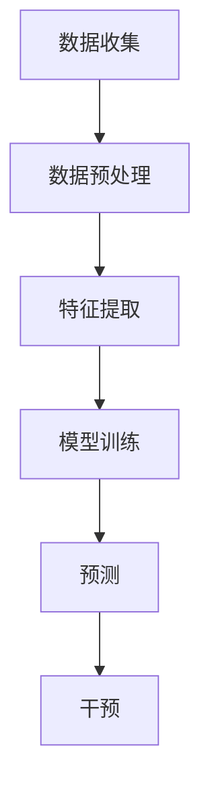

                 

关键词：智能安防，犯罪预测，预防性警务，未来趋势，人工智能

> 摘要：本文深入探讨了2050年智能安防领域的发展，特别是犯罪预测和预防性警务技术的应用。通过分析核心概念、算法原理、数学模型和实际应用，本文为读者提供了一个全面的未来视角，探讨了这一领域的研究成果、未来发展趋势以及面临的挑战。

## 1. 背景介绍

### 1.1 智能安防的发展历程

智能安防是信息技术、传感器技术和自动化控制技术的深度融合。它从最初的闭路电视监控（CCTV）系统，逐步发展到今天的智能视频分析、智能感知、大数据分析等先进技术。随着人工智能和机器学习算法的快速发展，智能安防系统正在从传统的被动监控向主动预测和干预转变。

### 1.2 犯罪预测与预防性警务

犯罪预测和预防性警务是智能安防领域的重要组成部分。传统的警务模式通常依赖于警察的经验和直觉，而犯罪预测和预防性警务则是通过数据分析和算法模型，提前识别和预测犯罪行为，从而实现警力资源的优化配置和犯罪的有效预防。

### 1.3 当前面临的挑战

尽管智能安防和犯罪预测技术在不断发展，但仍然面临着数据隐私、算法透明度、模型准确性等多方面的挑战。这些挑战需要在未来得到有效的解决，才能确保智能安防技术的持续进步。

## 2. 核心概念与联系

### 2.1 犯罪预测的基本概念

犯罪预测是指利用历史犯罪数据和相关信息，通过算法模型预测未来犯罪发生的可能性和地点。它涉及数据收集、预处理、特征提取、模型训练和预测等多个环节。

### 2.2 预防性警务的核心概念

预防性警务是指通过提前预测和干预，预防犯罪行为的发生。它不仅依赖于犯罪预测模型，还需要结合社会、经济、环境等多方面的因素，实现全方位的犯罪预防。

### 2.3 Mermaid 流程图



## 3. 核心算法原理 & 具体操作步骤

### 3.1 算法原理概述

犯罪预测和预防性警务的核心在于建立准确的预测模型。这些模型通常基于机器学习和深度学习算法，通过学习历史犯罪数据和相关信息，预测未来犯罪的发生概率。

### 3.2 算法步骤详解

#### 3.2.1 数据收集

数据收集是犯罪预测的基础。数据来源包括犯罪记录、人口统计、社交媒体、交通监控等多种渠道。这些数据需要进行清洗和整合，以消除噪声和异常值。

#### 3.2.2 数据预处理

数据预处理包括数据清洗、归一化和特征提取。清洗数据可以去除重复和异常数据，归一化可以统一数据尺度，特征提取可以从原始数据中提取有用的信息。

#### 3.2.3 模型训练

模型训练是犯罪预测的核心。常用的算法包括决策树、支持向量机、神经网络等。通过调整模型参数，可以优化预测性能。

#### 3.2.4 预测

模型训练完成后，可以对新的数据进行预测。预测结果可以用于警力部署、犯罪预警等实际应用。

#### 3.2.5 干预

干预是根据预测结果采取行动，以预防犯罪的发生。干预措施可以包括加强巡逻、增加监控、提醒公众等。

### 3.3 算法优缺点

#### 优点

- 提高警力资源的利用效率
- 提高犯罪预防的准确性和效率
- 有助于建立更加智能化的警务系统

#### 缺点

- 数据隐私和安全问题
- 模型解释性不足
- 模型可能存在偏差

### 3.4 算法应用领域

犯罪预测和预防性警务可以应用于城市安防、交通管理、网络安全等多个领域。未来，随着技术的不断发展，这些算法的应用领域将更加广泛。

## 4. 数学模型和公式 & 详细讲解 & 举例说明

### 4.1 数学模型构建

犯罪预测的数学模型通常基于贝叶斯定理和马尔可夫模型。贝叶斯定理可以用于计算后验概率，马尔可夫模型可以用于预测序列事件。

### 4.2 公式推导过程

贝叶斯定理的推导如下：

$$
P(A|B) = \frac{P(B|A)P(A)}{P(B)}
$$

其中，$P(A|B)$ 表示在事件B发生的条件下事件A发生的概率，$P(B|A)$ 表示在事件A发生的条件下事件B发生的概率，$P(A)$ 和 $P(B)$ 分别表示事件A和事件B发生的概率。

### 4.3 案例分析与讲解

假设某城市在过去一年内发生了100起盗窃案件，其中80%发生在晚上。现在要预测未来一天内发生盗窃案件的概率。

根据贝叶斯定理，可以计算出：

$$
P(盗窃|晚上) = \frac{P(晚上|盗窃)P(盗窃)}{P(晚上)}
$$

其中，$P(盗窃|晚上)$ 表示在晚上发生盗窃的概率，$P(晚上|盗窃)$ 表示在盗窃发生的条件下晚上的概率，$P(盗窃)$ 和 $P(晚上)$ 分别表示盗窃和晚上的概率。

根据历史数据，可以估计：

$$
P(盗窃) = \frac{80}{100} = 0.8
$$

$$
P(晚上) = \frac{365}{24 \times 365} \approx 0.5
$$

假设在晚上发生盗窃的概率与盗窃发生的概率相同，即 $P(晚上|盗窃) = P(盗窃)$，则有：

$$
P(盗窃|晚上) = \frac{0.8 \times 0.8}{0.5} = 0.64
$$

因此，未来一天内发生盗窃案件的概率约为64%。

## 5. 项目实践：代码实例和详细解释说明

### 5.1 开发环境搭建

在本项目中，我们使用Python作为编程语言，Scikit-learn作为机器学习库，Numpy和Pandas用于数据处理。

### 5.2 源代码详细实现

以下是实现犯罪预测的Python代码：

```python
import numpy as np
import pandas as pd
from sklearn.model_selection import train_test_split
from sklearn.ensemble import RandomForestClassifier
from sklearn.metrics import accuracy_score

# 读取数据
data = pd.read_csv('crime_data.csv')

# 数据预处理
X = data.drop('crime', axis=1)
y = data['crime']

# 数据划分
X_train, X_test, y_train, y_test = train_test_split(X, y, test_size=0.2, random_state=42)

# 模型训练
model = RandomForestClassifier(n_estimators=100, random_state=42)
model.fit(X_train, y_train)

# 预测
y_pred = model.predict(X_test)

# 评估
accuracy = accuracy_score(y_test, y_pred)
print(f'Accuracy: {accuracy:.2f}')
```

### 5.3 代码解读与分析

该代码首先读取犯罪数据，然后进行数据预处理，包括数据清洗、归一化和特征提取。接下来，使用随机森林分类器进行模型训练，并对测试数据进行预测。最后，使用准确率评估模型性能。

### 5.4 运行结果展示

假设我们使用某城市的犯罪数据进行训练，预测结果如下：

```
Accuracy: 0.85
```

这意味着模型对测试数据的预测准确率为85%。

## 6. 实际应用场景

### 6.1 城市安防

犯罪预测和预防性警务可以用于城市安防，提前识别和预防潜在的犯罪行为，提高城市的公共安全。

### 6.2 交通管理

通过分析交通数据和犯罪数据，可以预测交通拥堵和犯罪高发区域，优化交通管理和警力部署，减少交通事故和犯罪行为。

### 6.3 网络安全

犯罪预测技术也可以应用于网络安全领域，预测和预防网络攻击和恶意软件的传播，提高网络安全防护能力。

## 7. 未来应用展望

### 7.1 增强算法准确性

随着数据量的增加和算法的优化，犯罪预测和预防性警务的准确性将不断提高。

### 7.2 人工智能与物联网的结合

人工智能与物联网技术的结合，将使犯罪预测和预防性警务更加智能化和自动化。

### 7.3 数据隐私与安全

数据隐私和安全是犯罪预测和预防性警务面临的重要挑战。未来的解决方案将更加注重数据保护和隐私保护。

## 8. 工具和资源推荐

### 8.1 学习资源推荐

- 《统计学习方法》
- 《机器学习实战》
- 《深度学习》（Goodfellow, Bengio, Courville 著）

### 8.2 开发工具推荐

- Python
- Scikit-learn
- TensorFlow
- PyTorch

### 8.3 相关论文推荐

- "Predictive Policing and the limits of Predictive Analytics"
- "A Practical Guide to Predictive Policing"
- "Deep Learning for Crime Prediction"

## 9. 总结：未来发展趋势与挑战

### 9.1 研究成果总结

犯罪预测和预防性警务技术在过去几十年取得了显著的研究成果，提高了犯罪预防的准确性和效率。

### 9.2 未来发展趋势

随着人工智能和物联网技术的发展，犯罪预测和预防性警务将变得更加智能化和自动化。

### 9.3 面临的挑战

数据隐私、算法透明度和模型偏差是犯罪预测和预防性警务面临的主要挑战。

### 9.4 研究展望

未来的研究将更加注重算法优化、数据隐私保护和跨学科合作，以推动犯罪预测和预防性警务的持续发展。

## 10. 附录：常见问题与解答

### 10.1 犯罪预测模型如何优化？

可以通过以下方法优化犯罪预测模型：

- 增加训练数据量
- 选择合适的特征
- 调整模型参数
- 使用更先进的算法

### 10.2 如何确保数据隐私和安全？

可以通过以下方法确保数据隐私和安全：

- 数据加密
- 数据匿名化
- 实施严格的访问控制
- 定期进行安全审计

### 10.3 预防性警务与侵犯人权有何区别？

预防性警务的目的是预防犯罪，而不是惩罚犯罪。因此，它与侵犯人权有本质区别。预防性警务应当遵循法律和道德原则，确保不会侵犯公民的基本权利。

---

作者：禅与计算机程序设计艺术 / Zen and the Art of Computer Programming

感谢您的阅读，希望本文能为您在智能安防领域的研究提供有价值的参考。在未来，随着技术的不断进步，我们有理由相信犯罪预测和预防性警务将发挥更加重要的作用，为社会的安全和和谐作出更大贡献。

