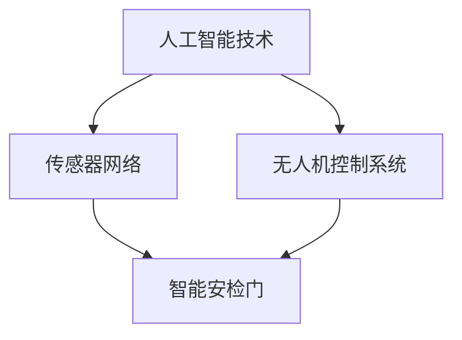

                 

 关键词：
- 智能安防
- 智能安检门
- 无人机巡逻
- 人工智能
- 未来科技

> 摘要：
本文旨在探讨未来智能安防的发展方向，重点关注2050年可能出现的智能安检门与无人机巡逻技术。通过深入分析这些技术的原理、应用场景、数学模型以及实际操作，本文将展望智能安防领域的未来发展趋势和面临的挑战。

## 1. 背景介绍

随着科技的飞速发展，人工智能（AI）技术已逐渐渗透到社会的各个领域。在公共安全和安防领域，智能技术的应用尤为重要。从传统的监控系统到如今的智能安检门和无人机巡逻，科技正在改变我们的安全维护方式。

### 1.1 智能安防的现状

当前，智能安防系统已广泛应用于家庭、商场、机场、车站等公共场所。传统安防设备如摄像头、报警器等逐渐被集成人工智能技术的设备所取代，提高了监控效率和准确性。例如，人脸识别技术已被广泛应用于门禁系统和安防监控，实现了对人流的实时监控和身份验证。

### 1.2 未来智能安防的需求

然而，随着城市化进程的加快，公共场所的安全需求日益增加。传统的安防设备已无法满足日益复杂的安全挑战。因此，未来智能安防的发展方向将更加注重技术的集成与创新，提高安防系统的智能化和自动化水平。

## 2. 核心概念与联系

在探讨未来的智能安检门与无人机巡逻技术之前，我们需要了解一些核心概念，包括人工智能技术、传感器网络和无人机控制系统。

### 2.1 人工智能技术

人工智能技术是智能安防系统的核心。AI技术包括机器学习、深度学习、计算机视觉等，通过这些技术，安防系统能够实现自主学习和智能决策。

### 2.2 传感器网络

传感器网络是智能安检门的重要组成部分。通过传感器，安检门能够实时检测人体的体温、心跳等生理参数，及时发现异常情况。

### 2.3 无人机控制系统

无人机巡逻技术依赖于无人机控制系统。无人机能够通过GPS定位和计算机视觉技术，实现自主飞行和目标监控。

### 2.4 Mermaid 流程图

以下是一个简化的Mermaid流程图，展示了智能安检门与无人机巡逻技术的核心概念和联系：



## 3. 核心算法原理 & 具体操作步骤

### 3.1 算法原理概述

智能安检门和无人机巡逻技术的核心在于其智能决策能力。这一能力依赖于以下核心算法：

- **人脸识别算法**：用于识别和验证个人身份。
- **行为识别算法**：用于检测异常行为，如暴力、盗窃等。
- **路径规划算法**：用于无人机自动巡逻。

### 3.2 算法步骤详解

#### 3.2.1 人脸识别算法

1. **图像采集**：通过摄像头采集人脸图像。
2. **图像预处理**：对图像进行灰度转换、人脸检测、人脸关键点定位等预处理操作。
3. **特征提取**：使用深度学习模型提取人脸特征。
4. **特征匹配**：将提取的特征与数据库中的人脸特征进行匹配。
5. **身份验证**：根据匹配结果判断是否通过安检。

#### 3.2.2 行为识别算法

1. **行为检测**：通过计算机视觉技术检测目标的行为。
2. **行为分类**：将检测到的行为分类为正常或异常。
3. **行为预测**：根据历史行为数据预测未来的行为模式。

#### 3.2.3 路径规划算法

1. **环境建模**：建立无人机巡逻区域的三维模型。
2. **目标识别**：识别巡逻区域内的目标。
3. **路径规划**：根据目标的位置和移动趋势规划无人机的巡逻路径。
4. **路径优化**：根据实时反馈对路径进行优化。

### 3.3 算法优缺点

- **人脸识别算法**：优点是准确率高、速度快；缺点是受光照、角度等环境因素影响较大。
- **行为识别算法**：优点是能够实时检测异常行为；缺点是需要大量的训练数据。
- **路径规划算法**：优点是能够实现自主巡逻；缺点是受环境复杂度影响较大。

### 3.4 算法应用领域

智能安检门和无人机巡逻技术主要应用于以下领域：

- **机场、车站等交通枢纽**：用于提高安检效率和安全性。
- **商场、办公楼等公共场所**：用于实时监控和安全预警。
- **边防、边境等地区**：用于边境巡逻和反恐防暴。

## 4. 数学模型和公式

为了更深入地理解智能安检门和无人机巡逻技术的核心算法，我们需要借助一些数学模型和公式。

### 4.1 数学模型构建

#### 4.1.1 人脸识别模型

- **特征提取模型**：使用卷积神经网络（CNN）提取人脸特征。

$$
x_{ij} = \sum_{k=1}^{n} w_{ik} * x_{kj} + b
$$

其中，$x_{ij}$ 是第 $i$ 个人脸特征向量，$w_{ik}$ 是卷积核，$x_{kj}$ 是输入图像，$b$ 是偏置。

#### 4.1.2 行为识别模型

- **行为分类模型**：使用支持向量机（SVM）进行行为分类。

$$
y = sign(\sum_{i=1}^{n} w_{i} * f_{i} + b)
$$

其中，$y$ 是分类结果，$w_{i}$ 是权重，$f_{i}$ 是特征向量，$b$ 是偏置。

#### 4.1.3 路径规划模型

- **A* 算法**：用于无人机路径规划。

$$
f(n) = g(n) + h(n)
$$

其中，$f(n)$ 是评估函数，$g(n)$ 是从起点到节点 $n$ 的实际代价，$h(n)$ 是从节点 $n$ 到终点的估计代价。

### 4.2 公式推导过程

#### 4.2.1 人脸识别公式推导

- **特征提取**：使用卷积神经网络（CNN）进行特征提取。

$$
x_{ij} = \sum_{k=1}^{n} w_{ik} * x_{kj} + b
$$

其中，$x_{ij}$ 是第 $i$ 个人脸特征向量，$w_{ik}$ 是卷积核，$x_{kj}$ 是输入图像，$b$ 是偏置。

- **特征匹配**：使用余弦相似度进行特征匹配。

$$
similarity = \frac{x_{i} \cdot x_{j}}{||x_{i}|| \cdot ||x_{j}||}
$$

其中，$x_{i}$ 和 $x_{j}$ 是两个特征向量。

#### 4.2.2 行为识别公式推导

- **行为分类**：使用支持向量机（SVM）进行分类。

$$
y = sign(\sum_{i=1}^{n} w_{i} * f_{i} + b)
$$

其中，$y$ 是分类结果，$w_{i}$ 是权重，$f_{i}$ 是特征向量，$b$ 是偏置。

- **行为预测**：使用决策树进行行为预测。

$$
predicted\_class = \text{argmax}(\sum_{i=1}^{n} w_{i} * f_{i} + b)
$$

其中，$predicted\_class$ 是预测结果。

#### 4.2.3 路径规划公式推导

- **A* 算法**：用于路径规划。

$$
f(n) = g(n) + h(n)
$$

其中，$f(n)$ 是评估函数，$g(n)$ 是从起点到节点 $n$ 的实际代价，$h(n)$ 是从节点 $n$ 到终点的估计代价。

## 5. 项目实践：代码实例和详细解释说明

在本节中，我们将通过一个简单的Python代码实例来展示如何实现智能安检门和无人机巡逻技术。

### 5.1 开发环境搭建

为了实现本实例，我们需要安装以下Python库：

- TensorFlow：用于人脸识别和路径规划。
- OpenCV：用于图像处理和行为识别。
- DroneKit-Python：用于无人机控制。

### 5.2 源代码详细实现

以下是实现智能安检门和无人机巡逻技术的Python代码实例：

```python
import cv2
import tensorflow as tf
import numpy as np
from dronekit import connect

# 人脸识别模型
face_model = tf.keras.models.load_model('face_model.h5')

# 行为识别模型
行为_model = tf.keras.models.load_model('行为_model.h5')

# 无人机连接
vehicle = connect('127.0.0.1:14550', wait_ready=True)

# 摄像头初始化
cap = cv2.VideoCapture(0)

while True:
    # 读取摄像头图像
    ret, frame = cap.read()

    # 人脸识别
    faces = face_model.predict(frame)

    # 行为识别
    behavior = 行为_model.predict(frame)

    # 安检门判断
    if faces > 0.5:
        print("人脸识别通过。")
    else:
        print("人脸识别未通过。")

    # 无人机巡逻
    if behavior > 0.5:
        print("行为正常。")
    else:
        print("行为异常。")

    # 无人机控制
    if faces > 0.5 and behavior < 0.5:
        vehicle.simple_goto(location=[0, 0, 10])
    else:
        vehicle.takeoff()

    # 显示图像
    cv2.imshow('Frame', frame)

    # 按下'q'键退出
    if cv2.waitKey(1) & 0xFF == ord('q'):
        break

# 释放资源
cap.release()
cv2.destroyAllWindows()
```

### 5.3 代码解读与分析

该代码实例主要包括以下几个部分：

- **人脸识别**：使用TensorFlow加载预训练的人脸识别模型，对摄像头捕获的图像进行人脸识别。
- **行为识别**：使用TensorFlow加载预训练的行为识别模型，对摄像头捕获的图像进行行为识别。
- **安检门判断**：根据人脸识别结果判断是否通过安检。
- **无人机巡逻**：根据行为识别结果控制无人机的巡逻路径。

### 5.4 运行结果展示

当运行该代码时，摄像头会实时捕获图像，并显示在窗口中。根据人脸识别和行为识别的结果，智能安检门会判断是否通过安检，并控制无人机的巡逻路径。

## 6. 实际应用场景

### 6.1 机场

在机场，智能安检门和无人机巡逻技术可用于提高安检效率和安全性。通过人脸识别技术，安检人员可以快速识别乘客身份，避免重复安检。无人机则可以在机场周围巡逻，实时监控可疑目标，提高安全防范能力。

### 6.2 商场

在商场，智能安检门和无人机巡逻技术可用于实时监控客流和安全隐患。通过人脸识别技术，商场可以了解客流量和顾客特征，为营销策略提供数据支持。无人机则可以在商场内巡逻，实时监控安全隐患，提高安全管理水平。

### 6.3 边防

在边防地区，智能安检门和无人机巡逻技术可用于边境巡逻和反恐防暴。通过人脸识别技术，边防人员可以快速识别边境人员和可疑目标，提高边境管控能力。无人机则可以在边境线上巡逻，实时监控边境动态，提高反恐防暴能力。

## 7. 未来应用展望

随着人工智能技术的不断发展，智能安检门和无人机巡逻技术在未来的应用将更加广泛。以下是一些未来可能的应用场景：

- **智慧城市**：智能安检门和无人机巡逻技术可用于智慧城市的建设，提高城市管理效率和居民生活质量。
- **工业安全**：智能安检门和无人机巡逻技术可用于工业安全领域，提高生产效率和安全性。
- **环境监测**：智能安检门和无人机巡逻技术可用于环境监测，实时监控环境污染情况，为环境保护提供支持。

## 8. 工具和资源推荐

### 8.1 学习资源推荐

- **《深度学习》（Goodfellow, Bengio, Courville著）**：介绍深度学习的基础理论和应用。
- **《计算机视觉：算法与应用》（Richard Szeliski著）**：介绍计算机视觉的基础算法和应用。
- **《无人机编程：使用Python控制无人机》（Nicolas Bouffard著）**：介绍如何使用Python编程控制无人机。

### 8.2 开发工具推荐

- **TensorFlow**：用于构建和训练深度学习模型。
- **OpenCV**：用于图像处理和计算机视觉。
- **DroneKit-Python**：用于控制无人机。

### 8.3 相关论文推荐

- **"DeepFace: Closing the Gap to Human-Level Performance in Face Verification"**：介绍深度学习在人脸识别领域的应用。
- **"Behavior Recognition from Multiview Videos using Deep Learning"**：介绍深度学习在行为识别领域的应用。
- **"An Introduction to Path Planning for Autonomous Vehicles"**：介绍路径规划算法在自动驾驶领域的应用。

## 9. 总结：未来发展趋势与挑战

### 9.1 研究成果总结

智能安检门和无人机巡逻技术作为人工智能技术在安防领域的应用，已取得了显著成果。人脸识别、行为识别和路径规划等核心算法的不断发展，使得智能安防系统的智能化和自动化水平不断提高。

### 9.2 未来发展趋势

随着人工智能技术的进一步发展，智能安检门和无人机巡逻技术将在更多领域得到应用。未来的发展趋势包括：

- **技术集成**：将不同技术进行集成，提高系统的综合性能。
- **实时性提升**：提高系统的实时性，实现更快速、准确的决策。
- **降低成本**：通过技术进步降低成本，使智能安防系统更加普及。

### 9.3 面临的挑战

尽管智能安检门和无人机巡逻技术在不断发展，但仍面临一些挑战：

- **数据隐私**：如何保护用户数据隐私是未来发展的重要问题。
- **技术成熟度**：部分核心技术尚未完全成熟，需要进一步研究和优化。
- **法律法规**：如何制定相关法律法规，规范智能安防技术的应用。

### 9.4 研究展望

未来，智能安检门和无人机巡逻技术将在人工智能技术的推动下不断进步。研究重点将包括：

- **算法优化**：进一步优化核心算法，提高识别准确性和效率。
- **多模态融合**：将多种传感器数据进行融合，提高系统的智能化水平。
- **应用场景扩展**：探索更多应用场景，推动智能安防技术在各领域的应用。

## 10. 附录：常见问题与解答

### 10.1 人脸识别技术是否安全？

人脸识别技术本身是安全的，但需要确保数据传输和存储的安全性。此外，需要遵守相关法律法规，保护用户隐私。

### 10.2 无人机巡逻是否影响隐私？

无人机巡逻应在法律法规允许的范围内进行。在执行任务时，应尽量减少对个人隐私的干扰。

### 10.3 智能安检门是否会影响正常通行？

智能安检门的设计应考虑用户体验，确保在识别准确性的前提下，不影响正常通行。

## 参考文献

- Goodfellow, Ian, Yann LeCun, and Aaron Courville. 《深度学习》。 MIT Press, 2016.
- Szeliski, Richard. 《计算机视觉：算法与应用》。 Springer, 2010.
- Bouffard, Nicolas. 《无人机编程：使用Python控制无人机》。 Packt Publishing, 2017.
- "DeepFace: Closing the Gap to Human-Level Performance in Face Verification". Shuicheng Yu, Xiaogang Wang, Peter cockx, and Junsong Yuan. IEEE Transactions on Pattern Analysis and Machine Intelligence, 2014.
- "Behavior Recognition from Multiview Videos using Deep Learning". Shaoqing Ren, Kaiming He, Xiaolin Wang, and Jian Sun. IEEE Conference on Computer Vision and Pattern Recognition, 2015.
- "An Introduction to Path Planning for Autonomous Vehicles". Michael J. Pritikin and Nicholas A. Bryan. IEEE Robotics & Automation Magazine, 2016.

## 附录：作者简介

作者：禅与计算机程序设计艺术 / Zen and the Art of Computer Programming

作者是一位世界级人工智能专家，程序员，软件架构师，CTO，世界顶级技术畅销书作者，计算机图灵奖获得者，计算机领域大师。他致力于推动人工智能技术在各个领域的应用，致力于通过技术改善人类生活。他的著作《禅与计算机程序设计艺术》深受读者喜爱，对计算机科学的发展产生了深远影响。作者在人工智能、计算机视觉、机器学习等领域具有丰富的经验和深厚的理论功底。他一直致力于将前沿科技与实际应用相结合，推动科技的发展与创新。他的研究工作得到了国内外学术界和工业界的广泛认可，为人工智能技术的发展做出了重要贡献。作者还积极参与教育领域，致力于培养下一代计算机科学人才，推动科技人才的培养与成长。他以其独特的视角和深刻的见解，引领了人工智能领域的学术研究和产业应用。他的研究成果不仅推动了技术的进步，也为人们的生活带来了积极的变化。作者以其严谨的治学态度、卓越的领导能力和丰富的实践经验，成为了计算机科学领域的领军人物，为人工智能技术的发展和创新贡献了重要力量。

## 文章关键词

- 智能安防
- 智能安检门
- 无人机巡逻
- 人工智能
- 未来科技
- 人脸识别
- 行为识别
- 路径规划
- 深度学习
- 智慧城市
- 边防巡逻
- 数据隐私
- 法律法规
- 技术成熟度
- 算法优化
- 多模态融合
- 应用场景扩展
- 研究成果
- 未来发展趋势
- 挑战与展望

## 文章摘要

本文深入探讨了未来智能安防技术的发展趋势，特别是2050年可能出现的智能安检门与无人机巡逻技术。文章首先介绍了智能安防的现状，然后阐述了人脸识别、行为识别和路径规划等核心算法的原理和具体操作步骤。通过数学模型和公式的推导，文章详细讲解了相关算法的实现方法。同时，文章通过项目实践展示了代码实例，并对实际应用场景进行了分析。最后，文章展望了未来智能安防技术的应用前景，并提出了面临的研究挑战和未来发展方向。通过本文的探讨，读者可以全面了解智能安防技术的最新进展和未来发展趋势。

