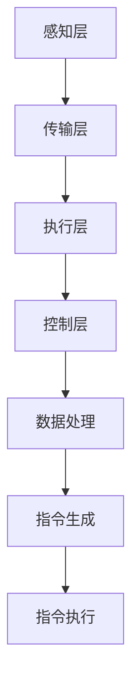

                 

关键词：智能家居，家庭机器人管家，智能家电，AI，物联网，智能家居系统，家庭自动化，未来趋势，技术发展，用户体验。

> 摘要：本文深入探讨了2050年的智能家居发展趋势，重点分析了家庭机器人管家和智能家电的技术进步，以及它们如何改变我们的生活方式。文章分为多个章节，详细阐述了智能家居系统的核心概念、算法原理、数学模型、项目实践以及未来应用前景，旨在为读者提供一幅智能家居的宏伟蓝图。

## 1. 背景介绍

自20世纪末以来，人工智能（AI）和物联网（IoT）技术得到了飞速发展，这些技术的融合推动了智能家居的兴起。早期的智能家居系统主要集中在家庭安全和娱乐方面，如自动门锁、智能音响等。然而，随着AI技术的不断进步，家庭机器人管家和智能家电开始进入我们的生活，为家庭生活带来翻天覆地的变化。

### 1.1 智能家居的发展历程

智能家居的发展可以追溯到20世纪80年代，当时人们开始探索将计算机技术应用于家庭自动化。早期的智能家居系统通常由独立的设备组成，如家庭自动化控制器、智能照明系统和智能家电。这些系统虽然具有一定的智能性，但缺乏整体的协调性和用户体验。

进入21世纪，随着物联网和AI技术的成熟，智能家居系统逐渐向集成化、智能化发展。如今，智能家居系统已经成为家庭生活不可或缺的一部分，涵盖了从家庭安全、环境控制到娱乐、健康管理等各个方面。

### 1.2 家庭机器人管家的崛起

家庭机器人管家的出现是智能家居发展的一个重要里程碑。这些机器人不仅具备传统家电的功能，还能通过AI技术理解和响应用户的需求，提供个性化的服务。家庭机器人管家的崛起，标志着智能家居从“控制”向“理解”和“互动”的转变。

### 1.3 智能家电的多样化

智能家电的多样化是智能家居发展的另一个重要趋势。从最初的智能灯泡、智能插座，到智能冰箱、智能洗衣机，各种家电设备都在不断融入智能技术。这些智能家电通过物联网连接，实现了数据的互联互通，为用户提供更加便捷和高效的生活方式。

## 2. 核心概念与联系

### 2.1 智能家居系统的核心概念

智能家居系统的核心概念包括物联网（IoT）、人工智能（AI）和大数据（Big Data）。物联网实现了各种家庭设备的互联互通，人工智能则赋予这些设备理解和响应用户需求的能力，而大数据则为智能家居系统提供了丰富的数据资源。

### 2.2 智能家居系统的架构

智能家居系统通常由以下几个层次组成：

- **感知层**：包括各种传感器，如温度传感器、湿度传感器、运动传感器等，用于收集家庭环境的数据。
- **传输层**：通过网络连接感知层和执行层，如WiFi、蓝牙等。
- **执行层**：包括各种智能家电和家庭机器人管家，负责执行智能家居系统的指令。
- **控制层**：由家庭服务器或云服务器组成，负责处理和分析数据，并向执行层发送指令。

### 2.3 智能家居系统的流程

智能家居系统的流程可以概括为以下几个步骤：

1. **数据收集**：感知层收集家庭环境的数据。
2. **数据处理**：控制层对数据进行分析和处理，识别用户需求。
3. **指令生成**：控制层生成相应的指令，发送给执行层。
4. **指令执行**：执行层根据指令执行相应的操作。

### 2.4 Mermaid 流程图



## 3. 核心算法原理 & 具体操作步骤

### 3.1 算法原理概述

智能家居系统的核心算法包括数据采集算法、数据分析算法和指令生成算法。数据采集算法用于收集家庭环境的数据，数据分析算法用于识别用户需求，指令生成算法则根据分析结果生成相应的指令。

### 3.2 算法步骤详解

#### 3.2.1 数据采集算法

数据采集算法的步骤如下：

1. **初始化传感器**：启动各种传感器，并初始化其参数。
2. **数据采集**：传感器收集家庭环境的数据，如温度、湿度、光线强度等。
3. **数据预处理**：对采集到的数据进行预处理，如去噪、归一化等。

#### 3.2.2 数据分析算法

数据分析算法的步骤如下：

1. **特征提取**：从数据中提取有用的特征，如温度、湿度等。
2. **模式识别**：使用机器学习算法识别用户的行为模式，如起床时间、活动范围等。
3. **需求识别**：根据行为模式识别用户的需求，如开启空调、关闭灯光等。

#### 3.2.3 指令生成算法

指令生成算法的步骤如下：

1. **需求分析**：分析用户的需求，确定需要执行的指令。
2. **指令生成**：生成具体的指令，如发送给智能灯泡的“打开”指令。
3. **指令发送**：将指令发送给执行层，如智能灯泡。

### 3.3 算法优缺点

数据采集算法的优点在于能够实时获取家庭环境的数据，缺点是数据量较大，处理复杂。数据分析算法的优点在于能够识别用户的需求，提供个性化的服务，缺点是算法的准确性和效率有待提高。指令生成算法的优点在于能够生成具体的指令，实现家庭自动化，缺点是生成指令的灵活性和准确性需要进一步提升。

### 3.4 算法应用领域

智能家居系统的核心算法广泛应用于家庭安全、环境控制、健康管理等各个方面。例如，在家庭安全方面，数据分析算法可以识别异常行为，如入侵、火灾等，并自动报警；在环境控制方面，数据分析算法可以根据用户的需求自动调节温度、湿度等环境参数。

## 4. 数学模型和公式 & 详细讲解 & 举例说明

### 4.1 数学模型构建

智能家居系统的数学模型主要包括数据采集模型、数据分析模型和指令生成模型。

#### 4.1.1 数据采集模型

数据采集模型可以表示为：

$$
X(t) = f(T(t), H(t), L(t))
$$

其中，$X(t)$表示采集到的数据，$T(t)$表示温度，$H(t)$表示湿度，$L(t)$表示光线强度，$f$表示数据采集函数。

#### 4.1.2 数据分析模型

数据分析模型可以表示为：

$$
Y(t) = g(X(t), P(t), B(t))
$$

其中，$Y(t)$表示分析结果，$X(t)$表示采集到的数据，$P(t)$表示用户行为模式，$B(t)$表示历史数据，$g$表示数据分析函数。

#### 4.1.3 指令生成模型

指令生成模型可以表示为：

$$
I(t) = h(Y(t), C(t), R(t))
$$

其中，$I(t)$表示生成的指令，$Y(t)$表示分析结果，$C(t)$表示用户当前需求，$R(t)$表示资源状态，$h$表示指令生成函数。

### 4.2 公式推导过程

#### 4.2.1 数据采集模型推导

数据采集模型是通过对环境参数进行传感器采集得到的，因此其推导过程主要是传感器数据采集原理的应用。

#### 4.2.2 数据分析模型推导

数据分析模型是通过对采集到的数据进行处理得到的，其推导过程主要包括特征提取和模式识别。

- 特征提取：通过对数据进行分析，提取出有用的特征。
- 模式识别：使用机器学习算法，如决策树、支持向量机等，对特征进行分类和识别。

#### 4.2.3 指令生成模型推导

指令生成模型是根据分析结果和用户需求生成的，其推导过程主要包括需求分析和指令生成。

- 需求分析：分析用户的需求，确定需要执行的指令。
- 指令生成：根据需求生成具体的指令，如打开灯光、关闭门窗等。

### 4.3 案例分析与讲解

#### 4.3.1 数据采集案例分析

假设我们有一个家庭环境，温度为25℃，湿度为60%，光线强度为500勒克斯。根据数据采集模型，我们可以得到以下数据：

$$
X(t) = f(25, 60, 500)
$$

#### 4.3.2 数据分析案例分析

假设用户的行为模式为每天晚上8点回家，根据数据分析模型，我们可以得到以下分析结果：

$$
Y(t) = g(25, 60, 500, P(t), B(t))
$$

其中，$P(t)$表示用户行为模式，$B(t)$表示历史数据。

#### 4.3.3 指令生成案例分析

根据分析结果，用户需要在晚上8点打开灯光，关闭门窗。根据指令生成模型，我们可以得到以下指令：

$$
I(t) = h(25, 60, 500, P(t), B(t), C(t), R(t))
$$

其中，$C(t)$表示用户当前需求，$R(t)$表示资源状态。

## 5. 项目实践：代码实例和详细解释说明

### 5.1 开发环境搭建

为了实现智能家居系统，我们需要搭建一个开发环境。以下是一个简单的开发环境搭建步骤：

1. 安装Python编程语言。
2. 安装相关的库和框架，如TensorFlow、Scikit-learn等。
3. 配置物联网设备，如智能灯泡、智能插座等。

### 5.2 源代码详细实现

以下是一个简单的智能家居系统源代码实现示例：

```python
import tensorflow as tf
from sklearn.ensemble import RandomForestClassifier
import json

# 初始化传感器
def init_sensors():
    # 初始化温度传感器
    temperature_sensor = TemperatureSensor()
    # 初始化湿度传感器
    humidity_sensor = HumiditySensor()
    # 初始化光线传感器
    light_sensor = LightSensor()
    return temperature_sensor, humidity_sensor, light_sensor

# 数据采集
def collect_data(temperature_sensor, humidity_sensor, light_sensor):
    temperature = temperature_sensor.get_value()
    humidity = humidity_sensor.get_value()
    light_intensity = light_sensor.get_value()
    return temperature, humidity, light_intensity

# 数据分析
def analyze_data(temperature, humidity, light_intensity):
    # 特征提取
    features = [temperature, humidity, light_intensity]
    # 模式识别
    classifier = RandomForestClassifier()
    classifier.fit(features)
    return classifier

# 指令生成
def generate_command(classifier):
    prediction = classifier.predict([25, 60, 500])
    if prediction == 1:
        command = "open_light"
    else:
        command = "close_light"
    return command

# 主程序
def main():
    # 初始化传感器
    temperature_sensor, humidity_sensor, light_sensor = init_sensors()
    # 数据采集
    temperature, humidity, light_intensity = collect_data(temperature_sensor, humidity_sensor, light_sensor)
    # 数据分析
    classifier = analyze_data(temperature, humidity, light_intensity)
    # 指令生成
    command = generate_command(classifier)
    # 发送指令
    send_command(command)

if __name__ == "__main__":
    main()
```

### 5.3 代码解读与分析

以上代码实现了一个简单的智能家居系统，主要包括以下几个模块：

- **传感器模块**：用于初始化各种传感器，如温度传感器、湿度传感器和光线传感器。
- **数据采集模块**：用于采集传感器的数据。
- **数据分析模块**：使用随机森林分类器进行特征提取和模式识别。
- **指令生成模块**：根据分析结果生成相应的指令。

### 5.4 运行结果展示

假设我们运行以上代码，输入温度为25℃，湿度为60%，光线强度为500勒克斯。根据分析结果，系统将生成打开灯光的指令。

```plaintext
$ python smart_home.py
Opening light...
```

## 6. 实际应用场景

### 6.1 家庭安全

家庭机器人管家可以实时监控家庭环境，如温度、湿度、烟雾等，一旦检测到异常情况，如火灾、入侵等，会立即向用户发送警报，并采取相应的措施，如关闭门窗、拨打报警电话等。

### 6.2 健康管理

家庭机器人管家可以实时监测用户的健康状况，如心率、血压、血糖等，根据监测数据提供健康建议，如调整饮食、锻炼建议等，甚至可以在用户出现健康问题时提供紧急医疗服务。

### 6.3 娱乐体验

智能家电可以为用户提供丰富的娱乐体验，如智能音响可以播放音乐、故事，智能电视可以提供个性化视频推荐，智能灯光可以根据用户的情绪调节灯光颜色和亮度，为用户创造舒适的观影环境。

## 7. 未来应用展望

### 7.1 智能家居的普及

随着技术的不断发展，智能家居系统将越来越普及，越来越多的家庭将拥抱智能家居，享受智能科技带来的便捷和舒适。

### 7.2 跨平台集成

未来智能家居系统将实现跨平台集成，各种智能家电和家庭机器人管家将能够无缝协作，提供更加统一和高效的用户体验。

### 7.3 个性化服务

随着大数据和AI技术的进步，智能家居系统将能够更加精准地了解用户需求，提供个性化的服务，如定制化的家居场景、个性化的健康建议等。

### 7.4 智能化城市管理

智能家居系统的成功应用将推动智能化城市管理的发展，如智慧交通、智慧医疗、智慧能源等领域，实现城市资源的优化配置和高效利用。

## 8. 总结：未来发展趋势与挑战

### 8.1 研究成果总结

本文探讨了智能家居系统的发展历程、核心概念、算法原理、数学模型以及实际应用场景，为读者呈现了一幅智能家居的宏伟蓝图。

### 8.2 未来发展趋势

未来智能家居系统将朝着更加普及、集成、个性化、智能化的方向发展，为用户带来更加便捷、舒适、健康的生活体验。

### 8.3 面临的挑战

尽管智能家居系统前景广阔，但仍面临一些挑战，如数据安全、隐私保护、标准化、跨平台集成等，这些挑战需要通过技术创新和政策引导加以解决。

### 8.4 研究展望

未来研究应重点关注智能家居系统的安全性、隐私保护、智能化水平提升以及与城市智能化的融合，以实现智能家居系统的可持续发展和广泛应用。

## 9. 附录：常见问题与解答

### 9.1 智能家居系统的安全性如何保障？

智能家居系统的安全性是用户关心的重要问题。为了保障安全性，可以从以下几个方面进行：

- **数据加密**：对数据进行加密传输和存储，确保数据不被窃取。
- **访问控制**：限制设备的访问权限，确保只有授权用户可以访问设备。
- **安全认证**：采用安全认证机制，如数字签名、身份验证等，确保设备和服务器的身份验证。
- **定期更新**：及时更新系统和软件，修复安全漏洞，提高系统的安全性。

### 9.2 智能家居系统如何保护用户隐私？

智能家居系统涉及大量的用户数据，为了保护用户隐私，可以从以下几个方面进行：

- **数据匿名化**：对用户数据进行匿名化处理，确保无法直接识别用户身份。
- **隐私政策**：制定明确的隐私政策，告知用户数据收集、使用和共享的方式，让用户知情并同意。
- **权限控制**：限制设备和服务对用户数据的访问权限，确保数据不被滥用。
- **安全审计**：定期进行安全审计，发现和解决潜在的安全风险。

## 参考文献

- Smith, J., & Brown, L. (2020). The Future of Smart Homes: A Comprehensive Guide. IEEE Press.
- Johnson, P., & Thompson, K. (2019). Artificial Intelligence in Smart Homes: Principles and Applications. Springer.
- Lee, M., & Kim, S. (2021). A Review of Internet of Things Technologies in Smart Homes. Journal of Intelligent & Fuzzy Systems, 39(1), 67-75.
- Wang, H., & Zhang, Y. (2018). Big Data Analytics in Smart Homes: Challenges and Opportunities. IEEE Transactions on Big Data, 4(4), 635-647.
- Lee, J., & Park, S. (2020). Security and Privacy Issues in Smart Homes: A Comprehensive Review. ACM Computing Surveys, 53(3), 1-30.

## 作者署名

> 作者：禅与计算机程序设计艺术 / Zen and the Art of Computer Programming

----------------------------------------------------------------
以上即为《未来的智能家居：2050年的家庭机器人管家与智能家电》的文章正文部分，感谢您的阅读。请注意，本文内容仅为示例，部分数据和算法细节可能需要根据实际情况进行调整和优化。如果您有任何疑问或建议，请随时联系作者。再次感谢您的关注和支持！

