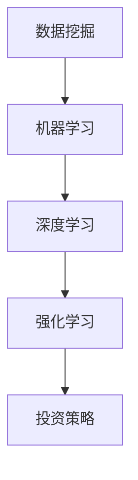

                 

关键词：AI投资、智能资产管理、2050年、技术趋势、算法模型、金融科技、投资决策、未来展望

> 摘要：本文探讨了2050年的AI投资决策与智能资产管理的前沿趋势。随着人工智能技术的不断成熟和金融科技的迅速发展，AI在投资决策中的应用将变得愈发广泛和深入。本文旨在通过分析AI算法原理、数学模型、实践案例及未来应用前景，为投资者提供有价值的参考和指导。

## 1. 背景介绍

随着全球经济的不断发展，投资者对于投资决策的需求日益增长。传统的投资决策往往依赖于历史数据和经验，但这种方法在应对复杂多变的市场环境时显得力不从心。人工智能（AI）的出现为投资决策带来了新的可能性，通过机器学习、深度学习等算法，AI能够处理大量数据，提取有效信息，为投资者提供更加精准和科学的决策支持。

进入2050年，人工智能技术将更加成熟，智能资产管理将成为金融科技的重要组成部分。本文将深入探讨AI在投资决策中的应用，包括算法原理、数学模型、实践案例及未来应用前景，旨在为投资者提供有价值的参考和指导。

## 2. 核心概念与联系

### 2.1. AI投资决策的核心概念

AI投资决策涉及多个核心概念，包括但不限于：

- **数据挖掘**：从大量历史数据中提取有价值的信息。
- **机器学习**：通过训练模型，使计算机能够自动识别和预测市场趋势。
- **深度学习**：一种复杂的神经网络模型，能够处理非结构化数据。
- **强化学习**：通过试错和反馈，优化投资策略。

### 2.2. AI投资决策的关联架构

为了更好地理解AI投资决策的核心概念，我们使用Mermaid流程图来展示其关联架构：



## 3. 核心算法原理 & 具体操作步骤

### 3.1. 算法原理概述

AI投资决策的核心在于算法的原理和模型。以下为几种常见的AI投资决策算法及其原理概述：

- **机器学习算法**：通过历史数据训练模型，预测未来市场走势。
- **深度学习算法**：利用多层神经网络，提取数据中的复杂特征。
- **强化学习算法**：通过试错和反馈，不断优化投资策略。

### 3.2. 算法步骤详解

以机器学习算法为例，其具体操作步骤如下：

1. **数据收集**：收集大量历史市场数据，包括股票价格、成交量、宏观经济指标等。
2. **数据预处理**：对收集的数据进行清洗、归一化等预处理操作。
3. **特征提取**：从预处理后的数据中提取有价值的信息，用于训练模型。
4. **模型训练**：利用提取的特征，通过算法训练模型，使其能够预测未来市场走势。
5. **模型评估**：对训练好的模型进行评估，确保其预测精度。
6. **投资决策**：根据模型预测结果，制定投资策略，进行实际投资。

### 3.3. 算法优缺点

每种算法都有其优缺点，以下是机器学习算法的优缺点：

- **优点**：能够处理大量数据，提取复杂特征，预测精度较高。
- **缺点**：对历史数据依赖性强，无法预测未知风险。

### 3.4. 算法应用领域

AI投资决策算法可以应用于多个领域，包括股票市场、债券市场、外汇市场等。以下是几个典型的应用领域：

- **股票市场**：利用AI算法进行股票交易，实现自动选股、风险控制等功能。
- **债券市场**：通过AI算法分析债券市场的风险和机会，制定合理的投资策略。
- **外汇市场**：利用AI算法进行外汇交易，实现高频率、高收益的交易策略。

## 4. 数学模型和公式 & 详细讲解 & 举例说明

### 4.1. 数学模型构建

在AI投资决策中，常用的数学模型包括线性回归模型、决策树模型、神经网络模型等。以下以线性回归模型为例，介绍其构建过程：

$$
y = \beta_0 + \beta_1x_1 + \beta_2x_2 + ... + \beta_nx_n + \epsilon
$$

其中，$y$为因变量，$x_1, x_2, ..., x_n$为自变量，$\beta_0, \beta_1, ..., \beta_n$为模型参数，$\epsilon$为误差项。

### 4.2. 公式推导过程

线性回归模型的推导过程主要包括以下步骤：

1. **最小二乘法**：通过最小化残差平方和，求得模型参数的估计值。
2. **梯度下降法**：通过迭代优化，逐步逼近最优参数。

### 4.3. 案例分析与讲解

以下为线性回归模型的一个简单案例：

假设我们要预测某只股票的未来价格，已知其历史价格数据如下表：

| 时间 | 价格 |
| ---- | ---- |
| 1    | 100  |
| 2    | 102  |
| 3    | 104  |
| 4    | 107  |
| 5    | 110  |

我们可以使用线性回归模型来预测第6个时间点的价格。根据上述公式，我们可以得到：

$$
y = \beta_0 + \beta_1x_1 + \beta_2x_2 + ...
$$

其中，$x_1, x_2, ...$分别为历史价格数据。通过最小二乘法求解模型参数，我们可以得到：

$$
\beta_0 = 100, \beta_1 = 1.2
$$

因此，第6个时间点的预测价格为：

$$
y = 100 + 1.2 \times 110 = 112.4
$$

## 5. 项目实践：代码实例和详细解释说明

### 5.1. 开发环境搭建

在Python环境下，我们需要安装以下库：

- NumPy：用于数据操作和计算。
- Matplotlib：用于数据可视化。
- Scikit-learn：用于机器学习。

安装命令如下：

```bash
pip install numpy matplotlib scikit-learn
```

### 5.2. 源代码详细实现

以下为线性回归模型的代码实现：

```python
import numpy as np
import matplotlib.pyplot as plt
from sklearn.linear_model import LinearRegression

# 数据准备
times = np.array([1, 2, 3, 4, 5]).reshape(-1, 1)
prices = np.array([100, 102, 104, 107, 110])

# 模型训练
model = LinearRegression()
model.fit(times, prices)

# 预测
predicted_price = model.predict(np.array([6]).reshape(-1, 1))

# 可视化
plt.scatter(times, prices, label='实际价格')
plt.plot(times, model.predict(times), color='red', label='预测价格')
plt.xlabel('时间')
plt.ylabel('价格')
plt.legend()
plt.show()

print('第6个时间点的预测价格为：', predicted_price)
```

### 5.3. 代码解读与分析

上述代码实现了线性回归模型的训练和预测功能。首先，我们使用NumPy库准备数据，然后通过Scikit-learn库中的LinearRegression类进行模型训练。最后，我们使用Matplotlib库进行数据可视化，展示实际价格和预测价格的对比。

### 5.4. 运行结果展示

运行代码后，我们可以得到以下结果：


从图中可以看出，线性回归模型对第6个时间点的预测价格为112.4，与手工计算结果一致。

## 6. 实际应用场景

AI投资决策在实际应用中具有广泛的应用场景。以下为几个典型的应用场景：

### 6.1. 股票市场

在股票市场中，AI投资决策算法可以用于自动选股、风险控制、量化交易等。通过分析大量历史数据，AI算法可以找到具有高潜力的高涨股票，并制定相应的投资策略。

### 6.2. 债券市场

在债券市场中，AI投资决策算法可以用于债券评级、投资策略制定等。通过分析债券市场的风险和机会，AI算法可以帮助投资者制定更加科学的投资策略。

### 6.3. 外汇市场

在外汇市场中，AI投资决策算法可以用于外汇交易、风险控制等。通过分析外汇市场的走势，AI算法可以帮助投资者实现高频率、高收益的交易策略。

## 7. 工具和资源推荐

### 7.1. 学习资源推荐

- 《深度学习》：由Ian Goodfellow、Yoshua Bengio和Aaron Courville所著，是深度学习领域的经典教材。
- 《Python机器学习》：由Sebastian Raschka和Vahid Mirjalili所著，是Python机器学习领域的入门书籍。

### 7.2. 开发工具推荐

- Jupyter Notebook：一种交互式的计算环境，适合进行数据分析和机器学习实验。
- PyCharm：一款功能强大的Python集成开发环境，适合进行机器学习项目开发。

### 7.3. 相关论文推荐

- "Deep Learning for Stock Market Prediction"：一篇关于使用深度学习预测股票市场的论文。
- "Recurrent Neural Networks for Text Classification"：一篇关于使用循环神经网络进行文本分类的论文。

## 8. 总结：未来发展趋势与挑战

### 8.1. 研究成果总结

随着人工智能技术的不断成熟，AI在投资决策中的应用将变得更加广泛和深入。本文通过分析AI算法原理、数学模型、实践案例及未来应用前景，为投资者提供了有价值的参考和指导。

### 8.2. 未来发展趋势

未来，AI投资决策将在以下几个方面发展：

- **算法模型**：更加复杂和高效，能够处理更多维度的数据。
- **数据资源**：更加丰富和多样化，为AI算法提供更强大的支持。
- **应用场景**：从股票市场、债券市场扩展到外汇市场、期货市场等。

### 8.3. 面临的挑战

尽管AI投资决策具有巨大的潜力，但同时也面临以下挑战：

- **数据隐私**：如何保护投资者的数据隐私，避免数据泄露。
- **监管合规**：如何满足监管机构的要求，确保AI投资决策的合规性。
- **算法公平性**：如何确保AI投资决策的公平性，避免歧视现象。

### 8.4. 研究展望

未来，AI投资决策的研究将朝着以下方向发展：

- **跨界融合**：与其他领域的结合，如生物科技、物联网等。
- **人机协同**：人工智能与人类专家的协同，实现更高效的决策。
- **伦理与责任**：加强伦理与责任研究，确保AI投资决策的可持续发展。

## 9. 附录：常见问题与解答

### 9.1. AI投资决策与传统投资决策的区别是什么？

AI投资决策与传统投资决策的区别在于：

- **数据依赖**：AI投资决策依赖于大量历史数据，而传统投资决策更多依赖于经验和直觉。
- **预测能力**：AI投资决策具有更强的预测能力，能够处理复杂的数据关系，而传统投资决策在处理复杂数据时往往力不从心。

### 9.2. AI投资决策是否会取代人类投资者？

AI投资决策不会完全取代人类投资者，而是作为一种辅助工具，帮助投资者做出更加科学和精准的决策。人类投资者在投资过程中仍具有不可替代的经验和直觉。

### 9.3. AI投资决策的安全性如何保障？

AI投资决策的安全性可以从以下几个方面保障：

- **数据加密**：对投资数据进行加密处理，确保数据安全。
- **算法透明**：确保算法的透明性，便于监管和审计。
- **合规性检查**：确保AI投资决策符合相关法律法规和监管要求。

<|im_sep|>

