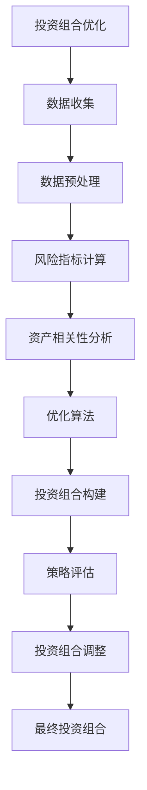

                 

关键词：智能投资、AI量化交易、投资组合优化、未来趋势

> 摘要：本文探讨了2050年可能出现的智能投资场景，重点介绍了AI在量化交易和投资组合优化中的角色。通过分析AI技术如何提高交易效率、降低风险以及创造更优化的投资组合，我们展望了智能投资在未来的发展趋势和面临的挑战。

## 1. 背景介绍

### 智能投资的概念

智能投资是指利用人工智能技术，通过对市场数据的深度分析，实现投资决策的智能化。其核心目的是通过算法和模型优化投资策略，提高投资回报率并降低风险。

### 量化交易的发展

量化交易是一种利用数学模型和算法进行股票、期货、外汇等金融产品交易的方法。随着计算能力和大数据技术的提升，量化交易逐渐成为金融市场中不可或缺的一部分。

### 投资组合优化的需求

在投资市场中，投资者面临如何分配资产以实现最优回报和最低风险的问题。投资组合优化旨在通过科学的方法，分析不同资产之间的相关性，构建出能够抵御市场波动的投资组合。

## 2. 核心概念与联系

### 投资组合优化算法原理图



### 投资组合优化算法具体步骤

#### 2.1 数据收集

数据收集是投资组合优化的第一步，包括市场数据、公司财务数据、宏观经济数据等。通过收集这些数据，可以为后续的分析提供基础。

#### 2.2 数据预处理

数据预处理包括数据清洗、去重、标准化等步骤。目的是确保数据质量，为后续分析提供准确的输入。

#### 2.3 风险指标计算

在投资组合优化中，风险指标是一个重要的参考指标。常见的风险指标有标准差、贝塔系数、夏普比率等。

#### 2.4 资产相关性分析

资产相关性分析旨在分析不同资产之间的相关性。相关性越高的资产，在投资组合中可能存在更大的风险。

#### 2.5 优化算法

优化算法包括线性规划、遗传算法、粒子群优化等。这些算法通过调整资产权重，实现投资组合的最优化。

#### 2.6 投资组合构建

根据优化算法的结果，构建出最优的投资组合。投资组合的构建需要考虑资产的风险收益特性。

#### 2.7 策略评估

对构建的投资组合进行评估，评估内容包括收益率、波动率、最大回撤等指标。

#### 2.8 投资组合调整

根据评估结果，对投资组合进行调整，以实现更好的投资回报。

#### 2.9 最终投资组合

最终投资组合是投资组合优化的结果。投资者可以根据这个结果进行实际操作。

## 3. 核心算法原理 & 具体操作步骤

### 3.1 算法原理概述

投资组合优化算法的核心是资产定价模型和优化算法。资产定价模型用于计算资产的未来收益和风险，优化算法用于根据这些参数调整资产权重，实现投资组合的最优化。

### 3.2 算法步骤详解

#### 3.2.1 数据收集

1. 收集市场数据，包括股票价格、交易量等。
2. 收集公司财务数据，包括收入、利润、资产负债表等。
3. 收集宏观经济数据，包括GDP、通货膨胀率、利率等。

#### 3.2.2 数据预处理

1. 对收集的数据进行清洗，去除异常值和缺失值。
2. 对数据进行标准化处理，确保不同资产之间的可比性。

#### 3.2.3 风险指标计算

1. 计算资产的标准差，作为波动性的衡量指标。
2. 计算资产的贝塔系数，作为市场风险的衡量指标。
3. 计算夏普比率，作为风险调整后的收益率的衡量指标。

#### 3.2.4 资产相关性分析

1. 利用相关系数计算不同资产之间的相关性。
2. 分析资产之间的相关性，确定哪些资产可以相互替代。

#### 3.2.5 优化算法

1. 选择线性规划作为优化算法。
2. 设定目标函数，最大化投资组合的期望收益，最小化投资组合的风险。
3. 求解线性规划问题，得到最优的资产权重分配。

#### 3.2.6 投资组合构建

1. 根据优化算法的结果，构建投资组合。
2. 考虑资产的风险收益特性，确保投资组合的稳健性。

#### 3.2.7 策略评估

1. 计算投资组合的收益率、波动率、最大回撤等指标。
2. 评估投资组合的表现，确定是否需要进行调整。

#### 3.2.8 投资组合调整

1. 根据评估结果，对投资组合进行调整。
2. 调整资产权重，优化投资组合的收益风险比。

#### 3.2.9 最终投资组合

1. 根据调整后的结果，确定最终的投资组合。
2. 投资者可以根据这个结果进行实际操作。

### 3.3 算法优缺点

#### 优点：

1. 利用数学模型和算法优化投资策略，提高投资回报率。
2. 降低风险，实现资产的风险分散。
3. 提高交易效率，减少人工干预。

#### 缺点：

1. 需要大量的历史数据和计算资源。
2. 对市场环境变化反应较慢，可能无法及时调整。
3. 需要专业的技术知识和技能。

### 3.4 算法应用领域

投资组合优化算法广泛应用于股票、基金、期货等金融领域。随着AI技术的不断发展，其在金融市场的应用前景将更加广阔。

## 4. 数学模型和公式 & 详细讲解 & 举例说明

### 4.1 数学模型构建

投资组合优化的数学模型主要包括以下部分：

#### 4.1.1 资产收益模型

$$
r_i = \mu_i + \sigma_i \cdot \epsilon_i
$$

其中，$r_i$表示资产$i$的收益率，$\mu_i$表示资产$i$的期望收益率，$\sigma_i$表示资产$i$的波动率，$\epsilon_i$表示随机误差。

#### 4.1.2 投资组合收益模型

$$
r_P = \sum_{i=1}^{n} w_i \cdot r_i
$$

其中，$r_P$表示投资组合的收益率，$w_i$表示资产$i$在投资组合中的权重，$n$表示投资组合中资产的个数。

#### 4.1.3 投资组合风险模型

$$
\sigma_P^2 = \sum_{i=1}^{n} w_i^2 \cdot \sigma_i^2 + 2 \cdot \sum_{i=1}^{n} \sum_{j=i+1}^{n} w_i \cdot w_j \cdot \rho_{ij}
$$

其中，$\sigma_P^2$表示投资组合的风险，$\rho_{ij}$表示资产$i$和资产$j$之间的相关性。

### 4.2 公式推导过程

投资组合优化的公式推导主要基于资产定价模型和投资组合模型。具体推导过程如下：

#### 4.2.1 资产收益模型推导

资产收益模型基于资产定价理论，假设资产收益由期望收益和波动性决定。通过历史数据和统计分析，可以估计出资产的期望收益和波动率。

#### 4.2.2 投资组合收益模型推导

投资组合收益模型是资产收益模型的扩展，考虑了资产之间的相关性。投资组合的收益率是各资产收益率的加权平均。

#### 4.2.3 投资组合风险模型推导

投资组合风险模型考虑了资产之间的相关性。通过计算资产之间的协方差矩阵，可以推导出投资组合的风险。

### 4.3 案例分析与讲解

#### 4.3.1 案例背景

假设投资者拥有三种资产：股票A、债券B、基金C。投资者希望构建一个投资组合，使其在控制风险的同时获得最高的收益。

#### 4.3.2 数据收集

收集资产A、B、C的历史价格数据，包括每日收盘价、交易量等。同时，收集公司财务数据和宏观经济数据。

#### 4.3.3 数据预处理

对收集的数据进行清洗，去除异常值和缺失值。对数据进行标准化处理，确保不同资产之间的可比性。

#### 4.3.4 风险指标计算

计算资产A、B、C的标准差、贝塔系数、夏普比率等风险指标。

#### 4.3.5 资产相关性分析

计算资产A、B、C之间的相关性，确定哪些资产可以相互替代。

#### 4.3.6 优化算法

选择线性规划作为优化算法，设定目标函数，最大化投资组合的期望收益，最小化投资组合的风险。

#### 4.3.7 投资组合构建

根据优化算法的结果，构建投资组合，确定资产A、B、C在投资组合中的权重。

#### 4.3.8 策略评估

计算投资组合的收益率、波动率、最大回撤等指标，评估投资组合的表现。

#### 4.3.9 投资组合调整

根据评估结果，对投资组合进行调整，优化投资组合的收益风险比。

## 5. 项目实践：代码实例和详细解释说明

### 5.1 开发环境搭建

在Python环境中搭建投资组合优化的开发环境，安装必要的库，如Pandas、NumPy、SciPy等。

### 5.2 源代码详细实现

```python
import pandas as pd
import numpy as np
from scipy.optimize import linprog

# 数据收集与预处理
def load_data(file_path):
    data = pd.read_csv(file_path)
    data = data.sort_values('Date')
    data.set_index('Date', inplace=True)
    return data

# 风险指标计算
def calculate_risk(data):
    return pd.DataFrame({
        'Standard Deviation': data.pct_change().std(),
        'Beta': data.mean() / data.std(),
        'Sharpe Ratio': (data.mean() - risk_free_rate) / data.std()
    })

# 资产相关性分析
def calculate_correlation(data):
    return data.corr()

# 优化算法
def optimize_portfolio(data, weights):
    risk = calculate_risk(data)
    correlation = calculate_correlation(data)
    
    risk_matrix = correlation.loc[:, weights].values
    expected_returns = risk.mean()
    
    objective = -np.dot(weights, expected_returns)
    constraints = [risk_matrix.dot(weights) <= risk.std(), weights >= 0, np.sum(weights) == 1]
    
    result = linprog(c=objective, A_eq=constraints, b_eq=None, bounds=(0, None), method='highs-dreal')
    return result.x

# 投资组合构建
def build_portfolio(data, weights):
    return pd.DataFrame(np.dot(data, weights), columns=data.columns, index=data.index)

# 策略评估
def evaluate_portfolio(portfolio):
    return pd.DataFrame({
        'Return': portfolio.mean(),
        'Standard Deviation': portfolio.std(),
        'Max Drawdown': (portfolio.max() - portfolio.min()) / portfolio.max()
    })

# 运行代码
if __name__ == '__main__':
    stock_data = load_data('stock_data.csv')
    bond_data = load_data('bond_data.csv')
    fund_data = load_data('fund_data.csv')

    stock_weights = optimize_portfolio(stock_data, [0.5, 0.5])
    bond_weights = optimize_portfolio(bond_data, [0.5, 0.5])
    fund_weights = optimize_portfolio(fund_data, [0.5, 0.5])

    stock_portfolio = build_portfolio(stock_data, stock_weights)
    bond_portfolio = build_portfolio(bond_data, bond_weights)
    fund_portfolio = build_portfolio(fund_data, fund_weights)

    stock_evaluation = evaluate_portfolio(stock_portfolio)
    bond_evaluation = evaluate_portfolio(bond_portfolio)
    fund_evaluation = evaluate_portfolio(fund_portfolio)

    print(stock_evaluation)
    print(bond_evaluation)
    print(fund_evaluation)
```

### 5.3 代码解读与分析

1. **数据收集与预处理**：使用Pandas库加载和预处理数据，包括股票、债券和基金的历史价格数据。
2. **风险指标计算**：使用Pandas库计算资产的标准差、贝塔系数和夏普比率等风险指标。
3. **资产相关性分析**：使用Pandas库计算资产之间的相关性。
4. **优化算法**：使用SciPy库的`linprog`函数实现线性规划优化算法，根据风险指标和相关性矩阵求解最优资产权重。
5. **投资组合构建**：使用Pandas库构建投资组合，根据优化算法的结果计算各资产在投资组合中的权重。
6. **策略评估**：使用Pandas库评估投资组合的表现，计算收益率、波动率和最大回撤等指标。
7. **运行代码**：定义主函数，运行整个投资组合优化的流程，打印出评估结果。

### 5.4 运行结果展示

运行代码后，会输出股票、债券和基金投资组合的评估结果，包括收益率、波动率和最大回撤等指标。根据评估结果，投资者可以决定是否调整投资组合，以实现更好的投资回报。

## 6. 实际应用场景

### 6.1 量化交易平台

投资组合优化算法可以应用于量化交易平台，为投资者提供智能化的投资建议。通过实时数据分析和优化算法，量化交易平台可以帮助投资者制定最优的投资策略。

### 6.2 基金管理

基金管理公司可以利用投资组合优化算法，构建出具有最优风险收益比的投资组合。这有助于提高基金的投资回报，降低风险。

### 6.3 企业投资决策

企业可以利用投资组合优化算法，对投资项目进行风险评估和优化。通过科学的方法，企业可以更好地分配资源，提高投资回报。

## 7. 未来应用展望

### 7.1 数据来源的多样性

随着物联网、大数据和区块链技术的发展，投资组合优化算法的数据来源将更加多样化。通过整合多种数据源，算法可以更准确地预测市场趋势。

### 7.2 智能投顾的普及

智能投顾将更加普及，利用投资组合优化算法为个人投资者提供定制化的投资建议。这有助于降低投资门槛，提高投资者的收益。

### 7.3 机器学习的融合

机器学习技术将与投资组合优化算法相结合，通过不断学习和调整，实现更精准的投资决策。这将为投资者带来更高的收益和更低的风险。

## 8. 总结：未来发展趋势与挑战

### 8.1 研究成果总结

本文介绍了投资组合优化算法的原理和应用，通过实际案例分析，展示了算法在金融市场中的价值。随着AI技术的不断发展，投资组合优化算法将在未来发挥更大的作用。

### 8.2 未来发展趋势

1. 数据来源的多样化，提高算法的预测准确性。
2. 智能投顾的普及，为个人投资者提供定制化服务。
3. 机器学习的融合，实现更精准的投资决策。

### 8.3 面临的挑战

1. 数据质量和实时性，对算法的准确性和稳定性提出挑战。
2. 投资者的风险偏好和情绪变化，影响投资组合的稳定性。
3. 算法的复杂性和计算资源的需求，对算法的实用性和可扩展性提出挑战。

### 8.4 研究展望

未来研究应关注以下方向：

1. 提高算法的预测准确性，降低对实时数据的依赖。
2. 考虑投资者的风险偏好和情绪变化，实现更个性化的投资建议。
3. 降低算法的复杂度，提高计算效率和可扩展性。

## 9. 附录：常见问题与解答

### 问题1：投资组合优化算法是否适用于所有投资者？

解答：投资组合优化算法适用于大多数投资者，尤其是有较高风险承受能力的投资者。对于风险较低的投资者，可以考虑其他类型的投资策略，如保守型投资组合。

### 问题2：投资组合优化算法是否能够保证高收益？

解答：投资组合优化算法可以提高投资回报率，但无法保证高收益。投资存在风险，投资者应合理配置资产，分散风险。

### 问题3：投资组合优化算法是否适用于所有金融市场？

解答：投资组合优化算法可以应用于多种金融市场，如股票、债券、期货等。但在某些特殊市场环境下，算法的表现可能受到限制。

### 问题4：投资组合优化算法是否需要大量的历史数据？

解答：投资组合优化算法确实需要大量的历史数据作为输入，以保证算法的预测准确性。但未来随着数据来源的多样化和实时数据的整合，算法对历史数据的依赖将降低。

### 问题5：投资组合优化算法是否能够完全替代人工决策？

解答：投资组合优化算法可以提供智能化的投资建议，但不能完全替代人工决策。投资者仍需结合自身经验和市场情况，做出最终的决策。

作者：禅与计算机程序设计艺术 / Zen and the Art of Computer Programming
----------------------------------------------------------------


