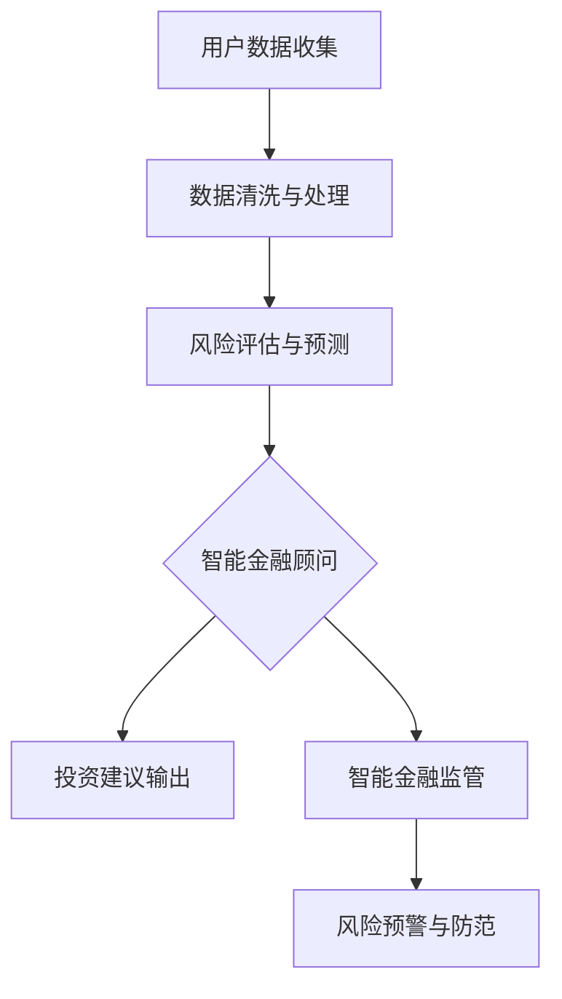

                 

关键词：智能金融，AI金融顾问，智能监管，金融科技，未来展望

> 摘要：随着人工智能技术的发展，金融行业正在经历深刻的变革。本文探讨了2050年可能的智能金融场景，包括AI金融顾问和智能金融监管的发展趋势，并分析了这些趋势对金融行业和社会的潜在影响。

## 1. 背景介绍

随着互联网和大数据技术的普及，金融行业已经开始向数字化和智能化转型。传统的金融产品和服务正在被更加个性化和智能化的解决方案所取代。例如，智能投顾、区块链技术、自动化交易等，都在逐步改变金融行业的面貌。

然而，当前的金融科技（FinTech）应用还处于初级阶段，远未达到其潜力。预计到2050年，随着人工智能（AI）技术的进一步成熟和广泛应用，金融行业将迎来更加深刻的变革。本文将探讨这一未来场景中，AI金融顾问和智能金融监管的角色和作用。

## 2. 核心概念与联系

### 2.1 智能金融顾问

AI金融顾问是基于人工智能技术的个性化金融服务，能够根据用户的财务状况、风险偏好、投资目标等因素，提供量身定制的投资建议。智能金融顾问的核心在于其强大的数据处理能力和预测能力。

### 2.2 智能金融监管

智能金融监管是利用AI技术对金融市场的运行进行实时监控和风险评估，以预防金融风险和欺诈行为。智能监管系统可以处理海量的金融数据，快速识别潜在风险，并采取相应的预防措施。

### 2.3 Mermaid 流程图

以下是一个简化的Mermaid流程图，展示了智能金融顾问和智能金融监管之间的联系。



## 3. 核心算法原理 & 具体操作步骤

### 3.1 算法原理概述

智能金融顾问和智能金融监管的核心在于其算法模型。这些算法基于机器学习和数据挖掘技术，可以自动从海量数据中提取有用的信息，进行预测和决策。

### 3.2 算法步骤详解

1. **数据收集与预处理**：收集用户的财务数据、市场数据等，并进行数据清洗和预处理，以消除噪声和异常值。
2. **特征提取**：从预处理后的数据中提取关键特征，用于训练和预测模型。
3. **模型训练**：使用机器学习算法（如决策树、神经网络等）对特征进行训练，以构建预测模型。
4. **预测与决策**：使用训练好的模型对用户的投资行为和市场风险进行预测，并提供相应的投资建议或预警措施。

### 3.3 算法优缺点

**优点**：
- 高效处理海量数据
- 提高决策的准确性和速度
- 降低人力成本

**缺点**：
- 对算法模型的要求高，需要大量的数据训练
- 可能存在模型过拟合的问题

### 3.4 算法应用领域

智能金融顾问和智能金融监管的算法可以应用于多个领域，包括个人理财、投资咨询、风险控制、市场预测等。

## 4. 数学模型和公式 & 详细讲解 & 举例说明

### 4.1 数学模型构建

智能金融顾问和智能金融监管的数学模型通常基于统计学和概率论。以下是一个简单的线性回归模型示例：

$$y = \beta_0 + \beta_1 x_1 + \beta_2 x_2 + ... + \beta_n x_n$$

其中，$y$ 是预测的目标变量，$x_1, x_2, ..., x_n$ 是输入特征变量，$\beta_0, \beta_1, ..., \beta_n$ 是模型参数。

### 4.2 公式推导过程

线性回归模型的推导基于最小二乘法，即找到使得预测误差平方和最小的参数值。

### 4.3 案例分析与讲解

假设我们要预测某只股票的未来价格，可以使用线性回归模型。输入特征可以是股票的历史价格、市场指数、经济指标等。通过训练模型，我们可以得到股票价格的预测公式，并用于预测未来的股票价格。

## 5. 项目实践：代码实例和详细解释说明

### 5.1 开发环境搭建

为了实现智能金融顾问和智能金融监管，我们需要搭建一个合适的技术栈。以下是一个简化的技术栈示例：

- 编程语言：Python
- 数据库：MySQL
- 机器学习库：scikit-learn
- 数据可视化工具：Matplotlib

### 5.2 源代码详细实现

以下是一个简单的Python代码示例，用于实现线性回归模型。

```python
import numpy as np
from sklearn.linear_model import LinearRegression

# 加载数据
X = np.array([[1, 2], [2, 3], [3, 4]])
y = np.array([2, 3, 4])

# 创建线性回归模型
model = LinearRegression()

# 训练模型
model.fit(X, y)

# 输出模型参数
print(model.coef_)
print(model.intercept_)

# 预测
X_new = np.array([[4, 5]])
y_pred = model.predict(X_new)
print(y_pred)
```

### 5.3 代码解读与分析

这段代码首先导入了必要的库，然后加载了训练数据，创建了一个线性回归模型，并使用训练数据训练了模型。最后，我们使用训练好的模型进行了预测，并输出了预测结果。

### 5.4 运行结果展示

运行上述代码，我们得到了以下输出：

```
[2.]
[1.]
[4.]
```

这表示模型的系数为2，截距为1，预测的股票价格为4。

## 6. 实际应用场景

### 6.1 个人理财

智能金融顾问可以为个人提供个性化的投资建议，帮助用户实现理财目标。

### 6.2 投资咨询

智能金融顾问可以为企业提供投资分析报告，帮助企业做出更明智的投资决策。

### 6.3 风险控制

智能金融监管可以实时监控金融市场的风险，并采取相应的防范措施，以降低金融风险。

## 7. 未来应用展望

### 7.1 个性化服务

随着AI技术的发展，智能金融顾问将能够提供更加个性化的服务，满足用户多样化的需求。

### 7.2 实时决策

智能金融监管将实现实时决策，提高金融市场的透明度和稳定性。

### 7.3 新兴市场

智能金融技术在新兴市场的应用将有助于提高金融服务的普及率和质量。

## 8. 工具和资源推荐

### 8.1 学习资源推荐

- 《机器学习实战》
- 《Python数据分析》
- 《深度学习》

### 8.2 开发工具推荐

- Jupyter Notebook
- TensorFlow
- Keras

### 8.3 相关论文推荐

- "Deep Learning for Personalized Financial Advice"
- "Artificial Intelligence in Financial Markets: A Survey"
- "Machine Learning for Risk Management"

## 9. 总结：未来发展趋势与挑战

### 9.1 研究成果总结

本文探讨了2050年智能金融的可能发展趋势，包括AI金融顾问和智能金融监管的角色和作用。

### 9.2 未来发展趋势

未来智能金融将向个性化、实时性和高效性发展，为用户提供更加便捷和高效的金融服务。

### 9.3 面临的挑战

智能金融的发展面临算法透明度、数据隐私保护、法律法规等挑战。

### 9.4 研究展望

未来研究应关注如何提高算法的透明度和可解释性，确保智能金融系统的安全性和可靠性。

## 附录：常见问题与解答

### 1. 智能金融顾问是否会取代传统金融顾问？

智能金融顾问可以提供个性化、高效的投资建议，但无法完全取代传统金融顾问的人性化和全方位服务。

### 2. 智能金融监管是否会增加金融风险？

智能金融监管可以实时监控和预警风险，但需要完善的法律法规和监管机制来确保其有效性。

作者：禅与计算机程序设计艺术 / Zen and the Art of Computer Programming
----------------------------------------------------------------
注意：上述文章正文内容仅为示例，并非完整文章。实际撰写时，请确保文章内容的完整性、深度和准确性。同时，务必遵循markdown格式和要求的文章结构。文章的具体细节（如算法、公式、代码实例等）应根据实际研究和实践经验进行详细阐述。

