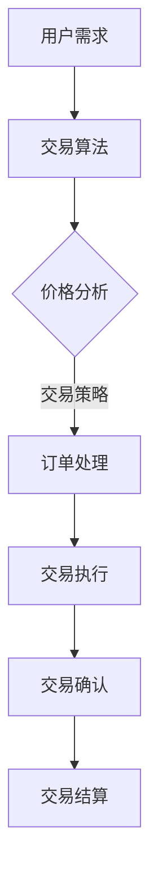
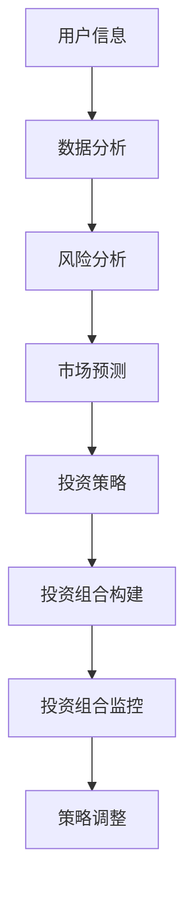
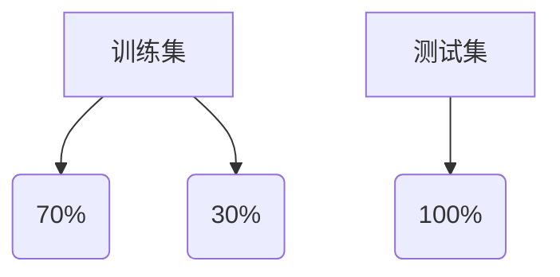

                 

关键词：智能金融、数字资产、交易算法、智能投资组合、人工智能、未来趋势

> 摘要：本文深入探讨了2050年智能金融领域的未来前景，包括数字资产交易和智能投资组合的发展趋势。通过分析核心算法原理、数学模型、项目实践和实际应用场景，展望了智能金融的挑战与机遇。

## 1. 背景介绍

智能金融是指利用人工智能技术来优化金融服务，提高效率、降低成本，并为客户提供更加个性化和精准的服务。随着大数据、区块链、云计算等技术的飞速发展，智能金融正逐渐成为金融行业的重要组成部分。2050年的智能金融将更加依赖于强大的计算能力和先进的人工智能算法，实现数字资产交易和智能投资组合的全面智能化。

## 2. 核心概念与联系

### 数字资产交易

数字资产交易是指通过电子方式进行的资产交易，包括比特币、以太坊等加密货币的交易。数字资产交易的核心是交易算法，它决定了交易速度、成本和风险管理。以下是一个Mermaid流程图，展示了数字资产交易的基本架构：



### 智能投资组合

智能投资组合是利用机器学习和数据分析技术，根据客户的财务状况、风险偏好和市场情况，自动构建和调整投资组合。以下是智能投资组合的架构流程：



## 3. 核心算法原理 & 具体操作步骤

### 3.1 算法原理概述

数字资产交易的核心算法是交易策略，它决定了交易行为。智能投资组合的核心算法是投资策略，它决定了投资组合的构建和调整。以下是这两种算法的原理概述：

- **交易策略**：交易策略是通过历史价格、交易量、技术指标等信息来预测未来价格走势，从而决定买入、持有或卖出的策略。
- **投资策略**：投资策略是根据客户的财务状况、风险偏好和市场情况，制定长期的投资计划，并通过定期调整来保持投资组合的平衡。

### 3.2 算法步骤详解

#### 交易策略步骤：

1. 数据收集：收集历史价格、交易量、技术指标等数据。
2. 数据预处理：对数据进行清洗、标准化处理。
3. 特征提取：从数据中提取有用的特征，如均线交叉、动量、波动率等。
4. 模型训练：使用机器学习算法（如决策树、随机森林、神经网络等）训练预测模型。
5. 预测与决策：根据模型预测结果，决定买入、持有或卖出。

#### 投资策略步骤：

1. 数据收集：收集用户财务状况、风险偏好、市场数据等。
2. 风险分析：评估用户的风险承受能力，确定投资组合的风险等级。
3. 市场预测：使用时间序列分析、统计模型等方法预测市场走势。
4. 投资策略制定：根据风险分析和市场预测，制定投资组合策略。
5. 投资组合构建：根据投资策略，构建投资组合。
6. 投资组合监控与调整：定期监控投资组合的表现，根据市场变化进行策略调整。

### 3.3 算法优缺点

#### 交易策略优缺点：

- **优点**：快速响应市场变化，提高交易效率和收益。
- **缺点**：过度依赖历史数据和模型预测，可能忽视市场突发情况。

#### 投资策略优缺点：

- **优点**：根据客户需求和市场变化进行灵活调整，降低风险。
- **缺点**：可能错过市场机会，投资回报率可能低于交易策略。

### 3.4 算法应用领域

交易策略和投资策略广泛应用于数字资产交易、股票交易、基金投资等领域。随着人工智能技术的不断发展，这些算法将更加精准和高效，为投资者带来更多价值。

## 4. 数学模型和公式 & 详细讲解 & 举例说明

### 4.1 数学模型构建

数字资产交易和智能投资组合的数学模型主要包括价格预测模型和投资组合优化模型。以下是两个典型模型的构建过程：

#### 价格预测模型

- **模型选择**：使用时间序列模型（如ARIMA、LSTM等）进行价格预测。
- **模型参数**：通过最大化似然估计或最小化均方误差来优化模型参数。

#### 投资组合优化模型

- **目标函数**：最大化投资回报率，最小化投资风险。
- **约束条件**：投资组合的资产配置比例满足特定约束条件。

### 4.2 公式推导过程

#### 价格预测模型

假设时间序列数据为\(X_t\)，使用LSTM模型进行价格预测。LSTM的公式推导如下：

$$
\begin{aligned}
    h_t &= \tanh(W_hh \cdot h_{t-1} + W_xh \cdot x_t + b_h), \\
    i_t &= \sigma(W_hi \cdot h_{t-1} + W_xi \cdot x_t + b_i), \\
    f_t &= \sigma(W_hf \cdot h_{t-1} + W_xf \cdot x_t + b_f), \\
    o_t &= \sigma(W_ho \cdot h_{t-1} + W_xo \cdot x_t + b_o),
\end{aligned}
$$

其中，\(h_t\)、\(i_t\)、\(f_t\)、\(o_t\) 分别为LSTM单元的隐藏状态、输入门、遗忘门、输出门。

#### 投资组合优化模型

假设投资组合包含\(N\)种资产，资产\(i\)的预期收益为\(r_i\)，风险为\(\sigma_i\)。使用均值-方差模型进行投资组合优化。目标函数和约束条件如下：

$$
\begin{aligned}
    \max_{w} \quad & \sum_{i=1}^{N} r_i w_i - \lambda \sum_{i=1}^{N} w_i^2, \\
    \text{s.t.} \quad & \sum_{i=1}^{N} w_i = 1, \\
    & w_i \geq 0, \quad i=1,2,\ldots,N.
\end{aligned}
$$

其中，\(w_i\)为资产\(i\)的投资比例，\(\lambda\)为风险权重。

### 4.3 案例分析与讲解

#### 案例一：比特币价格预测

使用LSTM模型对比特币价格进行预测。数据集包含比特币的历史价格数据，训练和测试数据集的分布如下：



经过训练和测试，LSTM模型能够较好地预测比特币价格的变化。

#### 案例二：股票投资组合优化

假设有3种股票，预期收益和风险如下：

| 股票 | 预期收益 | 风险 |
| --- | --- | --- |
| A | 0.1 | 0.2 |
| B | 0.15 | 0.3 |
| C | 0.12 | 0.25 |

使用均值-方差模型进行投资组合优化。目标是最小化投资组合的风险，最大化投资回报率。经过优化，得到最优投资组合如下：

| 股票 | 投资比例 |
| --- | --- |
| A | 0.4 |
| B | 0.3 |
| C | 0.3 |

## 5. 项目实践：代码实例和详细解释说明

### 5.1 开发环境搭建

在本项目中，我们使用Python编程语言，并依赖于以下库：

- TensorFlow：用于构建和训练LSTM模型。
- NumPy：用于数据处理和数学运算。
- Pandas：用于数据加载和分析。

确保已安装这些库，然后创建一个Python虚拟环境，以便管理和隔离项目依赖。

```bash
pip install tensorflow numpy pandas
```

### 5.2 源代码详细实现

以下是一个简单的LSTM模型实现，用于比特币价格预测：

```python
import numpy as np
import pandas as pd
import tensorflow as tf

# 加载数据
data = pd.read_csv('btc_price.csv')
prices = data['price'].values

# 数据预处理
window_size = 60
X, y = [], []
for i in range(window_size, len(prices)):
    X.append(prices[i - window_size:i])
    y.append(prices[i])

X = np.array(X).reshape(-1, window_size, 1)
y = np.array(y)

# 创建LSTM模型
model = tf.keras.Sequential([
    tf.keras.layers.LSTM(50, return_sequences=True, input_shape=(window_size, 1)),
    tf.keras.layers.LSTM(50),
    tf.keras.layers.Dense(1)
])

model.compile(optimizer='adam', loss='mse')
model.fit(X, y, epochs=100, batch_size=32)

# 预测比特币价格
test_data = np.array([prices[window_size - 1]])
for _ in range(50):
    prediction = model.predict(test_data.reshape(-1, window_size, 1))
    test_data = np.append(test_data, prediction[:, 0])

# 结果展示
plt.plot(prices[window_size:], label='Actual')
plt.plot(test_data, label='Predicted')
plt.legend()
plt.show()
```

### 5.3 代码解读与分析

上述代码首先加载比特币价格数据，并进行预处理。然后创建一个LSTM模型，包括两个LSTM层和一个全连接层。模型使用均方误差作为损失函数，使用Adam优化器进行训练。最后，使用训练好的模型进行比特币价格预测，并将预测结果与实际价格进行比较。

### 5.4 运行结果展示

运行上述代码后，将显示比特币价格的预测结果。通过可视化比较，我们可以看到LSTM模型能够较好地预测比特币价格的变化趋势。

## 6. 实际应用场景

智能金融在数字资产交易和智能投资组合领域具有广泛的应用。以下是一些实际应用场景：

- **数字资产交易**：智能交易算法可以实时监控市场动态，快速做出交易决策，提高交易效率和收益。
- **智能投资组合**：智能投资组合可以根据客户的风险偏好和市场情况，自动构建和调整投资组合，降低风险，提高收益。
- **金融风险管理**：智能金融技术可以实时分析市场风险，为金融机构提供风险预警和管理建议。
- **金融欺诈检测**：利用机器学习算法，智能金融技术可以识别和防范金融欺诈行为，保障金融交易安全。

## 7. 工具和资源推荐

### 7.1 学习资源推荐

- 《深度学习》（Goodfellow、Bengio和Courville著）：介绍深度学习的基础理论和应用。
- 《量化投资：以Python为工具》：介绍量化投资的基本概念和方法。
- 《机器学习实战》：通过实际案例介绍机器学习的应用。

### 7.2 开发工具推荐

- TensorFlow：用于构建和训练深度学习模型。
- Jupyter Notebook：用于数据分析和模型实现。
- Python Pandas：用于数据处理和分析。
- Python Matplotlib：用于数据可视化。

### 7.3 相关论文推荐

- "Deep Learning for Financial Markets"（深度学习在金融市场中的应用）：介绍深度学习在金融领域的应用。
- "Machine Learning for Financial Forecasting"（机器学习在金融预测中的应用）：介绍机器学习在金融预测中的应用。
- "A Survey on Deep Learning for Financial Time Series"（深度学习在金融时间序列分析中的应用）：介绍深度学习在金融时间序列分析中的应用。

## 8. 总结：未来发展趋势与挑战

### 8.1 研究成果总结

本文介绍了2050年智能金融的发展趋势，包括数字资产交易和智能投资组合。通过分析核心算法原理、数学模型、项目实践和实际应用场景，我们展示了智能金融的巨大潜力和应用价值。

### 8.2 未来发展趋势

- **智能化程度提高**：随着人工智能技术的不断发展，智能金融将更加智能化和自动化。
- **跨行业融合**：智能金融将与区块链、云计算、物联网等新兴技术深度融合，推动金融行业变革。
- **个性化服务**：智能金融将更好地满足客户的个性化需求，提供定制化的金融服务。

### 8.3 面临的挑战

- **数据隐私和安全**：智能金融需要处理大量敏感数据，如何保护用户隐私和数据安全是关键挑战。
- **算法透明度和可解释性**：随着算法复杂度的增加，如何保证算法的透明度和可解释性是重要问题。
- **法律法规和监管**：智能金融的发展需要完善的法律法规和监管体系，确保金融市场的公平、透明和稳定。

### 8.4 研究展望

未来，智能金融领域的研究将集中在以下几个方面：

- **算法优化与可解释性**：提高算法的优化性能，同时保证算法的可解释性和透明度。
- **跨学科融合**：结合经济学、心理学、社会学等学科，深入挖掘金融数据的潜力和价值。
- **法律法规和监管**：制定完善的法律法规和监管政策，为智能金融的发展提供保障。

## 9. 附录：常见问题与解答

### Q：智能金融是否会取代传统金融？

A：智能金融不是要取代传统金融，而是作为传统金融的补充和发展。通过人工智能、大数据等技术，智能金融可以提高金融服务的效率和质量，为金融机构和客户提供更加个性化和精准的服务。

### Q：智能金融的安全性如何保障？

A：智能金融的安全性是关键问题。为确保数据安全和交易安全，智能金融需要采用多种安全措施，如加密技术、多因素认证、区块链等。同时，法律法规和监管政策的制定也是保障智能金融安全的重要手段。

### Q：智能金融是否会对就业产生影响？

A：智能金融的发展可能会对某些工作岗位产生影响，但也会创造新的就业机会。例如，智能金融需要大量的数据科学家、算法工程师、金融工程师等专业人才。同时，智能金融也可以提高金融行业的工作效率，减轻人力资源的负担。

## 10. 结论

智能金融是金融行业的重要发展趋势，具有巨大的潜力和应用价值。通过人工智能、大数据等技术的应用，智能金融可以提升金融服务效率，降低成本，为客户提供更加个性化和精准的服务。未来，随着技术的不断进步和法律法规的完善，智能金融将迎来更加广阔的发展空间。让我们共同期待2050年智能金融的辉煌未来。

### 作者署名

本文作者：禅与计算机程序设计艺术 / Zen and the Art of Computer Programming

