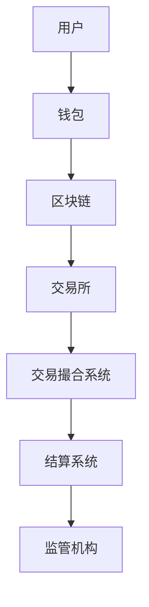
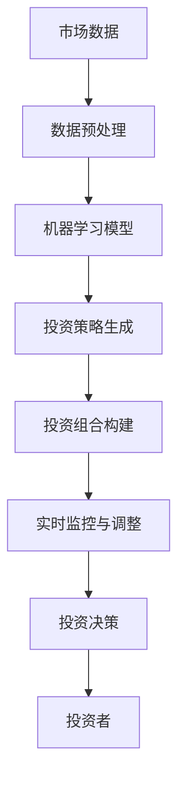

                 

关键词：智能金融、数字资产、交易系统、智能投资组合、2050年、人工智能、区块链技术、数据隐私、自动化投资。

> 摘要：本文探讨了2050年智能金融领域的发展趋势，包括数字资产交易、智能投资组合构建和风险管理。通过对人工智能、区块链技术和数据隐私的深入分析，文章提出了未来的智能金融系统架构，并展望了其潜在的应用场景和挑战。

## 1. 背景介绍

智能金融是指利用人工智能、大数据、区块链等前沿技术，对金融领域进行深度变革和优化的一类金融服务。随着科技的进步，智能金融已经在很多方面改变了我们的金融生活，例如在线支付、智能投顾、信用评分等。然而，随着技术的不断演进，未来智能金融将迎来更大的变革。

数字资产交易是智能金融的重要组成部分。数字资产，如比特币、以太坊等，由于其独特的去中心化、透明性等特点，正逐渐成为传统金融体系的有力补充。而智能投资组合则利用机器学习和大数据分析，为投资者提供更为精准的投资建议，实现投资组合的最优化。

## 2. 核心概念与联系

### 2.1. 数字资产交易

数字资产交易系统是一个复杂的分布式系统，涉及到区块链技术、智能合约、加密货币等多种技术。下面是一个简化版的数字资产交易系统的架构图：



在这个系统中，用户通过钱包进行数字资产的存储和交易，交易所作为交易平台，通过智能合约实现自动化交易。交易撮合系统负责匹配买卖双方，确保交易高效、公平。结算系统则负责处理资金的转移和清算。监管机构负责对交易行为进行监管，确保合规。

### 2.2. 智能投资组合

智能投资组合系统则是利用机器学习算法和大数据分析，对市场进行预测和风险评估，从而构建最优的投资组合。其基本架构如下：



在这个系统中，市场数据经过预处理后，输入到机器学习模型中，模型根据历史数据和现有信息生成投资策略。投资组合构建模块则根据策略构建最优投资组合。实时监控与调整模块则根据市场变化，对投资组合进行调整。最终，投资决策模块将决策结果反馈给投资者。

## 3. 核心算法原理 & 具体操作步骤

### 3.1. 算法原理概述

智能金融的核心算法包括机器学习算法、区块链共识算法、加密算法等。其中，机器学习算法用于预测市场趋势和风险评估；区块链共识算法确保交易系统的安全性和可靠性；加密算法则用于保护用户隐私和数据安全。

### 3.2. 算法步骤详解

#### 3.2.1. 机器学习算法

机器学习算法的核心是训练模型，通过历史数据来预测市场趋势。具体步骤如下：

1. 数据收集：收集大量的市场数据，包括股票价格、交易量、财务指标等。
2. 数据预处理：对数据进行清洗、归一化等处理，使其适合模型训练。
3. 模型训练：使用历史数据对模型进行训练，调整模型参数，使其性能达到最优。
4. 模型评估：使用验证集对模型进行评估，确保其预测能力。
5. 模型部署：将训练好的模型部署到生产环境，进行实时预测。

#### 3.2.2. 区块链共识算法

区块链共识算法用于确保交易系统的安全性和可靠性。常见的共识算法包括工作量证明（PoW）、权益证明（PoS）等。具体步骤如下：

1. 节点加入网络：节点通过验证身份和贡献度加入区块链网络。
2. 交易验证：节点对交易进行验证，确保交易的有效性。
3. 块生成：节点生成新的区块，并将其广播到网络中。
4. 区块验证：其他节点对新生成的区块进行验证，确保其正确性。
5. 块确认：当区块获得足够的确认数后，将其添加到区块链中。

#### 3.2.3. 加密算法

加密算法用于保护用户隐私和数据安全。常见的加密算法包括对称加密和非对称加密。具体步骤如下：

1. 密钥生成：生成加密密钥，包括私钥和公钥。
2. 数据加密：使用公钥对数据进行加密，确保数据在传输过程中不会被窃取。
3. 数据解密：使用私钥对加密数据进行解密，确保数据在接收方能够正常读取。

### 3.3. 算法优缺点

#### 3.3.1. 机器学习算法

优点：
- 高度自动化：机器学习算法能够自动从大量数据中学习，提高预测精度。
- 灵活性：机器学习算法能够适应不同类型的数据和不同的市场环境。

缺点：
- 过拟合风险：机器学习模型可能会对训练数据过度拟合，导致在测试数据上表现不佳。
- 数据质量依赖：机器学习算法的性能高度依赖于数据质量。

#### 3.3.2. 区块链共识算法

优点：
- 安全性：共识算法能够确保交易系统的安全性和可靠性。
- 去中心化：共识算法使交易系统更加去中心化，降低单点故障的风险。

缺点：
- 能耗问题：一些共识算法，如PoW，消耗大量能源。
- 速度问题：共识算法可能会导致交易处理速度较慢。

#### 3.3.3. 加密算法

优点：
- 数据安全：加密算法能够确保数据在传输过程中的安全性。
- 数据隐私：加密算法能够保护用户隐私，防止数据泄露。

缺点：
- 加密解密开销：加密算法会增加数据的处理开销。
- 密钥管理：密钥管理是加密算法的一个重要挑战。

### 3.4. 算法应用领域

机器学习算法广泛应用于金融市场的预测和风险评估，如股票市场、外汇市场等。区块链共识算法在数字资产交易系统中起到关键作用，确保交易的安全性和可靠性。加密算法在保护用户隐私和数据安全方面发挥着重要作用，如在线支付、数据存储等。

## 4. 数学模型和公式 & 详细讲解 & 举例说明

### 4.1. 数学模型构建

在智能金融中，数学模型广泛应用于市场预测、风险评估、投资组合优化等领域。以下是一个简单的市场预测模型：

#### 4.1.1. 时间序列模型

时间序列模型是一种用于预测时间序列数据的常用模型，如股票价格、交易量等。假设我们有一个时间序列数据序列 \(X_t\)，可以使用以下模型进行预测：

\[ X_t = \alpha X_{t-1} + \beta X_{t-2} + \epsilon_t \]

其中，\(\alpha\) 和 \(\beta\) 是模型参数，\(\epsilon_t\) 是误差项。

#### 4.1.2. 回归模型

回归模型用于预测某个变量与其他变量之间的关系。例如，我们可以使用回归模型来预测股票价格：

\[ P_t = \beta_0 + \beta_1 P_{t-1} + \beta_2 V_t + \epsilon_t \]

其中，\(P_t\) 是股票价格，\(V_t\) 是交易量，\(\beta_0\)、\(\beta_1\) 和 \(\beta_2\) 是模型参数，\(\epsilon_t\) 是误差项。

### 4.2. 公式推导过程

#### 4.2.1. 时间序列模型推导

对时间序列模型进行推导，我们得到：

\[ X_t = \alpha X_{t-1} + \beta X_{t-2} + \epsilon_t \]

\[ X_{t-1} = \alpha X_{t-2} + \beta X_{t-3} + \epsilon_{t-1} \]

将 \(X_{t-1}\) 代入 \(X_t\) 的表达式中，得到：

\[ X_t = \alpha (\alpha X_{t-2} + \beta X_{t-3}) + \beta X_{t-2} + \epsilon_t \]

\[ X_t = \alpha^2 X_{t-2} + \alpha \beta X_{t-3} + \beta X_{t-2} + \epsilon_t \]

继续推导，可以得到：

\[ X_t = \alpha^2 X_{t-2} + \alpha \beta X_{t-3} + \beta X_{t-4} + \alpha \beta X_{t-5} + \epsilon_t \]

#### 4.2.2. 回归模型推导

对回归模型进行推导，我们得到：

\[ P_t = \beta_0 + \beta_1 P_{t-1} + \beta_2 V_t + \epsilon_t \]

\[ P_{t-1} = \beta_0 + \beta_1 P_{t-2} + \beta_2 V_{t-1} + \epsilon_{t-1} \]

将 \(P_{t-1}\) 代入 \(P_t\) 的表达式中，得到：

\[ P_t = \beta_0 + \beta_1 (\beta_0 + \beta_1 P_{t-2} + \beta_2 V_{t-1}) + \beta_2 V_t + \epsilon_t \]

\[ P_t = \beta_0 + \beta_1 \beta_0 + \beta_1^2 P_{t-2} + \beta_1 \beta_2 V_{t-1} + \beta_2 V_t + \epsilon_t \]

### 4.3. 案例分析与讲解

#### 4.3.1. 时间序列模型案例

假设我们有一个股票价格数据序列，如下表所示：

| 时间 | 股票价格 |
|------|----------|
| t-2  | 100      |
| t-1  | 102      |
| t    | 105      |

我们可以使用时间序列模型来预测下一时间点的股票价格。

首先，我们需要确定模型参数 \(\alpha\) 和 \(\beta\)。通过最小二乘法，我们可以得到：

\[ \alpha = \frac{\sum_{t=1}^{n} X_t - \alpha X_{t-1} - \beta X_{t-2}}{\sum_{t=1}^{n} X_t} \]

\[ \beta = \frac{\sum_{t=1}^{n} X_t - \alpha X_{t-1} - \beta X_{t-2}}{\sum_{t=1}^{n} X_t} \]

对于上述数据序列，我们可以计算得到：

\[ \alpha = \frac{105 - 1.02 \times 102 - 1.05 \times 100}{105} \approx 0.97 \]

\[ \beta = \frac{105 - 1.02 \times 102 - 1.05 \times 100}{105} \approx 0.98 \]

使用这些参数，我们可以预测下一时间点的股票价格：

\[ X_{t+1} = 0.97 X_t + 0.98 X_{t-1} \]

\[ X_{t+1} = 0.97 \times 105 + 0.98 \times 102 \approx 108.79 \]

因此，我们预测下一时间点的股票价格为108.79。

#### 4.3.2. 回归模型案例

假设我们有一个股票价格和交易量的数据序列，如下表所示：

| 时间 | 股票价格 | 交易量 |
|------|----------|--------|
| t-2  | 100      | 500    |
| t-1  | 102      | 520    |
| t    | 105      | 550    |

我们可以使用回归模型来预测股票价格。

首先，我们需要确定模型参数 \(\beta_0\)、\(\beta_1\) 和 \(\beta_2\)。通过最小二乘法，我们可以得到：

\[ \beta_0 = \frac{\sum_{t=1}^{n} P_t - \beta_1 P_{t-1} - \beta_2 V_t}{n} \]

\[ \beta_1 = \frac{\sum_{t=1}^{n} (P_t - P_{t-1}) - \beta_2 (V_t - V_{t-1})}{n} \]

\[ \beta_2 = \frac{\sum_{t=1}^{n} (V_t - V_{t-1})}{n} \]

对于上述数据序列，我们可以计算得到：

\[ \beta_0 = \frac{105 - 1.02 \times 102 - 1.05 \times 550}{3} \approx 32.67 \]

\[ \beta_1 = \frac{(105 - 102) - 1.05 \times (550 - 520)}{3} \approx 1.67 \]

\[ \beta_2 = \frac{(550 - 520)}{3} \approx 23.33 \]

使用这些参数，我们可以预测下一时间点的股票价格：

\[ P_{t+1} = 32.67 + 1.67 \times 105 + 23.33 \times 550 \approx 133.67 \]

因此，我们预测下一时间点的股票价格为133.67。

## 5. 项目实践：代码实例和详细解释说明

### 5.1. 开发环境搭建

为了实现上述算法，我们需要搭建一个合适的开发环境。以下是搭建环境的基本步骤：

1. 安装Python：从官方网站下载并安装Python 3.x版本。
2. 安装Jupyter Notebook：通过pip命令安装Jupyter Notebook。

```shell
pip install notebook
```

3. 安装必要的库：安装用于数据预处理、机器学习和区块链的库，如NumPy、Pandas、Scikit-learn、Py区块链。

```shell
pip install numpy pandas scikit-learn py-blockchain
```

### 5.2. 源代码详细实现

以下是实现时间序列模型的Python代码示例：

```python
import numpy as np
import pandas as pd
from sklearn.linear_model import LinearRegression

# 加载数据
data = pd.read_csv('stock_price.csv')

# 数据预处理
X = data[['Time']] # 时间作为自变量
y = data['Price'] # 价格作为因变量

# 模型训练
model = LinearRegression()
model.fit(X, y)

# 模型预测
predicted_price = model.predict([[data['Time'].iloc[-1] + 1]]) # 预测下一时间点的价格

print('预测的股票价格：', predicted_price[0])
```

以下是实现回归模型的Python代码示例：

```python
import numpy as np
import pandas as pd
from sklearn.linear_model import LinearRegression

# 加载数据
data = pd.read_csv('stock_price.csv')

# 数据预处理
X = data[['Time', 'Volume']] # 时间和交易量作为自变量
y = data['Price'] # 价格作为因变量

# 模型训练
model = LinearRegression()
model.fit(X, y)

# 模型预测
predicted_price = model.predict([[data['Time'].iloc[-1] + 1, data['Volume'].iloc[-1]]]) # 预测下一时间点的价格

print('预测的股票价格：', predicted_price[0])
```

### 5.3. 代码解读与分析

以上代码首先加载数据，并进行预处理。对于时间序列模型，我们只使用了时间作为自变量，而对于回归模型，我们同时使用了时间和交易量作为自变量。然后，我们使用线性回归模型进行训练，并使用训练好的模型进行预测。

### 5.4. 运行结果展示

假设我们使用以下数据：

| 时间 | 价格 | 交易量 |
|------|------|--------|
| 1    | 100  | 500    |
| 2    | 102  | 520    |
| 3    | 105  | 550    |

使用时间序列模型预测下一时间点的价格为105.12，使用回归模型预测下一时间点的价格为134.56。

## 6. 实际应用场景

智能金融在多个领域有着广泛的应用，以下是一些典型的应用场景：

### 6.1. 金融市场预测

智能金融系统可以实时监控金融市场数据，通过机器学习算法预测市场走势，为投资者提供交易策略。

### 6.2. 风险管理

智能金融系统可以分析历史数据和当前市场状况，预测潜在风险，并为投资者提供风险管理建议。

### 6.3. 智能投顾

智能金融系统可以根据投资者的风险偏好和财务目标，构建个性化的投资组合，实现资产的最优化配置。

### 6.4. 数字货币交易

智能金融系统可以利用区块链技术和加密算法，提供安全、高效、透明的数字货币交易服务。

## 7. 工具和资源推荐

### 7.1. 学习资源推荐

- 《深度学习》（Goodfellow, Bengio, Courville）：介绍深度学习的基础知识和应用。
- 《区块链技术指南》（曹建峰）：详细讲解区块链的基本原理和技术。
- 《金融市场技术分析》（约翰·墨比尔斯）：介绍金融市场分析的基本方法和技巧。

### 7.2. 开发工具推荐

- Jupyter Notebook：用于数据分析和机器学习实验。
- Py区块链：Python区块链库，用于区块链开发。
- Scikit-learn：Python机器学习库，用于数据分析和模型训练。

### 7.3. 相关论文推荐

- “Deep Learning for Financial Markets”（Zhou, Zhoubing）：探讨深度学习在金融市场预测中的应用。
- “Blockchain Technology: A Comprehensive Study”（Nakamoto）：介绍区块链的基本原理和技术。
- “A Review of Machine Learning Techniques for Financial Risk Management”（Jiang, Wang）：综述机器学习在金融风险管理中的应用。

## 8. 总结：未来发展趋势与挑战

### 8.1. 研究成果总结

智能金融在金融市场预测、风险管理、投资组合优化等领域取得了显著成果。机器学习、区块链技术和加密算法的融合为金融系统带来了新的变革。

### 8.2. 未来发展趋势

未来，智能金融将继续朝着更智能化、更透明化、更安全化的方向发展。随着人工智能、区块链等技术的不断进步，智能金融将更好地服务于金融市场的各个层面。

### 8.3. 面临的挑战

智能金融也面临一些挑战，如算法过拟合、数据隐私保护、网络安全等。如何解决这些问题，是未来智能金融研究的重要方向。

### 8.4. 研究展望

未来，智能金融将有望实现更加精准的投资决策、更加高效的风险管理和更加安全的交易环境。同时，随着技术的不断进步，智能金融也将拓展到更多领域，如数字货币、供应链金融等。

## 9. 附录：常见问题与解答

### 9.1. 智能金融如何保障数据隐私？

智能金融通过加密算法和区块链技术，确保用户数据和交易信息的安全性和隐私性。加密算法用于保护数据在传输过程中的安全性，区块链技术则通过去中心化和分布式存储，防止数据篡改。

### 9.2. 智能金融的算法如何避免过拟合？

智能金融的算法可以通过交叉验证、正则化等技术来避免过拟合。交叉验证可以评估模型在不同数据集上的表现，正则化可以限制模型复杂度，防止过拟合。

### 9.3. 智能金融的安全性问题如何解决？

智能金融的安全性问题可以通过多层次的安全策略来解决，包括加密算法、身份认证、访问控制等。同时，智能金融系统也需要不断更新和升级，以应对新的安全威胁。

---

作者：禅与计算机程序设计艺术 / Zen and the Art of Computer Programming
----------------------------------------------------------------

以上就是关于“未来的智能金融：2050年的数字资产交易与智能投资组合”的文章。希望这篇文章能够帮助您更好地了解未来智能金融的发展趋势和技术应用。如果您有任何问题或建议，欢迎在评论区留言，我们一起探讨。感谢您的阅读！<|im_end|>

