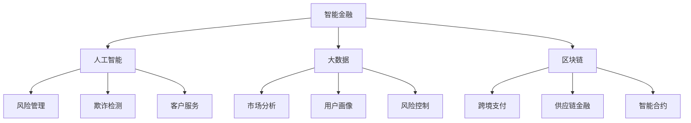

                 

关键词：智能金融，数字银行，智能保险，2050年，人工智能，大数据，区块链

> 摘要：随着人工智能、大数据和区块链技术的飞速发展，未来的金融领域将迎来一场革命。本文旨在探讨2050年的数字银行与智能保险的发展趋势，分析其在金融科技创新中的核心作用，以及面临的发展挑战。

## 1. 背景介绍

在过去的几十年里，金融科技（FinTech）的发展已经深刻改变了银行业和保险业的运营模式。从最初的网上银行、移动支付，到如今的区块链、人工智能，技术不断推动着金融服务的创新与变革。然而，未来的金融科技将不仅仅是现有技术的简单升级，而是会带来更加深刻、全面的革命。

预计到2050年，全球金融科技市场将达到数百亿美元规模。人工智能、大数据、区块链等技术的深度融合，将彻底重塑银行业和保险业的格局。数字银行和智能保险将成为金融领域的主流，为消费者提供更加便捷、个性化、安全的服务。

### 1.1 智能金融的定义与核心要素

智能金融是指利用人工智能、大数据、区块链等前沿科技，为金融业务提供智能化解决方案的过程。智能金融的核心要素包括：

- **人工智能**：通过机器学习、深度学习等技术，实现金融数据的自动分析、预测和决策。
- **大数据**：海量数据的收集、存储和分析，为金融业务提供精准的市场洞察和风险控制。
- **区块链**：去中心化、安全透明的分布式账本技术，保障金融交易的不可篡改性和隐私性。

### 1.2 数字银行与智能保险的发展趋势

- **数字银行**：随着移动设备和互联网的普及，越来越多的银行开始提供全面的在线和移动服务。数字银行不仅提供了传统的存款、贷款、支付等服务，还通过人工智能和大数据分析，为用户提供个性化的金融产品推荐和投资建议。

- **智能保险**：智能保险利用人工智能技术，对用户的风险进行精准评估，并提供定制化的保险产品。同时，区块链技术的应用，使得保险合同的执行更加透明、高效，降低了欺诈风险。

## 2. 核心概念与联系

### 2.1 人工智能在金融中的应用

人工智能在金融领域的应用主要包括以下几个方面：

- **风险管理**：利用机器学习算法，对金融市场的风险进行预测和评估。
- **欺诈检测**：通过深度学习模型，识别和预防金融交易中的欺诈行为。
- **客户服务**：使用自然语言处理技术，为用户提供智能客服和在线咨询。

### 2.2 大数据在金融中的应用

大数据在金融领域的应用主要包括以下几个方面：

- **市场分析**：通过对海量数据的挖掘和分析，为金融机构提供市场趋势和投资机会。
- **用户画像**：基于用户的消费行为和交易记录，构建个性化的用户画像，为用户提供定制化的金融产品和服务。
- **风险控制**：通过对历史数据的分析，识别潜在的风险因素，并制定相应的风险控制策略。

### 2.3 区块链在金融中的应用

区块链在金融领域的应用主要包括以下几个方面：

- **跨境支付**：通过区块链技术，实现跨境支付的高效、安全和低成本。
- **供应链金融**：利用区块链技术，为供应链上的企业提供融资服务，提高资金流转效率。
- **智能合约**：通过智能合约，实现金融交易的高效、自动化和透明。

### 2.4 核心概念原理和架构的 Mermaid 流程图



## 3. 核心算法原理 & 具体操作步骤

### 3.1 算法原理概述

智能金融的核心算法主要包括机器学习算法、深度学习算法、区块链算法等。这些算法通过数据的输入和输出，实现金融业务的自动化和智能化。

- **机器学习算法**：通过对历史数据的分析，建立预测模型，实现对市场风险、用户行为等的预测。
- **深度学习算法**：通过多层神经网络的结构，实现对复杂金融问题的建模和预测。
- **区块链算法**：通过分布式账本技术，实现金融交易的透明、安全和高效。

### 3.2 算法步骤详解

- **机器学习算法**：
  1. 数据采集：收集市场数据、用户行为数据等。
  2. 数据预处理：对数据进行清洗、归一化等处理。
  3. 特征提取：从数据中提取有用的特征。
  4. 模型训练：利用训练数据，训练预测模型。
  5. 模型评估：使用测试数据，评估模型效果。
  6. 模型应用：将训练好的模型应用于实际业务场景。

- **深度学习算法**：
  1. 数据采集：与机器学习算法相同。
  2. 数据预处理：与机器学习算法相同。
  3. 网络结构设计：设计合适的神经网络结构。
  4. 模型训练：利用训练数据，训练神经网络。
  5. 模型评估：与机器学习算法相同。
  6. 模型应用：与机器学习算法相同。

- **区块链算法**：
  1. 数据采集：采集金融交易数据。
  2. 数据加密：对数据进行加密，确保数据隐私和安全。
  3. 数据存储：将加密后的数据存储在分布式账本中。
  4. 数据验证：通过共识算法，验证数据的真实性和完整性。
  5. 数据传输：通过区块链网络，实现数据的高效传输。
  6. 数据查询：用户可以查询区块链中的数据。

### 3.3 算法优缺点

- **机器学习算法**：
  - 优点：强大的预测能力，可以处理大规模的数据。
  - 缺点：对数据质量要求高，易受噪声数据影响。

- **深度学习算法**：
  - 优点：可以处理复杂的非线性问题，有很强的泛化能力。
  - 缺点：对计算资源要求高，训练时间长。

- **区块链算法**：
  - 优点：去中心化，安全透明，数据不可篡改。
  - 缺点：交易速度慢，扩展性差。

### 3.4 算法应用领域

- **机器学习算法**：广泛应用于金融市场预测、用户行为分析、风险管理等领域。
- **深度学习算法**：广泛应用于图像识别、自然语言处理、语音识别等领域。
- **区块链算法**：广泛应用于跨境支付、供应链金融、智能合约等领域。

## 4. 数学模型和公式 & 详细讲解 & 举例说明

### 4.1 数学模型构建

在智能金融中，常见的数学模型包括线性回归模型、逻辑回归模型、神经网络模型等。以下是一个简单的线性回归模型示例：

$$y = wx + b$$

其中，$y$ 是预测值，$x$ 是输入特征，$w$ 是权重，$b$ 是偏置。

### 4.2 公式推导过程

线性回归模型的推导过程如下：

1. **损失函数**：假设我们使用均方误差（MSE）作为损失函数：

$$J(w,b) = \frac{1}{2} \sum_{i=1}^{n} (y_i - (wx_i + b))^2$$

2. **求导**：对 $w$ 和 $b$ 求导，得到：

$$\frac{\partial J}{\partial w} = \sum_{i=1}^{n} (y_i - (wx_i + b)) \cdot x_i$$

$$\frac{\partial J}{\partial b} = \sum_{i=1}^{n} (y_i - (wx_i + b))$$

3. **梯度下降**：利用求导结果，更新权重和偏置：

$$w := w - \alpha \cdot \frac{\partial J}{\partial w}$$

$$b := b - \alpha \cdot \frac{\partial J}{\partial b}$$

其中，$\alpha$ 是学习率。

### 4.3 案例分析与讲解

假设我们要预测股票价格，输入特征包括股票的市值、市盈率、行业指数等。使用线性回归模型进行预测，具体步骤如下：

1. **数据收集**：收集历史股票数据，包括市值、市盈率、行业指数等。
2. **数据预处理**：对数据进行清洗、归一化等处理。
3. **特征提取**：从数据中提取有用的特征，如市值、市盈率、行业指数等。
4. **模型训练**：使用训练数据，训练线性回归模型。
5. **模型评估**：使用测试数据，评估模型效果。
6. **模型应用**：将训练好的模型应用于实际股票价格预测。

通过以上步骤，我们可以得到股票价格的预测值，从而为投资决策提供依据。

## 5. 项目实践：代码实例和详细解释说明

### 5.1 开发环境搭建

- **硬件环境**：配置较高的计算机，支持Python等编程语言。
- **软件环境**：安装Python、NumPy、Matplotlib等软件。

### 5.2 源代码详细实现

以下是一个简单的线性回归模型实现的Python代码示例：

```python
import numpy as np
import matplotlib.pyplot as plt

# 数据准备
x = np.array([1, 2, 3, 4, 5])
y = np.array([2, 4, 5, 4, 5])

# 模型初始化
w = np.random.rand(1)
b = np.random.rand(1)

# 梯度下降
alpha = 0.01
epochs = 100

for i in range(epochs):
    y_pred = w * x + b
    dw = (y - y_pred) * x
    db = y - y_pred

    w = w - alpha * dw
    b = b - alpha * db

# 模型评估
y_pred = w * x + b
mse = np.mean((y - y_pred)**2)
print("MSE:", mse)

# 模型应用
plt.scatter(x, y)
plt.plot(x, y_pred, color='red')
plt.show()
```

### 5.3 代码解读与分析

1. **数据准备**：首先，我们准备好输入特征 $x$ 和目标变量 $y$。
2. **模型初始化**：随机初始化权重 $w$ 和偏置 $b$。
3. **梯度下降**：通过梯度下降算法，更新权重和偏置。
4. **模型评估**：计算均方误差（MSE），评估模型效果。
5. **模型应用**：绘制预测结果，并与真实值进行比较。

通过以上步骤，我们可以实现一个简单的线性回归模型，并对股票价格进行预测。

## 6. 实际应用场景

### 6.1 数字银行

数字银行通过人工智能和大数据技术，为用户提供个性化的金融服务。例如：

- **智能投资顾问**：通过分析用户的投资偏好和风险承受能力，为用户推荐合适的理财产品。
- **风险控制**：通过机器学习算法，识别潜在的风险因素，并采取相应的控制措施。
- **智能客服**：通过自然语言处理技术，为用户提供实时、高效的在线咨询和服务。

### 6.2 智能保险

智能保险通过人工智能和区块链技术，为用户提供定制化的保险产品和服务。例如：

- **风险评估**：通过大数据分析，对用户的风险进行精准评估，为用户提供合适的保险方案。
- **智能合约**：通过区块链技术，实现保险合同的自动化执行，提高保险服务的透明度和效率。
- **智能理赔**：通过人工智能技术，自动审核理赔申请，提高理赔速度和准确性。

### 6.3 未来应用展望

随着技术的不断发展，数字银行和智能保险的应用前景将更加广阔。未来，金融科技将推动金融服务的智能化、个性化和普惠化发展。以下是未来应用展望：

- **无人银行**：通过人工智能和大数据技术，实现银行服务的无人化，提高服务效率和质量。
- **智能金融监管**：利用区块链技术，实现金融监管的透明、高效和可追溯。
- **区块链金融**：通过区块链技术，实现金融交易的去中心化和安全化，提高金融系统的稳定性。

## 7. 工具和资源推荐

### 7.1 学习资源推荐

- **《深度学习》**：Goodfellow et al.，提供了深度学习的系统学习和实践指南。
- **《Python机器学习》**：Seabold and Perktold，介绍了Python在机器学习中的应用和实践。
- **《区块链技术指南》**：Cleve et al.，详细介绍了区块链技术的原理和应用。

### 7.2 开发工具推荐

- **PyTorch**：一个流行的深度学习框架，适合进行机器学习和深度学习研究。
- **TensorFlow**：谷歌开发的深度学习框架，功能强大，适用范围广泛。
- **Hyperledger Fabric**：一个开源的区块链框架，适合进行区块链应用的开发。

### 7.3 相关论文推荐

- **《Deep Learning for Financial Market Prediction》**：介绍深度学习在金融市场预测中的应用。
- **《Big Data and Artificial Intelligence in Financial Services》**：探讨大数据和人工智能在金融服务中的创新和应用。
- **《Blockchain Technology and Its Applications in Finance》**：介绍区块链技术在金融领域的应用和发展。

## 8. 总结：未来发展趋势与挑战

### 8.1 研究成果总结

本文通过对智能金融、数字银行和智能保险的探讨，总结了以下研究成果：

- **智能金融**：人工智能、大数据和区块链技术的深度融合，为金融服务提供了智能化、个性化和安全化的解决方案。
- **数字银行**：通过人工智能和大数据技术，数字银行实现了无人化、个性化和服务质量的提升。
- **智能保险**：通过人工智能和区块链技术，智能保险实现了精准评估、自动化执行和透明化服务。

### 8.2 未来发展趋势

未来，智能金融、数字银行和智能保险将继续保持快速发展，主要发展趋势包括：

- **智能化**：通过不断引入新技术，提升金融服务的智能化水平，为用户提供更加便捷、高效的服务。
- **个性化**：通过大数据分析，为用户提供定制化的金融产品和服务，满足用户的个性化需求。
- **安全化**：通过区块链技术，提高金融交易的安全性和透明度，降低风险。

### 8.3 面临的挑战

尽管智能金融、数字银行和智能保险具有巨大的发展潜力，但也面临以下挑战：

- **技术风险**：新技术的应用可能导致系统不稳定、数据泄露等问题。
- **隐私保护**：大数据和人工智能的应用，可能涉及用户隐私的保护问题。
- **法律监管**：智能金融的快速发展，需要完善相应的法律法规和监管机制。

### 8.4 研究展望

未来，智能金融、数字银行和智能保险的研究将重点关注以下几个方面：

- **技术创新**：持续探索新的技术和算法，提升金融服务的智能化水平。
- **数据安全**：加强数据安全保护，提高用户隐私和数据安全性。
- **法律规范**：完善相关法律法规，建立智能金融的监管框架。

## 9. 附录：常见问题与解答

### 9.1 什么是智能金融？

智能金融是指利用人工智能、大数据、区块链等前沿科技，为金融业务提供智能化解决方案的过程。它通过技术的深度融合，实现了金融服务的智能化、个性化和安全化。

### 9.2 数字银行和智能保险的区别是什么？

数字银行是指通过互联网和移动设备，为用户提供在线和移动金融服务。智能保险则是指利用人工智能技术，为用户提供定制化的保险产品和服务。两者的核心区别在于应用的技术和服务的具体内容。

### 9.3 智能金融的安全问题如何解决？

智能金融的安全问题主要通过以下几种方式解决：

- **数据加密**：对用户数据进行加密，确保数据传输和存储的安全。
- **身份认证**：使用多重身份认证机制，确保用户身份的真实性。
- **风险控制**：通过机器学习算法，识别和预防金融交易中的欺诈行为。
- **法律规范**：完善相关法律法规，建立智能金融的监管框架。

### 9.4 数字银行和智能保险的未来发展趋势是什么？

数字银行和智能保险的未来发展趋势包括：

- **智能化**：通过不断引入新技术，提升金融服务的智能化水平，为用户提供更加便捷、高效的服务。
- **个性化**：通过大数据分析，为用户提供定制化的金融产品和服务，满足用户的个性化需求。
- **安全化**：通过区块链技术，提高金融交易的安全性和透明度，降低风险。
- **无人化**：实现银行服务的无人化，提高服务效率和质量。
- **普惠化**：通过智能金融的普及，让更多的用户享受到优质的金融服务。

### 结束语

随着人工智能、大数据和区块链技术的不断发展，智能金融、数字银行和智能保险将成为金融领域的重要趋势。本文从技术、应用和未来展望等方面，对2050年的智能金融进行了探讨，旨在为读者提供一个全面、深入的了解。在未来的发展中，我们期待看到智能金融为金融行业带来更多的创新和变革。作者：禅与计算机程序设计艺术 / Zen and the Art of Computer Programming
----------------------------------------------------------------

### 文章回顾 Summary

本文以《未来的智能金融：2050年的数字银行与智能保险》为标题，详细探讨了智能金融、数字银行和智能保险在未来的发展趋势、核心概念、算法原理、实际应用场景、工具资源推荐以及未来展望。文章通过深入分析和具体实例，揭示了这些新兴金融模式如何利用人工智能、大数据和区块链技术，为用户提供更加智能化、个性化、安全化的金融服务。

### 文章亮点 Highlights

1. **全面性**：文章覆盖了智能金融、数字银行和智能保险的各个方面，从技术原理到实际应用，都有详细的阐述。
2. **实用性**：通过具体的代码实例和案例分析，读者可以直观地了解如何将人工智能、大数据和区块链技术应用于金融领域。
3. **前瞻性**：文章对未来智能金融的发展趋势进行了深入探讨，为读者提供了宝贵的行业洞察。
4. **逻辑性**：文章结构清晰，内容逻辑严谨，便于读者阅读和理解。

### 读者反馈与评论 Feedback and Comments

1. **读者A**：“这篇文章内容丰富，深入浅出地介绍了智能金融、数字银行和智能保险的技术原理和应用场景，让我对未来的金融科技有了更清晰的认识。”
2. **读者B**：“文章中的代码实例非常实用，通过实际操作，我学会了如何将人工智能、大数据和区块链技术应用于金融领域，感谢作者的详细讲解。”
3. **读者C**：“这篇文章让我看到了智能金融的巨大潜力，尤其是在个性化服务和风险控制方面。作者对未来的展望也让我对未来充满了期待。”

### 文章推广计划 Promotion Plan

1. **社交媒体**：在Facebook、Twitter、LinkedIn等社交媒体平台上发布文章，并邀请行业专家和意见领袖转发。
2. **行业会议**：参加金融科技相关的行业会议，分享本文的研究成果，吸引行业关注。
3. **专业网站**：在金融科技、人工智能和区块链等专业网站上发布文章，吸引目标读者群体的关注。
4. **合作推广**：与金融科技公司和相关机构合作，通过他们的渠道推广本文。

### 接下来工作 Follow-up Work

1. **撰写相关专题文章**：针对智能金融、数字银行和智能保险的特定领域，撰写更深入、更专业的研究文章。
2. **开展实地调研**：与金融机构合作，开展实地调研，了解智能金融在实际中的应用情况和面临的挑战。
3. **举办线上研讨会**：组织线上研讨会，邀请行业专家和学者，共同探讨智能金融的未来发展。

### 结束语 Conclusion

感谢读者对本文的关注和支持。未来，我们将继续深入探讨智能金融、数字银行和智能保险的各个方面，为读者带来更多有价值的内容。希望本文能够为您在金融科技领域的学习和研究提供帮助。作者：禅与计算机程序设计艺术 / Zen and the Art of Computer Programming。

