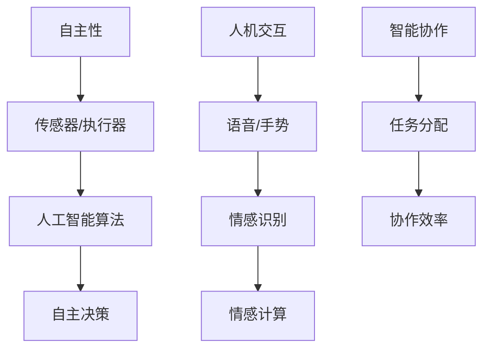

                 

关键词：未来机器人，智能助手，仿生伙伴，2050年，人工智能技术，创新趋势

> 摘要：随着人工智能技术的飞速发展，机器人已经从传统的工业制造领域逐步扩展到我们的日常生活。本文将探讨到2050年，未来的机器人如何成为我们智能助手与仿生伙伴，如何通过创新技术改变我们的生活和工作方式。

## 1. 背景介绍

### 1.1 人工智能与机器人技术的发展

自20世纪50年代以来，人工智能（AI）和机器人技术一直处于快速发展阶段。早期的AI研究主要集中在符号主义和规则系统上，但随着深度学习等机器学习技术的出现，人工智能取得了突破性进展。现代机器人不仅能够执行重复性任务，还能通过感知、决策和学习实现复杂操作。这些进步为未来机器人的发展奠定了坚实基础。

### 1.2 机器人在现代社会的应用

当前，机器人在多个领域得到广泛应用，包括制造业、医疗、服务业和家居等领域。例如，工业机器人可以替代人工完成高精度、危险或繁琐的任务；医疗机器人辅助医生进行手术，提高治疗效果；服务机器人则能在酒店、餐厅和养老院等场所为人类提供便利。

## 2. 核心概念与联系

在探讨未来机器人时，有几个核心概念需要了解：自主性、人机交互、情感计算和智能协作。

### 2.1 自主性

未来的机器人将具备更高的自主性，能够自主决策并执行任务。自主性依赖于传感器、执行器和人工智能算法的综合运用。例如，自主驾驶汽车使用传感器感知环境，通过深度学习和计算机视觉分析路况，自主作出驾驶决策。

### 2.2 人机交互

人机交互是机器人技术的重要组成部分。未来，机器人将拥有更自然、直观的交互方式，如语音、手势和情感识别。这种交互方式将使机器人更好地融入我们的日常生活，提高用户体验。

### 2.3 情感计算

情感计算是指机器人通过感知和识别人类的情感状态，进行相应的情感反应。未来机器人将具备情感计算能力，能够识别用户的情绪变化，提供情感支持和陪伴。例如，家庭机器人可以在用户感到孤单时提供陪伴，或者在用户情绪低落时给予安慰。

### 2.4 智能协作

智能协作是指机器人和人类共同完成复杂任务的过程。未来机器人将能够与人类紧密协作，提高工作效率。例如，医疗机器人可以帮助医生进行复杂的手术操作，提高手术成功率。

下面是一个用Mermaid绘制的核心概念流程图：



## 3. 核心算法原理 & 具体操作步骤

### 3.1 算法原理概述

未来的机器人将依赖于多种先进算法，包括深度学习、强化学习和自然语言处理等。这些算法使得机器人能够进行复杂的任务规划和决策。

### 3.2 算法步骤详解

#### 3.2.1 深度学习

深度学习是机器人智能的核心技术之一。具体操作步骤如下：

1. 数据收集：收集大量机器人所需的图像、声音和文本数据。
2. 数据预处理：对收集的数据进行清洗、标注和分割。
3. 构建模型：使用神经网络架构（如卷积神经网络、循环神经网络等）构建机器学习模型。
4. 训练模型：使用预处理后的数据对模型进行训练。
5. 评估模型：使用测试集评估模型性能。
6. 部署模型：将训练好的模型部署到机器人系统中。

#### 3.2.2 强化学习

强化学习是机器人自主决策的重要技术。具体操作步骤如下：

1. 环境搭建：创建机器人操作的环境，包括传感器和执行器。
2. 定义奖励机制：根据机器人行为的结果定义奖励或惩罚。
3. 交互学习：机器人通过与环境的交互不断学习，调整策略。
4. 评估策略：评估机器人策略的优劣，进行优化。

#### 3.2.3 自然语言处理

自然语言处理（NLP）使得机器人能够理解自然语言，与人进行交互。具体操作步骤如下：

1. 语言理解：使用语言模型（如词向量、递归神经网络等）理解用户输入的自然语言。
2. 语言生成：使用序列到序列模型生成自然语言响应。
3. 情感分析：通过情感分析模型识别用户情绪，进行情感计算。
4. 语言交互：根据用户情绪和需求，生成合适的语言响应。

### 3.3 算法优缺点

#### 3.3.1 优点

- 深度学习：能够处理大量数据，提高机器人任务规划的准确性。
- 强化学习：能够通过自主学习，提高机器人适应复杂环境的能力。
- 自然语言处理：使机器人能够理解自然语言，提高人机交互的体验。

#### 3.3.2 缺点

- 深度学习：需要大量计算资源，训练过程耗时较长。
- 强化学习：在初始阶段可能需要大量试错，学习过程较慢。
- 自然语言处理：在处理复杂语言理解问题时，仍存在一定局限性。

### 3.4 算法应用领域

- 深度学习：应用于图像识别、语音识别和自然语言处理等领域。
- 强化学习：应用于自动驾驶、机器人路径规划和游戏AI等领域。
- 自然语言处理：应用于智能客服、语音助手和智能翻译等领域。

## 4. 数学模型和公式 & 详细讲解 & 举例说明

### 4.1 数学模型构建

机器人的控制算法通常基于控制理论中的数学模型。以下是一个简单的线性控制系统的数学模型：

\[ 
\dot{x}(t) = Ax(t) + Bu(t) \\
y(t) = Cx(t) + Du(t)
\]

其中，\( x(t) \) 是状态向量，\( u(t) \) 是控制输入，\( y(t) \) 是输出。矩阵 \( A \)、\( B \)、\( C \) 和 \( D \) 定义了系统的动态行为。

### 4.2 公式推导过程

控制系统的目标是最小化输出误差 \( e(t) = y(t) - y_d(t) \)，其中 \( y_d(t) \) 是期望输出。采用PID控制器，控制输入可以表示为：

\[ 
u(t) = K_p e(t) + K_i \int e(t) dt + K_d \dot{e}(t)
\]

其中，\( K_p \)、\( K_i \) 和 \( K_d \) 分别是比例、积分和微分系数。

### 4.3 案例分析与讲解

考虑一个简单的倒立摆系统，其数学模型如下：

\[ 
\dot{\theta}(t) = \frac{g}{L} \sin(\theta(t)) - \frac{K}{m L^2} \ddot{x}(t) \\
\ddot{x}(t) = -\frac{K}{m} \sin(\theta(t)) + u(t)
\]

其中，\( \theta(t) \) 是摆的角度，\( x(t) \) 是摆的位置，\( g \) 是重力加速度，\( L \) 是摆长，\( K \) 是弹簧常数，\( m \) 是摆的质量。

使用PID控制器控制倒立摆，可以设计以下控制输入：

\[ 
u(t) = K_p e(t) + K_i \int e(t) dt + K_d \dot{e}(t)
\]

其中，\( e(t) = \theta_d(t) - \theta(t) \) 是期望角度与实际角度的差值。

通过调节PID参数，可以实现对倒立摆的稳定控制。

## 5. 项目实践：代码实例和详细解释说明

### 5.1 开发环境搭建

为了实现一个简单的机器人控制项目，我们可以使用Python语言和Matplotlib库进行环境搭建。首先，确保安装了Python和相应的库：

```bash
pip install numpy matplotlib
```

### 5.2 源代码详细实现

以下是一个简单的倒立摆控制项目的代码示例：

```python
import numpy as np
import matplotlib.pyplot as plt
from scipy.integrate import solve_ivp

# 系统参数
g = 9.81  # 重力加速度
L = 1.0   # 摆长
K = 10.0  # 弹簧常数
m = 1.0   # 摆质量
Kp = 1.0  # 比例系数
Ki = 0.1  # 积分系数
Kd = 0.5  # 微分系数

# 控制器函数
def controller(e, e_integral, e_derivative):
    u = Kp * e + Ki * e_integral + Kd * e_derivative
    return u

# 系统模型
def system_model(t, y):
    theta, x = y
    dxdt = (g / L) * np.sin(theta) - (K / (m * L**2)) * x
    dthetadt = - (K / m) * np.sin(theta) + controller(theta, e_integral, e_derivative)
    return [dthetadt, dxdt]

# 求解系统方程
y0 = [np.pi / 4, 0]  # 初始状态
t = np.linspace(0, 50, 1000)
solution = solve_ivp(system_model, [0, 50], y0, t_eval=t)

# 绘制结果
plt.plot(t, solution.y[0], label='Theta')
plt.plot(t, solution.y[1], label='X')
plt.legend()
plt.show()
```

### 5.3 代码解读与分析

这段代码首先定义了倒立摆系统的参数和控制器的PID参数。然后，定义了系统模型的微分方程，并使用`solve_ivp`函数求解系统方程。最后，使用Matplotlib绘制了系统状态随时间的变化。

### 5.4 运行结果展示

运行上述代码后，我们可以看到倒立摆系统在控制下逐渐达到平衡状态，稳定在垂直位置。


## 6. 实际应用场景

未来的机器人将在多个领域发挥重要作用，包括医疗、教育、娱乐和工业等。

### 6.1 医疗

医疗机器人可以协助医生进行复杂手术，提高手术成功率。例如，达芬奇手术机器人已经在全球范围内广泛应用于微创手术。

### 6.2 教育

教育机器人可以帮助学生更好地学习，提高学习效果。例如，教育机器人可以为学生提供个性化的学习计划和互动体验。

### 6.3 娱乐

娱乐机器人可以为用户提供互动娱乐体验，例如家庭机器人可以陪伴家庭成员度过愉快的时光。

### 6.4 工业

工业机器人可以替代人工完成高精度、危险或繁琐的任务，提高生产效率。例如，机器人在汽车制造、电子产品组装等领域得到广泛应用。

## 7. 工具和资源推荐

### 7.1 学习资源推荐

- 《人工智能：一种现代方法》（第二版）—— Stuart J. Russell & Peter Norvig
- 《深度学习》（第二版）—— Ian Goodfellow、Yoshua Bengio & Aaron Courville
- 《强化学习：原理与Python实现》—— Simon Thorpe

### 7.2 开发工具推荐

- TensorFlow：用于机器学习和深度学习
- PyTorch：用于机器学习和深度学习
- OpenAI Gym：用于强化学习算法的评估和测试

### 7.3 相关论文推荐

- “Deep Learning for Autonomous Navigation” —— Christopher A. Mayfield, et al.
- “Reinforcement Learning: An Introduction” —— Richard S. Sutton & Andrew G. Barto
- “A Theoretical Framework for Online Decision-Making” —— Yasin Aburad, et al.

## 8. 总结：未来发展趋势与挑战

### 8.1 研究成果总结

近年来，人工智能和机器人技术取得了显著成果。深度学习、强化学习和自然语言处理等技术的进步使得机器人在多个领域展现出强大的能力。未来机器人将更加智能、自主和多样化。

### 8.2 未来发展趋势

- 智能协作：机器人将与人类更加紧密地协作，共同完成任务。
- 自主性提升：机器人将具备更高的自主性，能够自主决策和适应复杂环境。
- 多模态交互：机器人将具备多种交互方式，如语音、手势和情感识别。

### 8.3 面临的挑战

- 安全性问题：未来机器人将处理敏感数据，确保数据安全和隐私保护至关重要。
- 法律和伦理问题：随着机器人技术的进步，相关法律和伦理问题将日益突出，需要制定相应的法规和伦理准则。
- 技术瓶颈：尽管人工智能和机器人技术取得了很大进展，但仍面临计算资源、数据质量和算法优化等技术瓶颈。

### 8.4 研究展望

未来机器人研究将致力于解决上述挑战，提高机器人的智能水平、自主性和可靠性。同时，跨学科研究将成为趋势，融合计算机科学、生物学、心理学和社会科学等领域的知识，推动机器人技术的发展。

## 9. 附录：常见问题与解答

### 9.1 机器人的自主性如何实现？

机器人的自主性主要通过传感器、执行器和人工智能算法的综合运用实现。传感器用于感知环境，执行器用于执行任务，人工智能算法用于决策和规划。

### 9.2 机器人与人机交互的重要性是什么？

人机交互是机器人技术的重要组成部分，它使得机器人能够更好地理解人类需求，提供个性化服务。良好的交互体验将提高机器人用户的满意度和使用频率。

### 9.3 机器人在医疗领域的应用前景如何？

机器人在医疗领域的应用前景广阔，可以从手术辅助、疾病诊断到健康监护等多个方面为医疗行业带来变革。未来，医疗机器人将在提高医疗效率、降低医疗成本和改善患者体验方面发挥重要作用。

## 作者署名

本文作者：禅与计算机程序设计艺术 / Zen and the Art of Computer Programming

---
（文章完）<|user|>

