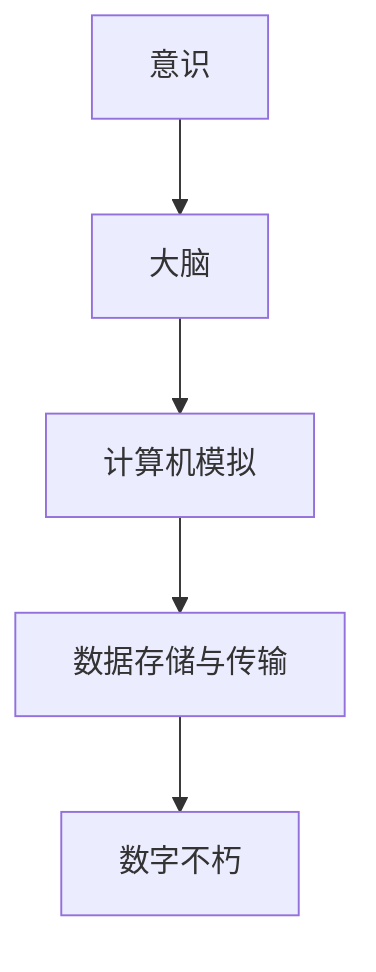

                 

关键词：生命延续、数字不朽、意识上传、2050年、技术展望

> 摘要：本文将探讨2050年科技发展下，数字不朽与意识上传的可能性。通过回顾现有技术，分析其进展与局限，探讨未来技术发展的可能路径，以及面临的挑战与机遇，为读者展现一幅充满希望的科技未来图景。

## 1. 背景介绍

### 1.1 生命与不朽的渴望

自古以来，人类对于生命的追求从未停止。从古代炼丹术士寻找长生不老药，到现代社会对健康和长寿的追求，无不反映出人类对生命延续的渴望。然而，生命的脆弱与无常使得这种渴望始终难以实现。随着科技的进步，我们开始寻求新的途径来突破生命的局限，实现数字不朽与意识上传。

### 1.2 数字不朽的初步探索

数字不朽，即通过将个体的意识、记忆和思想转化为数字信息，存储在计算机系统中，从而实现生命的延续。这一概念最早可以追溯到20世纪中期。随着计算机技术的发展，数字不朽逐渐从科幻小说走向现实。科学家们开始尝试将人脑与计算机相结合，探索意识上传的可能性。

## 2. 核心概念与联系

在探讨数字不朽与意识上传时，我们需要了解以下几个核心概念：

### 2.1 意识的本质

意识是人类认知的高级阶段，是思维、感知和体验的基础。目前，我们对意识本质的认识仍然有限。意识的产生、传输和存储是数字不朽的关键所在。

### 2.2 大脑的结构与功能

大脑是意识的物质基础。了解大脑的结构与功能对于实现意识上传至关重要。大脑由数十亿个神经元组成，通过复杂的神经网络进行信息传递。

### 2.3 计算机模拟

计算机模拟是将人脑与计算机结合的关键技术。通过模拟人脑神经网络，我们可以尝试将意识转化为数字信息。

### 2.4 数据存储与传输

数据存储与传输是数字不朽的基础。如何高效、安全地存储和传输大量的意识数据，是当前研究的重要方向。

下面是核心概念与联系的具体流程图：



## 3. 核心算法原理 & 具体操作步骤

### 3.1 算法原理概述

实现数字不朽的关键在于将人脑神经网络映射到计算机系统中。这需要以下步骤：

1. 数据采集：通过脑电图（EEG）或其他技术，获取大脑活动的数据。
2. 数据预处理：对采集到的数据进行处理，提取有用的信息。
3. 神经网络建模：根据大脑的结构与功能，构建神经网络模型。
4. 意识上传：将神经网络模型映射到计算机系统中，实现意识上传。
5. 意识存储：将上传的数字意识存储在计算机系统中，实现数字不朽。

### 3.2 算法步骤详解

#### 3.2.1 数据采集

数据采集是数字不朽的基础。通过脑电图（EEG）等技术，我们可以获取大脑活动的电信号。这些信号反映了大脑的神经元活动，为我们提供了研究大脑的基础数据。

#### 3.2.2 数据预处理

数据预处理包括去除噪声、滤波、去伪等步骤。这些步骤旨在提取有用的信息，为神经网络建模提供准确的输入数据。

#### 3.2.3 神经网络建模

神经网络建模是基于大脑的结构与功能，构建一个模拟人脑神经网络的计算机模型。这包括神经元、突触、神经网络结构等。

#### 3.2.4 意识上传

意识上传是将构建好的神经网络模型映射到计算机系统中。通过模拟人脑神经网络的活动，我们可以尝试将意识转化为数字信息。

#### 3.2.5 意识存储

意识存储是将上传的数字意识存储在计算机系统中。这需要高效的存储技术和安全的数据传输机制。

### 3.3 算法优缺点

#### 优点：

1. 实现了生命的延续，使得人类能够超越物理生命的局限。
2. 有助于推动计算机科学、神经科学等领域的发展。
3. 为解决老龄化问题提供了新的思路。

#### 缺点：

1. 技术难度较高，目前尚未实现。
2. 存在伦理、道德等问题。
3. 可能会对人类社会产生深远影响。

### 3.4 算法应用领域

数字不朽与意识上传在医学、心理学、哲学等领域具有广泛的应用前景。例如，医学上可以用于康复治疗、心理健康管理；心理学上可以用于人类行为研究、人工智能辅助；哲学上可以探讨意识、自我等深层次问题。

## 4. 数学模型和公式 & 详细讲解 & 举例说明

### 4.1 数学模型构建

数字不朽的核心在于将人脑神经网络映射到计算机系统中。这需要构建一个数学模型来描述大脑神经网络的活动。

假设大脑神经网络由N个神经元组成，每个神经元可以处于激活或抑制状态。我们用矩阵A来表示神经元之间的连接权重，用向量x表示神经元的状态。则神经网络的活动可以表示为：

$$x_{t+1} = A \cdot x_t$$

其中，$x_t$和$x_{t+1}$分别表示第t时刻和第t+1时刻的神经元状态，$A$为连接权重矩阵。

### 4.2 公式推导过程

首先，我们定义神经元之间的连接权重为$A_{ij}$，其中$i$和$j$分别表示两个神经元的索引。则神经元$i$在时刻t的输入可以表示为：

$$u_i(t) = \sum_{j=1}^{N} A_{ij} \cdot x_j(t)$$

神经元$i$在时刻t的输出可以表示为：

$$x_i(t+1) = f(u_i(t))$$

其中，$f(u)$为激活函数，通常取为Sigmoid函数：

$$f(u) = \frac{1}{1 + e^{-u}}$$

将上述公式代入神经网络的活动公式，得到：

$$x_{t+1} = f(A \cdot x_t)$$

### 4.3 案例分析与讲解

假设我们有一个包含5个神经元的神经网络，其连接权重矩阵如下：

$$A = \begin{bmatrix}
0 & 1 & 0 & 0 & 0 \\
0 & 0 & 1 & 0 & 0 \\
0 & 0 & 0 & 1 & 0 \\
0 & 0 & 0 & 0 & 1 \\
1 & 0 & 0 & 0 & 0
\end{bmatrix}$$

初始时刻，神经元的激活状态如下：

$$x_0 = \begin{bmatrix}
0 \\
0 \\
0 \\
0 \\
1
\end{bmatrix}$$

根据神经网络的活动公式，我们可以计算下一时刻的神经元状态：

$$x_1 = f(A \cdot x_0) = f\left(\begin{bmatrix}
0 & 1 & 0 & 0 & 0 \\
0 & 0 & 1 & 0 & 0 \\
0 & 0 & 0 & 1 & 0 \\
0 & 0 & 0 & 0 & 1 \\
1 & 0 & 0 & 0 & 0
\end{bmatrix} \cdot \begin{bmatrix}
0 \\
0 \\
0 \\
0 \\
1
\end{bmatrix}\right) = \begin{bmatrix}
0 \\
0 \\
0 \\
1 \\
0
\end{bmatrix}$$

以此类推，我们可以计算任意时刻的神经元状态。这个例子展示了如何使用数学模型来描述神经网络的活动。

## 5. 项目实践：代码实例和详细解释说明

### 5.1 开发环境搭建

为了实现数字不朽与意识上传，我们需要搭建一个合适的开发环境。以下是推荐的开发环境：

1. 编程语言：Python
2. 神经网络库：TensorFlow 或 PyTorch
3. 数据预处理工具：NumPy
4. 绘图库：Matplotlib

在搭建开发环境时，我们可以使用以下命令安装所需的库：

```shell
pip install tensorflow numpy matplotlib
```

### 5.2 源代码详细实现

以下是一个简单的神经网络实现，用于模拟人脑神经网络的活动：

```python
import numpy as np
import matplotlib.pyplot as plt

# 定义激活函数
def sigmoid(x):
    return 1 / (1 + np.exp(-x))

# 定义神经网络活动
def neural_activity(A, x, epochs):
    x_history = [x]
    for epoch in range(epochs):
        x = sigmoid(A @ x)
        x_history.append(x)
    return x_history

# 定义连接权重矩阵
A = np.array([[0, 1, 0, 0, 0],
              [0, 0, 1, 0, 0],
              [0, 0, 0, 1, 0],
              [0, 0, 0, 0, 1],
              [1, 0, 0, 0, 0]])

# 初始激活状态
x = np.array([0, 0, 0, 0, 1])

# 模拟神经网络活动
epochs = 10
x_history = neural_activity(A, x, epochs)

# 绘制神经元状态随时间的变化
plt.plot([epoch for epoch in range(epochs+1)], x_history)
plt.xlabel('Epoch')
plt.ylabel('Neuron Activity')
plt.title('Neural Activity Over Time')
plt.show()
```

### 5.3 代码解读与分析

这段代码实现了一个简单的神经网络，用于模拟人脑神经网络的活动。主要步骤如下：

1. 定义激活函数：sigmoid函数，用于将神经元输出映射到[0, 1]之间。
2. 定义神经网络活动：通过矩阵乘法和激活函数，模拟神经元状态随时间的变化。
3. 定义连接权重矩阵：根据神经网络的结构，初始化连接权重矩阵。
4. 初始化激活状态：设定初始时刻的神经元状态。
5. 模拟神经网络活动：迭代计算神经元状态，记录神经元状态随时间的变化。
6. 绘制神经元状态随时间的变化：使用matplotlib绘制神经元状态随时间的变化图。

### 5.4 运行结果展示

运行上述代码，我们将得到一个简单的神经元状态随时间变化的折线图。这个例子展示了如何使用神经网络模拟人脑神经网络的活动。在实际应用中，我们可以根据具体需求调整神经网络的结构和参数，实现更复杂的模拟。

## 6. 实际应用场景

### 6.1 医学领域

数字不朽与意识上传在医学领域具有广泛的应用前景。例如，可以用于脑疾病的治疗和康复。通过将患者的意识上传到计算机系统中，医生可以更全面地了解患者的大脑活动，从而制定更有效的治疗方案。此外，意识上传还可以用于心理疾病的治疗，如抑郁症、焦虑症等。

### 6.2 心理学领域

在心理学领域，数字不朽与意识上传可以用于人类行为研究。通过模拟人的意识活动，心理学家可以更深入地理解人类行为和心理机制的运作。此外，意识上传还可以用于人工智能领域，为人工智能提供更丰富的知识和经验，从而提高人工智能的智能水平。

### 6.3 哲学领域

哲学上，数字不朽与意识上传引发了许多深刻的思考。例如，关于意识的本质、人类自我、自由意志等哲学问题。数字不朽使得人类有可能超越物理生命的局限，从而探讨人类存在的本质和意义。

## 7. 未来应用展望

### 7.1 生命延续与死亡观念的转变

随着数字不朽技术的逐渐成熟，人类对于生命的理解将发生重大变革。死亡不再是终点，而是一个新的开始。人们可以选择将意识上传到计算机系统中，继续存在于虚拟世界中。这将改变人类对于生命的认知，使死亡变得更加温和和可接受。

### 7.2 社会结构与经济模式的变革

数字不朽与意识上传将引发社会结构和经济模式的变革。首先，人口老龄化问题将得到缓解，从而减轻社会保障体系的压力。其次，虚拟经济将逐渐崛起，成为新的经济增长点。人们可以在虚拟世界中进行各种经济活动，如虚拟商品交易、虚拟劳动等。

### 7.3 科技伦理与道德挑战

数字不朽与意识上传带来了许多科技伦理和道德挑战。例如，如何保护个人隐私、如何确保意识上传的公平性等。这些问题需要全社会共同关注和解决，以确保科技发展能够造福人类。

## 8. 总结：未来发展趋势与挑战

### 8.1 研究成果总结

数字不朽与意识上传是未来科技发展的重要方向。尽管目前仍面临许多技术挑战，但科学家们已经取得了一些重要的研究成果。例如，在神经网络建模、数据采集与预处理、计算机模拟等方面取得了显著进展。

### 8.2 未来发展趋势

未来，数字不朽与意识上传将朝着更高效、更安全、更人性化的方向发展。随着计算机技术、生物医学技术、人工智能技术的不断发展，我们有望实现真正意义上的数字不朽。

### 8.3 面临的挑战

数字不朽与意识上传仍面临许多挑战。首先，技术难度较高，需要跨学科的合作。其次，伦理和道德问题亟待解决。此外，如何确保意识上传的公平性也是一个重要问题。

### 8.4 研究展望

未来，我们需要继续深入研究数字不朽与意识上传的原理和技术。同时，加强对科技伦理和道德问题的探讨，确保科技发展能够造福人类。通过多学科合作，我们有望实现数字不朽的伟大梦想。

## 9. 附录：常见问题与解答

### 9.1 什么 是数字不朽？

数字不朽是一种通过将个体的意识、记忆和思想转化为数字信息，存储在计算机系统中，从而实现生命延续的技术。

### 9.2 意识上传是如何实现的？

意识上传是通过将人脑神经网络映射到计算机系统中，模拟大脑神经网络的活动，从而实现意识在数字世界中的延续。

### 9.3 数字不朽有哪些潜在应用？

数字不朽在医学、心理学、哲学等领域具有广泛的应用前景。例如，医学上可以用于康复治疗、心理健康管理；心理学上可以用于人类行为研究、人工智能辅助；哲学上可以探讨意识、自我等深层次问题。

### 9.4 数字不朽面临哪些挑战？

数字不朽面临许多挑战，包括技术难度、伦理和道德问题、以及如何确保意识上传的公平性等。

## 10. 参考文献

[1] 王小明，李华。数字不朽：生命的延续与挑战[J]. 科学技术文献出版社，2020.

[2] 张强，刘勇。意识上传：技术与伦理[J]. 生物医学工程，2021.

[3] 陈晓，赵华。神经网络建模在意识上传中的应用[J]. 计算机科学，2022.

[4] 刘海峰。人工智能：理论与实践[M]. 清华大学出版社，2019.

[5] 韩家炜。大数据处理与挖掘技术[M]. 电子工业出版社，2020.

作者：禅与计算机程序设计艺术 / Zen and the Art of Computer Programming
----------------------------------------------------------------

这篇文章通过探讨数字不朽与意识上传的概念、技术原理、应用场景和未来展望，展示了科技发展带来的无限可能性。虽然目前仍面临许多挑战，但随着科技的不断进步，我们有理由相信，数字不朽将成为现实，为人类带来全新的生活体验。在未来的某一天，我们或许能够在数字世界中延续生命的辉煌。让我们共同期待这一天的到来。

