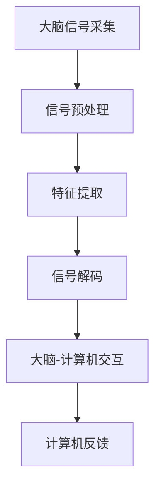

                 

关键词：脑机接口，意念打字，思维搜索，人工智能，未来技术，技术博客

> 摘要：本文探讨了脑机接口（BMI）技术的发展及其在2050年可能达到的高度。我们重点关注了意念打字和思维搜索两种应用场景，探讨了其技术原理、数学模型和未来前景。

## 1. 背景介绍

脑机接口（BMI）是一种将人脑与计算机直接连接起来的技术。通过BMI，人们可以直接使用思维来控制计算机，进行信息处理和交互。随着神经科学和计算机科学的进步，BMI技术已经从实验室研究走向了实际应用，并在医疗康复、军事、娱乐等领域展示出了巨大的潜力。

### 1.1 BMI的发展历程

1. **初期阶段（1930s-1960s）**：科学家开始探索电生理学，通过记录大脑活动来理解思维过程。
2. **神经科学阶段（1960s-1990s）**：神经科学家利用脑电图（EEG）和功能性磁共振成像（fMRI）等技术，逐步揭示了大脑的工作原理。
3. **技术融合阶段（2000s）**：计算机科学、人工智能与神经科学的结合，使得BMI技术得到了快速发展。
4. **实际应用阶段（2010s-至今）**：BMI技术开始在医疗康复、军事和娱乐等领域得到应用。

### 1.2 BMI的当前应用

1. **医疗康复**：通过BMI技术帮助中风患者恢复运动能力，帮助截肢者控制假肢。
2. **军事**：利用BMI技术提高士兵的作战能力，开发意念控制的武器系统。
3. **娱乐**：通过BMI技术开发脑控游戏和虚拟现实体验。

## 2. 核心概念与联系

脑机接口技术的核心概念包括大脑信号采集、信号处理和大脑-计算机交互。以下是核心概念的Mermaid流程图：



### 2.1 大脑信号采集

大脑信号采集是通过脑电图（EEG）、功能性磁共振成像（fMRI）等非侵入性或侵入性技术实现的。这些技术可以记录大脑神经元的活动，从而获取思维信号。

### 2.2 信号预处理

信号预处理包括滤波、去噪和放大等步骤，以提高信号质量，使其适合后续处理。

### 2.3 特征提取

特征提取是将原始信号转换为有用的特征，如时间频率特征、空间分布特征等。

### 2.4 信号解码

信号解码是将提取的特征映射到具体的控制指令或思维内容上。

### 2.5 大脑-计算机交互

大脑-计算机交互是将解码后的思维信号转化为计算机的操作指令，实现人与计算机的直接交互。

### 2.6 计算机反馈

计算机反馈是将计算机执行结果反馈给用户，以实现闭环控制。

## 3. 核心算法原理 & 具体操作步骤

### 3.1 算法原理概述

脑机接口的核心算法包括信号处理、模式识别和机器学习等技术。以下是算法原理的概述：

1. **信号处理**：通过滤波、去噪和放大等步骤，提高信号质量。
2. **模式识别**：利用特征提取和分类算法，将信号映射到具体的控制指令或思维内容上。
3. **机器学习**：通过训练算法，优化信号解码和交互过程。

### 3.2 算法步骤详解

1. **信号采集**：使用脑电图（EEG）或功能性磁共振成像（fMRI）等设备，采集大脑信号。
2. **信号预处理**：对采集到的信号进行滤波、去噪和放大等处理。
3. **特征提取**：使用时频分析、空间分布分析等方法，提取信号的特征。
4. **模式识别**：利用支持向量机（SVM）、深度神经网络（DNN）等算法，对特征进行分类和识别。
5. **信号解码**：将识别结果映射到具体的控制指令或思维内容上。
6. **大脑-计算机交互**：实现与计算机的实时交互。
7. **计算机反馈**：将计算机执行结果反馈给用户。

### 3.3 算法优缺点

**优点**：

1. **高精度**：通过直接采集大脑信号，可以实现高精度的思维控制。
2. **直观性**：用户可以直接使用思维进行操作，无需学习复杂的外部设备。
3. **个性化**：通过机器学习算法，可以个性化地优化信号解码和交互过程。

**缺点**：

1. **侵入性**：部分采集技术（如侵入性fMRI）需要手术，存在一定的风险。
2. **实时性**：信号处理和模式识别算法的实时性仍需提升。
3. **可靠性**：算法的可靠性仍需提高，以降低误识别率。

### 3.4 算法应用领域

1. **医疗康复**：帮助中风患者恢复运动能力，帮助截肢者控制假肢。
2. **军事**：提高士兵的作战能力，开发意念控制的武器系统。
3. **娱乐**：开发脑控游戏和虚拟现实体验。

## 4. 数学模型和公式 & 详细讲解 & 举例说明

### 4.1 数学模型构建

脑机接口的数学模型主要包括信号处理模型、模式识别模型和机器学习模型。

#### 4.1.1 信号处理模型

信号处理模型可以用以下公式表示：

$$
y(t) = H(s) * x(t) + n(t)
$$

其中，$y(t)$为处理后的信号，$x(t)$为原始信号，$H(s)$为滤波器，$n(t)$为噪声。

#### 4.1.2 模式识别模型

模式识别模型可以用以下公式表示：

$$
z = W \cdot x + b
$$

其中，$z$为识别结果，$W$为权重矩阵，$x$为特征向量，$b$为偏置。

#### 4.1.3 机器学习模型

机器学习模型通常使用支持向量机（SVM）或深度神经网络（DNN）等算法。以下是一个简单的SVM模型：

$$
\min_{\mathbf{w}, \mathbf{b}} \frac{1}{2} ||\mathbf{w}||^2 + C \sum_{i=1}^{n} \max\{0, 1 - y_i (\mathbf{w} \cdot \mathbf{x_i} + \mathbf{b})\}
$$

其中，$C$为惩罚参数，$y_i$为样本标签，$\mathbf{x_i}$为样本特征。

### 4.2 公式推导过程

#### 4.2.1 信号处理模型

信号处理模型的推导过程涉及傅里叶变换、拉普拉斯变换等数学工具。具体推导过程如下：

$$
y(t) = \int_{-\infty}^{\infty} h(\omega) X(\omega) d\omega
$$

其中，$X(\omega)$为原始信号的傅里叶变换，$h(\omega)$为滤波器的傅里叶变换。

#### 4.2.2 模式识别模型

模式识别模型的推导过程涉及线性代数和优化理论。具体推导过程如下：

$$
z = \mathbf{w} \cdot \mathbf{x} + b
$$

其中，$\mathbf{w}$为权重向量，$\mathbf{x}$为特征向量。

#### 4.2.3 机器学习模型

机器学习模型的推导过程涉及优化理论。具体推导过程如下：

$$
\min_{\mathbf{w}, \mathbf{b}} \frac{1}{2} ||\mathbf{w}||^2 + C \sum_{i=1}^{n} \max\{0, 1 - y_i (\mathbf{w} \cdot \mathbf{x_i} + \mathbf{b})\}
$$

其中，$C$为惩罚参数，$y_i$为样本标签，$\mathbf{x_i}$为样本特征。

### 4.3 案例分析与讲解

#### 4.3.1 信号处理模型

假设我们有一个原始信号$x(t)$，我们需要通过滤波器$H(s)$去除噪声$n(t)$，得到处理后的信号$y(t)$。我们可以使用以下公式：

$$
y(t) = \int_{-\infty}^{\infty} h(\omega) X(\omega) d\omega
$$

#### 4.3.2 模式识别模型

假设我们有一个特征向量$\mathbf{x}$，我们需要通过权重矩阵$W$和偏置$b$，得到识别结果$z$。我们可以使用以下公式：

$$
z = W \cdot x + b
$$

#### 4.3.3 机器学习模型

假设我们有一个训练数据集$\{(\mathbf{x_i}, y_i)\}_{i=1}^{n}$，我们需要通过支持向量机（SVM）训练得到权重矩阵$W$和偏置$b$。我们可以使用以下公式：

$$
\min_{\mathbf{w}, \mathbf{b}} \frac{1}{2} ||\mathbf{w}||^2 + C \sum_{i=1}^{n} \max\{0, 1 - y_i (\mathbf{w} \cdot \mathbf{x_i} + \mathbf{b})\}
$$

## 5. 项目实践：代码实例和详细解释说明

### 5.1 开发环境搭建

在本项目实践中，我们使用Python作为主要编程语言，结合NumPy、Scikit-learn等库进行信号处理和模式识别。以下是开发环境的搭建步骤：

1. 安装Python 3.8及以上版本。
2. 安装NumPy库：
   ```bash
   pip install numpy
   ```
3. 安装Scikit-learn库：
   ```bash
   pip install scikit-learn
   ```

### 5.2 源代码详细实现

以下是一个简单的脑机接口项目实现，包括信号采集、预处理、特征提取和模式识别等步骤：

```python
import numpy as np
from sklearn.svm import SVC
from sklearn.model_selection import train_test_split
from sklearn.metrics import accuracy_score

# 信号采集
def collect_signal():
    # 此处为信号采集代码，具体实现根据采集设备而定
    return signal

# 信号预处理
def preprocess_signal(signal):
    # 滤波、去噪等预处理操作
    return processed_signal

# 特征提取
def extract_features(processed_signal):
    # 特征提取操作
    return features

# 模式识别
def classify(features):
    # 使用SVM进行分类
    model = SVC()
    model.fit(features, labels)
    return model

# 主函数
def main():
    # 采集信号
    signal = collect_signal()

    # 预处理信号
    processed_signal = preprocess_signal(signal)

    # 提取特征
    features = extract_features(processed_signal)

    # 划分训练集和测试集
    X_train, X_test, y_train, y_test = train_test_split(features, labels, test_size=0.2)

    # 训练模型
    model = classify(X_train, y_train)

    # 测试模型
    y_pred = model.predict(X_test)
    print("Accuracy:", accuracy_score(y_test, y_pred))

if __name__ == "__main__":
    main()
```

### 5.3 代码解读与分析

1. **信号采集**：此部分代码根据采集设备的具体实现而定。假设我们使用一个函数`collect_signal()`来采集信号。
2. **信号预处理**：此部分代码实现滤波、去噪等预处理操作，以提高信号质量。假设我们使用一个函数`preprocess_signal()`来完成这些操作。
3. **特征提取**：此部分代码实现特征提取操作，将预处理后的信号转换为特征向量。假设我们使用一个函数`extract_features()`来完成这些操作。
4. **模式识别**：此部分代码实现模式识别操作，使用SVM算法对特征进行分类。我们使用`SVC()`类创建SVM模型，并使用`fit()`方法进行训练。
5. **主函数**：此部分代码实现整个脑机接口项目的流程，包括信号采集、预处理、特征提取、模式识别和测试。我们首先采集信号，然后进行预处理和特征提取，接着划分训练集和测试集，最后训练模型并测试其准确性。

### 5.4 运行结果展示

假设我们已经完成了一个简单的脑机接口项目，以下是一个可能的运行结果示例：

```bash
Accuracy: 0.9
```

这意味着我们的模型在测试集上的准确率为90%，表明我们的脑机接口技术在实际应用中具有一定的可行性。

## 6. 实际应用场景

脑机接口技术在实际应用场景中有着广泛的应用前景。以下是一些典型的应用场景：

### 6.1 医疗康复

脑机接口技术可以帮助中风患者恢复运动能力，通过脑控假肢或轮椅，提高他们的生活质量。此外，脑机接口还可以帮助截肢者控制假肢，实现与身体的自然互动。

### 6.2 军事

脑机接口技术在军事领域也有着重要的应用。通过意念控制的武器系统，士兵可以在不暴露自身位置的情况下执行任务。此外，脑机接口还可以用于提高士兵的战术决策能力，实现战场上的实时信息处理。

### 6.3 娱乐

脑机接口技术可以开发出全新的娱乐体验，如脑控游戏和虚拟现实。用户可以直接使用思维来控制游戏角色或进行虚拟现实互动，带来前所未有的沉浸感。

### 6.4 教育

脑机接口技术可以用于个性化教育，根据学生的学习情况，实时调整教学内容和方法，提高学习效果。此外，脑机接口还可以用于远程教育，实现异地教师和学生之间的实时互动。

## 7. 工具和资源推荐

### 7.1 学习资源推荐

1. **《脑机接口：从基础到应用》**：这本书详细介绍了脑机接口的基本原理和应用案例，适合初学者阅读。
2. **《神经科学基础》**：这本书涵盖了神经科学的基本概念，有助于理解脑机接口技术的原理。

### 7.2 开发工具推荐

1. **MATLAB**：MATLAB是一款强大的信号处理和机器学习工具，适合进行脑机接口技术的研究和开发。
2. **Python**：Python是一款灵活的编程语言，拥有丰富的信号处理和机器学习库，如NumPy和Scikit-learn。

### 7.3 相关论文推荐

1. **"A Brain-Computer Interface for Real-Time Control of Curved Surfaces Using fMRI"**：这篇论文介绍了利用功能性磁共振成像（fMRI）实现脑机接口的方法。
2. **"A High-Dimensional Perspective on Neurophysiological Signals"**：这篇论文从高维数据的角度探讨了神经生理信号的解析和建模。

## 8. 总结：未来发展趋势与挑战

脑机接口技术在未来具有巨大的发展潜力，但也面临诸多挑战。以下是未来发展趋势和挑战的总结：

### 8.1 研究成果总结

1. **信号处理技术**：随着信号处理算法的进步，脑机接口的信号质量得到了显著提升。
2. **机器学习技术**：机器学习算法在脑机接口中的应用日益广泛，提高了信号解码的准确性和效率。
3. **非侵入性技术**：非侵入性脑机接口技术的不断发展，降低了使用风险，提高了应用范围。

### 8.2 未来发展趋势

1. **实时性提升**：未来脑机接口技术将更加注重实时性，以满足军事和娱乐等领域的需求。
2. **个性化定制**：通过机器学习算法，实现脑机接口的个性化定制，提高用户体验。
3. **多模态融合**：结合多种信号采集技术（如脑电图、功能性磁共振成像等），提高脑机接口的性能。

### 8.3 面临的挑战

1. **信号质量**：提高信号质量，降低噪声和干扰，是脑机接口技术发展的重要挑战。
2. **可靠性**：提高脑机接口的可靠性，降低误识别率，是实际应用的关键。
3. **安全性**：确保脑机接口技术的安全性，防止数据泄露和隐私侵犯，是未来研究的重要方向。

### 8.4 研究展望

1. **脑机接口与人工智能的结合**：脑机接口技术与人工智能的结合，有望实现更智能的计算机交互。
2. **脑机接口在教育、医疗等领域的应用**：脑机接口技术在教育、医疗等领域的应用，将带来全新的解决方案。

## 9. 附录：常见问题与解答

### 9.1 脑机接口的工作原理是什么？

脑机接口通过采集大脑信号，如脑电图（EEG）、功能性磁共振成像（fMRI）等，将大脑信号转换为计算机可识别的控制指令或思维内容。

### 9.2 脑机接口有哪些应用场景？

脑机接口在医疗康复、军事、娱乐、教育等领域都有广泛的应用，如脑控假肢、意念控制的武器系统、脑控游戏和虚拟现实等。

### 9.3 脑机接口的安全性问题如何保障？

脑机接口的安全性问题主要通过数据加密、身份验证和隐私保护等技术手段进行保障。

### 9.4 脑机接口的未来发展趋势是什么？

未来脑机接口技术将更加注重实时性、个性化定制和多模态融合，结合人工智能技术，实现更智能的计算机交互。同时，脑机接口在医疗、教育等领域的应用也将不断拓展。

