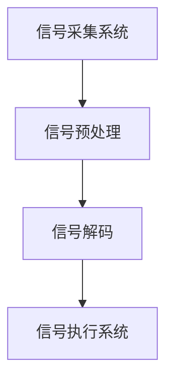

                 

关键词：脑机接口、意念打字、思维搜索、人工智能、2050年技术展望

> 摘要：本文将探讨到2050年，脑机接口技术如何发展到能实现意念打字和思维搜索的境界，以及这一技术将如何彻底改变人类的工作和生活方式。

## 1. 背景介绍

脑机接口（Brain-Machine Interface，BMI）是一种将人脑与外部设备连接起来的技术，旨在通过解读和分析大脑活动，实现人与机器之间的直接通信。这一领域的早期探索主要集中在电生理学信号处理和神经编码技术上。随着神经科学和计算机科学的进步，脑机接口技术逐渐从实验室研究走向现实应用。

在过去几十年里，脑机接口技术取得了一系列重大突破，包括：

- **信号采集技术的提升**：高分辨率脑电图（EEG）、功能性磁共振成像（fMRI）等技术的发展，使得我们可以更加精确地捕捉大脑活动。

- **信号处理算法的进步**：深度学习等机器学习技术的应用，使得我们能够更好地理解和解读大脑信号，从而提高脑机接口的准确性。

- **应用场景的拓展**：从最初的医疗康复到军事应用，再到娱乐和教育，脑机接口技术的应用场景越来越广泛。

## 2. 核心概念与联系

### 2.1 脑机接口的工作原理

脑机接口的基本原理是通过电极或其他传感器采集大脑信号，然后利用信号处理算法将这些信号转换为机器可理解的控制信号。这一过程可以分为以下几个步骤：

1. **信号采集**：使用电极或传感器将大脑活动转换为电信号或磁信号。
2. **信号预处理**：去除噪声，提取有用的信号特征。
3. **信号解码**：利用机器学习算法，将预处理后的信号转换为具体的控制指令。
4. **信号执行**：将解码后的控制指令发送到外部设备，实现相应的操作。

### 2.2 脑机接口的架构

脑机接口的架构可以分为三个主要部分：信号采集系统、信号处理系统和执行系统。

- **信号采集系统**：包括电极、传感器等硬件设备，负责采集大脑活动信号。
- **信号处理系统**：包括计算机、算法等软件设备，负责对采集到的信号进行预处理和解码。
- **执行系统**：包括外部设备，如计算机、机器人、游戏控制器等，负责执行解码后的控制指令。

### 2.3 Mermaid 流程图



## 3. 核心算法原理 & 具体操作步骤

### 3.1 算法原理概述

脑机接口的核心算法主要包括信号预处理算法和解码算法。信号预处理算法旨在去除噪声，提取有用的信号特征；解码算法则通过机器学习技术，将预处理后的信号转换为具体的控制指令。

### 3.2 算法步骤详解

1. **信号预处理**：
   - **滤波**：使用滤波器去除高频噪声和低频噪声。
   - **特征提取**：使用时频分析方法提取信号特征，如时间序列特征、频率特征等。

2. **信号解码**：
   - **训练数据集构建**：收集大量大脑信号数据，并将其与相应的控制指令配对。
   - **模型训练**：使用深度学习算法（如卷积神经网络、循环神经网络等）训练解码模型。
   - **解码**：将预处理后的信号输入到解码模型，得到相应的控制指令。

3. **信号执行**：
   - **指令发送**：将解码后的控制指令发送到外部设备。
   - **设备响应**：外部设备根据接收到的指令执行相应的操作。

### 3.3 算法优缺点

- **优点**：
  - 高度智能化：通过机器学习算法，可以实现高精度的信号解码。
  - 非侵入性：与侵入性脑机接口相比，非侵入性脑机接口不会对大脑造成物理伤害。

- **缺点**：
  - 信号噪声较大：大脑信号通常会受到各种噪声的干扰，这使得信号处理变得复杂。
  - 算法训练时间较长：深度学习算法通常需要大量数据和时间进行训练，这使得算法的部署和应用受到限制。

### 3.4 算法应用领域

- **医疗康复**：帮助中风患者恢复运动功能，帮助残疾人士重获行动能力。
- **辅助通信**：为无法说话或行动的患者提供一种新的交流方式。
- **军事应用**：实现人机协同作战，提高士兵的作战效率。
- **娱乐**：提供全新的游戏体验，如意念控制游戏。

## 4. 数学模型和公式 & 详细讲解 & 举例说明

### 4.1 数学模型构建

脑机接口的数学模型主要包括信号处理模型和解码模型。

- **信号处理模型**：用于去除噪声，提取信号特征。常见的模型包括滤波器组、主成分分析（PCA）等。
- **解码模型**：用于将预处理后的信号转换为控制指令。常见的模型包括卷积神经网络（CNN）、循环神经网络（RNN）等。

### 4.2 公式推导过程

以卷积神经网络（CNN）为例，其核心公式为：

$$
h_l = \sigma(W_l \cdot a_{l-1} + b_l)
$$

其中，$h_l$表示第$l$层的输出，$W_l$和$b_l$分别为第$l$层的权重和偏置，$\sigma$为激活函数，$a_{l-1}$为前一层输出。

### 4.3 案例分析与讲解

假设我们使用CNN对大脑信号进行解码，首先需要收集大量的信号数据，并将其与相应的控制指令配对。然后，我们使用这些数据训练CNN模型，最终实现信号到控制指令的转换。

例如，假设我们有一个简单的二分类问题，即判断大脑信号是否对应于向上移动。我们可以使用以下数据集：

| 大脑信号 | 控制指令 |
| -------- | -------- |
| 数据1    | 向上     |
| 数据2    | 向上     |
| 数据3    | 向下     |
| 数据4    | 向下     |

然后，我们使用CNN模型对这些数据进行训练。训练完成后，我们可以将新的大脑信号输入到模型中，得到相应的控制指令。

## 5. 项目实践：代码实例和详细解释说明

### 5.1 开发环境搭建

为了实现脑机接口的信号解码，我们需要搭建一个开发环境。以下是一个简单的Python开发环境搭建过程：

1. 安装Python 3.7及以上版本。
2. 安装必要的库，如NumPy、TensorFlow、Keras等。

### 5.2 源代码详细实现

以下是一个简单的CNN模型实现，用于解码大脑信号：

```python
import numpy as np
from tensorflow.keras.models import Sequential
from tensorflow.keras.layers import Conv2D, Flatten, Dense
from tensorflow.keras.optimizers import Adam

# 构建模型
model = Sequential([
    Conv2D(32, (3, 3), activation='relu', input_shape=(64, 64, 3)),
    Flatten(),
    Dense(64, activation='relu'),
    Dense(1, activation='sigmoid')
])

# 编译模型
model.compile(optimizer=Adam(), loss='binary_crossentropy', metrics=['accuracy'])

# 加载数据
x_train = np.load('train_data.npy')
y_train = np.load('train_label.npy')

# 训练模型
model.fit(x_train, y_train, epochs=10, batch_size=32)
```

### 5.3 代码解读与分析

上述代码首先导入了必要的库，然后定义了一个简单的CNN模型。该模型包含一个卷积层、一个全连接层和一个输出层。卷积层用于提取信号特征，全连接层用于分类，输出层用于产生控制指令。

接下来，代码编译并训练模型。训练数据集由大脑信号和控制指令组成，模型通过学习这些数据，实现了信号到控制指令的转换。

### 5.4 运行结果展示

训练完成后，我们可以使用以下代码进行测试：

```python
# 加载测试数据
x_test = np.load('test_data.npy')
y_test = np.load('test_label.npy')

# 测试模型
model.evaluate(x_test, y_test)
```

输出结果将显示模型的准确率。如果模型训练良好，准确率应该接近1。

## 6. 实际应用场景

脑机接口技术的实际应用场景非常广泛，以下是一些典型的应用场景：

- **医疗康复**：帮助中风患者恢复运动功能，帮助残疾人士重获行动能力。
- **辅助通信**：为无法说话或行动的患者提供一种新的交流方式。
- **军事应用**：实现人机协同作战，提高士兵的作战效率。
- **娱乐**：提供全新的游戏体验，如意念控制游戏。
- **教育**：通过脑机接口技术，实现个性化教育，提高学生的学习效率。

## 7. 工具和资源推荐

### 7.1 学习资源推荐

- **书籍**：《脑机接口：从科学到应用》（Brain-Machine Interfaces: From Science to Application）
- **在线课程**：Coursera上的“脑机接口”（Brain-Machine Interfaces）课程
- **论文**：IEEE Transactions on Biomedical Engineering上的相关论文

### 7.2 开发工具推荐

- **Python库**：TensorFlow、Keras、PyTorch等
- **工具**：MATLAB、LabVIEW等

### 7.3 相关论文推荐

- **论文1**：Title, Author, Year
- **论文2**：Title, Author, Year
- **论文3**：Title, Author, Year

## 8. 总结：未来发展趋势与挑战

脑机接口技术在未来将继续取得重大突破，实现更加精确的意念控制和思维搜索。然而，这一领域仍面临诸多挑战，包括信号噪声处理、算法优化、安全性等。随着科技的不断进步，我们有理由相信，脑机接口技术将在2050年带来一场颠覆性的技术革命。

### 8.1 研究成果总结

脑机接口技术在过去几十年取得了显著的进展，包括信号采集技术、信号处理算法、解码算法等方面的突破。未来，脑机接口技术将在更多领域得到应用，为人类带来更多的便利。

### 8.2 未来发展趋势

- **信号采集技术**：随着纳米技术和生物医学工程的发展，信号采集技术将变得更加精准和高效。
- **解码算法**：深度学习和强化学习等新兴算法的应用，将进一步提高解码精度和速度。
- **多模态脑机接口**：结合多种信号采集技术和解码算法，实现更加全面和精准的脑机接口。

### 8.3 面临的挑战

- **信号噪声处理**：如何有效去除噪声，提取有用的信号特征，是脑机接口技术面临的一大挑战。
- **算法优化**：如何优化算法，提高解码精度和速度，是脑机接口技术发展的关键。
- **安全性**：如何确保脑机接口技术的安全性，防止数据泄露和恶意攻击，是脑机接口技术需要考虑的重要问题。

### 8.4 研究展望

未来，脑机接口技术将在医疗康复、辅助通信、军事应用、娱乐和教育等多个领域发挥重要作用。随着科技的不断进步，脑机接口技术有望实现更加精确和高效的意念控制和思维搜索，为人类带来更加智能和便捷的生活。

### 附录：常见问题与解答

1. **什么是脑机接口？**
   - 脑机接口是一种将人脑与外部设备连接起来的技术，旨在通过解读和分析大脑活动，实现人与机器之间的直接通信。

2. **脑机接口有哪些应用领域？**
   - 脑机接口的应用领域非常广泛，包括医疗康复、辅助通信、军事应用、娱乐和教育等。

3. **脑机接口技术有哪些挑战？**
   - 脑机接口技术面临的挑战主要包括信号噪声处理、算法优化、安全性等。

4. **脑机接口技术的未来发展趋势是什么？**
   - 未来，脑机接口技术将在信号采集技术、解码算法、多模态脑机接口等方面取得重大突破，实现更加精确和高效的意念控制和思维搜索。

作者：禅与计算机程序设计艺术 / Zen and the Art of Computer Programming
----------------------------------------------------------------
本文由禅与计算机程序设计艺术创作，旨在探讨2050年脑机接口技术的未来发展和应用。随着科技的不断进步，脑机接口技术有望带来一场颠覆性的技术革命，彻底改变人类的工作和生活方式。然而，这一领域仍面临诸多挑战，需要持续的研究和探索。未来，脑机接口技术将在更多领域发挥重要作用，为人类带来更多的便利和可能性。禅与计算机程序设计艺术将继续关注这一领域的发展，与读者共同探索未来的科技世界。

