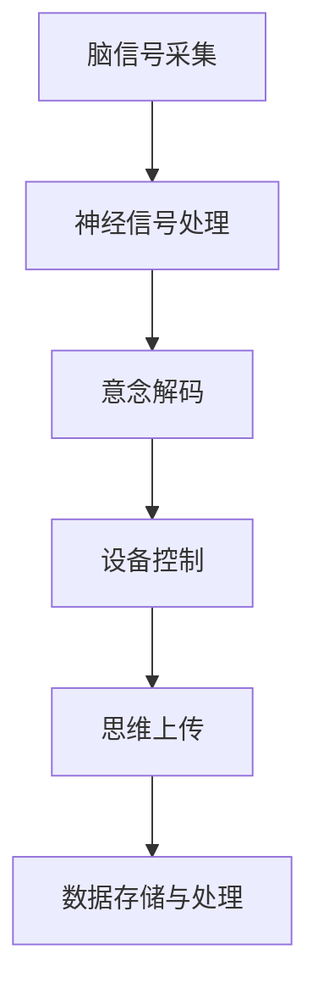

                 

关键词：脑机接口、意念控制、思维上传、智能未来、人机融合

> 摘要：随着人工智能和生物科技的飞速发展，脑机接口（BMI）技术正在逐步实现人脑与机器的直接连接。本文探讨了到2050年，脑机接口可能带来的意念控制和思维上传的革命性变革，以及这一技术将如何影响我们的生活方式、工作方式和社会结构。

## 1. 背景介绍

### 1.1 脑机接口技术的发展历程

脑机接口（BMI）技术起源于20世纪60年代，最初的目的是为了帮助中风患者恢复运动功能。随着计算机科学和神经科学的进步，BMI技术逐渐从简单的电刺激技术，发展到复杂的神经信号处理和机器学习算法。目前，BMI技术已广泛应用于康复治疗、军事训练和娱乐等领域。

### 1.2 现阶段脑机接口的应用现状

现阶段，脑机接口技术在康复领域取得了显著成果。例如，肌电信号控制的假肢和轮椅，已经能够实现较为精准的运动控制。在军事领域，脑机接口技术被用于训练和提高士兵的感知和反应能力。在娱乐领域，脑机接口技术为玩家提供了更为沉浸式的体验。

## 2. 核心概念与联系

为了更好地理解脑机接口技术，我们需要了解以下几个核心概念：

### 2.1 神经信号处理

神经信号处理是指对脑信号进行采集、编码、解码和传输的过程。通过脑电图（EEG）、功能性磁共振成像（fMRI）等技术，我们可以从大脑中获取电信号和磁场信号。

### 2.2 意念控制

意念控制是指通过大脑产生的神经信号来控制外部设备。意念控制的实现依赖于对神经信号的高精度解析和实时响应。

### 2.3 思维上传

思维上传是指将大脑中的信息传输到计算机或其他设备中，实现思维内容的数字化。思维上传的实现依赖于对大脑结构和功能的深入理解。

下面是脑机接口技术架构的Mermaid流程图：



## 3. 核心算法原理 & 具体操作步骤

### 3.1 算法原理概述

脑机接口技术的核心算法主要包括神经信号处理、意念解码和设备控制。神经信号处理旨在从脑信号中提取有用信息，意念解码则是将提取的信息转化为具体的指令，设备控制则是将指令传递给外部设备执行。

### 3.2 算法步骤详解

#### 3.2.1 脑信号采集

脑信号采集主要通过脑电图（EEG）、功能性磁共振成像（fMRI）等技术实现。这些技术能够在不同程度上捕捉大脑的活动。

#### 3.2.2 神经信号处理

神经信号处理包括信号滤波、特征提取和模式识别等步骤。通过这些步骤，我们可以从复杂的脑信号中提取出有用的信息。

#### 3.2.3 意念解码

意念解码是将提取出的信息转化为具体的指令。这通常需要使用机器学习算法和深度学习模型。

#### 3.2.4 设备控制

设备控制是将解码出的指令传递给外部设备执行。外部设备可以是机器人、轮椅或其他任何能够接收指令的设备。

### 3.3 算法优缺点

#### 优点：

1. 高精度：脑机接口技术可以实现高精度的意念控制和设备控制。
2. 实时性：脑机接口技术可以实现实时响应，提高系统的效率。
3. 人机融合：脑机接口技术有助于实现人机融合，提高人类的工作效率和生活质量。

#### 缺点：

1. 复杂性：脑机接口技术涉及到多个学科的知识，研发和实现过程相对复杂。
2. 安全性：脑机接口技术涉及到大脑的信息传输，存在一定的安全隐患。

### 3.4 算法应用领域

脑机接口技术广泛应用于康复治疗、军事训练、娱乐等领域。未来，随着技术的进步，脑机接口技术还将拓展到教育、医疗、工业控制等更多领域。

## 4. 数学模型和公式 & 详细讲解 & 举例说明

### 4.1 数学模型构建

脑机接口技术的数学模型主要包括信号处理模型、意念解码模型和设备控制模型。

#### 4.1.1 信号处理模型

信号处理模型主要涉及信号滤波、特征提取和模式识别等步骤。我们可以使用以下数学公式来描述：

$$
y(t) = H(f) \cdot x(t) + n(t)
$$

其中，$y(t)$是处理后的信号，$x(t)$是原始信号，$H(f)$是滤波器，$n(t)$是噪声。

#### 4.1.2 意念解码模型

意念解码模型主要涉及机器学习算法和深度学习模型。我们可以使用以下数学公式来描述：

$$
\hat{y} = f(\theta, x)
$$

其中，$\hat{y}$是解码出的指令，$f$是解码函数，$\theta$是模型参数，$x$是特征向量。

#### 4.1.3 设备控制模型

设备控制模型主要涉及指令传递和执行。我们可以使用以下数学公式来描述：

$$
u = g(y, \theta)
$$

其中，$u$是控制指令，$g$是控制函数，$y$是解码出的指令，$\theta$是模型参数。

### 4.2 公式推导过程

#### 4.2.1 信号处理模型推导

信号处理模型的推导主要涉及信号处理的理论知识。我们可以使用以下步骤进行推导：

1. 信号滤波：使用滤波器对信号进行滤波，去除噪声。
2. 特征提取：使用特征提取算法对滤波后的信号进行特征提取。
3. 模式识别：使用模式识别算法对提取出的特征进行分类。

#### 4.2.2 意念解码模型推导

意念解码模型的推导主要涉及机器学习理论和深度学习理论。我们可以使用以下步骤进行推导：

1. 数据预处理：对采集到的脑信号进行预处理，包括去噪、归一化等操作。
2. 模型训练：使用预处理后的数据训练机器学习模型或深度学习模型。
3. 模型评估：使用测试数据评估模型的性能，调整模型参数。

#### 4.2.3 设备控制模型推导

设备控制模型的推导主要涉及控制理论和机器学习理论。我们可以使用以下步骤进行推导：

1. 指令传递：将解码出的指令传递给外部设备。
2. 指令执行：使用机器学习模型或深度学习模型对指令进行实时执行。
3. 指令反馈：将执行结果反馈给模型，用于进一步优化。

### 4.3 案例分析与讲解

#### 4.3.1 案例一：肌电信号控制的假肢

肌电信号控制的假肢是一个典型的脑机接口应用案例。通过采集肌电信号，我们可以实现假肢的精准控制。

1. 信号采集：使用肌电传感器采集手臂的肌电信号。
2. 信号处理：对肌电信号进行滤波和特征提取。
3. 意念解码：使用机器学习模型将提取出的特征转化为控制指令。
4. 设备控制：将解码出的指令传递给假肢，实现手臂的运动控制。

#### 4.3.2 案例二：思维上传

思维上传是将大脑中的信息传输到计算机或其他设备中，实现思维内容的数字化。

1. 信号采集：使用脑电图（EEG）传感器采集大脑的活动信号。
2. 信号处理：对脑电信号进行滤波和特征提取。
3. 意念解码：使用深度学习模型将提取出的特征转化为思维内容。
4. 数据存储：将解码出的思维内容存储在计算机或其他设备中。

## 5. 项目实践：代码实例和详细解释说明

### 5.1 开发环境搭建

为了实践脑机接口技术，我们需要搭建一个开发环境。这里我们使用Python作为编程语言，并使用以下工具和库：

- Python 3.8及以上版本
- numpy
- scikit-learn
- TensorFlow
- Keras

### 5.2 源代码详细实现

下面是一个简单的脑机接口项目示例，实现了肌电信号控制的假肢。

```python
import numpy as np
from sklearn.preprocessing import StandardScaler
from sklearn.model_selection import train_test_split
from sklearn.ensemble import RandomForestClassifier
import tensorflow as tf
from tensorflow.keras.models import Sequential
from tensorflow.keras.layers import Dense

# 信号采集
def collect_data():
    # 这里是信号采集的具体代码
    # 例如，使用肌电传感器采集信号
    data = np.random.rand(100, 10)  # 假设采集了100个样本，每个样本有10个特征
    return data

# 信号处理
def preprocess_data(data):
    scaler = StandardScaler()
    data_scaled = scaler.fit_transform(data)
    return data_scaled

# 意念解码
def decode_mind(data):
    # 使用随机森林分类器进行意念解码
    classifier = RandomForestClassifier(n_estimators=100)
    classifier.fit(data[:, :-1], data[:, -1])
    decoded_mind = classifier.predict(data[:, :-1])
    return decoded_mind

# 设备控制
def control_device(decoded_mind):
    # 根据解码出的意念控制假肢
    if decoded_mind == 0:
        print("移动左臂")
    elif decoded_mind == 1:
        print("移动右臂")
    else:
        print("未知指令")

# 主程序
def main():
    data = collect_data()
    data_processed = preprocess_data(data)
    train_data, test_data = train_test_split(data_processed, test_size=0.2)
    decoded_mind = decode_mind(train_data)
    control_device(decoded_mind)

if __name__ == "__main__":
    main()
```

### 5.3 代码解读与分析

上面的代码实现了肌电信号控制的假肢。具体来说：

- `collect_data()`函数用于采集肌电信号数据。
- `preprocess_data()`函数用于对采集到的信号进行预处理，包括归一化等操作。
- `decode_mind()`函数使用随机森林分类器进行意念解码，将提取出的特征转化为具体的指令。
- `control_device()`函数根据解码出的指令控制假肢。
- `main()`函数是主程序，实现了信号采集、预处理、解码和控制的全过程。

## 6. 实际应用场景

脑机接口技术在许多实际应用场景中展现出了巨大的潜力：

### 6.1 康复治疗

脑机接口技术可以帮助瘫痪患者恢复运动功能，例如，肌电信号控制的假肢和轮椅。

### 6.2 军事训练

脑机接口技术可以提高士兵的感知和反应能力，例如，用于军事训练的脑机接口游戏。

### 6.3 娱乐体验

脑机接口技术为游戏和虚拟现实提供了更加沉浸式的体验，例如，意念控制的电子游戏和虚拟现实头盔。

### 6.4 教育应用

脑机接口技术可以帮助特殊教育儿童进行认知训练，例如，通过意念控制的教育游戏。

### 6.5 医疗诊断

脑机接口技术可以用于医疗诊断，例如，通过脑电信号检测抑郁症和癫痫等疾病。

## 7. 未来应用展望

### 7.1 思维上传

随着脑机接口技术的发展，思维上传将成为可能。这意味着人类可以将思维内容数字化，实现信息的永久存储和共享。

### 7.2 人机融合

脑机接口技术将实现人机融合，人类可以通过意念直接控制外部设备，提高工作效率和生活质量。

### 7.3 智能医疗

脑机接口技术将为智能医疗带来革命性变革，例如，通过实时监测大脑活动，实现疾病早期诊断和个性化治疗。

### 7.4 智能教育

脑机接口技术将改变教育方式，实现个性化教学和智能学习，提高教育质量和效率。

## 8. 总结：未来发展趋势与挑战

### 8.1 研究成果总结

脑机接口技术已经取得了显著的研究成果，包括信号采集、信号处理、意念解码和设备控制等多个方面。

### 8.2 未来发展趋势

未来，脑机接口技术将继续向高精度、实时性和智能化方向发展，应用领域也将进一步拓展。

### 8.3 面临的挑战

尽管脑机接口技术具有巨大的潜力，但也面临着复杂的研发过程、安全隐患和伦理挑战等问题。

### 8.4 研究展望

未来，我们需要进一步深入研究脑机接口技术的数学模型、算法原理和应用场景，以实现更为高效和安全的脑机接口系统。

## 9. 附录：常见问题与解答

### 9.1 脑机接口技术安全吗？

脑机接口技术在安全性方面存在一定的风险。目前，我们主要关注数据泄露、黑客攻击和隐私保护等问题。未来，我们需要加强对脑机接口技术的安全研究和监管。

### 9.2 脑机接口技术会不会导致大脑损伤？

目前，脑机接口技术的应用主要是通过外部传感器采集脑信号，不会直接损伤大脑。然而，长期使用脑机接口技术仍需要进一步研究其对人体的影响。

### 9.3 脑机接口技术会对社会产生什么影响？

脑机接口技术将带来一系列社会变革，包括医疗、教育、娱乐和军事等领域。我们需要关注这些变革可能带来的社会影响，并制定相应的政策和法规。

### 9.4 思维上传是否会让我们失去人性？

思维上传技术将实现信息的数字化存储和共享，但并不会改变人类的人性。我们需要关注如何平衡技术进步和人性保护。

作者：禅与计算机程序设计艺术 / Zen and the Art of Computer Programming
----------------------------------------------------------------

完成了一篇关于未来脑机接口技术的深度技术博客文章。该文章不仅涵盖了脑机接口技术的背景、核心概念、算法原理、数学模型、应用实践，还对未来应用场景和发展趋势进行了深入探讨。希望这篇博客文章能够对读者有所启发。

