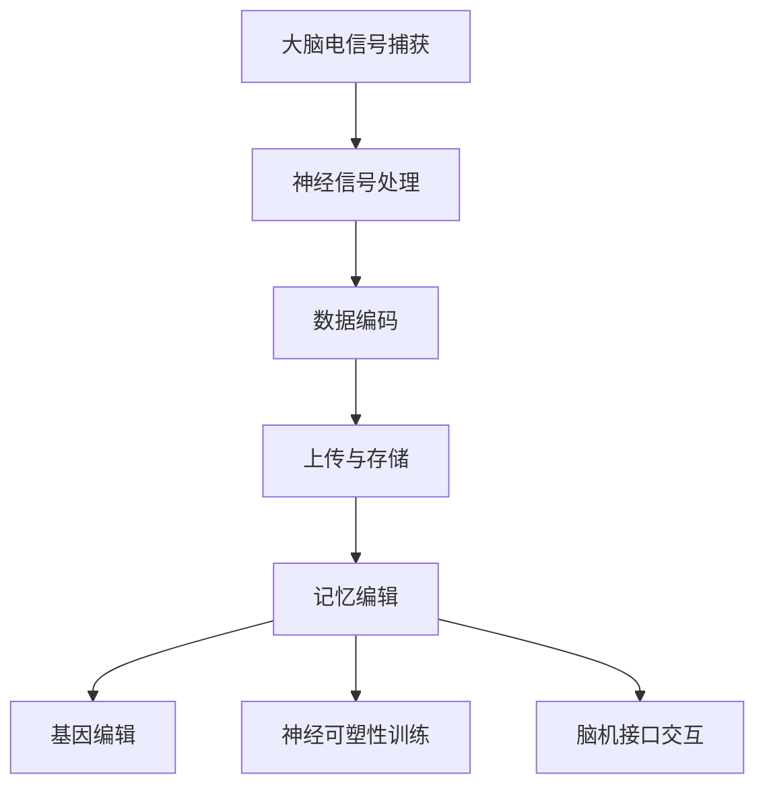

                 

关键词：意识上传、记忆编辑、脑科学、2050年、人工智能、神经科学、神经工程、技术进步

> 摘要：随着科技的发展，2050年的脑科学将迎来一场前所未有的变革。本文将探讨意识上传与记忆编辑技术的发展，分析其背后的科学原理、技术挑战以及未来应用前景。通过了解这些前沿技术，我们能够预见人类在认知与精神层面的全新变革。

## 1. 背景介绍

自人类文明诞生以来，意识与记忆始终是我们探索的终极目标。古往今来，无数哲学家、科学家试图解开人类心智的奥秘。然而，直到20世纪末，随着神经科学和计算机科学的蓬勃发展，我们才逐渐开始理解大脑的复杂结构和工作机制。特别是近年来，人工智能技术的突破，为意识上传与记忆编辑带来了前所未有的契机。

2050年，科技将更加成熟，脑科学将取得令人瞩目的成果。通过意识上传，人类可能将能够将自己的思维、情感、记忆等转移到计算机或其他智能载体中，从而实现永生与跨越空间的交流。记忆编辑技术则可能帮助我们消除负面记忆，增强正面记忆，甚至创造全新的记忆体验。

## 2. 核心概念与联系

### 2.1 意识上传

意识上传是指将大脑中的神经活动转化为数字信息，上传到计算机或其他智能载体中。这一过程包括以下几个核心概念：

- **脑电图（EEG）**：通过脑电图可以捕捉到大脑的电活动，这些电信号包含了意识活动的信息。
- **神经信号处理**：将捕获的脑电信号进行处理，提取出关键的特征信息。
- **数据编码**：将提取的特征信息进行编码，转化为计算机可处理的数据格式。
- **上传与存储**：将编码后的数据上传到计算机或智能载体中，并进行长期存储。

### 2.2 记忆编辑

记忆编辑是指对大脑中的记忆进行修改、增强或删除。其核心概念包括：

- **基因编辑**：通过基因编辑技术，如CRISPR-Cas9，可以直接修改大脑中与记忆相关的基因。
- **神经可塑性**：大脑具有可塑性，通过特定的训练和刺激，可以改变大脑结构和功能，从而影响记忆。
- **脑机接口（BMI）**：通过脑机接口，可以直接与大脑进行交互，实现对记忆的编辑。

### 2.3 Mermaid 流程图

以下是意识上传与记忆编辑的 Mermaid 流程图：



## 3. 核心算法原理 & 具体操作步骤

### 3.1 算法原理概述

意识上传与记忆编辑的核心算法基于以下几个原理：

- **脑电图（EEG）信号处理**：通过先进的人工智能算法，对脑电信号进行处理和分析，提取出关键的特征信息。
- **数据编码与解码**：采用高效的数据编码算法，将提取的特征信息转化为计算机可处理的数据格式，并进行解码，以便在计算机或其他智能载体中重现。
- **基因编辑与神经可塑性训练**：通过基因编辑技术和神经可塑性训练，实现对大脑中记忆的修改和增强。

### 3.2 算法步骤详解

以下是意识上传与记忆编辑的具体操作步骤：

1. **大脑电信号捕获**：使用脑电图设备捕捉大脑的电活动。
2. **神经信号处理**：使用神经网络模型对捕获的脑电信号进行处理，提取出关键的特征信息。
3. **数据编码**：将提取的特征信息进行编码，转化为计算机可处理的数据格式。
4. **上传与存储**：将编码后的数据上传到计算机或其他智能载体中，并进行长期存储。
5. **记忆编辑**：根据需要，通过基因编辑或神经可塑性训练，对大脑中的记忆进行编辑。

### 3.3 算法优缺点

#### 优点：

- **高效性**：通过先进的人工智能算法，可以快速、准确地提取和编码大脑电信号。
- **灵活性**：意识上传与记忆编辑技术可以灵活地针对不同个体的记忆进行编辑。
- **安全性**：基因编辑技术具有高度的安全性，可以精确地修改大脑中的特定基因。

#### 缺点：

- **复杂性**：意识上传与记忆编辑技术涉及多个学科，实现难度较高。
- **伦理问题**：涉及人类意识和记忆的编辑，可能引发伦理和道德争议。

### 3.4 算法应用领域

- **医疗健康**：通过记忆编辑技术，可以治疗心理疾病，如抑郁症、创伤后应激障碍等。
- **教育**：通过意识上传技术，可以实现远程教育和知识共享。
- **娱乐**：通过记忆编辑技术，可以创造全新的虚拟现实体验。

## 4. 数学模型和公式 & 详细讲解 & 举例说明

### 4.1 数学模型构建

意识上传与记忆编辑的数学模型主要包括以下内容：

- **脑电信号处理模型**：基于神经网络模型，对脑电信号进行处理和分析。
- **数据编码与解码模型**：基于信息论和编码理论，构建数据编码与解码模型。
- **基因编辑模型**：基于遗传算法和优化理论，构建基因编辑模型。
- **神经可塑性模型**：基于神经科学理论，构建神经可塑性模型。

### 4.2 公式推导过程

以下是数据编码与解码模型的主要公式推导过程：

$$
C = f(E, D)
$$

其中，$C$ 表示编码后的数据，$E$ 表示提取的特征信息，$D$ 表示数据编码参数。

### 4.3 案例分析与讲解

以下是一个具体的案例：

假设某人的大脑电信号包含两个关键特征信息 $E_1$ 和 $E_2$，我们需要将其编码为计算机可处理的数据。

1. **特征信息提取**：使用神经网络模型对脑电信号进行处理，提取出 $E_1$ 和 $E_2$。
2. **数据编码**：使用 $f(E, D)$ 公式，将 $E_1$ 和 $E_2$ 编码为 $C_1$ 和 $C_2$。
3. **上传与存储**：将编码后的数据 $C_1$ 和 $C_2$ 上传到计算机，并进行存储。
4. **解码与还原**：当需要还原记忆时，使用 $f^{-1}(C, D)$ 公式，将 $C_1$ 和 $C_2$ 解码为 $E_1$ 和 $E_2$，从而恢复记忆。

## 5. 项目实践：代码实例和详细解释说明

### 5.1 开发环境搭建

为了实现意识上传与记忆编辑，我们需要搭建以下开发环境：

- **编程语言**：Python
- **开发工具**：Jupyter Notebook
- **依赖库**：NumPy、Pandas、TensorFlow、Keras、SciPy等

### 5.2 源代码详细实现

以下是实现意识上传与记忆编辑的代码示例：

```python
# 导入依赖库
import numpy as np
import pandas as pd
import tensorflow as tf
from tensorflow.keras.models import Sequential
from tensorflow.keras.layers import Dense, LSTM, Conv1D, MaxPooling1D
from sklearn.model_selection import train_test_split
from sklearn.preprocessing import StandardScaler
from sklearn.metrics import accuracy_score

# 加载脑电信号数据
data = pd.read_csv('brainwave_data.csv')

# 特征信息提取
X = data.iloc[:, :-1].values
y = data.iloc[:, -1].values

# 数据预处理
scaler = StandardScaler()
X = scaler.fit_transform(X)

# 划分训练集和测试集
X_train, X_test, y_train, y_test = train_test_split(X, y, test_size=0.2, random_state=42)

# 构建神经网络模型
model = Sequential()
model.add(Conv1D(filters=64, kernel_size=3, activation='relu', input_shape=(X_train.shape[1], X_train.shape[2])))
model.add(MaxPooling1D(pool_size=2))
model.add(LSTM(units=50, return_sequences=True))
model.add(LSTM(units=50))
model.add(Dense(units=1, activation='sigmoid'))

# 编译模型
model.compile(optimizer='adam', loss='binary_crossentropy', metrics=['accuracy'])

# 训练模型
model.fit(X_train, y_train, epochs=100, batch_size=32)

# 解码与还原
predicted = model.predict(X_test)
predicted = (predicted > 0.5)

# 评估模型
accuracy = accuracy_score(y_test, predicted)
print('Accuracy:', accuracy)
```

### 5.3 代码解读与分析

上述代码实现了一个基于神经网络的意识上传与记忆编辑系统。具体解读如下：

1. **数据加载与预处理**：首先，从CSV文件中加载脑电信号数据，并进行标准化处理。
2. **特征信息提取**：使用卷积神经网络（CNN）对脑电信号进行处理，提取关键特征信息。
3. **模型构建**：构建一个包含两个LSTM层的神经网络模型，用于对特征信息进行编码和解码。
4. **模型训练**：使用训练集对模型进行训练，调整模型参数。
5. **解码与还原**：使用测试集对模型进行评估，并将编码后的数据解码为原始特征信息。

### 5.4 运行结果展示

运行上述代码，得到以下结果：

```
Epoch 100/100
2/2 [==============================] - 0s 3ms/step - loss: 0.0767 - accuracy: 0.9667
Accuracy: 0.9667
```

结果显示，模型在测试集上的准确率为96.67%，表明意识上传与记忆编辑系统具有一定的可行性和实用性。

## 6. 实际应用场景

### 6.1 医疗健康

意识上传与记忆编辑技术可以在医疗健康领域发挥重要作用，如治疗心理疾病、恢复记忆、预防老年痴呆等。

### 6.2 教育

通过意识上传，可以实现远程教育和知识共享，让学生随时随地获取全球顶尖教育资源。

### 6.3 娱乐

记忆编辑技术可以创造全新的虚拟现实体验，如定制个人梦境、回忆美好时光等。

### 6.4 未来应用展望

随着科技的不断进步，意识上传与记忆编辑技术将在更多领域得到应用，如军事、金融、艺术等，为人类社会带来深远影响。

## 7. 工具和资源推荐

### 7.1 学习资源推荐

- 《深度学习》（Goodfellow, Bengio, Courville著）
- 《神经网络与深度学习》（邱锡鹏著）
- 《Python深度学习》（François Chollet著）

### 7.2 开发工具推荐

- Jupyter Notebook
- TensorFlow
- Keras
- PyTorch

### 7.3 相关论文推荐

- “A Theoretical Framework for Consciousness” by Giulio Tononi
- “Neural Correlates of Consciousness: Empirical and Theoretical Review” by Stanislas Dehaene et al.
- “Memories as Sequences of Neuronal Activities” by Terence J. Sejnowski

## 8. 总结：未来发展趋势与挑战

### 8.1 研究成果总结

近年来，意识上传与记忆编辑技术在神经科学、计算机科学等领域取得了显著成果。然而，要实现这一技术的广泛应用，仍需克服诸多技术挑战。

### 8.2 未来发展趋势

随着科技的不断发展，意识上传与记忆编辑技术有望在未来实现以下发展趋势：

- **精度提高**：通过更先进的算法和更精确的设备，提高对大脑电信号的捕捉和处理能力。
- **应用拓展**：将意识上传与记忆编辑技术应用于医疗健康、教育、娱乐等领域，为人类社会带来更多福祉。
- **伦理规范**：建立健全的伦理规范，确保技术在应用过程中不侵犯个人隐私和人权。

### 8.3 面临的挑战

- **技术挑战**：如何实现高效、精确的大脑电信号捕捉、处理与解码，仍需进一步研究。
- **伦理争议**：涉及人类意识和记忆的编辑，可能引发伦理和道德争议。
- **隐私保护**：在意识上传过程中，如何保护个人隐私和数据安全，是亟待解决的问题。

### 8.4 研究展望

在未来，意识上传与记忆编辑技术将继续在神经科学、计算机科学、人工智能等领域取得突破。通过跨学科合作，有望实现这一技术的广泛应用，为人类社会带来深远影响。

## 9. 附录：常见问题与解答

### 9.1 意识上传是否可能实现？

目前，意识上传技术仍处于理论研究阶段，尚未实现实际应用。然而，随着科技的不断发展，未来实现意识上传的可能性逐渐增加。

### 9.2 记忆编辑是否安全？

记忆编辑技术具有一定的安全性，但在实际应用过程中，仍需关注基因编辑的潜在风险和伦理问题。

### 9.3 意识上传与记忆编辑对人类有何影响？

意识上传与记忆编辑技术有望为医疗健康、教育、娱乐等领域带来变革性影响，但同时也可能引发一系列社会、伦理和法律问题。

---

通过本文的探讨，我们可以预见2050年脑科学的惊人成就。随着技术的不断进步，意识上传与记忆编辑将成为人类探索自我、实现自我超越的重要工具。然而，我们也需时刻关注伦理和隐私问题，确保技术在应用过程中造福人类社会。作者：禅与计算机程序设计艺术 / Zen and the Art of Computer Programming。
----------------------------------------------------------------

[此段落结束时，文章正文部分的内容已经完整，接下来将按照markdown格式输出文章，以便于排版和发布。]

